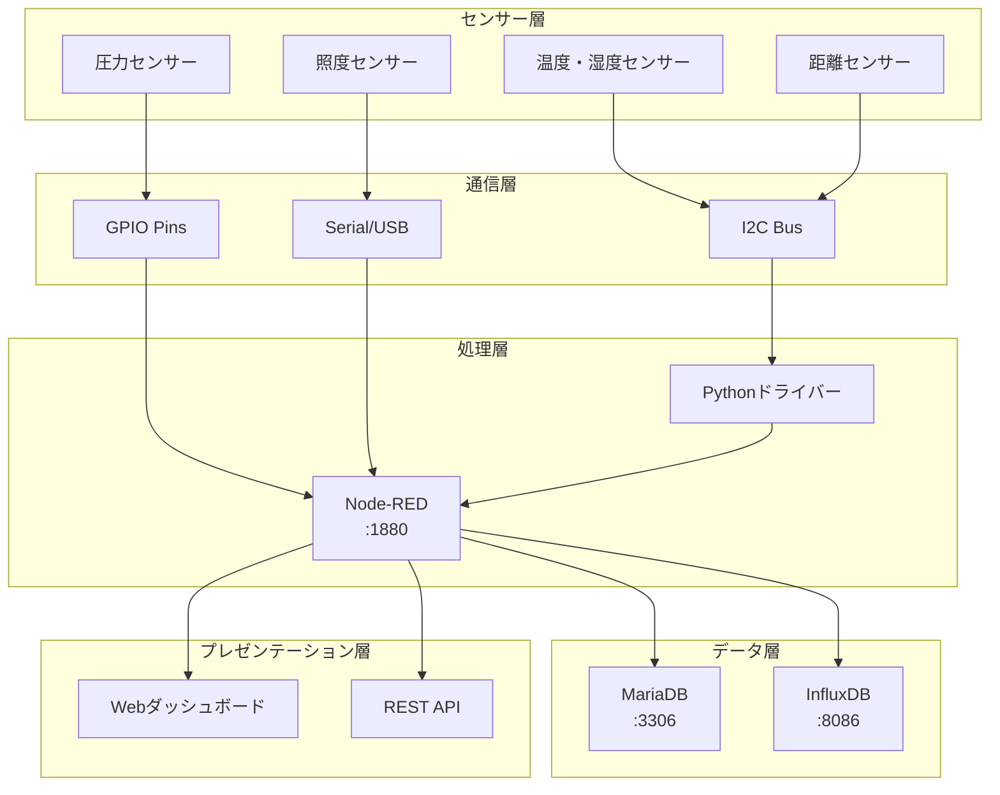

# IoT導入支援キット Ver.4.1

## 概要

福岡県工業技術センター（FITC）が開発した包括的なIoTデータ収集・可視化システムです。Raspberry Pi上で動作し、様々なセンサーからのデータ収集、保存、可視化、アラート機能を提供します。

## 主な特徴

- **13種類の産業用センサー対応** - 温度、湿度、圧力、距離、照度、加速度など
- **マルチプロトコル対応** - I2C、GPIO、Serial、BLE、HTTP、MQTT
- **デュアルデータベース** - MariaDB（設定）+ InfluxDB（時系列データ）
- **リアルタイム可視化** - Node-REDダッシュボード
- **拡張性** - モジュール化されたアーキテクチャ

## クイックスタート

### 1. システム要件
- Raspberry Pi 4 Model B (4GB RAM推奨)
- Raspbian OS Bullseye以降
- Docker & Docker Compose
- 32GB以上のmicroSDカード

### 2. インストール
```bash
# リポジトリクローン
git clone https://github.com/your-org/iot4-copy.git
cd iot4-copy

# セットアップスクリプト実行
./desktop/first.sh

# サービス起動
cd docker && docker-compose up -d
```

### 3. アクセス
- **ダッシュボード**: http://localhost:1880/ui
- **Node-REDエディタ**: http://localhost:1880
- **API**: http://localhost:1880/api/v2

## 📚 ドキュメント

完全なドキュメントは **[docs/](./docs/)** ディレクトリにあります：

### 🎯 目的別ガイド

#### 初めての方
1. [📖 システム概要](./docs/architecture/overview.md) - 全体像の理解
2. [⚙️ インストールガイド](./docs/guides/installation.md) - 環境構築
3. [🚀 開発ガイド](./docs/guides/development.md) - 開発環境準備

#### システム移行検討者
1. [🔄 移行戦略概要](./docs/migration/overview.md) - 移行計画
2. [📊 事前分析手順](./docs/migration/analysis-procedures.md) - 現状分析
3. [🏗️ アーキテクチャ選択肢](./docs/migration/architecture-alternatives.md) - 技術選定

#### 運用管理者
1. [⚡ 日常運用ガイド](./docs/guides/operation.md) - 運用手順
2. [🔧 トラブルシューティング](./docs/guides/troubleshooting.md) - 問題解決
3. [📡 API仕様](./docs/api/rest-api.md) - 外部連携

#### 開発者
1. [⚙️ Node-REDフロー仕様](./docs/technical/node-red-flows.md) - 実装詳細
2. [🧪 テストガイド](./docs/guides/testing.md) - 品質保証
3. [🔌 API リファレンス](./docs/api/rest-api.md) - プログラム連携

### 📁 ドキュメント構成

```
docs/
├── 📁 architecture/     # システム設計・アーキテクチャ
├── 📁 technical/        # 技術仕様・実装詳細
├── 📁 migration/        # システム移行ガイド
├── 📁 guides/          # 運用・開発ガイド
├── 📁 api/             # API仕様・外部連携
└── 📁 assets/          # 図表・リソース
```

## システム構成



## 対応センサー

| センサータイプ | 測定項目 | 通信方式 | 測定範囲 |
|---------------|----------|----------|----------|
| 温湿度 | 温度・湿度 | I2C | -40～85℃、0～100%RH |
| 距離 | 距離測定 | I2C | 4cm～400cm |
| 圧力 | 差圧・気圧 | I2C | ±2.5kPa～±250kPa |
| 照度 | 明るさ | I2C | 0.01～40,000 lux |
| 加速度 | X,Y,Z軸 | I2C | ±2g～±16g |
| ADC | 電圧 | I2C | ±2000mV |
| 接点 | ON/OFF | GPIO | デジタル |
| 熱電対 | 高温 | I2C | -200～1372℃ |

## API例

### センサーデータ取得
```bash
curl "http://localhost:1880/api/v2/device/sensor_001/sensor/value?from=2024-01-01T00:00:00Z&limit=10"
```

### デバイス一覧
```bash
curl "http://localhost:1880/api/v2/device"
```

### センサーデータ送信
```bash
curl -X POST "http://localhost:1880/api/v2/device/sensor_001/sensor/value" \
  -H "Content-Type: application/json" \
  -d '{"timestamp":"2024-01-01T12:00:00Z","values":{"temperature":25.3,"humidity":60.5}}'
```

## 開発・貢献

### 開発環境セットアップ
```bash
# Node-RED開発モード起動
node-red --safe

# テスト実行
npm test

# ドキュメント生成
npm run docs
```

### 貢献ガイドライン
1. [Issue作成](../../issues) - バグ報告・機能要求
2. Fork & Pull Request - コード貢献
3. [ドキュメント改善](./docs/) - 情報提供・修正

## ライセンス

このプロジェクトは [MIT License](./LICENSE) の下で公開されています。

## サポート

- **ドキュメント**: [完全なドキュメント](./docs/)
- **Issue Tracker**: [GitHub Issues](../../issues)
- **技術サポート**: [トラブルシューティングガイド](./docs/guides/troubleshooting.md)

## 更新履歴

- **v4.1** - 包括的ドキュメント整備、移行ガイド追加
- **v4.0** - Node-REDベースアーキテクチャ
- **v3.x** - 初期リリース

---

> 🚀 **次のステップ**: [インストールガイド](./docs/guides/installation.md)から始めて、[システム概要](./docs/architecture/overview.md)でアーキテクチャを理解し、[開発ガイド](./docs/guides/development.md)で開発環境を準備してください。