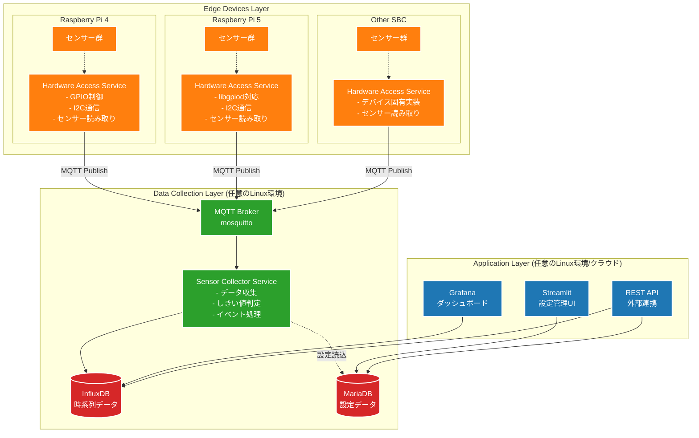
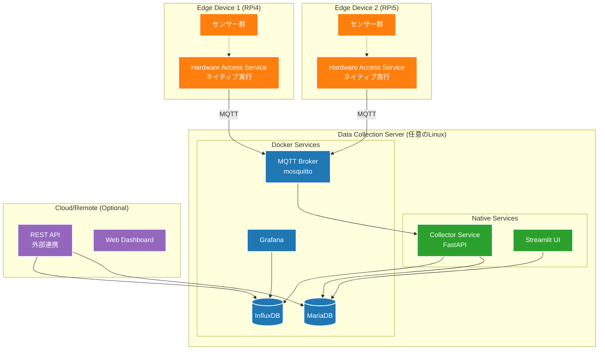
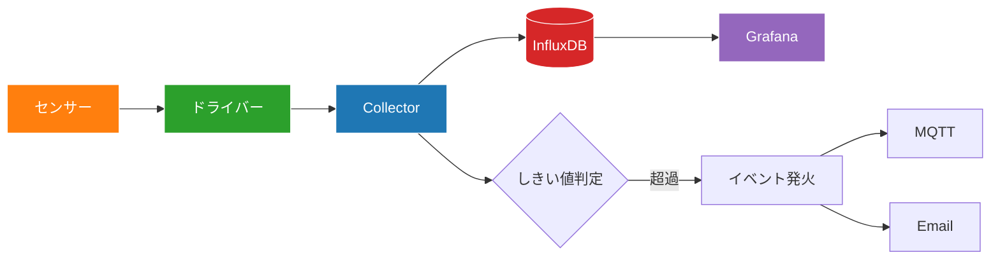

# センサー収集システム アーキテクチャ設計書

## 概要

本ドキュメントは、既存のNode-REDベースのIoTシステムから、よりメンテナンス性の高いPython/FastAPIベースのアーキテクチャへの移行設計を記述します。

## 現状の課題

1. **Node-REDの複雑性**: 大規模なフロー管理が困難
2. **密結合**: センサードライバーとNode-REDが密に結合
3. **メンテナンス性**: 1人での保守が限界
4. **AI活用の制限**: ビジュアルプログラミングではAI支援が限定的

## 新アーキテクチャの設計方針

- **シンプル**: 技術スタックを最小限に
- **疎結合**: 各コンポーネントの独立性を確保
- **保守性**: 1人でも管理可能な構成
- **AI親和性**: テキストベースのコードでAI支援を最大化
- **ポータビリティ**: コレクター層以上は任意のLinux環境で動作
- **スケーラビリティ**: 複数のエッジデバイスからのデータ収集に対応

## システム構成図

### 分散アーキテクチャ概要



## 3層アーキテクチャ詳細

### Layer 1: Edge Devices Layer（エッジデバイス層）

**責務**
- ハードウェア固有の処理に特化
- センサーデータの読み取りと前処理
- MQTTによるデータ送信

**Hardware Access Service**
```python
# edge/hardware_access_service.py
class HardwareAccessService:
    def __init__(self, device_type: str):
        self.gpio = get_gpio_interface(device_type)  # RPi4/5/Other
        self.i2c = get_i2c_interface(device_type)
        self.sensors = load_sensor_drivers()
    
    async def collect_and_publish(self):
        for sensor in self.sensors:
            data = sensor.read()
            await self.mqtt_client.publish(f"sensors/{sensor.id}", data)
```

**デバイス固有実装**
- **RPi4**: RPi.GPIO + sysfs
- **RPi5**: libgpiod + 新GPIO API
- **Orange Pi/Jetson**: デバイス固有ライブラリ

### Layer 2: Data Collection Layer（データ収集層）

**責務**
- 複数エッジデバイスからのデータ統合
- しきい値判定とイベント処理
- データベースへの永続化

**技術スタック**
- MQTT Broker (mosquitto)
- FastAPI + asyncio
- InfluxDB (時系列データ)
- MariaDB (設定データ)

**特徴**
- ハードウェア非依存
- 任意のLinux環境で動作
- 水平スケーリング可能

### Layer 3: Application Layer（アプリケーション層）

**責務**
- ユーザーインターフェース
- データ可視化
- 外部システム連携

**コンポーネント**
- Streamlit: 設定管理UI
- Grafana: ダッシュボード
- REST API: 外部連携

**特徴**
- 完全にハードウェア非依存
- クラウドでも動作可能
- マルチテナント対応

## 分散アーキテクチャ対応ディレクトリ構造

```
iot-distributed-system/
├── edge/                    # エッジデバイス層（各SBCで実行）
│   ├── hardware_access_service.py    # ハードウェアアクセスサービス
│   ├── sensors/                      # センサードライバー
│   │   ├── __init__.py
│   │   ├── base.py                   # 基底クラス
│   │   ├── i2c/
│   │   │   ├── vl53l1x.py           # 測距センサー
│   │   │   ├── opt3001.py           # 照度センサー
│   │   │   ├── mcp3427.py           # ADCセンサー
│   │   │   ├── mcp9600.py           # 熱電対センサー
│   │   │   ├── lis2duxs12.py        # 加速度センサー
│   │   │   └── sdp610.py            # 差圧センサー
│   │   ├── gpio/
│   │   │   └── gpio.py              # GPIO入出力
│   │   └── serial/
│   │       └── brave.py             # BravePIシリアル通信
│   ├── hardware/                     # ハードウェア抽象化層
│   │   ├── __init__.py
│   │   ├── interfaces.py            # 抽象インターフェース
│   │   ├── rpi4/
│   │   │   ├── gpio.py             # RPi4 GPIO実装
│   │   │   └── i2c.py              # RPi4 I2C実装
│   │   ├── rpi5/
│   │   │   ├── gpio.py             # RPi5 GPIO実装（libgpiod）
│   │   │   └── i2c.py              # RPi5 I2C実装
│   │   └── mock/
│   │       ├── gpio.py             # テスト用モック
│   │       └── i2c.py              # テスト用モック
│   ├── config/
│   │   └── edge_config.yml         # エッジデバイス設定
│   └── requirements-edge.txt        # エッジ用依存関係
│
├── collector/               # データ収集層（任意のLinux環境）
│   ├── main.py             # FastAPIアプリケーション
│   ├── mqtt_subscriber.py  # MQTTデータ受信
│   ├── processor.py        # しきい値判定・イベント処理
│   ├── storage.py          # データベース書き込み
│   ├── notifier.py         # 通知処理
│   ├── models.py           # Pydanticモデル
│   ├── config/
│   │   └── collector_config.yml
│   └── requirements-collector.txt
│
├── application/             # アプリケーション層（任意のLinux環境/クラウド）
│   ├── streamlit_app/       # 設定管理UI
│   │   ├── main.py
│   │   ├── pages/
│   │   │   ├── devices.py   # デバイス管理
│   │   │   ├── sensors.py   # センサー設定
│   │   │   └── alerts.py    # アラート設定
│   │   └── models.py        # SQLAlchemyモデル
│   ├── api/                 # REST API
│   │   ├── main.py
│   │   ├── routers/
│   │   │   ├── devices.py
│   │   │   ├── sensors.py
│   │   │   └── data.py
│   │   └── models.py
│   ├── config/
│   │   └── app_config.yml
│   └── requirements-app.txt
│
├── common/                  # 共通ライブラリ（全層で使用）
│   ├── __init__.py
│   ├── database.py          # DB接続管理
│   ├── mqtt_client.py       # MQTT共通クライアント
│   ├── config_loader.py     # 設定ファイル読み込み
│   ├── logger.py            # ロギング設定
│   └── models/              # 共通データモデル
│       ├── sensor_data.py
│       └── device_config.py
│
├── infrastructure/          # インフラストラクチャ構成
│   ├── docker/              # Dockerコンテナ構成
│   │   ├── docker-compose.yml       # 開発環境用
│   │   ├── docker-compose.prod.yml  # 本番環境用
│   │   ├── influxdb/
│   │   │   └── Dockerfile
│   │   ├── mariadb/
│   │   │   └── Dockerfile
│   │   ├── grafana/
│   │   │   ├── Dockerfile
│   │   │   └── dashboards/
│   │   └── mosquitto/
│   │       ├── Dockerfile
│   │       └── config/
│   ├── systemd/             # systemdサービス定義
│   │   ├── edge-service.service
│   │   ├── collector-service.service
│   │   └── streamlit-app.service
│   └── ansible/             # デプロイメント自動化
│       ├── playbooks/
│       └── inventory/
│
├── tests/                   # テストコード
│   ├── test_edge/
│   ├── test_collector/
│   ├── test_application/
│   └── test_common/
│
├── docs/                    # ドキュメント
│   ├── deployment/          # デプロイメントガイド
│   ├── api/                 # API仕様
│   └── troubleshooting/     # トラブルシューティング
│
├── scripts/                 # 運用スクリプト
│   ├── deploy_edge.sh       # エッジデバイスデプロイ
│   ├── deploy_collector.sh  # コレクターデプロイ
│   └── health_check.py      # ヘルスチェック
│
└── config/                  # 全体設定
    ├── global_config.yml    # グローバル設定
    └── environments/        # 環境別設定
        ├── development.yml
        ├── staging.yml
        └── production.yml
```

## インフラストラクチャ構成

### デプロイメント構成例



### 層別ポート構成

#### Edge Layer
| サービス | 実行環境 | ポート | 用途 |
|---------|---------|--------|------|
| Hardware Access Service | Native | - | MQTTクライアント |

#### Collection Layer
| サービス | 実行環境 | ポート | 用途 |
|---------|---------|--------|------|
| MQTT Broker | Docker | 1883 | デバイス間通信 |
| Collector Service | Native | 8000 | データ収集API |
| Streamlit UI | Native | 8501 | 設定管理 |
| InfluxDB | Docker | 8086 | 時系列DB |
| MariaDB | Docker | 3306 | 設定DB |
| Grafana | Docker | 3000 | 可視化 |

#### Application Layer
| サービス | 実行環境 | ポート | 用途 |
|---------|---------|--------|------|
| REST API | Native/Cloud | 8080 | 外部連携 |

### 各層の技術選択理由

**Edge Layer（エッジデバイス層）**
- **ネイティブ実行**: ハードウェア直接アクセス必須
- **軽量実装**: リソース制約のあるSBC環境

**Collection Layer（データ収集層）**
- **ハイブリッド構成**: 
  - アプリケーション: ネイティブ（性能重視）
  - データベース: Docker（運用性重視）

**Application Layer（アプリケーション層）**
- **完全抽象化**: ハードウェア非依存
- **クラウド対応**: スケーラビリティ確保

## データフロー

### 1. センサーデータ収集フロー



### 2. 設定管理フロー


## 分散アーキテクチャ移行戦略

### Phase 1: ハードウェア抽象化層の構築
1. **抽象インターフェースの定義**
   - GPIO、I2C、Serial通信の統一インターフェース作成
   - RPi4/RPi5/その他SBC対応の実装
   - モック実装によるテスト環境構築

2. **Edge Layer基盤開発**
   - Hardware Access Serviceの基本実装
   - MQTTクライアント機能の実装
   - 設定ファイルによるデバイス管理

### Phase 2: Collection Layer開発
1. **MQTT基盤の構築**
   - mosquitto MQTTブローカーの設定
   - メッセージフォーマットの標準化
   - QoS設定とエラーハンドリング

2. **データ収集サービス開発**
   - MQTTサブスクライバーの実装
   - しきい値判定ロジックの移植
   - InfluxDB書き込み機能

### Phase 3: Application Layer開発
1. **設定管理UIの構築**
   - Streamlitによる管理画面
   - 既存MariaDBスキーマとの連携
   - デバイス登録・設定機能

2. **可視化環境の構築**
   - Grafanaダッシュボードの作成
   - アラート設定とパネル構成

### Phase 4: 段階的移行
1. **パイロット運用**
   - 1台のエッジデバイスで動作確認
   - 既存Node-REDシステムとの並行稼働
   - データ整合性の検証

2. **本格運用**
   - 全エッジデバイスの順次移行
   - パフォーマンス監視と調整
   - Node-REDシステムの段階的停止

## 分散アーキテクチャの利点

### ポータビリティとスケーラビリティ

**Edge Layer（エッジデバイス層）**
- **ハードウェア抽象化**: RPi4/5やその他SBCへの対応
- **軽量実装**: リソース制約下での効率的動作
- **デバイス固有最適化**: 各ハードウェアの特性を活用

**Collection Layer（データ収集層）**
- **ハードウェア非依存**: 任意のLinux環境で動作
- **水平スケーリング**: 複数エッジデバイスからのデータ統合
- **高可用性**: 単一障害点の排除

**Application Layer（アプリケーション層）**
- **クラウド対応**: AWS/Azure/GCPでの運用可能
- **マルチテナント**: 複数サイトの統合管理
- **API連携**: 外部システムとのシームレスな統合

### 技術選定の理由

**MQTT**
- **軽量プロトコル**: IoTデバイスに最適
- **QoS保証**: データ配信の信頼性
- **Pub/Sub**: 疎結合なアーキテクチャ

**ハードウェア抽象化**
- **将来性**: 新しいSBCへの対応容易
- **テスタビリティ**: モック実装による単体テスト
- **保守性**: ハードウェア固有コードの局所化

**既存DB活用**
- **移行コスト削減**: スキーマ変更不要
- **データ継続性**: 過去データの保持
- **実績**: 現行システムでの安定稼働

## セキュリティ考慮事項

1. **認証**: StreamlitとGrafanaに認証機能を実装
2. **通信**: HTTPS/TLSでの暗号化
3. **アクセス制御**: ロールベースの権限管理
4. **監査**: 操作ログの記録

## パフォーマンス目標

- センサーポーリング: 最大100センサー/秒
- データ書き込み: 1000ポイント/秒
- UI応答時間: 1秒以内
- システム稼働率: 99.9%

## 今後の拡張性

1. **センサー追加**: プラグイン形式で容易に追加
2. **クラウド連携**: AWS/Azure IoT Hubへの接続
3. **機械学習**: 異常検知・予測機能の追加
4. **マルチサイト**: 複数拠点の統合管理

## まとめ

本分散アーキテクチャにより、以下の効果が期待できます：

### 技術的メリット
- **ハードウェア互換性**: RPi4/5やその他SBCへの柔軟な対応
- **スケーラビリティ**: 複数エッジデバイスからの統合データ収集
- **保守性**: レイヤー分離による明確な責務分担
- **テスタビリティ**: ハードウェア抽象化によるモック実装

### 運用メリット
- **分散配置**: エッジとコレクションの最適配置
- **段階的移行**: 既存システムからのリスク最小化
- **クラウド対応**: 将来的なクラウド移行の容易性
- **AI支援**: テキストベースコードによる開発効率向上

### ビジネスメリット
- **コスト削減**: 既存資産の有効活用
- **迅速な展開**: 標準化されたデプロイメント
- **将来性**: 新技術への対応力
- **保守効率**: 1人でも管理可能な構成

既存システムの良い部分（MariaDBスキーマ、センサー制御ロジック、ハードウェア資産）を活かしながら、Node-REDの複雑性とハードウェア依存性から脱却し、より現代的で拡張性の高いIoTプラットフォームへの進化を実現します。