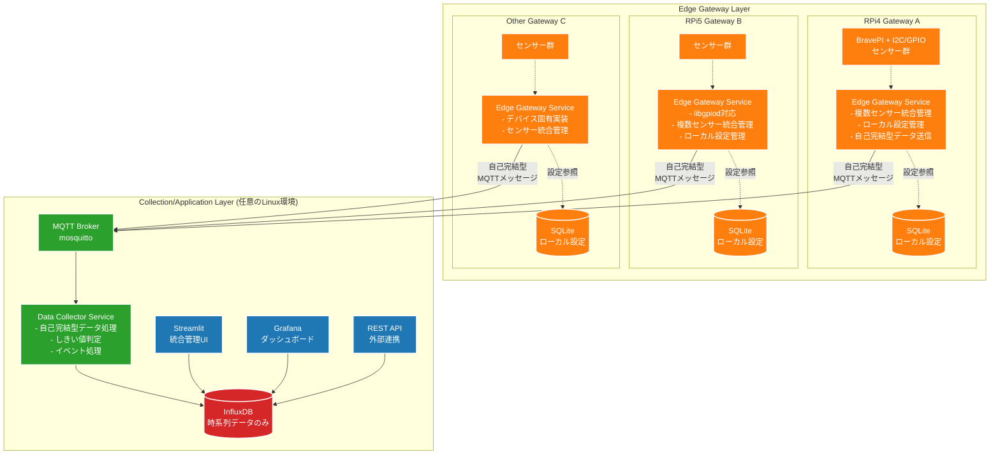
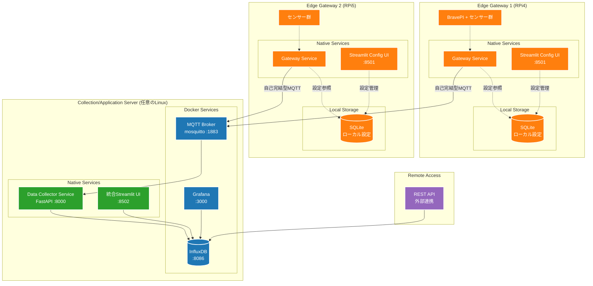
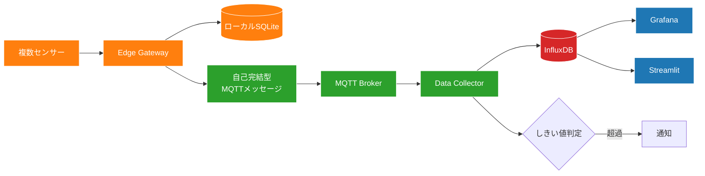

# センサー収集システム アーキテクチャ設計書

## 概要

本ドキュメントは、既存のNode-REDベースのIoTシステムから、よりメンテナンス性の高いPython/FastAPIベースのアーキテクチャへの移行設計を記述します。

## 現状の課題

1. **Node-REDの複雑性**: 大規模なフロー管理が困難
2. **密結合**: センサードライバーとNode-REDが密に結合
3. **メンテナンス性**: 1人での保守が限界
4. **AI活用の制限**: ビジュアルプログラミングではAI支援が限定的

## 新アーキテクチャの設計方針

- **シンプル**: 技術スタックを最小限に
- **疎結合**: 各コンポーネントの独立性を確保
- **保守性**: 1人でも管理可能な構成
- **AI親和性**: テキストベースのコードでAI支援を最大化
- **ポータビリティ**: コレクター層以上は任意のLinux環境で動作
- **スケーラビリティ**: 複数のエッジデバイスからのデータ収集に対応

## システム構成図

### エッジゲートウェイアーキテクチャ概要



## エッジゲートウェイアーキテクチャ詳細

### Layer 1: Edge Gateway Layer（エッジゲートウェイ層）

**責務**
- 複数センサーの統合管理
- ローカル設定としきい値の管理
- ローカルStreamlit設定UI提供
- 自己完結型MQTTメッセージの送信

**Edge Gateway Service**
```python
# edge/gateway_service.py
class EdgeGatewayService:
    def __init__(self, gateway_id: str):
        self.gateway_id = gateway_id
        self.db = LocalSQLiteDB()  # ローカル設定DB
        self.sensors = load_sensor_drivers()
        self.mqtt_client = MQTTClient()
    
    async def collect_and_publish(self):
        for sensor in self.sensors:
            # センサー値読み取り
            value = sensor.read()
            
            # ローカル設定を取得
            config = self.db.get_sensor_config(sensor.id)
            
            # 自己完結型メッセージを構築
            message = {
                "timestamp": datetime.utcnow().isoformat(),
                "gateway_id": self.gateway_id,
                "sensor": {
                    "id": sensor.id,
                    "type": config.sensor_type,
                    "name": config.name,
                    "unit": config.unit,
                    "value": value
                },
                "thresholds": {
                    "high": config.threshold_high,
                    "low": config.threshold_low
                },
                "metadata": {
                    "location": config.location,
                    "calibration": config.offset
                }
            }
            
            await self.mqtt_client.publish("sensors/data", message)
```

**Local Streamlit Configuration UI**
```python
# edge/config_ui.py
import streamlit as st
from database import LocalSQLiteDB

st.set_page_config(page_title="Gateway Config", page_icon="🌡️")

st.title("🌡️ センサーゲートウェイ設定")

# サイドバーでゲートウェイ情報表示
with st.sidebar:
    st.info(f"Gateway ID: {st.session_state.gateway_id}")
    st.metric("接続センサー数", len(sensors))
    st.metric("稼働時間", get_uptime())
    st.metric("MQTT接続", "🟢 接続中" if mqtt_connected else "🔴 切断")

# メインエリア
tab1, tab2, tab3, tab4 = st.tabs(["センサー一覧", "しきい値設定", "システム状態", "ネットワーク"])

with tab1:
    st.subheader("接続センサー一覧")
    
    # リアルタイム更新（autorefresh）
    if st.button("🔄 更新"):
        st.rerun()
    
    # センサー一覧表示
    for sensor in get_sensors():
        with st.container():
            col1, col2, col3, col4 = st.columns([3, 2, 2, 1])
            with col1:
                st.write(f"**{sensor.name}**")
                st.caption(f"{sensor.type} | ID: {sensor.id}")
            with col2:
                current_value = sensor.get_current_value()
                st.metric("現在値", f"{current_value:.2f} {sensor.unit}")
            with col3:
                status = "🟢 正常" if sensor.is_healthy() else "🔴 異常"
                st.write(status)
            with col4:
                if st.button("⚙️", key=f"config_{sensor.id}"):
                    st.session_state.edit_sensor = sensor.id
            st.divider()

with tab2:
    st.subheader("しきい値設定")
    
    # センサー選択
    sensor_options = [(s.id, f"{s.name} ({s.type})") for s in sensors]
    selected_sensor_id = st.selectbox(
        "設定するセンサーを選択",
        options=[opt[0] for opt in sensor_options],
        format_func=lambda x: next(opt[1] for opt in sensor_options if opt[0] == x)
    )
    
    if selected_sensor_id:
        sensor = get_sensor_by_id(selected_sensor_id)
        current_config = get_sensor_config(selected_sensor_id)
        
        st.write(f"**{sensor.name}** の設定")
        
        col1, col2 = st.columns(2)
        with col1:
            high_threshold = st.number_input(
                "上限値", 
                value=current_config.threshold_high,
                step=0.1,
                format="%.2f"
            )
            hysteresis_high = st.number_input(
                "上限ヒステリシス", 
                value=current_config.hysteresis_high,
                step=0.1,
                format="%.2f"
            )
        with col2:
            low_threshold = st.number_input(
                "下限値", 
                value=current_config.threshold_low,
                step=0.1,
                format="%.2f"
            )
            hysteresis_low = st.number_input(
                "下限ヒステリシス", 
                value=current_config.hysteresis_low,
                step=0.1,
                format="%.2f"
            )
        
        # 較正設定
        st.subheader("較正設定")
        offset = st.number_input(
            "オフセット値", 
            value=current_config.offset,
            step=0.01,
            format="%.3f"
        )
        
        # 保存ボタン
        if st.button("💾 設定を保存", type="primary"):
            save_sensor_config(selected_sensor_id, {
                "threshold_high": high_threshold,
                "threshold_low": low_threshold,
                "hysteresis_high": hysteresis_high,
                "hysteresis_low": hysteresis_low,
                "offset": offset
            })
            st.success("✅ 設定を保存しました")
            st.rerun()

with tab3:
    st.subheader("システム状態")
    
    # システム情報
    col1, col2, col3 = st.columns(3)
    with col1:
        st.metric("CPU使用率", f"{get_cpu_usage():.1f}%")
    with col2:
        st.metric("メモリ使用率", f"{get_memory_usage():.1f}%")
    with col3:
        st.metric("ディスク使用率", f"{get_disk_usage():.1f}%")
    
    # サービス状態
    st.subheader("サービス状態")
    services = [
        ("Gateway Service", "gateway-service"),
        ("MariaDB", "mariadb"),
        ("MQTT Client", "mqtt")
    ]
    
    for service_name, service_id in services:
        status = get_service_status(service_id)
        col1, col2, col3 = st.columns([2, 1, 1])
        with col1:
            st.write(service_name)
        with col2:
            st.write("🟢 稼働中" if status == "running" else "🔴 停止")
        with col3:
            if st.button("再起動", key=f"restart_{service_id}"):
                restart_service(service_id)
                st.rerun()

with tab4:
    st.subheader("ネットワーク設定")
    
    # MQTT設定
    st.write("**MQTT設定**")
    mqtt_config = get_mqtt_config()
    
    col1, col2 = st.columns(2)
    with col1:
        mqtt_host = st.text_input("MQTTブローカーホスト", value=mqtt_config.host)
        mqtt_port = st.number_input("ポート", value=mqtt_config.port, min_value=1, max_value=65535)
    with col2:
        mqtt_username = st.text_input("ユーザー名", value=mqtt_config.username)
        mqtt_password = st.text_input("パスワード", type="password", value="")
    
    if st.button("💾 MQTT設定を保存"):
        save_mqtt_config({
            "host": mqtt_host,
            "port": mqtt_port,
            "username": mqtt_username,
            "password": mqtt_password if mqtt_password else mqtt_config.password
        })
        st.success("✅ MQTT設定を保存しました")
        st.rerun()
    
    # 接続テスト
    if st.button("🔗 MQTT接続テスト"):
        if test_mqtt_connection():
            st.success("✅ MQTT接続成功")
        else:
            st.error("❌ MQTT接続失敗")
```

**デバイス固有実装**
- **RPi4**: RPi.GPIO + BravePI Hub
- **RPi5**: libgpiod + 新GPIO API  
- **Orange Pi/Jetson**: デバイス固有ライブラリ

### Layer 2: Collection/Application Layer（統合処理層）

**責務**
- 自己完結型メッセージの受信と処理
- 時系列データの永続化
- 統合ダッシュボードとAPI提供
- **双方向MQTT通信によるゲートウェイ制御**
- **製造業システムとの統合ゲートウェイ機能**

**技術スタック**
- MQTT Broker (mosquitto)
- FastAPI + asyncio
- InfluxDB (時系列データのみ)
- Streamlit (統合管理UI)
- Grafana (可視化)

**Enhanced Data Collector Service**
```python
# collector/data_collector.py
class DataCollectorService:
    def __init__(self):
        self.influxdb = InfluxDBClient()
        self.mqtt_client = MQTTClient()
        self.manufacturing_gateway = ManufacturingGateway()
    
    async def on_sensor_message(self, message):
        data = json.loads(message)
        
        # メッセージに全ての情報が含まれているので、
        # 外部設定を参照せずに処理可能
        sensor_value = data["sensor"]["value"]
        thresholds = data["thresholds"]
        
        # しきい値判定とアラート処理
        if sensor_value > thresholds["high"]:
            await self.trigger_alert(data)
            # 他ゲートウェイへのアラート配信
            await self.broadcast_alert(data)
        
        # InfluxDBに保存（設定情報もタグとして保存）
        await self.influxdb.write({
            "measurement": data["sensor"]["type"],
            "tags": {
                "gateway_id": data["gateway_id"],
                "sensor_id": data["sensor"]["id"],
                "location": data["metadata"]["location"]
            },
            "fields": {
                "value": sensor_value
            },
            "timestamp": data["timestamp"]
        })
        
        # 製造業システムへのデータ転送
        await self.manufacturing_gateway.process_for_manufacturing(data)
    
    async def publish_gateway_config(self, gateway_id: str, config: dict):
        """ゲートウェイへの設定配信"""
        topic = f"gateway/{gateway_id}/config/update"
        await self.mqtt_client.publish(topic, config)
    
    async def send_gateway_command(self, gateway_id: str, command: dict):
        """ゲートウェイへのコマンド送信"""
        topic = f"gateway/{gateway_id}/command/{command['type']}"
        await self.mqtt_client.publish(topic, command)
    
    async def broadcast_alert(self, alert_data: dict):
        """アラートの全ゲートウェイ配信"""
        topic = "alert/broadcast"
        alert_message = {
            "source_gateway": alert_data["gateway_id"],
            "alert_type": "threshold_exceeded",
            "sensor_info": alert_data["sensor"],
            "timestamp": alert_data["timestamp"],
            "suggested_actions": self.get_suggested_actions(alert_data)
        }
        await self.mqtt_client.publish(topic, alert_message)
```

**Manufacturing Gateway Integration**
```python
# collector/manufacturing_gateway.py
class ManufacturingGateway:
    def __init__(self):
        self.mes_client = MESClient()
        self.erp_client = ERPClient()
        self.scada_client = SCADAClient()
        self.mqtt_client = MQTTClient()
    
    async def process_for_manufacturing(self, sensor_data):
        """製造業システム向けデータ処理"""
        
        # トヨタ生産方式：かんばん方式への連携
        if sensor_data["sensor"]["type"] == "production_count":
            await self.update_kanban_system(sensor_data)
        
        # アンドン（異常通知）システム連携
        if self.is_quality_issue(sensor_data):
            await self.trigger_andon_alert(sensor_data)
        
        # ジャストインタイム制御
        if sensor_data["sensor"]["type"] == "inventory_level":
            await self.jit_control(sensor_data)
        
        # 予知保全への活用
        if self.is_maintenance_required(sensor_data):
            await self.schedule_maintenance(sensor_data)
    
    async def trigger_andon_alert(self, data):
        """アンドンシステムへのアラート送信"""
        alert_message = {
            "line_id": data["metadata"]["location"],
            "alert_type": "quality_issue",
            "severity": self.calculate_severity(data),
            "sensor_data": data["sensor"],
            "timestamp": data["timestamp"],
            "suggested_action": "stop_line_inspection"
        }
        
        # MES/ERPシステムへの通知
        await self.mes_client.send_alert(alert_message)
        
        # 現場表示システムへの通知
        await self.mqtt_client.publish("manufacturing/andon", alert_message)
    
    async def update_kanban_system(self, data):
        """かんばんシステムの更新"""
        production_data = {
            "line_id": data["metadata"]["location"],
            "product_count": data["sensor"]["value"],
            "timestamp": data["timestamp"],
            "quality_status": self.assess_quality(data)
        }
        
        # ERPシステムへの生産実績送信
        await self.erp_client.update_production(production_data)
        
        # 次工程への指示（必要に応じて）
        if self.should_trigger_next_process(data):
            await self.trigger_downstream_process(data)
    
    async def to_opc_ua_format(self, sensor_data):
        """OPC UAフォーマットへの変換"""
        return {
            "NodeId": f"ns=1;s={sensor_data['sensor']['id']}",
            "Value": sensor_data["sensor"]["value"],
            "SourceTimestamp": sensor_data["timestamp"],
            "StatusCode": "Good"
        }
    
    async def to_mqtt_sparkplug(self, sensor_data):
        """MQTT Sparkplug B仕様への変換"""
        return {
            "timestamp": int(datetime.fromisoformat(sensor_data["timestamp"]).timestamp() * 1000),
            "metrics": [{
                "name": sensor_data["sensor"]["id"],
                "value": sensor_data["sensor"]["value"],
                "type": "Double",
                "timestamp": int(datetime.fromisoformat(sensor_data["timestamp"]).timestamp() * 1000)
            }]
        }
```

**Gateway Command Handler (Edge側での受信処理)**
```python
# edge-gateway/command_handler.py  
class CommandHandler:
    async def on_config_update(self, message):
        """設定更新コマンドの処理"""
        config = json.loads(message)
        await self.db.update_sensor_config(config["sensor_id"], config)
        
        # 設定更新完了を報告
        response = {
            "gateway_id": self.gateway_id,
            "command_id": config["command_id"],
            "status": "completed",
            "timestamp": datetime.utcnow().isoformat()
        }
        await self.mqtt_client.publish("gateway/response", response)
    
    async def on_system_command(self, message):
        """システムコマンドの処理"""
        command = json.loads(message)
        
        if command["action"] == "restart_service":
            await self.restart_service(command["service_name"])
        elif command["action"] == "calibrate_sensor":
            await self.calibrate_sensor(command["sensor_id"])
        elif command["action"] == "emergency_stop":
            await self.emergency_stop()
```

**MQTT Topic Structure**
```
# 既存：データ収集
sensors/data

# 新規：ゲートウェイ制御
gateway/{gateway_id}/config/{config_type}      # 設定配信
gateway/{gateway_id}/command/{command_type}    # コマンド送信
gateway/response                               # 実行結果報告

# 新規：アラート配信
alert/broadcast                                # 全体アラート
alert/{gateway_id}/local                       # 特定ゲートウェイ

# 新規：製造業システム連携
manufacturing/andon                            # アンドンシステム
manufacturing/kanban                           # かんばんシステム
manufacturing/production                       # 生産実績
manufacturing/quality                          # 品質データ
manufacturing/maintenance                      # 保全情報
```

**特徴**
- **双方向通信**: CollectorからGatewayへの制御配信
- **製造業統合**: トヨタ生産方式等の概念を実装
- **標準プロトコル対応**: OPC UA、MQTT Sparkplug B対応
- **リアルタイム制御**: アンドン、かんばん、JIT制御
- **設定非依存**: MQTTメッセージが自己完結
- **スケーラブル**: 複数ゲートウェイと複数製造システムの統合

## エッジゲートウェイ対応ディレクトリ構造

```
iot-gateway-system/
├── edge-gateway/            # エッジゲートウェイ層（各ゲートウェイで実行）
│   ├── gateway_service.py   # ゲートウェイサービス
│   ├── config_ui.py         # ローカルStreamlit設定UI
│   ├── command_handler.py   # 双方向MQTT通信ハンドラー
│   ├── sensors/             # センサードライバー
│   │   ├── __init__.py
│   │   ├── base.py         # 基底クラス
│   │   ├── i2c/
│   │   │   ├── vl53l1x.py   # 測距センサー
│   │   │   ├── opt3001.py   # 照度センサー
│   │   │   ├── mcp3427.py   # ADCセンサー
│   │   │   ├── mcp9600.py   # 熱電対センサー
│   │   │   ├── lis2duxs12.py # 加速度センサー
│   │   │   └── sdp610.py    # 差圧センサー
│   │   ├── gpio/
│   │   │   └── gpio.py      # GPIO入出力
│   │   ├── serial/
│   │   │   └── brave.py     # BravePIシリアル通信
│   │   └── brave_hub/
│   │       └── brave_hub.py # BravePI Hub管理
│   ├── hardware/            # ハードウェア抽象化層
│   │   ├── __init__.py
│   │   ├── interfaces.py    # 抽象インターフェース
│   │   ├── rpi4/
│   │   │   ├── gpio.py     # RPi4 GPIO実装
│   │   │   └── i2c.py      # RPi4 I2C実装
│   │   ├── rpi5/
│   │   │   ├── gpio.py     # RPi5 GPIO実装（libgpiod）
│   │   │   └── i2c.py      # RPi5 I2C実装
│   │   └── mock/
│   │       ├── gpio.py     # テスト用モック
│   │       └── i2c.py      # テスト用モック
│   ├── database/            # ローカルSQLite管理
│   │   ├── models.py       # SQLiteモデル
│   │   ├── schema.sql      # テーブル定義
│   │   └── init.py         # DB初期化
│   ├── config/
│   │   └── gateway_config.yml # ゲートウェイ設定
│   └── requirements-gateway.txt # ゲートウェイ用依存関係
│
├── collection-server/       # 統合処理層（任意のLinux環境）
│   ├── main.py             # FastAPIアプリケーション
│   ├── data_collector.py   # MQTTデータ受信・処理
│   ├── manufacturing_gateway.py # 製造業システム統合
│   ├── storage.py          # InfluxDB書き込み
│   ├── alert_manager.py    # アラート処理
│   ├── api/                # REST API
│   │   ├── __init__.py
│   │   ├── routers/
│   │   │   ├── gateways.py # ゲートウェイ管理
│   │   │   ├── sensors.py  # センサーデータ
│   │   │   └── alerts.py   # アラート管理
│   │   └── models.py       # APIモデル
│   ├── streamlit_app/      # 統合管理UI
│   │   ├── main.py
│   │   ├── pages/
│   │   │   ├── overview.py    # 全体概要
│   │   │   ├── gateways.py    # ゲートウェイ状況
│   │   │   ├── sensors.py     # センサー一覧
│   │   │   └── alerts.py      # アラート管理
│   │   └── components/
│   │       ├── charts.py      # グラフコンポーネント
│   │       └── tables.py      # テーブルコンポーネント
│   ├── config/
│   │   └── server_config.yml
│   └── requirements-server.txt
│
├── common/                  # 共通ライブラリ（全層で使用）
│   ├── __init__.py
│   ├── mqtt_client.py       # MQTT共通クライアント
│   ├── message_format.py    # 自己完結型メッセージ定義
│   ├── config_loader.py     # 設定ファイル読み込み
│   ├── logger.py            # ロギング設定
│   └── models/              # 共通データモデル
│       ├── sensor_data.py   # センサーデータ構造
│       ├── gateway_info.py  # ゲートウェイ情報
│       └── alert_rule.py    # アラートルール
│
├── infrastructure/          # インフラストラクチャ構成
│   ├── docker/              # Dockerコンテナ構成（Collection層用）
│   │   ├── docker-compose.yml       # 開発環境用
│   │   ├── docker-compose.prod.yml  # 本番環境用
│   │   ├── influxdb/
│   │   │   ├── Dockerfile
│   │   │   └── config/
│   │   ├── grafana/
│   │   │   ├── Dockerfile
│   │   │   ├── dashboards/
│   │   │   └── provisioning/
│   │   └── mosquitto/
│   │       ├── Dockerfile
│   │       └── config/
│   ├── gateway-setup/       # ゲートウェイセットアップ
│   │   ├── sqlite/
│   │   │   ├── schema.sql
│   │   │   └── setup.py
│   │   └── systemd/
│   │       └── gateway-service.service
│   ├── systemd/             # Collection層systemdサービス
│   │   ├── collector-service.service
│   │   └── streamlit-app.service
│   └── ansible/             # デプロイメント自動化
│       ├── playbooks/
│       │   ├── deploy-gateway.yml
│       │   └── deploy-server.yml
│       └── inventory/
│
├── tests/                   # テストコード
│   ├── test_gateway/
│   │   ├── test_sensors/
│   │   └── test_message_format/
│   ├── test_server/
│   │   ├── test_collector/
│   │   └── test_api/
│   └── test_common/
│
├── docs/                    # ドキュメント
│   ├── deployment/          # デプロイメントガイド
│   │   ├── gateway-setup.md
│   │   └── server-setup.md
│   ├── api/                 # API仕様
│   │   └── message-format.md # MQTTメッセージ仕様
│   └── troubleshooting/     # トラブルシューティング
│
├── scripts/                 # 運用スクリプト
│   ├── deploy_gateway.sh    # ゲートウェイデプロイ
│   ├── deploy_server.sh     # サーバーデプロイ
│   ├── gateway_health.py    # ゲートウェイヘルスチェック
│   └── sync_config.py       # 設定同期（必要に応じて）
│
└── config/                  # 全体設定
    ├── message_schema.json  # MQTTメッセージスキーマ
    └── environments/        # 環境別設定
        ├── development.yml
        ├── staging.yml
        └── production.yml
```

## インフラストラクチャ構成

### デプロイメント構成例



### 層別ポート構成

#### Edge Gateway Layer
| サービス | 実行環境 | ポート | 用途 | アクセス方法 |
|---------|---------|--------|------|----------|
| Gateway Service | Native | - | センサーデータ収集 | systemdサービス |
| Streamlit Config UI | Native | 8501 | ローカル設定管理 | http://gateway-ip:8501 |
| SQLite Database | File | - | ローカル設定保存 | ファイルアクセス |

#### Collection/Application Layer
| サービス | 実行環境 | ポート | 用途 | アクセス方法 |
|---------|---------|--------|------|----------|
| MQTT Broker | Docker | 1883 | ゲートウェイ間通信 | mqtt://server-ip:1883 |
| Data Collector Service | Native | 8000 | データ収集API | http://server-ip:8000 |
| 統合Streamlit UI | Native | 8502 | 全体管理・監視 | http://server-ip:8502 |
| InfluxDB | Docker | 8086 | 時系列データ保存 | 内部アクセスのみ |
| Grafana | Docker | 3000 | データ可視化 | http://server-ip:3000 |

#### 推奨アクセス方法

**ローカル設定（各ゲートウェイ）**
```bash
# RPi4ゲートウェイの設定
http://192.168.1.100:8501

# RPi5ゲートウェイの設定  
http://192.168.1.101:8501
```

**統合監視・管理（サーバー）**
```bash
# 統合管理画面
http://192.168.1.200:8502

# データ可視化
http://192.168.1.200:3000

# API アクセス
http://192.168.1.200:8000/docs
```

### 各層の技術選択理由

**Edge Gateway Layer（エッジゲートウェイ層）**
- **ネイティブ実行**: ハードウェア直接アクセス必須
- **軽量DB**: SQLiteによる最小リソース使用
- **自律動作**: ネットワーク切断時も設定管理継続

**Collection/Application Layer（統合処理層）**
- **ハイブリッド構成**: 
  - アプリケーション: ネイティブ（性能重視）
  - データベース: Docker（運用性重視）
- **完全抽象化**: ハードウェア非依存
- **クラウド対応**: スケーラビリティ確保

## データフロー

### 1. 自己完結型データフロー



### 2. MQTTメッセージ構造

```json
{
  "timestamp": "2024-01-15T10:30:00Z",
  "gateway_id": "rpi4-factory-001",
  "sensor": {
    "id": "temp-room-01",
    "type": "temperature",
    "name": "工場内温度センサー",
    "unit": "℃",
    "value": 25.3
  },
  "thresholds": {
    "high": 30.0,
    "low": 10.0,
    "hysteresis": 1.0
  },
  "metadata": {
    "location": "製造ライン1",
    "calibration_offset": 0.2,
    "last_calibrated": "2024-01-01T00:00:00Z"
  },
  "quality": {
    "confidence": 0.95,
    "error_status": "ok"
  }
}
```

## 分散アーキテクチャ移行戦略

### Phase 1: ハードウェア抽象化層の構築
1. **抽象インターフェースの定義**
   - GPIO、I2C、Serial通信の統一インターフェース作成
   - RPi4/RPi5/その他SBC対応の実装
   - モック実装によるテスト環境構築

2. **Edge Layer基盤開発**
   - Hardware Access Serviceの基本実装
   - MQTTクライアント機能の実装
   - 設定ファイルによるデバイス管理

### Phase 2: Collection Layer開発
1. **MQTT基盤の構築**
   - mosquitto MQTTブローカーの設定
   - メッセージフォーマットの標準化
   - QoS設定とエラーハンドリング

2. **データ収集サービス開発**
   - MQTTサブスクライバーの実装
   - しきい値判定ロジックの移植
   - InfluxDB書き込み機能

### Phase 3: Application Layer開発
1. **設定管理UIの構築**
   - Streamlitによる管理画面
   - 既存MariaDBスキーマとの連携
   - デバイス登録・設定機能

2. **可視化環境の構築**
   - Grafanaダッシュボードの作成
   - アラート設定とパネル構成

### Phase 4: 段階的移行
1. **パイロット運用**
   - 1台のエッジデバイスで動作確認
   - 既存Node-REDシステムとの並行稼働
   - データ整合性の検証

2. **本格運用**
   - 全エッジデバイスの順次移行
   - パフォーマンス監視と調整
   - Node-REDシステムの段階的停止

## 分散アーキテクチャの利点

### ポータビリティとスケーラビリティ

**Edge Layer（エッジデバイス層）**
- **ハードウェア抽象化**: RPi4/5やその他SBCへの対応
- **軽量実装**: リソース制約下での効率的動作
- **デバイス固有最適化**: 各ハードウェアの特性を活用

**Collection Layer（データ収集層）**
- **ハードウェア非依存**: 任意のLinux環境で動作
- **水平スケーリング**: 複数エッジデバイスからのデータ統合
- **高可用性**: 単一障害点の排除

**Application Layer（アプリケーション層）**
- **クラウド対応**: AWS/Azure/GCPでの運用可能
- **マルチテナント**: 複数サイトの統合管理
- **API連携**: 外部システムとのシームレスな統合

### 技術選定の理由

**MQTT**
- **軽量プロトコル**: IoTデバイスに最適
- **QoS保証**: データ配信の信頼性
- **Pub/Sub**: 疎結合なアーキテクチャ

**ハードウェア抽象化**
- **将来性**: 新しいSBCへの対応容易
- **テスタビリティ**: モック実装による単体テスト
- **保守性**: ハードウェア固有コードの局所化

**既存DB活用**
- **移行コスト削減**: スキーマ変更不要
- **データ継続性**: 過去データの保持
- **実績**: 現行システムでの安定稼働

## セキュリティ考慮事項

1. **認証**: StreamlitとGrafanaに認証機能を実装
2. **通信**: HTTPS/TLSでの暗号化
3. **アクセス制御**: ロールベースの権限管理
4. **監査**: 操作ログの記録

## パフォーマンス目標

- センサーポーリング: 最大100センサー/秒
- データ書き込み: 1000ポイント/秒
- UI応答時間: 1秒以内
- システム稼働率: 99.9%

## 今後の拡張性

1. **センサー追加**: プラグイン形式で容易に追加
2. **クラウド連携**: AWS/Azure IoT Hubへの接続
3. **機械学習**: 異常検知・予測機能の追加
4. **マルチサイト**: 複数拠点の統合管理

## まとめ

本分散アーキテクチャにより、以下の効果が期待できます：

### 技術的メリット
- **ハードウェア互換性**: RPi4/5やその他SBCへの柔軟な対応
- **スケーラビリティ**: 複数エッジデバイスからの統合データ収集
- **保守性**: レイヤー分離による明確な責務分担
- **テスタビリティ**: ハードウェア抽象化によるモック実装

### 運用メリット
- **分散配置**: エッジとコレクションの最適配置
- **段階的移行**: 既存システムからのリスク最小化
- **クラウド対応**: 将来的なクラウド移行の容易性
- **AI支援**: テキストベースコードによる開発効率向上

### ビジネスメリット
- **コスト削減**: 既存資産の有効活用
- **迅速な展開**: 標準化されたデプロイメント
- **将来性**: 新技術への対応力
- **保守効率**: 1人でも管理可能な構成

既存システムの良い部分（MariaDBスキーマ、センサー制御ロジック、ハードウェア資産）を活かしながら、Node-REDの複雑性とハードウェア依存性から脱却し、より現代的で拡張性の高いIoTプラットフォームへの進化を実現します。