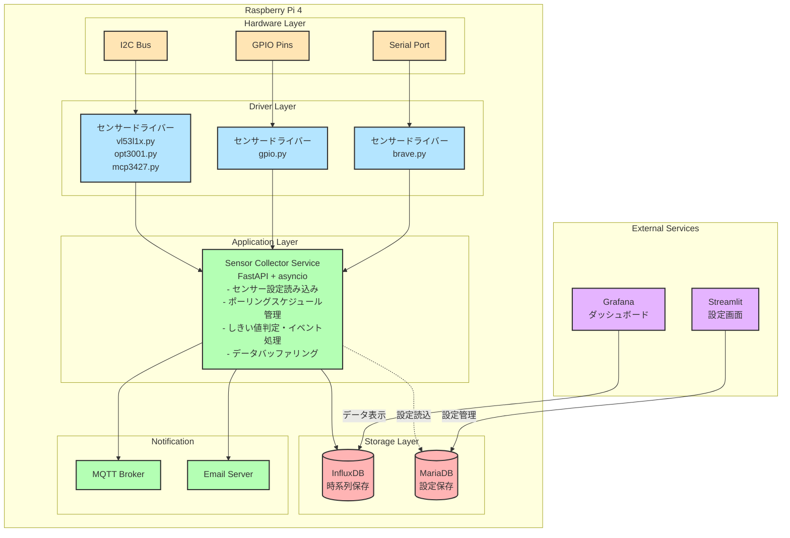
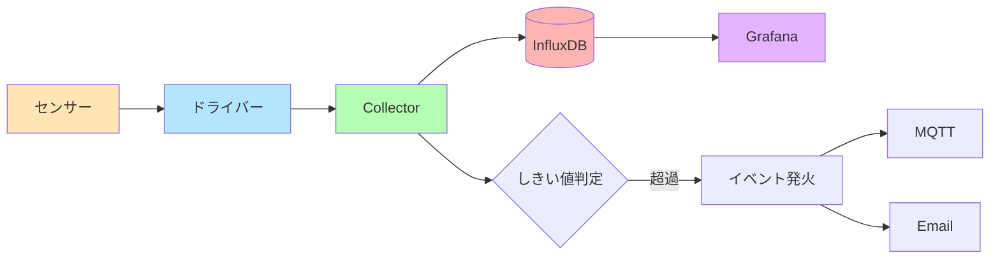

# センサー収集システム アーキテクチャ設計書

## 概要

本ドキュメントは、既存のNode-REDベースのIoTシステムから、よりメンテナンス性の高いPython/FastAPIベースのアーキテクチャへの移行設計を記述します。

## 現状の課題

1. **Node-REDの複雑性**: 大規模なフロー管理が困難
2. **密結合**: センサードライバーとNode-REDが密に結合
3. **メンテナンス性**: 1人での保守が限界
4. **AI活用の制限**: ビジュアルプログラミングではAI支援が限定的

## 新アーキテクチャの設計方針

- **シンプル**: 技術スタックを最小限に
- **疎結合**: 各コンポーネントの独立性を確保
- **保守性**: 1人でも管理可能な構成
- **AI親和性**: テキストベースのコードでAI支援を最大化

## システム構成図



## コンポーネント詳細

### 1. センサードライバー層

**責務**
- ハードウェアとの直接通信
- センサー固有のプロトコル実装
- データの取得と基本的な変換

**特徴**
- Node-RED依存の完全排除
- 純粋なPythonライブラリとして実装
- 単体テスト可能な設計

**実装例**
```python
# sensors/i2c/vl53l1x.py
class VL53L1X:
    def __init__(self, address=0x29, bus=1):
        self.address = address
        self.bus = smbus2.SMBus(bus)
    
    def read_distance(self) -> int:
        # I2C通信でセンサー値を取得
        return distance_mm
```

### 2. Sensor Collector Service

**責務**
- センサーデータの定期収集
- しきい値判定とイベント処理
- データの永続化
- 通知処理

**技術スタック**
- FastAPI: 非同期処理とAPI提供
- asyncio: 並行処理
- SQLAlchemy: MariaDB接続
- influxdb-client: 時系列データ保存

**主要機能**
- MariaDBから設定を読み込み
- 各センサーを非同期でポーリング
- しきい値超過時のアクション実行
- バッファリングによる書き込み最適化

### 3. 設定管理UI (Streamlit)

**責務**
- センサーデバイスの登録・編集・削除
- しきい値とアラート条件の設定
- 通知先の管理
- システム状態の表示

**特徴**
- Pythonのみで実装
- リアクティブなUI
- 既存のMariaDBスキーマを活用

### 4. データ可視化 (Grafana)

**責務**
- リアルタイムデータの表示
- 履歴データのグラフ化
- アラート状態の可視化

**特徴**
- InfluxDBから直接データ取得
- 1秒間隔での更新に対応
- カスタムダッシュボード作成可能

## ディレクトリ構造

```
iot-system/
├── sensors/                # センサードライバー
│   ├── __init__.py
│   ├── base.py            # 基底クラス
│   ├── i2c/
│   │   ├── vl53l1x.py     # 測距センサー
│   │   ├── opt3001.py     # 照度センサー
│   │   ├── mcp3427.py     # ADCセンサー
│   │   ├── mcp9600.py     # 熱電対センサー
│   │   ├── lis2duxs12.py  # 加速度センサー
│   │   └── sdp610.py      # 差圧センサー
│   ├── gpio/
│   │   └── gpio.py        # GPIO入出力
│   └── serial/
│       └── brave.py       # BravePIシリアル通信
│
├── collector/             # データ収集サービス
│   ├── main.py           # FastAPIアプリケーション
│   ├── scheduler.py      # ポーリングスケジューラー
│   ├── processor.py      # しきい値判定・イベント処理
│   ├── storage.py        # InfluxDB書き込み
│   ├── notifier.py       # MQTT/Email通知
│   └── models.py         # Pydanticモデル
│
├── config/               # 設定管理UI
│   ├── main.py          # Streamlitアプリケーション
│   ├── pages/           # マルチページ構成
│   │   ├── devices.py   # デバイス管理
│   │   ├── sensors.py   # センサー設定
│   │   └── alerts.py    # アラート設定
│   └── models.py        # SQLAlchemyモデル
│
├── common/              # 共通ライブラリ
│   ├── database.py      # DB接続管理
│   ├── config.py        # 設定ファイル読み込み
│   └── logger.py        # ロギング設定
│
├── tests/               # テストコード
│   ├── test_sensors/
│   ├── test_collector/
│   └── test_config/
│
├── docker-compose.yml   # コンテナ構成
├── requirements.txt     # Python依存関係
└── config.yml          # アプリケーション設定
```

## データフロー

### 1. センサーデータ収集フロー



### 2. 設定管理フロー


## 移行戦略

### Phase 1: 基盤構築
1. センサードライバーライブラリの実装
2. Collector Serviceの基本機能実装
3. 既存MariaDBとの接続確認

### Phase 2: 機能実装
1. しきい値判定ロジックの移植
2. 通知機能の実装
3. Streamlit設定UIの構築

### Phase 3: 統合テスト
1. 全センサーでの動作確認
2. パフォーマンステスト
3. 既存システムとの並行稼働

### Phase 4: 切り替え
1. Grafanaダッシュボードの構築
2. 本番環境への段階的移行
3. Node-REDシステムの停止

## 技術選定の理由

### Python + FastAPI
- **開発効率**: Pythonの豊富なライブラリ
- **非同期処理**: 高効率なセンサーポーリング
- **AI支援**: コード生成・デバッグが容易

### Streamlit
- **迅速な開発**: UIコンポーネントが豊富
- **Pythonのみ**: フロントエンド知識不要
- **リアクティブ**: 自動的なUI更新

### Grafana
- **実績**: 時系列データ可視化のデファクト
- **柔軟性**: カスタムダッシュボード作成
- **性能**: 大量データの高速表示

### 既存DB活用
- **移行コスト削減**: スキーマ変更不要
- **データ継続性**: 過去データの保持
- **実績**: 現行システムでの安定稼働

## セキュリティ考慮事項

1. **認証**: StreamlitとGrafanaに認証機能を実装
2. **通信**: HTTPS/TLSでの暗号化
3. **アクセス制御**: ロールベースの権限管理
4. **監査**: 操作ログの記録

## パフォーマンス目標

- センサーポーリング: 最大100センサー/秒
- データ書き込み: 1000ポイント/秒
- UI応答時間: 1秒以内
- システム稼働率: 99.9%

## 今後の拡張性

1. **センサー追加**: プラグイン形式で容易に追加
2. **クラウド連携**: AWS/Azure IoT Hubへの接続
3. **機械学習**: 異常検知・予測機能の追加
4. **マルチサイト**: 複数拠点の統合管理

## まとめ

本アーキテクチャにより、以下の効果が期待できます：

- **保守性向上**: シンプルな構成で1人でも管理可能
- **開発効率**: AI支援による高速開発
- **拡張性**: モジュラー設計による柔軟な機能追加
- **信頼性**: 各コンポーネントの独立性による障害の局所化

既存システムの良い部分（MariaDBスキーマ、センサー制御ロジック）を活かしながら、Node-REDの複雑性から脱却し、より現代的で保守しやすいシステムへの移行を実現します。