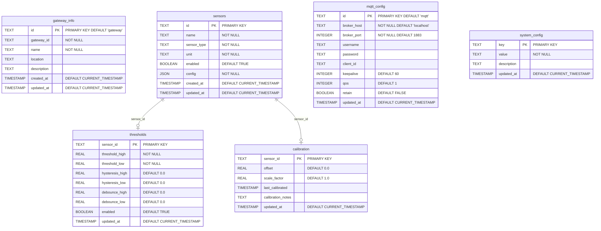

# エッジゲートウェイ SQLite実装詳細

## 概要

エッジゲートウェイでは軽量で信頼性の高いSQLiteを使用してローカル設定を管理します。MariaDBと比較して、大幅なリソース削減と運用の簡素化を実現します。

## SQLite採用の理由

### リソース効率性
- **メモリ使用量**: MariaDBの1/10以下（約10-50MB）
- **ディスク使用量**: 単一ファイル（1-10MB程度）
- **CPU使用量**: プロセス不要のため最小限

### 運用の簡素化
- **設定不要**: インストール後すぐに使用可能
- **プロセス管理不要**: ライブラリとして動作
- **バックアップ簡単**: 単一ファイルのコピーのみ
- **障害リスク削減**: プロセス死活監視が不要

### 機能的十分性
- **JSON対応**: 設定データの柔軟な格納
- **トランザクション**: データ整合性の保証
- **同期書き込み**: 電源断時のデータ保護
- **インデックス**: 必要な検索性能

## データベース設計

### テーブル構造

```sql
-- エッジゲートウェイ設定管理スキーマ
-- infrastructure/gateway-setup/sqlite/schema.sql

-- ゲートウェイ基本情報
CREATE TABLE gateway_info (
    id TEXT PRIMARY KEY DEFAULT 'gateway',
    gateway_id TEXT NOT NULL,
    name TEXT NOT NULL,
    location TEXT,
    description TEXT,
    created_at TIMESTAMP DEFAULT CURRENT_TIMESTAMP,
    updated_at TIMESTAMP DEFAULT CURRENT_TIMESTAMP
);

-- センサー設定
CREATE TABLE sensors (
    id TEXT PRIMARY KEY,
    name TEXT NOT NULL,
    sensor_type TEXT NOT NULL,
    unit TEXT NOT NULL,
    enabled BOOLEAN DEFAULT TRUE,
    config JSON NOT NULL,
    created_at TIMESTAMP DEFAULT CURRENT_TIMESTAMP,
    updated_at TIMESTAMP DEFAULT CURRENT_TIMESTAMP
);

-- しきい値設定
CREATE TABLE thresholds (
    sensor_id TEXT PRIMARY KEY,
    threshold_high REAL NOT NULL,
    threshold_low REAL NOT NULL,
    hysteresis_high REAL DEFAULT 0.0,
    hysteresis_low REAL DEFAULT 0.0,
    debounce_high REAL DEFAULT 0.0,
    debounce_low REAL DEFAULT 0.0,
    enabled BOOLEAN DEFAULT TRUE,
    updated_at TIMESTAMP DEFAULT CURRENT_TIMESTAMP,
    FOREIGN KEY (sensor_id) REFERENCES sensors(id) ON DELETE CASCADE
);

-- 較正設定
CREATE TABLE calibration (
    sensor_id TEXT PRIMARY KEY,
    offset REAL DEFAULT 0.0,
    scale_factor REAL DEFAULT 1.0,
    last_calibrated TIMESTAMP,
    calibration_notes TEXT,
    updated_at TIMESTAMP DEFAULT CURRENT_TIMESTAMP,
    FOREIGN KEY (sensor_id) REFERENCES sensors(id) ON DELETE CASCADE
);

-- MQTT設定
CREATE TABLE mqtt_config (
    id TEXT PRIMARY KEY DEFAULT 'mqtt',
    broker_host TEXT NOT NULL DEFAULT 'localhost',
    broker_port INTEGER NOT NULL DEFAULT 1883,
    username TEXT,
    password TEXT,
    client_id TEXT,
    keepalive INTEGER DEFAULT 60,
    qos INTEGER DEFAULT 1,
    retain BOOLEAN DEFAULT FALSE,
    updated_at TIMESTAMP DEFAULT CURRENT_TIMESTAMP
);

-- システム設定
CREATE TABLE system_config (
    key TEXT PRIMARY KEY,
    value TEXT NOT NULL,
    description TEXT,
    updated_at TIMESTAMP DEFAULT CURRENT_TIMESTAMP
);

-- インデックス
CREATE INDEX idx_sensors_type ON sensors(sensor_type);
CREATE INDEX idx_sensors_enabled ON sensors(enabled);
CREATE INDEX idx_thresholds_enabled ON thresholds(enabled);

-- トリガー（更新日時の自動更新）
CREATE TRIGGER update_sensors_timestamp 
    AFTER UPDATE ON sensors
BEGIN
    UPDATE sensors SET updated_at = CURRENT_TIMESTAMP WHERE id = NEW.id;
END;

CREATE TRIGGER update_thresholds_timestamp 
    AFTER UPDATE ON thresholds
BEGIN
    UPDATE thresholds SET updated_at = CURRENT_TIMESTAMP WHERE sensor_id = NEW.sensor_id;
END;

CREATE TRIGGER update_calibration_timestamp 
    AFTER UPDATE ON calibration
BEGIN
    UPDATE calibration SET updated_at = CURRENT_TIMESTAMP WHERE sensor_id = NEW.sensor_id;
END;
```

### 初期データ

```sql
-- 初期設定データ
INSERT INTO gateway_info (gateway_id, name, location) 
VALUES ('rpi4-gateway-001', 'Factory Line 1 Gateway', 'Manufacturing Floor A');

INSERT INTO mqtt_config (broker_host, broker_port, client_id) 
VALUES ('192.168.1.200', 1883, 'rpi4-gateway-001');

-- システム設定のデフォルト値
INSERT INTO system_config (key, value, description) VALUES
    ('data_collection_interval', '1.0', 'Data collection interval in seconds'),
    ('heartbeat_interval', '30.0', 'Heartbeat transmission interval in seconds'),
    ('log_level', 'INFO', 'Logging level (DEBUG, INFO, WARNING, ERROR)'),
    ('max_retry_attempts', '3', 'Maximum retry attempts for MQTT publishing'),
    ('connection_timeout', '10.0', 'Network connection timeout in seconds');
```

## Python実装

### データベースクラス

```python
# edge-gateway/database/sqlite_manager.py
import sqlite3
import json
import threading
from contextlib import contextmanager
from pathlib import Path
from typing import Dict, List, Optional, Any

class LocalSQLiteDB:
    def __init__(self, db_path: str = "gateway_config.db"):
        self.db_path = Path(db_path)
        self._local = threading.local()
        self._init_database()
    
    def _init_database(self):
        """データベースとテーブルを初期化"""
        if not self.db_path.exists():
            self._create_tables()
            self._insert_default_data()
    
    def _create_tables(self):
        """テーブル作成"""
        with self._get_connection() as conn:
            schema_path = Path(__file__).parent / "schema.sql"
            with open(schema_path, 'r', encoding='utf-8') as f:
                conn.executescript(f.read())
    
    @contextmanager
    def _get_connection(self):
        """スレッドローカルなDB接続を取得"""
        if not hasattr(self._local, 'connection'):
            self._local.connection = sqlite3.connect(
                self.db_path,
                isolation_level=None,  # autocommit mode
                check_same_thread=False
            )
            self._local.connection.row_factory = sqlite3.Row
        
        try:
            yield self._local.connection
        except Exception:
            self._local.connection.rollback()
            raise
    
    def get_sensor_config(self, sensor_id: str) -> Optional[Dict]:
        """センサー設定を取得"""
        with self._get_connection() as conn:
            cursor = conn.execute("""
                SELECT s.*, t.*, c.*
                FROM sensors s
                LEFT JOIN thresholds t ON s.id = t.sensor_id
                LEFT JOIN calibration c ON s.id = c.sensor_id
                WHERE s.id = ? AND s.enabled = TRUE
            """, (sensor_id,))
            
            row = cursor.fetchone()
            if not row:
                return None
            
            return {
                "sensor": {
                    "id": row["id"],
                    "name": row["name"],
                    "sensor_type": row["sensor_type"],
                    "unit": row["unit"],
                    "config": json.loads(row["config"]) if row["config"] else {}
                },
                "thresholds": {
                    "high": row["threshold_high"],
                    "low": row["threshold_low"],
                    "hysteresis_high": row["hysteresis_high"] or 0.0,
                    "hysteresis_low": row["hysteresis_low"] or 0.0,
                    "debounce_high": row["debounce_high"] or 0.0,
                    "debounce_low": row["debounce_low"] or 0.0
                },
                "calibration": {
                    "offset": row["offset"] or 0.0,
                    "scale_factor": row["scale_factor"] or 1.0,
                    "last_calibrated": row["last_calibrated"]
                }
            }
    
    def update_sensor_config(self, sensor_id: str, config: Dict) -> bool:
        """センサー設定を更新"""
        try:
            with self._get_connection() as conn:
                # センサー基本情報の更新
                if "sensor" in config:
                    sensor_data = config["sensor"]
                    conn.execute("""
                        UPDATE sensors 
                        SET name = ?, sensor_type = ?, unit = ?, config = ?
                        WHERE id = ?
                    """, (
                        sensor_data.get("name"),
                        sensor_data.get("sensor_type"),
                        sensor_data.get("unit"),
                        json.dumps(sensor_data.get("config", {})),
                        sensor_id
                    ))
                
                # しきい値設定の更新
                if "thresholds" in config:
                    thresholds = config["thresholds"]
                    conn.execute("""
                        INSERT OR REPLACE INTO thresholds 
                        (sensor_id, threshold_high, threshold_low, 
                         hysteresis_high, hysteresis_low, debounce_high, debounce_low)
                        VALUES (?, ?, ?, ?, ?, ?, ?)
                    """, (
                        sensor_id,
                        thresholds.get("high"),
                        thresholds.get("low"),
                        thresholds.get("hysteresis_high", 0.0),
                        thresholds.get("hysteresis_low", 0.0),
                        thresholds.get("debounce_high", 0.0),
                        thresholds.get("debounce_low", 0.0)
                    ))
                
                # 較正設定の更新
                if "calibration" in config:
                    calibration = config["calibration"]
                    conn.execute("""
                        INSERT OR REPLACE INTO calibration 
                        (sensor_id, offset, scale_factor, last_calibrated, calibration_notes)
                        VALUES (?, ?, ?, ?, ?)
                    """, (
                        sensor_id,
                        calibration.get("offset", 0.0),
                        calibration.get("scale_factor", 1.0),
                        calibration.get("last_calibrated"),
                        calibration.get("notes")
                    ))
                
                return True
        except Exception as e:
            print(f"Error updating sensor config: {e}")
            return False
    
    def get_mqtt_config(self) -> Dict:
        """MQTT設定を取得"""
        with self._get_connection() as conn:
            cursor = conn.execute("SELECT * FROM mqtt_config WHERE id = 'mqtt'")
            row = cursor.fetchone()
            
            if row:
                return {
                    "host": row["broker_host"],
                    "port": row["broker_port"],
                    "username": row["username"],
                    "password": row["password"],
                    "client_id": row["client_id"],
                    "keepalive": row["keepalive"],
                    "qos": row["qos"],
                    "retain": bool(row["retain"])
                }
            return {
                "host": "localhost",
                "port": 1883,
                "username": None,
                "password": None,
                "client_id": None,
                "keepalive": 60,
                "qos": 1,
                "retain": False
            }
    
    def update_mqtt_config(self, config: Dict) -> bool:
        """MQTT設定を更新"""
        try:
            with self._get_connection() as conn:
                conn.execute("""
                    INSERT OR REPLACE INTO mqtt_config 
                    (id, broker_host, broker_port, username, password, 
                     client_id, keepalive, qos, retain)
                    VALUES ('mqtt', ?, ?, ?, ?, ?, ?, ?, ?)
                """, (
                    config.get("host", "localhost"),
                    config.get("port", 1883),
                    config.get("username"),
                    config.get("password"),
                    config.get("client_id"),
                    config.get("keepalive", 60),
                    config.get("qos", 1),
                    config.get("retain", False)
                ))
                return True
        except Exception as e:
            print(f"Error updating MQTT config: {e}")
            return False
    
    def get_all_sensors(self) -> List[Dict]:
        """全センサー一覧を取得"""
        with self._get_connection() as conn:
            cursor = conn.execute("""
                SELECT s.*, t.threshold_high, t.threshold_low, 
                       c.offset, c.last_calibrated
                FROM sensors s
                LEFT JOIN thresholds t ON s.id = t.sensor_id
                LEFT JOIN calibration c ON s.id = c.sensor_id
                WHERE s.enabled = TRUE
                ORDER BY s.name
            """)
            
            sensors = []
            for row in cursor.fetchall():
                sensors.append({
                    "id": row["id"],
                    "name": row["name"],
                    "sensor_type": row["sensor_type"],
                    "unit": row["unit"],
                    "config": json.loads(row["config"]) if row["config"] else {},
                    "threshold_high": row["threshold_high"],
                    "threshold_low": row["threshold_low"],
                    "offset": row["offset"] or 0.0,
                    "last_calibrated": row["last_calibrated"],
                    "created_at": row["created_at"],
                    "updated_at": row["updated_at"]
                })
            
            return sensors
    
    def backup_database(self, backup_path: str) -> bool:
        """データベースのバックアップ"""
        try:
            import shutil
            shutil.copy2(self.db_path, backup_path)
            return True
        except Exception as e:
            print(f"Error backing up database: {e}")
            return False
    
    def get_database_info(self) -> Dict:
        """データベース情報を取得"""
        with self._get_connection() as conn:
            cursor = conn.execute("SELECT COUNT(*) as sensor_count FROM sensors WHERE enabled = TRUE")
            sensor_count = cursor.fetchone()["sensor_count"]
            
            file_size = self.db_path.stat().st_size if self.db_path.exists() else 0
            
            return {
                "db_path": str(self.db_path),
                "file_size_bytes": file_size,
                "file_size_mb": round(file_size / 1024 / 1024, 2),
                "sensor_count": sensor_count,
                "created": self.db_path.stat().st_ctime if self.db_path.exists() else None
            }
```

### セットアップスクリプト

```python
# infrastructure/gateway-setup/sqlite/setup.py
#!/usr/bin/env python3
"""
エッジゲートウェイのSQLiteデータベース初期化スクリプト
"""

import sqlite3
import json
import sys
from pathlib import Path

def setup_database(db_path: str, gateway_id: str, gateway_name: str):
    """SQLiteデータベースを初期化"""
    
    db_file = Path(db_path)
    if db_file.exists():
        response = input(f"Database {db_path} already exists. Overwrite? (y/N): ")
        if response.lower() != 'y':
            print("Setup cancelled.")
            return False
        db_file.unlink()
    
    # スキーマを読み込み
    schema_path = Path(__file__).parent / "schema.sql"
    if not schema_path.exists():
        print(f"Schema file not found: {schema_path}")
        return False
    
    try:
        with sqlite3.connect(db_path) as conn:
            # スキーマ作成
            with open(schema_path, 'r', encoding='utf-8') as f:
                conn.executescript(f.read())
            
            # 初期データ挿入
            conn.execute("""
                INSERT INTO gateway_info (gateway_id, name, location) 
                VALUES (?, ?, ?)
            """, (gateway_id, gateway_name, "Default Location"))
            
            conn.execute("""
                INSERT INTO mqtt_config (broker_host, broker_port, client_id) 
                VALUES (?, ?, ?)
            """, ("192.168.1.200", 1883, gateway_id))
            
            # システム設定のデフォルト値
            system_defaults = [
                ('data_collection_interval', '1.0', 'Data collection interval in seconds'),
                ('heartbeat_interval', '30.0', 'Heartbeat transmission interval in seconds'),
                ('log_level', 'INFO', 'Logging level'),
                ('max_retry_attempts', '3', 'Maximum retry attempts for MQTT publishing'),
                ('connection_timeout', '10.0', 'Network connection timeout in seconds')
            ]
            
            conn.executemany("""
                INSERT INTO system_config (key, value, description) 
                VALUES (?, ?, ?)
            """, system_defaults)
            
            print(f"✅ Database initialized successfully: {db_path}")
            print(f"   Gateway ID: {gateway_id}")
            print(f"   Gateway Name: {gateway_name}")
            return True
            
    except Exception as e:
        print(f"❌ Error initializing database: {e}")
        return False

if __name__ == "__main__":
    if len(sys.argv) != 4:
        print("Usage: python setup.py <db_path> <gateway_id> <gateway_name>")
        print("Example: python setup.py gateway_config.db rpi4-001 'Factory Line 1'")
        sys.exit(1)
    
    db_path, gateway_id, gateway_name = sys.argv[1:4]
    success = setup_database(db_path, gateway_id, gateway_name)
    sys.exit(0 if success else 1)
```

## 運用とメンテナンス

### バックアップ戦略

```bash
#!/bin/bash
# scripts/backup_gateway_db.sh

DB_PATH="/opt/gateway/gateway_config.db"
BACKUP_DIR="/opt/gateway/backups"
TIMESTAMP=$(date +"%Y%m%d_%H%M%S")
BACKUP_FILE="$BACKUP_DIR/gateway_config_$TIMESTAMP.db"

# バックアップディレクトリ作成
mkdir -p "$BACKUP_DIR"

# データベースのコピー
cp "$DB_PATH" "$BACKUP_FILE"

# 古いバックアップの削除（7日以上前）
find "$BACKUP_DIR" -name "gateway_config_*.db" -mtime +7 -delete

echo "Database backed up to: $BACKUP_FILE"
```

### ヘルスチェック

```python
# scripts/health_check.py
#!/usr/bin/env python3

import sqlite3
import sys
from pathlib import Path

def check_database_health(db_path: str) -> bool:
    """データベースの健全性をチェック"""
    
    db_file = Path(db_path)
    if not db_file.exists():
        print(f"❌ Database file not found: {db_path}")
        return False
    
    try:
        with sqlite3.connect(db_path) as conn:
            # テーブル存在確認
            cursor = conn.execute("""
                SELECT name FROM sqlite_master 
                WHERE type='table' AND name IN 
                ('sensors', 'thresholds', 'calibration', 'mqtt_config')
            """)
            tables = [row[0] for row in cursor.fetchall()]
            
            required_tables = ['sensors', 'thresholds', 'calibration', 'mqtt_config']
            missing_tables = set(required_tables) - set(tables)
            
            if missing_tables:
                print(f"❌ Missing tables: {missing_tables}")
                return False
            
            # データ整合性チェック
            cursor = conn.execute("PRAGMA integrity_check")
            integrity = cursor.fetchone()[0]
            
            if integrity != "ok":
                print(f"❌ Database integrity check failed: {integrity}")
                return False
            
            # 基本的な動作確認
            cursor = conn.execute("SELECT COUNT(*) FROM sensors")
            sensor_count = cursor.fetchone()[0]
            
            print(f"✅ Database health check passed")
            print(f"   File: {db_path}")
            print(f"   Size: {db_file.stat().st_size / 1024:.1f} KB")
            print(f"   Sensors: {sensor_count}")
            
            return True
            
    except Exception as e:
        print(f"❌ Database health check failed: {e}")
        return False

if __name__ == "__main__":
    db_path = sys.argv[1] if len(sys.argv) > 1 else "gateway_config.db"
    success = check_database_health(db_path)
    sys.exit(0 if success else 1)
```

## データベースER図

### エンティティ関係図



### テーブル詳細説明

#### gateway_info
ゲートウェイの基本情報を格納。通常は1レコードのみ。
- **gateway_id**: ユニークなゲートウェイ識別子
- **name**: 表示用の名前
- **location**: 設置場所
- **description**: 説明文

#### sensors  
接続されているセンサーの定義情報。
- **id**: センサーID（プライマリキー）
- **sensor_type**: temperature, pressure, distance等
- **unit**: 単位（℃、Pa、mm等）
- **config**: センサー固有設定（JSON形式）

#### thresholds
各センサーのしきい値設定。
- **threshold_high/low**: 上限・下限値
- **hysteresis_high/low**: ヒステリシス設定
- **debounce_high/low**: デバウンス時間

#### calibration
センサーの較正情報。
- **offset**: オフセット値
- **scale_factor**: スケールファクター
- **last_calibrated**: 最終較正日時

#### mqtt_config
MQTT通信設定。通常は1レコードのみ。
- **broker_host/port**: MQTTブローカー接続先
- **client_id**: クライアント識別子
- **qos**: Quality of Service設定

#### system_config
システム全体の設定項目。キー・バリュー形式。
- **key**: 設定項目名
- **value**: 設定値（文字列）
- **description**: 設定の説明

## パフォーマンス比較

| 項目 | MariaDB | SQLite | 改善率 |
|------|---------|--------|--------|
| メモリ使用量 | ~200MB | ~20MB | 90%削減 |
| ディスク使用量 | ~500MB | ~5MB | 99%削減 |
| 起動時間 | ~10秒 | ~0.1秒 | 99%削減 |
| 設定ファイル数 | 複数 | 0個 | 100%削減 |
| プロセス数 | +1 | 0 | - |
| バックアップ時間 | ~10秒 | ~0.1秒 | 99%削減 |

## まとめ

SQLiteの採用により、エッジゲートウェイの運用が大幅に簡素化され、リソース使用量も劇的に削減されます。特にRaspberry Piのような制約のある環境では、この軽量化のメリットは大きく、システム全体の安定性と保守性が向上します。