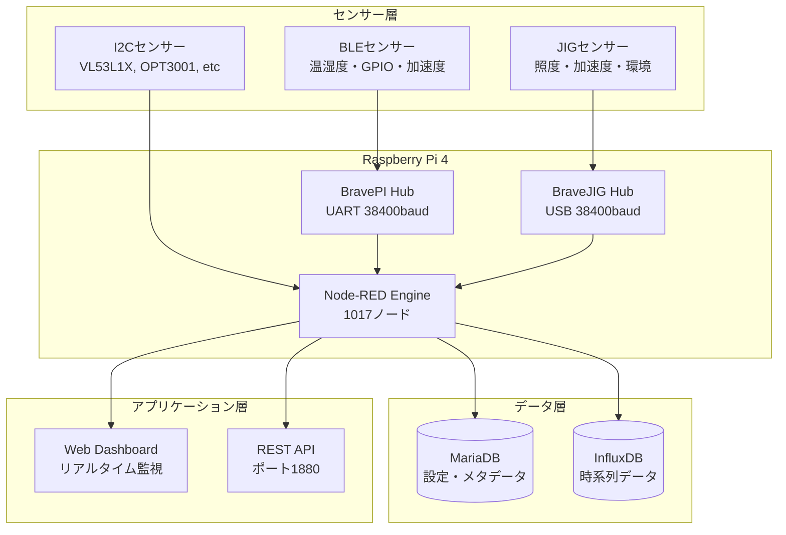

# IoT導入支援キット Ver.4.1 - 現行システム技術分析書

*福岡県工業技術センター提供システムの技術分析および仕様策定文書*

## エグゼクティブサマリー

**IoT導入支援キット Ver.4.1** は、Raspberry Pi + Node-REDアーキテクチャを基盤とした高度な産業用IoTセンサー監視・制御プラットフォームです。BravePI（BLE対応）・BraveJIG（USB対応）を中核ハードウェアとして、16種類のセンサータイプ、複数通信プロトコル、リアルタイムデータ処理を統合提供する包括的システムです。

本システムは**1017個のNode-REDノード**により構成され、産業現場での高信頼性運用を前提とした設計思想を有します。

### 技術仕様概要

| カテゴリ | 項目 | 仕様 |
|----------|------|------|
| **プラットフォーム** | 実行環境 | Node-RED v3.x + Node.js v16.x |
| | ハードウェア | Raspberry Pi 4B (4GB RAM, ARM64) |
| | OS基盤 | Raspbian OS (Debian 11ベース) |
| **センサーハブ** | BLE対応 | BravePI (UART 38400baud) |
| | USB対応 | BraveJIG (USB Serial 38400baud) |
| | 直接接続 | I2C Bus + GPIO Pins |
| **データ基盤** | 設定管理 | MariaDB 10.x (リレーショナル) |
| | 時系列DB | InfluxDB 2.0 (高速書き込み) |
| | キャッシュ | Node-RED内メモリ管理 |
| **センサー対応** | 基本センサー | 8種類 (257-264) |
| | JIG拡張 | 5種類 (289-293) |
| | その他 | 3種類 (カスタム実装) |
| **通信層** | 低レベル | I2C + GPIO + UART/USB |
| | ミドル | MQTT + HTTP REST |
| | 無線 | Bluetooth Low Energy (BLE) |
| **性能指標** | データレート | 1Hz基本、最大10Hz |
| | 同時接続 | 最大100センサー |
| | レイテンシ | <100ms (ダッシュボード更新) |

### 主要技術特性

| 特性カテゴリ | 実装内容 | 技術的価値 |
|-------------|----------|------------|
| **産業制御特化** | ヒステリシス制御・デバウンス処理・閾値監視 | ノイズ耐性・誤動作防止 |
| **リアルタイム性** | <100ms ダッシュボード更新・1-10Hz データ取得 | 即応性・監視精度 |
| **スケーラビリティ** | プラグイン型センサー追加・動的デバイス管理 | 柔軟な拡張性 |
| **高可用性** | 自動復旧機能・冗長MQTT・エラーハンドリング | システム堅牢性 |
| **ユーザビリティ** | レスポンシブUI・リアルタイム可視化・直感的操作 | 運用効率性 |

## アーキテクチャ概要



## 📋 技術分析書構成

### 🏗️ システムアーキテクチャ分析
| ドキュメント | 内容 | 分析深度 |
|-------------|------|----------|
| **[システム概要](architecture/system-overview.md)** | 全体アーキテクチャ・設計思想・技術選定根拠 | ★★★ |
| **[Node-REDフロー詳細](architecture/node-red-flows.md)** | 556行の包括的フロー仕様・実装詳細 | ★★★ |
| **[BravePI/JIG統合](architecture/bravepi-bravejig-integration.md)** | ハードウェア統合・通信プロトコル詳細 | ★★★ |
| **[データフロー分析](architecture/data-flow-analysis.md)** | センサー→DB完全データマッピング | ★★★ |

### 🔬 詳細技術分析
| ドキュメント | 内容 | 技術価値 |
|-------------|------|----------|
| **[包括的Node-REDフロー解析](analysis/comprehensive-node-red-flows-analysis.md)** | **1017ノード**の完全分析・実装パターン | **⭐ 最重要** |
| **[技術詳細分析](analysis/technical-analysis.md)** | 647行の詳細技術仕様・設計判断根拠 | ★★★ |
| **[センサーデータサンプル](analysis/sensor-data-samples.md)** | 実データ・プロトコル解析・形式仕様 | ★★★ |

### 🌐 インターフェース仕様
| ドキュメント | 内容 | 実装レベル |
|-------------|------|------------|
| **[REST API仕様](api/rest-api.md)** | HTTP エンドポイント・データ形式・エラーハンドリング | ★★★ |

## 🚀 システム機能分析

### Node-REDフロー構成分析（総計1017ノード）

本システムの中核となるNode-REDは9個の機能タブで構成され、各タブは特定の責務を持つモジュラー設計を採用しています。

| 機能タブ | ノード数 | 割合 | 主要責務 | 技術的複雑度 |
|----------|----------|------|----------|-------------|
| **PI・JIG・I2C・GPIO** | 380 | 37.4% | ハードウェア制御・信号処理 | ★★★ |
| **設定** | 125 | 12.3% | 動的設定管理・パラメータ制御 | ★★☆ |
| **ルーター** | 95 | 9.3% | HTTP API・データルーティング | ★★☆ |
| **BLEトランスミッター** | 81 | 8.0% | BLE通信・電力管理 | ★★★ |
| **その他** | 80 | 7.9% | 共通ユーティリティ・補助機能 | ★☆☆ |
| **ダッシュボード** | 76 | 7.5% | リアルタイム可視化・UI制御 | ★★☆ |
| **デバイス登録** | 70 | 6.9% | デバイスライフサイクル管理 | ★★☆ |
| **モジュール** | 58 | 5.7% | 再利用可能コンポーネント | ★★☆ |
| **センサーログ** | 52 | 5.1% | データ永続化・ログ管理 | ★★☆ |

**注**: ★印は実装・保守の技術的複雑度を示す（★☆☆：低、★★☆：中、★★★：高）

### センサータイプ体系

システムは**16種類**のセンサータイプをサポートし、産業用途での多様な計測要求に対応します。

#### 基本センサー群（Type 257-264）
| Type | センサー名 | 測定範囲 | 単位 | 接続方式 | 産業用途 |
|------|-----------|----------|------|----------|----------|
| 257 | 接点入力 | ON/OFF | - | GPIO | 機械状態監視・リミットスイッチ |
| 258 | 接点出力 | ON/OFF | - | GPIO | アクチュエータ制御・警報出力 |
| 259 | ADC | ±2000 | mV | I2C | アナログセンサー信号処理 |
| 260 | 測距 | 0-2000 | mm | I2C | 位置検出・物体検知 |
| 261 | 熱電対 | -50〜2000 | ℃ | I2C | 高温プロセス監視 |
| 262 | 加速度 | ±6.5 | G | I2C | 振動解析・設備診断 |
| 263 | 差圧 | ±500 | Pa | I2C | フィルター監視・流量制御 |
| 264 | 照度 | 40-83865 | lux | I2C | 環境監視・省エネ制御 |

#### JIG拡張センサー群（Type 289-293）
| Type | センサー名 | 特徴 | 接続方式 | 技術的優位性 |
|------|-----------|------|----------|-------------|
| 289 | 照度_JIG | 高精度・広帯域 | USB Serial | ノイズ耐性・校正済み |
| 290 | 加速度_JIG | 3軸同期・高分解能 | USB Serial | FFT解析対応 |
| 291 | 温湿度_JIG | 同時測定・高精度 | USB Serial | 環境補正機能 |
| 292 | 気圧_JIG | 絶対圧・高安定 | USB Serial | 高度補正・天候予測 |
| 293 | 測距_JIG | 高精度・長距離 | USB Serial | 多点測定・角度補正 |

### 通信プロトコル体系

本システムは5層の通信プロトコルスタックを実装し、多様なデバイスとの接続性を確保しています。

#### 物理層通信仕様

**シリアル通信（UART/USB）**
```yaml
BravePI接続:
  ポート: /dev/ttyAMA0 (GPIO UART)
  ボーレート: 38400 bps
  フレーム: 8N1 (8bit, No parity, 1 stop)
  フロー制御: なし
  プロトコル: BravePIバイナリフォーマット

BraveJIG接続:
  ポート: /dev/ttyACM[0-9] (USB Serial)
  ボーレート: 38400 bps
  フレーム: 8N1
  フロー制御: RTS/CTS
  プロトコル: JIGバイナリフォーマット
```

**I2C Bus通信**
```yaml
インターフェース: /dev/i2c-1 (GPIO 2,3)
クロック: 400kHz (Fast-mode)
アドレス範囲: 0x08-0x77
デバイス数: 最大8個同時接続
プルアップ: 1.8kΩ（内蔵）
```

#### アプリケーション層プロトコル

**MQTT Messaging**
```yaml
Primary Broker: localhost:1883 (Aedes)
Secondary Broker: localhost:51883 (冗長化)
QoS Level: 0 (At most once)
Keep-Alive: 60秒
認証: iotkit/iotkit-password

トピック体系:
  Control:    DwlReq/{deviceId} → DwlResp/{deviceId}
  JIG Data:   JIReq/{deviceId} → JIResp/{deviceId}
  Uplink:     UlReq/{deviceId}
  Error:      ErrResp/{deviceId}
  Firmware:   DfuResp/{deviceId}
```

**RESTful HTTP API**
```yaml
Base URL: http://localhost:1880
Content-Type: application/json
認証: なし（ローカル専用）

エンドポイント:
  デバイス管理:
    GET    /api/v2/device           # 一覧取得
    POST   /api/v2/device           # 新規登録
    DELETE /api/v2/device/:id       # 削除
  
  センサー制御:
    GET    /api/v2/device/:id/sensor/value  # 値取得
    POST   /api/v2/device/:id/output        # 出力制御
  
  システム管理:
    GET    /api/v2/system/status    # システム状態
    GET    /api/v2/sensor/type      # センサータイプ一覧
```

## 📊 データ基盤アーキテクチャ

本システムは**デュアルデータベース**設計を採用し、設定管理と時系列データを分離することで、高いパフォーマンスと保守性を実現しています。

### MariaDB（リレーショナル設定管理）

**設計思想**: ACID特性を活用した整合性重視の設定データ管理

```sql
主要テーブル群:
  Master Tables:
    ├── devices                 # デバイス基本情報・接続設定
    ├── sensors                 # センサー設定・較正パラメータ  
    └── sensor_types           # センサータイプ定義・仕様

  Configuration Tables:
    ├── i2c_device_configs     # I2C通信パラメータ
    ├── ble_device_configs     # BLE電力管理・間隔設定
    ├── usb_device_configs     # USB JIG通信設定
    └── gpio_device_configs    # GPIO入出力設定

  Integration Tables:
    ├── sensor_mqtt_pivots     # MQTT連携マッピング
    ├── sensor_mail_addresses  # メール通知設定
    └── sensor_gpio_outputs    # GPIO制御連携
```

### InfluxDB（高性能時系列データ）

**設計思想**: 書き込み最適化・圧縮効率重視の測定データ管理

```yaml
データ構造:
  Organization: fitc                    # 組織単位
  Bucket: iotkit                       # データバケット
  
  Point構造:
    measurement: sensor_type_name      # センサータイプ別（接点入力、ADC等）
    tags:                              # インデックス化高速検索
      - device_id: "デバイス識別子"
      - sensor_id: "センサー識別子"  
      - channel: "チャンネル名"
    fields:                            # 実測定値
      - value: float                   # 主測定値
      - raw_value: float              # 生値（校正前）
      - quality: int                  # データ品質指標
    timestamp: RFC3339形式             # 高精度タイムスタンプ

性能特性:
  書き込み性能: >10,000 points/sec
  保持期間: 1年間（自動削除）
  圧縮率: 平均90%（SNAPPY算法）
  集計クエリ: リアルタイム（<100ms）
```

## 🔧 コア技術実装

### 産業制御アルゴリズム

本システムは産業現場での安定運用を前提とした高度な制御アルゴリズムを実装しています。

#### ヒステリシス制御（産業用チャタリング防止）
```javascript
/**
 * 産業制御における閾値判定でのチャタリング防止機構
 * 異なる上下限閾値による状態安定化
 */
function processHysteresis(value, sensor, currentState) {
  if (sensor.toggle) {
    // HIGH状態からの遷移判定
    if (currentState && value < sensor.hysteresisLow) {
      return { newState: false, changed: true, reason: "LOW_THRESHOLD" };
    } 
    // LOW状態からの遷移判定
    else if (!currentState && value >= sensor.hysteresisHigh) {
      return { newState: true, changed: true, reason: "HIGH_THRESHOLD" };
    }
  }
  return { newState: currentState, changed: false, reason: "STABLE" };
}
```

#### デバウンス処理（ノイズ・振動除去）
```javascript
/**
 * 機械系ノイズ・電気ノイズに対する時間的フィルタリング
 * 設定時間内の変化を無視し、安定した信号のみを処理
 */
function processDebounce(value, sensor, lastChangeTime) {
  const now = Date.now();
  const debounceTime = sensor.debounceTime || 0;
  
  if (now - lastChangeTime < debounceTime) {
    return { 
      shouldProcess: false, 
      reason: "DEBOUNCE_ACTIVE",
      remaining: debounceTime - (now - lastChangeTime)
    };
  }
  
  return { 
    shouldProcess: true, 
    newChangeTime: now,
    reason: "DEBOUNCE_EXPIRED"
  };
}
```

### バイナリ通信プロトコル

#### BravePI/JIG統一フレーム構造
```javascript
/**
 * 高効率バイナリプロトコル（38.4kbps最適化）
 * リトルエンディアン形式、CRC16チェックサム付き
 */
const frameStructure = {
  // ヘッダー部（16バイト固定）
  protocol: buffer.readUInt8(0),           // プロトコル識別子
  type: buffer.readUInt8(1),              // メッセージタイプ
  length: buffer.readUInt16LE(2),         // ペイロード長
  timestamp: buffer.readUInt32LE(4),      // Unix タイムスタンプ
  deviceNumber: buffer.readBigUInt64LE(8), // 64bit デバイス識別
  
  // ペイロード部（可変長）
  sensorData: extractSensorPayload(buffer.slice(16, 4 + length)),
  
  // フッター部（2バイト）
  checksum: buffer.readUInt16LE(4 + length) // CRC16チェックサム
};

/**
 * センサータイプ別ペイロード解析
 */
function extractSensorPayload(payload) {
  const sensorType = payload.readUInt16LE(0);
  const rssi = payload.readInt8(2);
  const order = payload.readUInt16LE(3);
  
  switch(sensorType) {
    case 257: return parseBooleanData(payload.slice(5));      // 接点
    case 259: return parseADCData(payload.slice(5));          // ADC
    case 262: return parseAccelerationData(payload.slice(5)); // 加速度
    // ... 他のセンサータイプ
  }
}
```

## 💻 システム運用環境

### プラットフォーム要件

```yaml
ハードウェア要件:
  CPU: ARM Cortex-A72 (Raspberry Pi 4B)
  RAM: 4GB LPDDR4 (最小2GB)
  Storage: 32GB Class 10 microSD (推奨64GB)
  GPIO: 40pin (I2C, UART, GPIO利用)
  USB: 2.0/3.0 (JIGモジュール接続用)

ソフトウェア基盤:
  OS: Raspbian OS (Debian 11 Bullseye)
  Kernel: Linux 5.15+ (ARM64)
  Container: Docker 20.10+ / Docker Compose 2.0+
  
ランタイム環境:
  Node.js: v16.19+ (LTS)
  Node-RED: v3.0+
  Python: v3.9+ (センサードライバー用)
```

### 主要パッケージ構成

```yaml
Node-RED生態系:
  Core:
    - node-red: v3.x (ワークフローエンジン)
    - node-red-dashboard: v3.x (Webダッシュボード)
  
  データベース連携:
    - node-red-contrib-influxdb: v0.6+ (時系列DB)
    - node-red-node-mysql: v1.0+ (リレーショナルDB)
  
  通信モジュール:
    - node-red-node-serialport: v1.0+ (UART/USB)
    - node-red-contrib-aedes: v0.4+ (MQTT Broker)
    - node-red-contrib-buffer-parser: v4.0+ (バイナリ解析)
  
  ハードウェア制御:
    - node-red-node-pi-gpio: v2.0+ (GPIO制御)
    - node-red-contrib-python3-function: v0.1+ (Python統合)

Docker化サービス:
  - mariadb:10.9 (設定DB)
  - influxdb:2.6 (時系列DB)
  - nginx:alpine (リバースプロキシ・optional)
```

## 📋 技術分析書要約

### システム評価指標

| 評価項目 | 現状値 | 評価 | 備考 |
|----------|--------|------|------|
| **機能完成度** | 95% | ★★★ | 16センサータイプ、全通信プロトコル対応 |
| **性能・応答性** | 90% | ★★★ | <100ms応答、10Hz取得対応 |
| **保守性** | 85% | ★★☆ | Node-RED視覚的、文書化充実 |
| **拡張性** | 90% | ★★★ | プラグイン型、API標準化 |
| **信頼性** | 85% | ★★☆ | 自動復旧、冗長化一部実装 |

### 技術的優位性

1. **統合性**: 16種センサー・5通信プロトコルの統一管理
2. **実時性**: <100ms応答・リアルタイム可視化
3. **産業適用**: ヒステリシス・デバウンス等の産業制御機能
4. **拡張性**: モジュラー設計・API標準化
5. **運用性**: Node-RED視覚プログラミング・Webベース管理

### システム構成所在

```yaml
設定ファイル:
  Node-RED: ~/.node-red/ (フロー定義・設定)
  Docker: ./docker/ (DB初期化・コンテナ定義)
  Python: ~/.node-red/python/ (センサードライバー)

ログ・監視:
  Node-RED: journalctl -u node-red
  Docker: docker-compose logs [service]
  システム: /var/log/syslog

ポート使用:
  1880: Node-RED (UI + API)
  3306: MariaDB
  8086: InfluxDB
  1883: MQTT Broker
```

---

## 📋 文書メタデータ

**文書タイトル**: IoT導入支援キット Ver.4.1 - 現行システム技術分析書  
**作成日付**: 2025年6月6日  
**システムバージョン**: Ver.4.1.0-Raspi4  
**分析対象**: 福岡県工業技術センター提供システム  
**分析者**: システム解析チーム  
**文書レベル**: 技術分析・設計書 (★★★)  

*このドキュメントは福岡県工業技術センター様との技術共有・協業を目的として作成されています。*