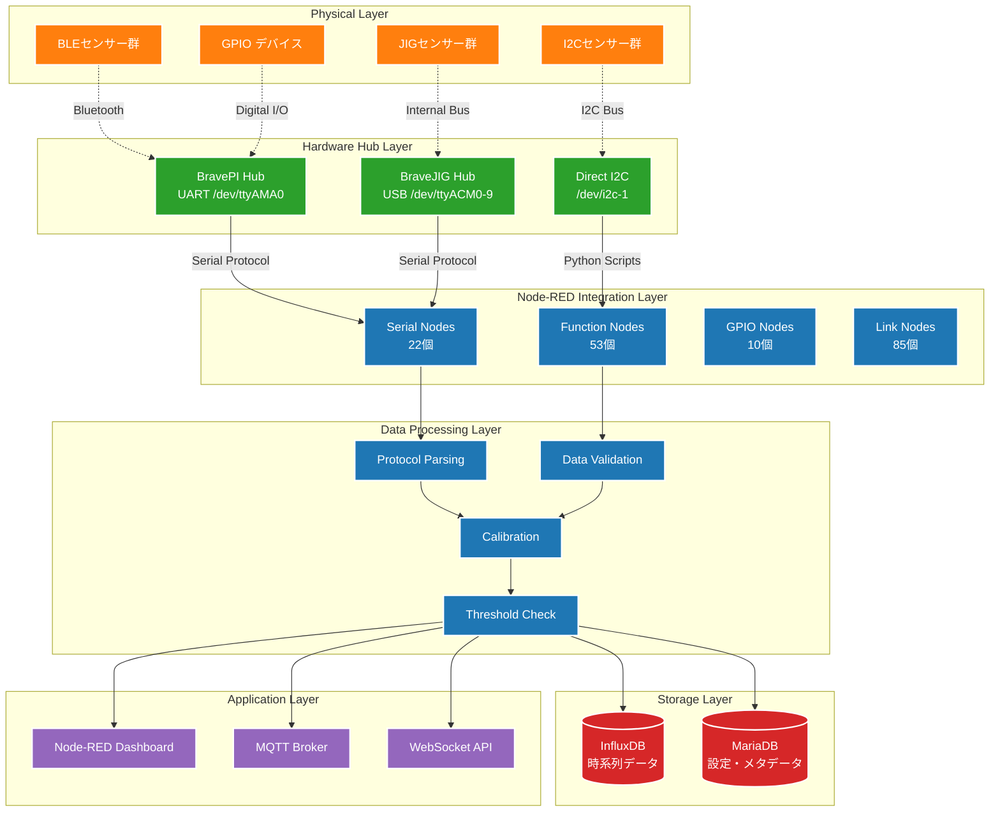
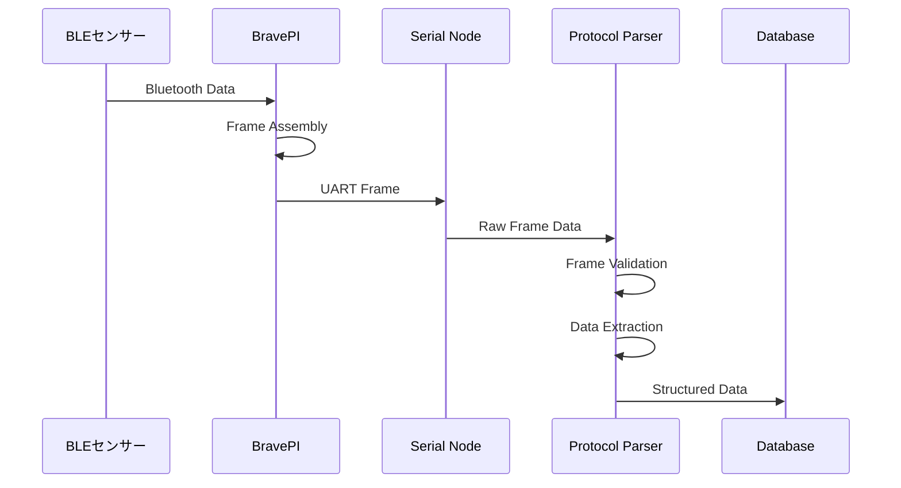
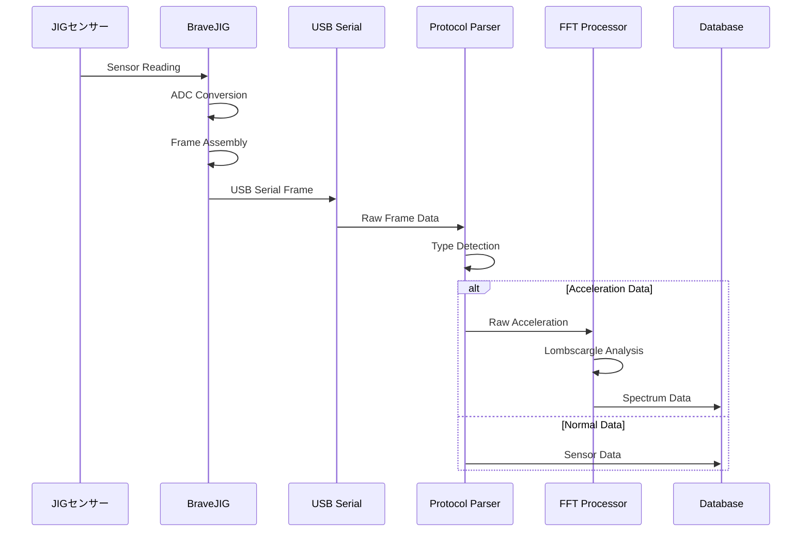

# BravePI/BraveJIG統合アーキテクチャ

## 概要

BravePIとBraveJIGは、Node-REDシステムにおける中核的なセンサーハブとして機能します。本ドキュメントでは、これらのハードウェアとNode-REDとの統合アーキテクチャを詳細に解説します。

## ハードウェア概要

### BravePI
**役割**: ワイヤレス・GPIO統合ハブ  
**主要機能**:
- Bluetooth Low Energy (BLE) センサーのハブ機能
- GPIO入出力制御
- UART経由でのRaspberry Pi通信

**技術仕様**:
- 通信インターフェース: UART (/dev/ttyAMA0)
- 通信速度: 38400 baud
- プロトコル: 独自フレーム形式
- 電源: Raspberry Piから供給

### BraveJIG
**役割**: 高精度産業用センサーハブ  
**主要機能**:
- 複数種類の産業用センサー統合
- 高精度ADC機能
- FFT処理機能（振動解析）

**技術仕様**:
- 通信インターフェース: USB Serial (/dev/ttyACM0-9)
- 通信速度: 38400 baud
- プロトコル: 独自フレーム形式
- 電源: USB経由

## 通信プロトコル

### フレーム構造

```
+----------+----------+----------+----------+----------+----------+
| Protocol | Type     | Length   | Timestamp| Device # | Data...  |
| (1 byte) | (1 byte) | (2 bytes)| (4 bytes)| (8 bytes)| (n bytes)|
+----------+----------+----------+----------+----------+----------+
```

### メッセージタイプ

| Type | 名称 | 説明 |
|------|------|------|
| 0x00 | General Data | 一般的なセンサーデータ |
| 0x01 | Downlink Response | ダウンリンク応答 |
| 0x02 | JIG Information | JIG情報 |
| 0x03 | DFU | Device Firmware Update |
| 0xFF | Error Response | エラー応答 |

### アクセスタイプ

| Type | 名称 | 説明 |
|------|------|------|
| 0 | Bluetooth | BravePI経由のBLEセンサー |
| 1 | I2C | 直接I2C接続センサー |
| 3 | LAN | ネットワークデバイス |
| 4 | USB | BraveJIG経由のUSBセンサー |

## センサータイプ対応表

### BraveJIG対応センサー

| センサータイプ | Type ID | 測定値 | 単位 |
|---------------|---------|--------|------|
| 照度センサー | 289 | 照度 | lux |
| 加速度センサー | 290 | X,Y,Z軸加速度 | g |
| 温湿度センサー | 291 | 温度、湿度 | ℃, %RH |
| 気圧センサー | 292 | 大気圧 | hPa |
| 測距センサー | 293 | 距離 | mm |
| 接点入力 | 294 | デジタル入力 | boolean |
| 接点出力 | 295 | デジタル出力 | boolean |
| PWM出力 | 296 | PWM制御 | duty% |

### BravePI対応センサー

| 機能 | 説明 | データ形式 |
|------|------|------------|
| BLE温度センサー | Bluetooth経由温度測定 | float + RSSI + Battery |
| GPIO入力 | デジタル入力監視 | boolean + timestamp |
| GPIO出力 | デジタル出力制御 | boolean command |

## Node-RED統合アーキテクチャ

### 全体構成図



### データフロー詳細

#### 1. BravePI経由のデータフロー



#### 2. BraveJIG経由のデータフロー



## 設定管理システム

### MariaDBスキーマ（BravePI/JIG関連）

```sql
-- BravePI設定テーブル
CREATE TABLE bravepi_config (
    id INT PRIMARY KEY AUTO_INCREMENT,
    device_id VARCHAR(16) NOT NULL,
    access_type INT NOT NULL,  -- 0: Bluetooth, 1: GPIO
    sensor_type INT,
    threshold_high FLOAT,
    threshold_low FLOAT,
    hysteresis_high FLOAT,
    hysteresis_low FLOAT,
    debounce_time_high FLOAT,
    debounce_time_low FLOAT,
    toggle_mode BOOLEAN DEFAULT FALSE,
    output_gpio_pin INT,
    created_at TIMESTAMP DEFAULT CURRENT_TIMESTAMP,
    updated_at TIMESTAMP DEFAULT CURRENT_TIMESTAMP ON UPDATE CURRENT_TIMESTAMP
);

-- BraveJIG設定テーブル  
CREATE TABLE bravejig_config (
    id INT PRIMARY KEY AUTO_INCREMENT,
    device_id VARCHAR(16) NOT NULL,
    sensor_type INT NOT NULL,  -- 289-296
    channel INT DEFAULT 0,
    calibration_offset FLOAT DEFAULT 0.0,
    calibration_scale FLOAT DEFAULT 1.0,
    sampling_rate INT DEFAULT 1000,
    fft_enabled BOOLEAN DEFAULT FALSE,
    created_at TIMESTAMP DEFAULT CURRENT_TIMESTAMP,
    updated_at TIMESTAMP DEFAULT CURRENT_TIMESTAMP ON UPDATE CURRENT_TIMESTAMP
);

-- 統合センサー情報テーブル
CREATE TABLE sensor_registry (
    id INT PRIMARY KEY AUTO_INCREMENT,
    device_id VARCHAR(16) UNIQUE NOT NULL,
    device_name VARCHAR(64),
    hub_type ENUM('bravepi', 'bravejig', 'i2c_direct'),
    hub_port VARCHAR(32),  -- /dev/ttyAMA0, /dev/ttyACM0, etc.
    sensor_type INT,
    access_type INT,
    status ENUM('active', 'inactive', 'error') DEFAULT 'active',
    last_seen TIMESTAMP,
    rssi INT,  -- BLEセンサーのみ
    battery_level INT,  -- BLEセンサーのみ
    created_at TIMESTAMP DEFAULT CURRENT_TIMESTAMP,
    updated_at TIMESTAMP DEFAULT CURRENT_TIMESTAMP ON UPDATE CURRENT_TIMESTAMP
);
```

### Node-REDでの設定管理フロー

1. **設定読み込み**: 起動時にMariaDBから設定を読み込み
2. **動的設定更新**: Web UIからの設定変更をリアルタイム反映
3. **設定検証**: しきい値・較正値の妥当性チェック
4. **設定配信**: BravePI/JIGへの設定送信

## 高度な機能

### 1. FFT解析（加速度センサー）

```javascript
// Node-REDでのFFT処理フロー
if (msg.payload.sensorType === 262) {  // 加速度センサー
    if (msg.payload.tag === 'spectrogram') {
        // Lombscargle FFT結果の処理
        const spectrum = msg.payload.values;
        const peaks = findSpectralPeaks(spectrum);
        
        // 振動異常の判定
        if (peaks.maxPower > VIBRATION_THRESHOLD) {
            triggerVibrationAlert(msg.payload);
        }
    }
}
```

### 2. しきい値判定とヒステリシス

```javascript
// ヒステリシス付きしきい値判定
function checkThresholdWithHysteresis(value, config, currentState) {
    const { threshold_high, threshold_low, hysteresis_high, hysteresis_low } = config;
    
    if (currentState === 'normal') {
        if (value > threshold_high + hysteresis_high) return 'high_alert';
        if (value < threshold_low - hysteresis_low) return 'low_alert';
    } else if (currentState === 'high_alert') {
        if (value < threshold_high - hysteresis_high) return 'normal';
    } else if (currentState === 'low_alert') {
        if (value > threshold_low + hysteresis_low) return 'normal';
    }
    
    return currentState;
}
```

### 3. GPIO連動制御

```javascript
// しきい値超過時のGPIO出力制御
if (alertState === 'high_alert' && config.output_gpio_pin) {
    // BravePIに出力指示を送信
    const command = {
        type: 'gpio_output',
        pin: config.output_gpio_pin,
        state: config.toggle_mode ? !currentGPIOState : true
    };
    
    sendToBravePI(command);
}
```

## 課題と制約

### 1. 技術的課題
- **プロトコル依存性**: 独自プロトコルによるベンダーロックイン
- **デバッグの困難さ**: シリアル通信の問題切り分けが困難
- **スケーラビリティ**: 多数のセンサー接続時の性能劣化

### 2. 運用課題
- **設定の複雑さ**: GUIでの設定管理の限界
- **障害診断**: ハードウェア・ソフトウェア障害の判別困難
- **メンテナンス**: Node-REDフローの保守性

### 3. 拡張性の制約
- **新センサー追加**: プロトコル拡張の複雑さ
- **リモート管理**: 遠隔地デバイスの管理困難
- **バージョン管理**: ファームウェア・設定のバージョン管理不備

## 移行時の考慮事項

### 1. 継続性要件
- BravePI/JIGハードウェアの継続利用
- 既存センサー設定の移行
- 通信プロトコルの互換性維持

### 2. 改善機会
- プロトコル標準化（MQTT等）
- 設定管理の簡素化
- 診断機能の強化
- リモート管理機能の追加

### 3. 移行戦略
- 段階的移行による影響最小化
- ハードウェア互換レイヤーの構築
- 設定・データの自動移行ツール

## まとめ

BravePI/JIGは現行システムの中核的なコンポーネントであり、多様なセンサーとの統合において重要な役割を果たしています。新システムへの移行においても、これらのハードウェア資産を最大限活用する設計が必要です。