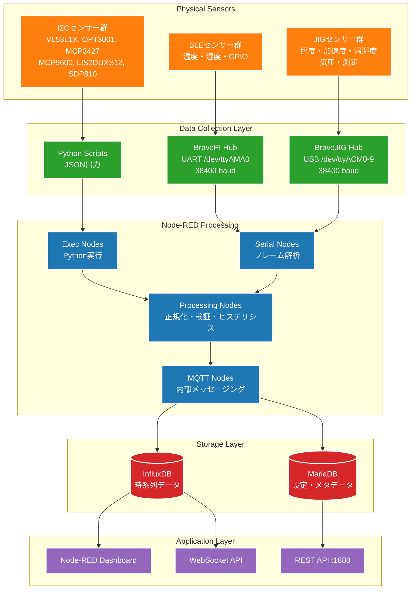

# 現行システム データフロー詳細分析

## 概要

現行Node-REDシステムにおける、センサーからデータベースまでの完全なデータフローを詳細に分析したドキュメントです。

## データフロー全体図



## 1. センサーデータ形式

### I2Cセンサー（Python Scripts）

各I2Cセンサーは専用のPythonスクリプトでJSONデータを出力：

#### VL53L1X（測距センサー）
```json
{
  "value": 1250,
  "unit": "mm", 
  "quality": 0.95,
  "timestamp": "2024-01-15T10:30:00.000Z"
}
```

#### OPT3001（照度センサー）
```json
{
  "value": 1500.5,
  "unit": "lux",
  "timestamp": "2024-01-15T10:30:00.000Z"
}
```

#### MCP3427（ADCセンサー）
```json
{
  "time": 1705312200000,
  "values": [1234.5, 2345.6],
  "address": 107,
  "sensorType": 259
}
```

#### MCP9600（熱電対センサー）
```json
{
  "value": 25.3,
  "unit": "℃",
  "type": "K_type",
  "timestamp": "2024-01-15T10:30:00.000Z"
}
```

#### LIS2DUXS12（加速度センサー）
```json
{
  "time": "2024-01-15 10:30:00.123456",
  "values": [0.1, 0.2, 0.3, 0.374],
  "address": 25,
  "sensorType": 262,
  "tag": "accelerator"
}
```

#### Lombscargle FFT解析
```json
{
  "time": 1705312200000,
  "values": [0.1, 0.2, 0.3],
  "address": 25,
  "sensorType": 262,
  "tag": "accelerator"
}
```

```json
{
  "time": 1705312200000,
  "values": [0.05, 0.10, 0.08, ...],
  "sensorType": 262,
  "address": 25,
  "sumpower": 1.234,
  "tag": "spectrogram"
}
```

### BravePI/JIG バイナリプロトコル

#### フレーム構造
```
+----------+----------+----------+----------+----------+----------+
| Protocol | Type     | Length   | Timestamp| Device # | Data...  |
| (1 byte) | (1 byte) | (2 bytes)| (4 bytes)| (8 bytes)| (n bytes)|
+----------+----------+----------+----------+----------+----------+
```

#### メッセージタイプ
| Type | 名称 | 説明 |
|------|------|------|
| 0x00 | General Data | 一般的なセンサーデータ |
| 0x01 | Downlink Response | ダウンリンク応答 |
| 0x02 | JIG Information | JIG情報 |
| 0x03 | DFU | Device Firmware Update |
| 0xFF | Error Response | エラー応答 |

#### アクセスタイプ
| Type | 名称 | 説明 |
|------|------|------|
| 0 | Bluetooth | BravePI経由のBLEセンサー |
| 1 | I2C | 直接I2C接続センサー |
| 3 | LAN | ネットワークデバイス |
| 4 | USB | BraveJIG経由のUSBセンサー |

## 2. センサータイプマッピング

### 標準センサータイプ（257-264）
```javascript
const sensorTypes = {
  257: { name: "接点入力", unit: "", measurement: "gpio_input" },
  258: { name: "接点出力", unit: "", measurement: "gpio_output" },
  259: { name: "ADC", unit: "mV", measurement: "voltage" },
  260: { name: "測距", unit: "mm", measurement: "distance" },
  261: { name: "熱電対", unit: "℃", measurement: "temperature" },
  262: { name: "加速度", unit: "G", measurement: "acceleration" },
  263: { name: "差圧", unit: "Pa", measurement: "pressure" },
  264: { name: "照度", unit: "lux", measurement: "illuminance" }
};
```

### BraveJIGセンサータイプ（289-293）
```javascript
const jigSensorTypes = {
  289: { name: "照度", unit: "lux", measurement: "illuminance_jig" },
  290: { name: "加速度", unit: "G", measurement: "acceleration_jig" },  
  291: { name: "温湿度", unit: "℃/%", measurement: "environment_jig" },
  292: { name: "気圧", unit: "hPa", measurement: "atmospheric_jig" },
  293: { name: "測距", unit: "mm", measurement: "distance_jig" }
};
```

## 3. Node-REDデータ処理パイプライン

### Stage 1: データ取り込み

#### シリアルフレーム解析
```javascript
function parseSerialFrame(buffer) {
  return {
    protocol: buffer.readUInt8(0),
    type: buffer.readUInt8(1), 
    length: buffer.readUInt16LE(2),
    timestamp: buffer.readUInt32LE(4),
    deviceNumber: buffer.readBigUInt64LE(8),
    sensorData: extractSensorPayload(buffer.slice(16))
  };
}
```

#### I2CセンサーJSONパース
```javascript
function parseI2CData(jsonString) {
  const data = JSON.parse(jsonString);
  return {
    sensorType: determineSensorType(data),
    values: data,
    timestamp: data.timestamp || new Date().toISOString()
  };
}
```

### Stage 2: データ変換・検証

#### 値の正規化・較正
```javascript
function normalizeValue(rawValue, sensor) {
  let corrected = rawValue + sensor.offset;
  if (sensor.invert) corrected = -corrected;
  return Math.round(corrected * Math.pow(10, sensor.precision)) / Math.pow(10, sensor.precision);
}
```

#### ヒステリシス処理
```javascript
function processHysteresis(value, sensor, currentState) {
  if (sensor.toggle) {
    if (currentState && value < sensor.hysteresisLow) {
      return { newState: false, changed: true };
    } else if (!currentState && value >= sensor.hysteresisHigh) {
      return { newState: true, changed: true };
    }
  }
  return { newState: currentState, changed: false };
}
```

#### デバウンス処理
```javascript
function processDebounce(value, sensor, lastChangeTime) {
  const now = Date.now();
  const debounceTime = sensor.debounceTime || 0;
  
  if (now - lastChangeTime < debounceTime) {
    return { shouldProcess: false };
  }
  
  return { shouldProcess: true, newChangeTime: now };
}
```

### Stage 3: データ配信

#### MQTT内部配信
```javascript
// MQTTトピック構造
const topics = {
  uplink: "UlReq/{deviceNumber}",
  downlink: "DwlReq/{deviceNumber}",
  response: "DwlResp/{deviceNumber}",
  jig: "JIResp/{deviceNumber}",
  error: "ErrResp/{deviceNumber}",
  dfu: "DfuResp/{deviceNumber}"
};
```

#### 統一メッセージフォーマット
```javascript
function createStandardMessage(sensorData, deviceInfo) {
  return {
    device_id: deviceInfo.deviceId,
    sensor_id: sensorData.sensorId,
    sensor_type: sensorData.type,
    channel: sensorData.channel,
    value: sensorData.normalizedValue,
    unit: sensorData.unit,
    timestamp: sensorData.timestamp,
    quality: sensorData.quality,
    metadata: {
      raw_value: sensorData.rawValue,
      offset: deviceInfo.offset,
      precision: deviceInfo.precision,
      rssi: sensorData.rssi,
      battery: sensorData.battery
    }
  };
}
```

## 4. データベーススキーマ

### MariaDB（設定・メタデータ）

#### デバイス管理
```sql
-- デバイス登録テーブル
CREATE TABLE devices (
    id INT PRIMARY KEY AUTO_INCREMENT,
    device_id VARCHAR(16) UNIQUE NOT NULL,
    device_name VARCHAR(64),
    access_type INT,  -- 0:BLE, 1:I2C, 3:LAN, 4:USB
    created_at TIMESTAMP DEFAULT CURRENT_TIMESTAMP
);

-- センサー設定テーブル
CREATE TABLE sensors (
    id INT PRIMARY KEY AUTO_INCREMENT,
    device_id VARCHAR(16) NOT NULL,
    sensor_id INT NOT NULL,
    sensor_type INT NOT NULL,
    sensor_name VARCHAR(64),
    offset FLOAT DEFAULT 0.0,
    precision INT DEFAULT 2,
    hysteresis_high FLOAT,
    hysteresis_low FLOAT,
    debounce_time FLOAT DEFAULT 0.0,
    toggle BOOLEAN DEFAULT FALSE,
    invert BOOLEAN DEFAULT FALSE,
    FOREIGN KEY (device_id) REFERENCES devices(device_id)
);
```

#### 通信設定
```sql
-- MQTT設定
CREATE TABLE mqtt_topics (
    id INT PRIMARY KEY AUTO_INCREMENT,
    topic_pattern VARCHAR(255),
    device_id VARCHAR(16),
    message_type ENUM('uplink', 'downlink', 'response', 'error')
);

-- デバイス種別設定
CREATE TABLE ble_device_configs (
    device_id VARCHAR(16) PRIMARY KEY,
    rssi_threshold INT DEFAULT -80,
    battery_threshold INT DEFAULT 20
);
```

### InfluxDB（時系列データ）

#### データポイント構造
```javascript
// InfluxDBポイント
{
  measurement: "temperature",  // センサータイプベース
  tags: {
    device_id: "rpi4-001",
    sensor_id: "123", 
    channel: "main",
    location: "factory_line_1"
  },
  fields: {
    value: 25.3,
    quality: 0.95,
    raw_value: 25.1
  },
  timestamp: "2024-01-15T10:30:00.000Z"
}
```

## 5. 通信プロトコル

### ハードウェアインターフェース
- **UART**: `/dev/ttyAMA0` @ 38400 baud (BravePI)
- **USB Serial**: `/dev/ttyACM0-9` @ 38400 baud (BraveJIG)
- **I2C**: `/dev/i2c-1` (直接センサー接続)
- **GPIO**: BCM pins 5,6,13,16-18,23-27

### ネットワークプロトコル
- **MQTT Broker**: localhost:1883 (primary), localhost:51883 (failover)
- **HTTP REST API**: Port 1880
- **WebSocket**: リアルタイムダッシュボード更新

## 6. エラーハンドリング

### データ品質管理
```javascript
function validateSensorData(data) {
  const validation = {
    isValid: true,
    quality: 1.0,
    errors: []
  };
  
  // 値の範囲チェック
  if (data.value < data.minValue || data.value > data.maxValue) {
    validation.quality *= 0.5;
    validation.errors.push("value_out_of_range");
  }
  
  // タイムスタンプの妥当性
  const age = Date.now() - new Date(data.timestamp).getTime();
  if (age > 60000) {  // 1分以上古い
    validation.quality *= 0.7;
    validation.errors.push("stale_data");
  }
  
  // RSSI/Battery閾値チェック（BLEの場合）
  if (data.rssi && data.rssi < -80) {
    validation.quality *= 0.6;
    validation.errors.push("weak_signal");
  }
  
  return validation;
}
```

### 通信エラー処理
```javascript
function handleCommunicationError(device, error) {
  const errorResponse = {
    device_id: device.id,
    error_type: error.type,
    error_message: error.message,
    timestamp: new Date().toISOString(),
    retry_count: device.retryCount || 0
  };
  
  // MQTTエラートピックに送信
  mqttClient.publish(`ErrResp/${device.id}`, JSON.stringify(errorResponse));
  
  // リトライ管理
  if (device.retryCount < 3) {
    setTimeout(() => retryConnection(device), device.retryDelay || 5000);
  }
}
```

## 7. パフォーマンス特性

### データ処理性能
- **センサー読み取り頻度**: 1Hz（基本）、最大10Hz
- **同時センサー数**: 最大100センサー
- **Node-REDフロー**: 53個のFunction Node、22個のSerial Node
- **MQTT スループット**: 1000 msg/sec

### データ保持
- **InfluxDB**: 時系列データ（1年間保持）
- **MariaDB**: 設定データ（永続保持）
- **リアルタイム性**: 100ms以内のダッシュボード更新

## まとめ

現行Node-REDシステムは、多様なセンサータイプと通信プロトコルを統合した複雑なデータ処理パイプラインを持っています。特に以下の特徴があります：

1. **多層データ変換**: 生データ → 正規化 → 検証 → 配信
2. **複雑なプロトコル処理**: バイナリフレーム解析からJSON変換まで
3. **リアルタイム処理**: ヒステリシス・デバウンス・品質管理
4. **堅牢なエラーハンドリング**: 通信エラー・データ検証・リトライ機構

この詳細な分析により、新システムへの移行時に必要な機能要件と互換性維持項目が明確になりました。