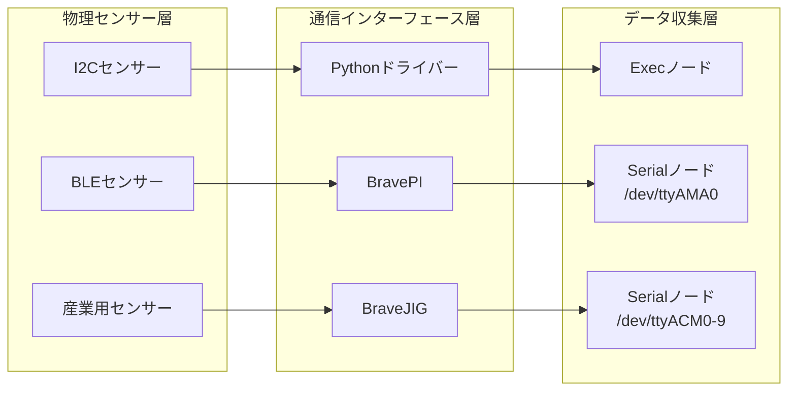
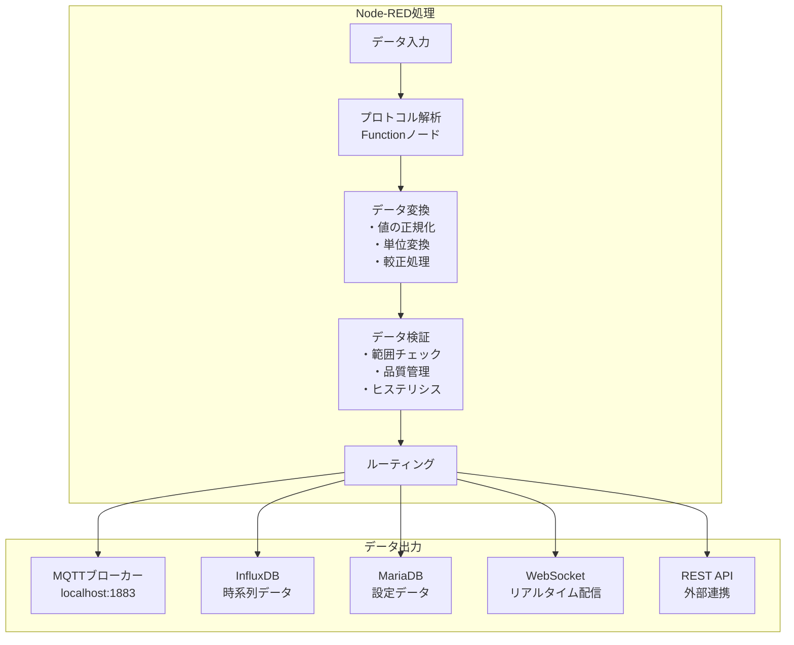
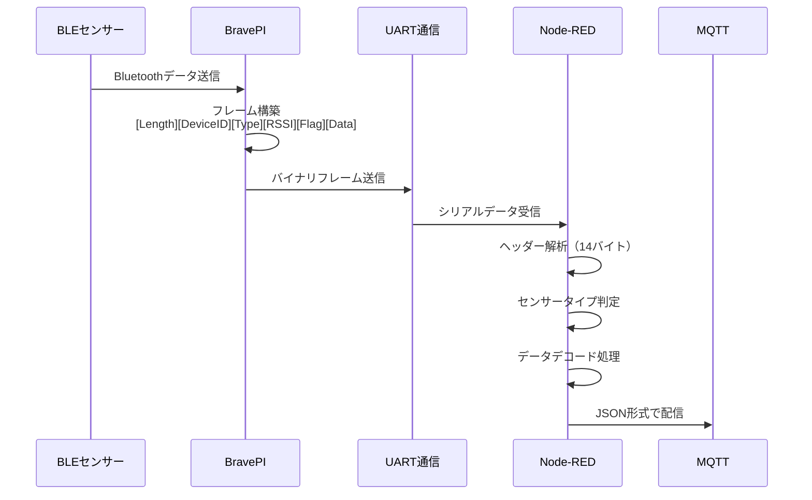

# プログラム実行時アーキテクチャ

## 概要

IoT導入支援キット Ver.4.1のRaspberry Pi上で実行されているプログラムとその動作について詳細に説明します。本システムは、複数のセンサーデバイスからデータを収集し、Node-REDを中心としたデータ処理パイプラインで処理します。

## 実行プログラム一覧

### 1. Pythonセンサードライバー

I2C接続されたセンサーを制御し、定期的にデータを取得するPythonプログラムが実行されています。

| ファイル名 | センサー | 機能 | 実行間隔 |
|-----------|---------|------|----------|
| `lis2duxs12.py` | LIS2DUXS12 | 3軸加速度測定（±8G、800Hz） | 1秒 |
| `vl53l1x.py` | VL53L1X | ToF距離測定（4mm～2m） | 1秒 |
| `opt3001.py` | OPT3001 | 照度測定（0.01～83,000 lux） | 1秒 |
| `mcp3427.py` | MCP3427 | 2ch ADC電圧測定（16bit） | 1秒 |
| `mcp9600.py` | MCP9600 | 熱電対温度測定（-270～+1372°C） | 1秒 |
| `sdp810.py` | SDP810-500 | 差圧測定（±500 Pa） | 1秒 |
| `lombscargle.py` | - | 加速度データのFFT解析 | リアルタイム |

#### 実行方法
```bash
python3 ./.node-red/python/<センサー名>.py [オプション]
```

#### 共通オプション
- `-i/--interval`: 出力間隔（ミリ秒）
- `-a/--address`: I2Cアドレス（一部センサーのみ）

### 2. Node-REDプロセス

Node-REDはポート1880で実行され、以下の処理を行います：

- **データ収集**: シリアル通信、Pythonプログラム実行
- **データ処理**: プロトコル解析、値変換、検証
- **データ配信**: MQTT、データベース保存、WebSocket配信

### 3. 通信プロセス

#### MQTTブローカー（Mosquitto）
- **ポート**: 1883（プライマリ）、51883（セカンダリ）
- **役割**: 内部メッセージング、リアルタイムデータ配信

#### シリアル通信
- **BravePI**: `/dev/ttyAMA0` (38400 baud)
- **BraveJIG**: `/dev/ttyACM0-9` (38400 baud)

### 4. データベースプロセス

#### InfluxDB
- **ポート**: 8086
- **役割**: 時系列センサーデータの保存
- **保持期間**: 30日（デフォルト）

#### MariaDB
- **ポート**: 3306
- **役割**: デバイス設定、メタデータの保存

## データフロー

### 1. センサーデータ取得フロー



### 2. データ処理フロー



### 3. BLEデータ処理詳細



### 4. BravePI接続種別の判別方法

BravePIから送信されるデータの接続種別（BLE接続か有線接続か）を判別する方法は、システムの重要な機能の1つです。

#### アクセスタイプによる判別

最も確実な判別方法は、**アクセスタイプ（access_type）フィールド**を使用することです。

| アクセスタイプ | 値 | 接続方式 | 説明 |
|--------------|---|----------|------|
| Bluetooth | 0 | 無線 | BravePI経由のBLEセンサー |
| I2C | 1 | 有線 | 直接I2C接続センサー |
| LAN | 3 | ネットワーク | イーサネット接続デバイス |
| USB | 4 | 有線 | BraveJIG経由のUSBセンサー |

#### データベースでの管理

```sql
-- MariaDBのdevicesテーブル
CREATE TABLE devices (
    device_number VARCHAR(16) PRIMARY KEY,
    access_type TINYINT,  -- 0=Bluetooth, 1=I2C, 3=LAN, 4=USB
    sensor_type INT,
    -- その他のフィールド
);

-- sensor_registryテーブル
CREATE TABLE sensor_registry (
    id INT PRIMARY KEY AUTO_INCREMENT,
    device_id VARCHAR(16),
    access_type INT,  -- アクセスタイプを記録
    -- その他のフィールド
);
```

#### Node-REDでの実装

```javascript
// アクセスタイプの定義
const ACCESS_TYPES = {
    BLUETOOTH: 0,   // BravePI BLEセンサー
    I2C: 1,         // I2C直接接続
    LAN: 3,         // ネットワーク接続
    USB: 4          // BraveJIG USB接続
};

// 接続種別の判別関数
function determineConnectionType(frameData) {
    // 1. アクセスタイプフィールドを確認（最優先）
    if (frameData.access_type !== undefined) {
        switch (frameData.access_type) {
            case ACCESS_TYPES.BLUETOOTH:
                return "BLE";
            case ACCESS_TYPES.I2C:
                return "I2C";
            case ACCESS_TYPES.LAN:
                return "LAN";
            case ACCESS_TYPES.USB:
                return "USB";
        }
    }
    
    // 2. メタデータから判別（補助的）
    if (frameData.metadata) {
        // RSSI値やバッテリーレベルがあればBLE
        if (frameData.metadata.rssi || frameData.metadata.battery_level) {
            return "BLE";
        }
        // GPIO pin情報があればGPIO有線接続
        if (frameData.metadata.gpio_pin !== undefined) {
            return "GPIO";
        }
    }
    
    // 3. センサータイプから推測（最後の手段）
    const sensorType = frameData.sensor_type;
    if (sensorType) {
        // GPIO入出力
        if (sensorType === 257 || sensorType === 258) {
            return "GPIO";
        }
        // I2Cセンサー群
        if ([259, 260, 261, 262, 263, 264].includes(sensorType)) {
            return "I2C";
        }
    }
    
    return "Unknown";
}
```

#### メタデータによる判別

BravePIプラグイン実装では、接続種別に応じて異なるメタデータが含まれます：

```python
# BLE接続の場合のメタデータ
metadata_ble = {
    "rssi": -45,                    # 信号強度（dBm）
    "battery_level": 85,            # バッテリー残量（%）
    "connection_type": "bluetooth_le",
    "bluetooth_address": "AA:BB:CC:DD:EE:FF"
}

# GPIO接続の場合のメタデータ
metadata_gpio = {
    "connection_type": "gpio",
    "gpio_pin": 17,                 # GPIOピン番号
    "pull_resistor": "pull_up"      # プルアップ/プルダウン設定
}

# I2C接続の場合のメタデータ
metadata_i2c = {
    "connection_type": "i2c",
    "i2c_address": "0x19",          # I2Cアドレス
    "i2c_bus": 1                    # I2Cバス番号
}
```

#### センサータイプと接続方式の対応

| センサータイプ | 型番 | 主な接続方式 | 備考 |
|--------------|------|-------------|------|
| 257 | 接点入力 | GPIO/BLE | BravePIのGPIOまたはBLE |
| 258 | 接点出力 | GPIO | BravePIのGPIO |
| 259 | ADC (MCP3427) | I2C | 直接接続 |
| 260 | 測距 (VL53L1X) | I2C | 直接接続 |
| 261 | 熱電対 (MCP9600) | I2C/BLE | 両方の可能性あり |
| 262 | 加速度 (LIS2DUXS12) | I2C/BLE | 両方の可能性あり |
| 263 | 差圧 (SDP810) | I2C | 直接接続 |
| 264 | 照度 (OPT3001) | I2C | 直接接続 |
| 291 | 温湿度 | BLE/USB | BLEまたはBraveJIG経由 |

#### 実装上の注意点

1. **優先順位の遵守**
   - 必ずaccess_typeフィールドを最優先で確認
   - メタデータは補助的な判別材料として使用
   - センサータイプのみでの判別は避ける

2. **エラーハンドリング**
   ```javascript
   if (connectionType === "Unknown") {
       console.warn(`Unable to determine connection type for device ${frameData.device_number}`);
       // デフォルト処理またはエラー通知
   }
   ```

3. **パフォーマンス考慮**
   - 接続種別の判別結果をキャッシュして再利用
   - 頻繁なデータベースアクセスを避ける

この接続種別判別機能により、システムは異なる接続方式のセンサーを適切に識別し、それぞれに最適な処理を実行できます。

## データフォーマット

### 1. Pythonドライバー出力（JSON）

```json
{
    "time": "2024-01-15 10:30:00.123456",
    "values": [0.1, 0.2, 0.3],
    "address": 25,
    "sensorType": 262,
    "tag": "accelerator"
}
```

### 2. BravePI/JIGフレーム構造

```
ヘッダー（14バイト）:
+--------+--------+--------+--------+--------+--------+
| Length | Device Number (8)    | Type   | RSSI   | Flag |
| (2)    |                      | (2)    | (1)    | (1)  |
+--------+--------+--------+--------+--------+--------+

データ部（可変長）:
+--------+--------+--------+
| センサーデータ (n bytes)  |
+--------+--------+--------+
```

### 3. MQTT配信フォーマット

```json
{
    "deviceNumber": "1234567890ABCDEF",
    "sensorType": 261,
    "rssi": -45,
    "battery": 85,
    "values": [23.4],
    "timestamp": "2024-01-15T10:30:00.123Z",
    "quality": "good"
}
```

## プロセス管理

### 1. 起動順序

1. データベースサービス（MariaDB、InfluxDB）
2. MQTTブローカー（Mosquitto）
3. Node-RED
4. Pythonセンサードライバー（Node-REDから起動）

### 2. 監視とログ

- **Node-REDログ**: `/var/log/node-red.log`
- **Pythonドライバー**: 標準出力をNode-REDが取得
- **シリアル通信**: Node-REDのデバッグノードで監視

### 3. エラーハンドリング

- **センサー初期化失敗**: プロセス終了、Node-REDが再起動
- **通信タイムアウト**: 10秒でタイムアウト、再接続試行
- **データ検証エラー**: 異常値をフィルタリング、ログ記録

## パフォーマンス特性

### 1. データ処理能力

- **センサーデータ**: 最大100Hz/センサー
- **Node-RED処理**: 1017ノードで構成
- **MQTT配信**: 1000msg/秒以上

### 2. リソース使用状況

- **CPU**: Node-RED 20-40%、Pythonドライバー 各1-5%
- **メモリ**: Node-RED 200-400MB、全体で1GB以下
- **ストレージ**: InfluxDB 1GB/月（標準構成）

## セキュリティ考慮事項

1. **通信**: 内部通信はlocalhost限定
2. **認証**: REST APIはトークン認証
3. **アクセス制御**: ポート1880は外部公開なし
4. **データ保護**: センシティブデータのマスキング

## トラブルシューティング

### よくある問題

1. **センサーが認識されない**
   - I2Cアドレスの確認: `i2cdetect -y 1`
   - 配線の確認
   - プルアップ抵抗の確認

2. **データが取得できない**
   - Node-REDのフロー確認
   - シリアルポートの権限確認
   - プロセスの重複起動確認

3. **パフォーマンス低下**
   - データベースのクリーンアップ
   - Node-REDフローの最適化
   - 不要なログの削除

## まとめ

本システムは、複数のセンサーデバイスからのデータを統合的に処理する複雑なアーキテクチャを持っています。Pythonドライバー、Node-RED、各種通信プロトコルが連携し、リアルタイムでのデータ収集・処理・配信を実現しています。