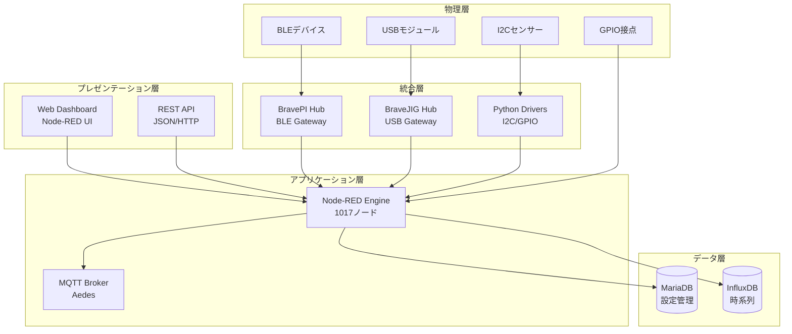
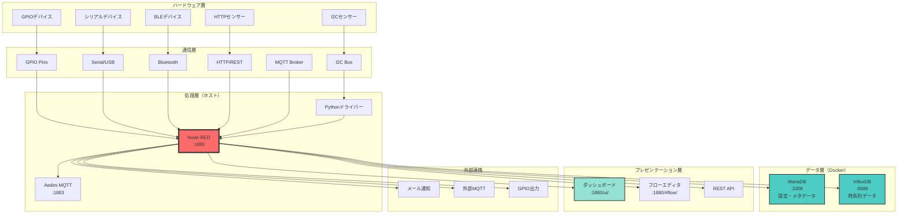
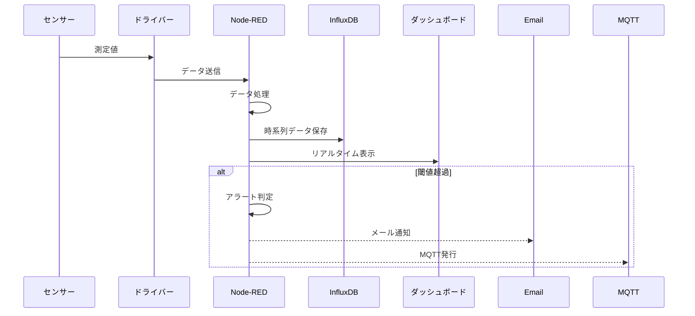
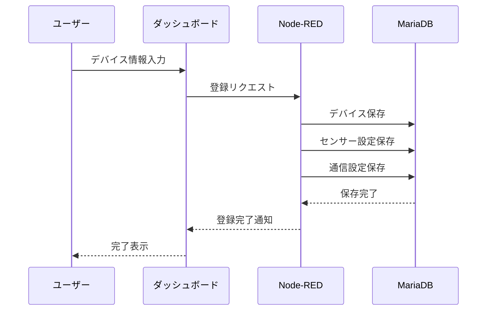
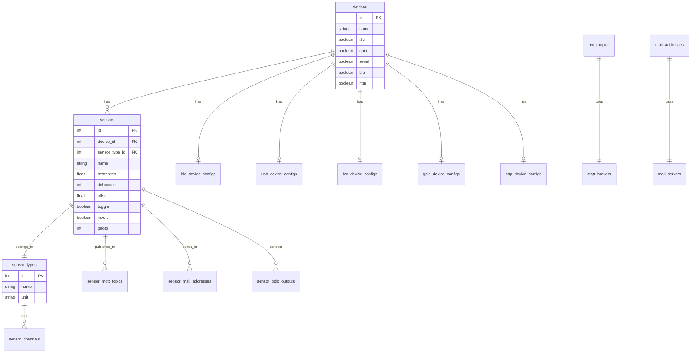
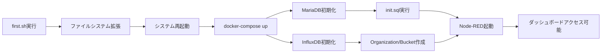

# システムアーキテクチャ総合仕様書

*IoT導入支援キット Ver.4.1 設計思想・実装詳細・技術選定根拠*

## 文書目的

本文書は、福岡県工業技術センター（FITC）開発「IoT導入支援キット Ver.4.1」の包括的システムアーキテクチャを技術者向けに詳述します。設計思想、技術選定根拠、実装詳細、運用特性を網羅し、システム理解・保守・拡張の技術基盤を提供します。

## 目次
1. [システム設計思想](#システム設計思想)
2. [アーキテクチャ概要](#アーキテクチャ概要)
3. [プロジェクト構造分析](#プロジェクト構造分析)
4. [データフロー設計](#データフロー設計)
5. [コンポーネント統合](#コンポーネント統合)
6. [技術選定根拠](#技術選定根拠)

## システム設計思想

IoT導入支援キット Ver.4.1は、**産業現場での実用性**を最優先とした設計思想のもと開発された包括的IoTプラットフォームです。

### 設計原則

| 原則 | 実装方針 | 技術的実現 |
|------|----------|------------|
| **統合性** | 多様センサー・プロトコルの統一管理 | 16種センサー・5通信方式の抽象化 |
| **実用性** | 産業現場での即応性・安定性確保 | <100ms応答・ヒステリシス制御 |
| **保守性** | 視覚的プログラミング・文書化徹底 | Node-RED・包括的ドキュメント |
| **拡張性** | プラグイン型・モジュラー構成 | API標準化・コンポーネント分離 |
| **運用性** | Webベース・一元管理 | 統合ダッシュボード・設定管理 |

### 技術的特徴概要
- **16種センサータイプ**: 接点・アナログ・環境・振動・距離等の産業用途網羅
- **5通信プロトコル**: I2C・GPIO・UART・USB・BLE・MQTT・HTTP統合
- **デュアルDB**: MariaDB（設定）+ InfluxDB（時系列）分離設計
- **Node-RED中核**: 1017ノードによる視覚的ワークフロー制御
- **リアルタイム性**: 1-10Hz連続取得・<100ms UI更新

## アーキテクチャ概要

### 階層アーキテクチャ設計

本システムは**5層アーキテクチャ**を採用し、関心事の分離と高い保守性を実現しています。



## プロジェクト構造分析

```
iot4-copy/
├── README.md                    # プロジェクト概要
├── desktop/                     # Raspberry Piデスクトップ設定
│   ├── first.sh                # 初期設定スクリプト
│   ├── chrome-IoT導入支援キット_Ver.4.1.desktop
│   └── chrome-Node-RED___IoT導入支援キットVer.4.1.desktop
├── docker/                      # Dockerコンテナ設定
│   ├── docker-compose.yml      # サービス定義
│   ├── init.sql               # MariaDBスキーマ
│   ├── mariadb/
│   │   └── Dockerfile
│   └── influxdb/
│       └── Dockerfile
└── .node-red/                  # Node-RED設定（gitignore）
    ├── flows.json             # フロー定義
    ├── settings.js            # Node-RED設定
    ├── package.json           # 依存関係
    ├── python/                # センサードライバー
    │   ├── vl53l1x.py        # 距離センサー
    │   ├── mcp3427.py        # ADC
    │   ├── mcp9600.py        # 熱電対
    │   ├── lis2duxs12.py     # 加速度センサー
    │   ├── opt3001.py        # 照度センサー
    │   ├── sdp810.py         # 差圧センサー
    │   └── lombscargle.py    # 信号処理
    └── static/               # Webフロントエンド
        ├── css/
        └── js/               # 可視化コンポーネント
```

## システムアーキテクチャ



## データフロー

### 1. センサーデータ収集フロー



### 2. デバイス登録フロー



## コンポーネント詳細

### Node-REDフロー構成

| タブ名 | 機能 | 説明 |
|--------|------|------|
| PI・JIG・I2C・GPIO | ハードウェアインターフェース | センサーとの通信制御 |
| ダッシュボード | UI表示 | リアルタイムグラフとステータス |
| デバイス登録 | デバイス管理 | 新規デバイスの登録と設定 |
| センサーログ | データ記録 | InfluxDBへの時系列データ保存 |
| BLEトランスミッター | BLE通信 | Bluetoothデバイスとの連携 |
| ルーター | データルーティング | センサーデータの振り分け |
| モジュール | 共通機能 | 再利用可能な処理ブロック |
| 設定 | システム設定 | MQTT、メール等の設定管理 |

### データベーススキーマ

#### MariaDB（設定管理）



#### InfluxDB（時系列データ）

- **Organization**: fitc
- **Bucket**: iotkit
- **Measurements**: センサータイプごとに自動作成
- **Tags**: device_id, sensor_id, channel
- **Fields**: value, timestamp

### 主要Node-REDモジュール

| モジュール | 用途 |
|-----------|------|
| node-red-contrib-aedes | MQTTブローカー機能 |
| node-red-contrib-influxdb | InfluxDB連携 |
| node-red-dashboard | Webダッシュボード |
| node-red-node-mysql | MariaDB連携 |
| node-red-node-pi-gpio | GPIO制御 |
| node-red-node-serialport | シリアル通信 |
| node-red-contrib-buffer-parser | バイナリデータ解析 |

## センサータイプと設定

### サポートセンサー一覧

| ID | タイプ | 測定項目 | 範囲 | 単位 |
|----|--------|----------|------|------|
| 257 | 接点入力 | ON/OFF | 0-1 | - |
| 258 | 接点出力 | ON/OFF | 0-1 | - |
| 259 | ADC | 電圧（2ch） | ±2000 | mV |
| 260 | 測距 | 距離 | 0-2000 | mm |
| 261 | 熱電対 | 温度 | -50-2000 | ℃ |
| 262 | 加速度 | X,Y,Z,合成 | ±6.5 | G |
| 263 | 差圧 | 圧力 | ±500 | Pa |
| 264 | 照度 | 明るさ | 40-83865 | lux |

### センサー設定パラメータ

| パラメータ | 説明 | デフォルト |
|-----------|------|-----------|
| hysteresis | ヒステリシス閾値 | 0.0 |
| debounce | デバウンス時間（秒） | 0 |
| offset | オフセット補正値 | 0.0 |
| toggle | トグル動作有効化 | false |
| invert | 出力反転 | false |
| photo | 写真撮影トリガー | 0 |

### 通信プロトコル設定

#### MQTT設定
- ブローカー: localhost:1883
- 認証: iotkit / iotkit-password
- QoS: 0（デフォルト）

#### メール設定
- SMTPサーバー: localhost:25
- 認証: なし（デフォルト）
- アラート条件: センサーごとに設定可能

### 初期設定フロー



## まとめ

IoT導入支援キットは、ハードウェアアクセスが必要な部分（Node-RED、Pythonドライバー）をホスト上で実行し、データ管理部分（MariaDB、InfluxDB）をDocker化することで、柔軟性と保守性を両立させた設計となっています。

このハイブリッドアーキテクチャにより、Raspberry Piの GPIO やI2Cバスへの直接アクセスを維持しながら、データベースの可搬性とバージョン管理の利便性を確保しています。