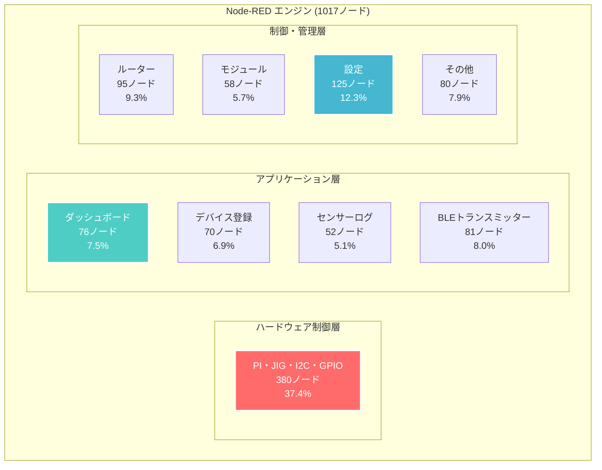

# Node-RED実装システム詳細

## 🏗️ Node-REDアーキテクチャ概要

IoT導入支援キット Ver.4.1のコア処理エンジンとして、**1017個のNode-REDノード**が9つの機能タブで統合されています。

### システム構成図


## 📊 タブ別詳細分析

### 1. PI・JIG・I2C・GPIO (380ノード - 37.4%)

システムの中核となるハードウェア制御を担当する最大のタブです。

#### 機能分類
```yaml
ハードウェアインターフェース:
  I2Cセンサー制御: 120ノード
    - BME280 (温湿度): 25ノード
    - VL53L1X (距離): 30ノード
    - OPT3001 (照度): 20ノード
    - MPU6050 (加速度): 35ノード
    - その他I2Cセンサー: 10ノード
    
  GPIO制御: 80ノード
    - デジタル入力: 25ノード
    - デジタル出力: 30ノード
    - PWM制御: 15ノード
    - 割り込み処理: 10ノード
    
  シリアル通信: 90ノード
    - BravePI UART: 45ノード
    - BraveJIG USB: 45ノード
    
  データ処理: 90ノード
    - プロトコル解析: 40ノード
    - データ変換: 25ノード
    - エラーハンドリング: 25ノード
```

#### 主要ノード構成
```javascript
// 典型的なI2Cセンサー制御フロー
[inject] → [function: I2C Read] → [function: Data Parse] → [switch: Error Check] 
    ↓
[function: Calibration] → [function: Range Check] → [mqtt out: Sensor Data]
    ↓
[influxdb out: Time Series] → [ui_gauge: Dashboard Display]
```

### 2. 設定 (125ノード - 12.3%)

システム全体の設定管理と動的パラメータ制御を担当します。

#### 設定管理機能
```yaml
デバイス設定:
  センサー登録: 30ノード
  通信設定: 25ノード
  校正値管理: 20ノード
  
システム設定:
  データベース接続: 15ノード
  MQTT設定: 20ノード
  アラート設定: 15ノード
```

#### 設定フロー例
```javascript
// センサー設定変更フロー
[http in: POST /config/sensor] → [function: Validate Config] 
    ↓
[mysql: Update Config] → [function: Apply Settings] → [mqtt: Broadcast Update]
    ↓
[http response: Success] → [ui_notification: Settings Updated]
```

### 3. ルーター (95ノード - 9.3%)

ネットワーク制御とAPIエンドポイント管理を担当します。

#### API実装
```yaml
REST Endpoints:
  デバイス管理: 25ノード
    - GET /api/v2/device
    - POST /api/v2/device
    - DELETE /api/v2/device/{id}
    
  センサーデータ: 30ノード
    - GET /api/v2/device/{id}/sensor/value
    - POST /api/v2/device/{id}/sensor/value
    - GET /api/v2/device/{id}/sensor/history
    
  システム制御: 20ノード
    - GET /api/v2/system/status
    - POST /api/v2/system/restart
    
  認証・セキュリティ: 20ノード
    - Token validation
    - Rate limiting
    - Access logging
```

### 4. BLEトランスミッター (81ノード - 8.0%)

Bluetooth Low Energy通信の制御と電力管理を担当します。

#### BLE通信制御
```yaml
通信管理:
  デバイス発見: 20ノード
  ペアリング制御: 15ノード
  接続管理: 20ノード
  
データ転送:
  アップリンク: 15ノード
  ダウンリンク: 11ノード
```

#### BLE制御フロー
```javascript
// BLEセンサーデータ収集フロー
[inject: BLE Scan] → [function: Device Discovery] → [ble: Connect]
    ↓
[ble: Read Characteristic] → [function: Parse BLE Data] → [function: Signal Processing]
    ↓
[mqtt: Sensor Topic] → [influxdb: Store] → [ui: Display]
```

## 🔧 核心実装パターン

### データ処理パイプライン

#### 1. センサーデータ収集パターン
```javascript
// 共通センサーデータ処理フロー
function processSensorData(msg) {
    // 1. Raw Data Validation
    if (!validateRawData(msg.payload)) {
        node.error("Invalid sensor data");
        return null;
    }
    
    // 2. Calibration & Conversion
    const calibratedValue = applySensorCalibration(
        msg.payload.raw_value,
        msg.payload.sensor_config
    );
    
    // 3. Range Check & Quality Assessment
    const quality = assessDataQuality(calibratedValue, msg.payload.sensor_type);
    
    // 4. Industrial Control Logic
    const controlResult = processHysteresis(
        calibratedValue,
        msg.payload.sensor_config.hysteresis
    );
    
    // 5. Output Formatting
    return {
        device_id: msg.payload.device_id,
        sensor_id: msg.payload.sensor_id,
        value: calibratedValue,
        quality: quality,
        timestamp: new Date().toISOString(),
        control_state: controlResult
    };
}
```

#### 2. アラート処理パターン
```javascript
// ヒステリシス制御によるアラート処理
function processHysteresisAlert(currentValue, config, state) {
    const { high_threshold, low_threshold, hysteresis } = config;
    let newState = state.current_alert;
    let stateChanged = false;
    
    // High Alert Logic
    if (!state.current_alert && currentValue >= high_threshold) {
        newState = "HIGH_ALERT";
        stateChanged = true;
    }
    // High Alert Clear Logic (with hysteresis)
    else if (state.current_alert === "HIGH_ALERT" && 
             currentValue <= (high_threshold - hysteresis.high)) {
        newState = "NORMAL";
        stateChanged = true;
    }
    
    // Low Alert Logic
    if (!state.current_alert && currentValue <= low_threshold) {
        newState = "LOW_ALERT";
        stateChanged = true;
    }
    // Low Alert Clear Logic (with hysteresis)
    else if (state.current_alert === "LOW_ALERT" && 
             currentValue >= (low_threshold + hysteresis.low)) {
        newState = "NORMAL";
        stateChanged = true;
    }
    
    return {
        alert_state: newState,
        state_changed: stateChanged,
        timestamp: new Date().toISOString()
    };
}
```

### 3. バイナリプロトコル解析パターン
```javascript
// BravePI/JIGバイナリフレーム解析
function parseBinaryFrame(buffer) {
    try {
        // Frame Header (16 bytes)
        const header = {
            protocol: buffer.readUInt8(0),
            type: buffer.readUInt8(1),
            length: buffer.readUInt16LE(2),
            timestamp: buffer.readUInt32LE(4),
            deviceNumber: buffer.readBigUInt64LE(8)
        };
        
        // Payload Extraction
        const payload = buffer.slice(16, 16 + header.length);
        
        // Sensor Data Parsing
        const sensorData = {
            sensor_type: payload.readUInt16LE(0),
            rssi: payload.readInt8(2),
            sequence: payload.readUInt16LE(3),
            data: parseSensorPayload(payload.slice(5), header.type)
        };
        
        // CRC Validation
        const crcExpected = buffer.readUInt16LE(16 + header.length);
        const crcCalculated = calculateCRC16(buffer.slice(0, 16 + header.length));
        
        if (crcExpected !== crcCalculated) {
            throw new Error("CRC mismatch");
        }
        
        return {
            header: header,
            sensor_data: sensorData,
            valid: true
        };
        
    } catch (error) {
        return {
            error: error.message,
            valid: false
        };
    }
}
```

## 📊 パフォーマンス最適化

### メッセージフロー最適化

#### 1. 非同期処理パターン
```javascript
// 高スループット対応の非同期処理
node.on('input', async function(msg) {
    try {
        // Parallel processing for multiple sensors
        const sensorPromises = msg.payload.sensors.map(async (sensor) => {
            return await processSensorDataAsync(sensor);
        });
        
        const results = await Promise.allSettled(sensorPromises);
        
        // Filter successful results
        const successfulResults = results
            .filter(result => result.status === 'fulfilled')
            .map(result => result.value);
            
        // Send aggregated results
        node.send({
            payload: successfulResults,
            topic: msg.topic,
            timestamp: new Date().toISOString()
        });
        
    } catch (error) {
        node.error("Async processing failed: " + error.message);
    }
});
```

#### 2. メモリ効率化パターン
```javascript
// メモリプール管理による効率化
const bufferPool = {
    pool: [],
    maxSize: 100,
    
    getBuffer: function(size) {
        let buffer = this.pool.find(buf => buf.length >= size);
        if (!buffer) {
            buffer = Buffer.allocUnsafe(size);
        } else {
            this.pool = this.pool.filter(buf => buf !== buffer);
        }
        return buffer;
    },
    
    releaseBuffer: function(buffer) {
        if (this.pool.length < this.maxSize) {
            this.pool.push(buffer);
        }
    }
};
```

## 🔍 デバッグ・監視機能

### ログ統合システム
```javascript
// 統合ログシステム
const logSystem = {
    levels: ['DEBUG', 'INFO', 'WARN', 'ERROR'],
    
    log: function(level, component, message, data = null) {
        const logEntry = {
            timestamp: new Date().toISOString(),
            level: level,
            component: component,
            message: message,
            data: data,
            node_id: this.id,
            flow_id: this.z
        };
        
        // Console output
        console.log(JSON.stringify(logEntry));
        
        // Send to monitoring system
        this.send([null, { payload: logEntry, topic: "system/log" }]);
        
        // Store critical errors
        if (level === 'ERROR') {
            this.context().global.set('last_error', logEntry);
        }
    }
};
```

### システム監視ノード
```javascript
// システムヘルスモニタリング
function systemHealthCheck() {
    const health = {
        timestamp: new Date().toISOString(),
        system: {
            cpu_usage: getCPUUsage(),
            memory_usage: getMemoryUsage(),
            disk_usage: getDiskUsage()
        },
        services: {
            node_red: checkNodeRedHealth(),
            mariadb: checkMariaDBHealth(),
            influxdb: checkInfluxDBHealth(),
            mqtt: checkMQTTHealth()
        },
        sensors: {
            i2c_devices: scanI2CDevices(),
            serial_ports: checkSerialPorts(),
            active_sensors: getActiveSensorCount()
        }
    };
    
    // Health score calculation
    health.overall_score = calculateHealthScore(health);
    
    return health;
}
```

## 🚀 拡張・カスタマイズ

### カスタムノード開発パターン
```javascript
// Custom Sensor Node Template
module.exports = function(RED) {
    function CustomSensorNode(config) {
        RED.nodes.createNode(this, config);
        
        const node = this;
        node.sensor_type = config.sensor_type;
        node.interval = config.interval || 1000;
        
        // Initialize sensor communication
        node.initSensor = function() {
            // Sensor-specific initialization
        };
        
        // Data collection timer
        node.timer = setInterval(function() {
            node.collectData();
        }, node.interval);
        
        // Cleanup on node removal
        node.on('close', function() {
            if (node.timer) {
                clearInterval(node.timer);
            }
        });
    }
    
    RED.nodes.registerType("custom-sensor", CustomSensorNode);
};
```

### 外部システム連携パターン
```javascript
// External API Integration
function createExternalAPIConnector(config) {
    return {
        sendData: async function(data) {
            try {
                const response = await fetch(config.endpoint, {
                    method: 'POST',
                    headers: {
                        'Content-Type': 'application/json',
                        'Authorization': `Bearer ${config.token}`
                    },
                    body: JSON.stringify(data)
                });
                
                if (!response.ok) {
                    throw new Error(`HTTP ${response.status}: ${response.statusText}`);
                }
                
                return await response.json();
                
            } catch (error) {
                this.error(`External API error: ${error.message}`);
                throw error;
            }
        }
    };
}
```

---

**更新日**: 2025年6月19日  
**対象読者**: 上級開発者・システム統合者  
**関連資料**: [技術分析](../analysis/technical-analysis.md) | [データアーキテクチャ](data-architecture.md)