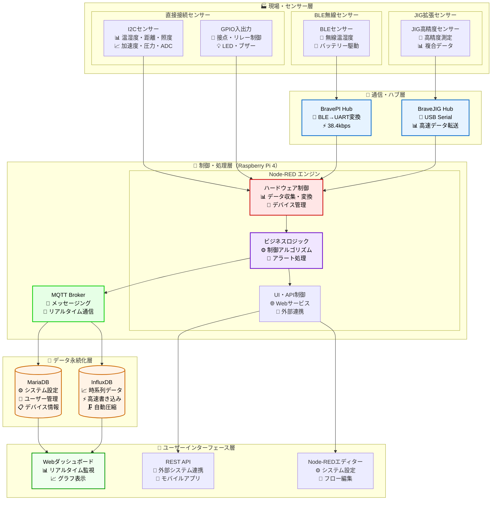

# アーキテクチャ図解

## 🏗️ システム全体構成

IoT導入支援キット Ver.4.1の全体アーキテクチャを図解で説明します。

### システム階層構造



## 📊 レイヤー別詳細

### 🏭 現場・センサー層

産業現場に設置される実際のセンサーデバイス群です。

#### 直接接続センサー
```
I2Cバス接続:
├── 温湿度センサー (BME280): 環境監視
├── 距離センサー (VL53L1X): 物体検知・位置測定  
├── 照度センサー (OPT3001): 明るさ監視
├── 加速度センサー (MPU6050): 振動・傾斜監視
├── 圧力センサー: 差圧・流量監視
└── ADCセンサー: アナログ信号取得

GPIO接続:
├── 接点入力: スイッチ・リミットセンサー
├── 接点出力: リレー・LED・ブザー制御
└── PWM出力: モーター・サーボ制御
```

#### 無線・拡張センサー
```
BLE（Bluetooth Low Energy）:
├── 無線温湿度センサー: 配線不要設置
├── バッテリー駆動センサー: 移動体監視
└── 長距離通信センサー: 広範囲監視

JIG拡張ハブ:
├── 高精度センサー群: 研究・開発用途
├── 複合センサー: 複数要素同時測定
└── 特殊プロトコル: カスタムセンサー対応
```

### 📡 通信・ハブ層

異なる通信方式のセンサーを統合するハブ機能です。

```
通信プロトコル変換:
┌─────────────┐    ┌─────────────┐    ┌─────────────┐
│ BLE Sensors │ -> │  BravePI    │ -> │ UART Serial │
│ (無線)       │    │ (プロトコル  │    │ (有線)       │
│             │    │  変換)      │    │             │
└─────────────┘    └─────────────┘    └─────────────┘

┌─────────────┐    ┌─────────────┐    ┌─────────────┐
│ JIG Sensors │ -> │ BraveJIG    │ -> │ USB Serial  │  
│ (高精度)     │    │ (データ集約) │    │ (高速転送)   │
└─────────────┘    └─────────────┘    └─────────────┘
```

### 🧠 制御・処理層

Raspberry Pi 4上で動作するNode-REDエンジンによる制御処理です。

#### Node-REDフロー構成（1017ノード）
```
タブ構成:
├── PI・JIG・I2C・GPIO (380ノード): ハードウェア制御
├── ダッシュボード (76ノード): UI表示制御
├── デバイス登録 (70ノード): デバイス管理
├── センサーログ (52ノード): データ永続化
├── BLEトランスミッター (81ノード): 無線通信制御
├── ルーター (95ノード): ネットワーク制御
├── モジュール (58ノード): 共通機能
├── 設定 (125ノード): システム設定
└── その他 (80ノード): ユーティリティ
```

#### 処理フロー
```
データ処理パイプライン:
Raw Data -> Validation -> Calibration -> Business Logic -> Storage -> Presentation
    ↓           ↓             ↓              ↓            ↓          ↓
生データ -> 妥当性検証 -> 校正・変換 -> アラート処理 -> DB保存 -> UI表示
```

### 💾 データ永続化層

設定管理と時系列データを分離したデュアルデータベース設計です。

#### MariaDB（リレーショナルDB）
```
設定・マスターデータ:
├── devices: デバイス基本情報
├── sensors: センサー設定・校正値
├── sensor_types: センサータイプ定義
├── users: ユーザー・権限管理
├── configs: システム設定
└── relationships: デバイス間関係
```

#### InfluxDB（時系列DB）
```
センサーデータ:
measurement: sensor_type (温度、湿度、距離...)
├── tags: device_id, sensor_id, location
├── fields: value, quality, status
├── timestamp: 高精度タイムスタンプ
└── retention: 90日間自動保持
```

## 🔄 データフロー詳細

### リアルタイムデータフロー
```
1秒サイクルでのデータ処理:

Sensor -> Hub -> Raspberry Pi -> Database -> Dashboard
  ↓        ↓         ↓             ↓          ↓
 物理値   プロトコル   Node-RED     永続化    可視化
        変換・集約   処理・判定    (設定/時系列)

処理時間: <100ms (センサー読み取り〜ダッシュボード表示)
```

### 制御フロー
```
アラート・制御の処理:

Threshold Check -> Alert Generation -> Action Execution
       ↓                ↓                   ↓
   閾値監視         アラート生成        自動制御実行
   
- ヒステリシス制御によるチャタリング防止
- デバウンス処理による誤動作防止  
- 複数条件による複雑な制御ロジック
```

## 🌐 ネットワーク構成

### 基本ネットワーク
```
Internet
    |
[ Router ]
    |
┌───┴─────┐
│ LAN     │
├─────────┤
│ PC      │ -> http://raspberry-pi:1880
│ Tablet  │ -> http://192.168.1.100:1880/ui  
│ Phone   │ -> REST API Access
└─────────┘
    |
[Raspberry Pi] -> Sensors/Devices
```

### ポート使用状況
```
Raspberry Pi Services:
├── 1880: Node-RED (UI + API)
├── 3306: MariaDB (設定DB)
├── 8086: InfluxDB (時系列DB)
├── 1883: MQTT Broker (Primary)
├── 51883: MQTT Broker (Secondary)
└── 22: SSH (リモート管理)
```

## 📈 性能特性

### スループット性能
```
データ収集性能:
├── 最大センサー数: 100個
├── 最大データレート: 10Hz per sensor  
├── 最大総スループット: 1,000 points/sec
└── 応答時間: <100ms (センサー→ダッシュボード)

データベース性能:
├── 書き込み: >10,000 points/sec (InfluxDB)
├── 読み込み: <50ms (一般的なクエリ)
├── 保存効率: 90%圧縮率
└── 保持期間: 90日 (自動削除)
```

### リソース使用量
```
Raspberry Pi 4 (4GB RAM):
├── CPU使用率: 平均20-30%
├── メモリ使用量: 1.5-2GB
├── ストレージ: 8-16GB (ログ・データ含む)
└── 電力消費: 15W (24時間稼働)
```

## 🔧 拡張・カスタマイズポイント

### センサー追加
```
新センサー追加時の拡張ポイント:
├── Hardware Layer: I2C/GPIO/Serial接続
├── Communication Layer: プロトコルドライバー追加
├── Processing Layer: Node-REDフロー追加
├── Data Layer: センサータイプ・チャンネル定義
└── UI Layer: ダッシュボード表示追加
```

### 外部システム連携
```
連携インターフェース:
├── REST API: HTTP/JSON標準インターフェース
├── MQTT: IoTスタンダードメッセージング
├── WebSocket: リアルタイム双方向通信
└── Database Direct: SQL直接アクセス
```

---

**更新日**: 2025年6月19日  
**対象読者**: システム理解を深めたい全てのユーザー  
**関連資料**: [技術仕様](../specifications/technical-specs.md) | [実装詳細](../implementation/)