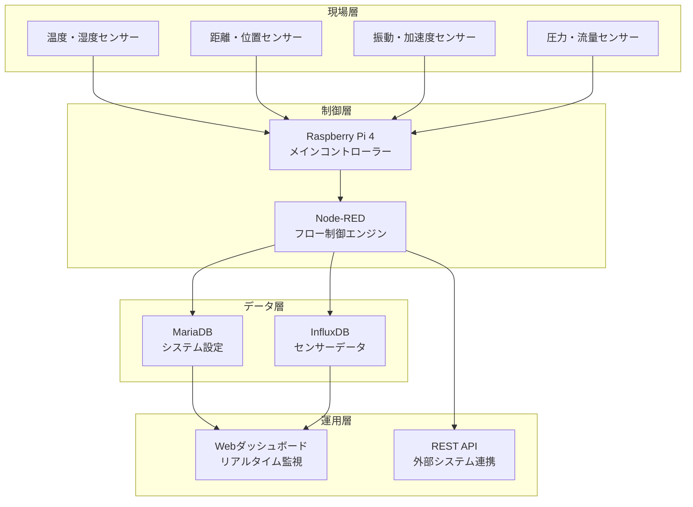

# システム概要

## 📋 IoT導入支援キット Ver.4.1 とは

IoT導入支援キット Ver.4.1は、**産業用IoTシステムの導入を簡単にする**ために福岡県工業技術センターが開発した包括的なプラットフォームです。中小企業でも手軽に導入できる低コスト・高機能なIoTソリューションを提供します。

## 🎯 システムの目的

### 解決する課題
- **IoT導入の複雑性**: 多種多様なセンサーや通信方式の統合が困難
- **高い導入コスト**: 専用システム開発に数百万円が必要
- **技術的ハードル**: 専門知識がないと運用できない
- **拡張性の欠如**: 後からセンサーを追加しにくい

### 提供する価値
- **統合プラットフォーム**: 16種類のセンサーを統一管理
- **低コスト導入**: Raspberry Pi基盤で数十万円から構築可能
- **簡単運用**: Webブラウザだけで監視・制御が可能
- **柔軟な拡張**: 新しいセンサーを簡単に追加可能

## 🏭 適用分野・業界

### 製造業
- **設備監視**: 機械の振動・温度・稼働状態監視
- **品質管理**: 製造環境（温湿度・照度）の自動記録
- **予知保全**: 異常値検出による設備故障の事前発見

### 農業・食品
- **環境管理**: ビニールハウス・倉庫の温湿度管理
- **品質保証**: 冷蔵・冷凍設備の温度監視
- **自動化制御**: 条件に応じた換気・散水制御

### インフラ・建設
- **構造物監視**: 橋梁・建物の変位・振動監視
- **環境監視**: 騒音・大気環境の連続測定
- **安全管理**: 立入禁止区域の侵入検知

## ⚙️ システム構成

## 📊 主要機能

### データ収集・監視
- **リアルタイム監視**: 1秒〜10秒間隔でのセンサーデータ取得
- **自動記録**: 90日間のデータ自動保存（設定変更可能）
- **可視化**: グラフ・メーター表示による直感的なデータ表示

### 制御・アラート
- **閾値監視**: 設定値を超えた場合の自動アラート
- **自動制御**: 条件に応じた出力制御（リレー・LED等）
- **通知機能**: メール・MQTT・HTTPによる外部通知

### 管理・運用
- **Webベース管理**: ブラウザだけで全設定・操作が可能
- **ユーザー管理**: 複数ユーザーでの同時アクセス対応
- **ログ管理**: システム動作ログの自動記録・分析

## 🔧 技術的特徴

### ハードウェア基盤
- **Raspberry Pi 4**: 高性能ARM CPU、豊富なI/O
- **産業用設計**: 24時間連続稼働対応
- **拡張性**: USBポート・GPIOによる柔軟な接続

### ソフトウェア基盤
- **Node-RED**: 視覚的プログラミングによる柔軟な制御
- **デュアルDB**: 設定管理と時系列データの最適分離
- **REST API**: 外部システムとの標準的な連携

### 通信プロトコル
- **有線**: I2C、Serial、GPIO、Ethernet
- **無線**: Bluetooth Low Energy、Wi-Fi
- **ネットワーク**: HTTP、MQTT、WebSocket

## 💰 コスト構造

### 初期導入コスト
| 項目 | 費用目安 | 備考 |
|------|---------|------|
| **Raspberry Pi** | 15,000円 | 本体＋SDカード＋電源 |
| **基本センサー** | 30,000円 | 温湿度・距離・照度・GPIO |
| **筐体・配線** | 20,000円 | 産業用ケース・ケーブル類 |
| **設置・設定** | 50,000円 | 初回セットアップ・調整 |
| **合計** | **約115,000円** | 基本システム導入 |

### 運用コスト
- **電気代**: 月額約500円（24時間稼働）
- **保守**: 年額50,000円（定期点検・サポート）
- **拡張**: センサー1個追加あたり5,000円〜

## 🚀 導入効果

### 定量的効果
- **監視工数削減**: 人手による巡回点検を80%削減
- **異常発見時間短縮**: 24時間→即時検出
- **データ精度向上**: 手動記録ミスを100%削減
- **予防保全効果**: 設備故障を30%削減

### 定性的効果
- **業務品質向上**: 人的エラーの排除、記録の信頼性向上
- **従業員満足度**: 単純作業から解放、高付加価値業務への集中
- **競争力強化**: データ駆動型の意思決定、改善活動の根拠

## 📈 成功事例

### 製造業A社（従業員50名）
- **課題**: 製造ライン3台の温度監視を1日8回手動実施
- **導入効果**: 24時間自動監視により品質トラブル0件達成
- **ROI**: 8ヶ月で投資回収

### 農業B社（ビニールハウス10棟）
- **課題**: 各ハウスの温湿度管理に毎日2時間の巡回が必要
- **導入効果**: 遠隔監視により作業時間90%削減、収量15%向上
- **ROI**: 6ヶ月で投資回収

## 🔄 次のステップ

1. **[機能と利点の詳細](features-benefits.md)**: より詳細な機能説明
2. **[クイックスタート](quick-start.md)**: 実際の操作方法
3. **[技術仕様](../specifications/technical-specs.md)**: 技術的詳細

---

**更新日**: 2025年6月19日  
**対象読者**: 初心者・導入検討者  
**関連資料**: [システム全体構成](../architecture/system-overview.md)