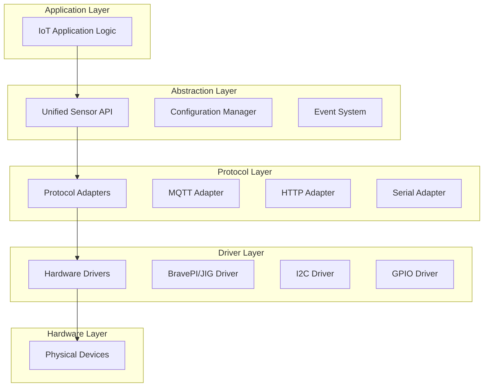

# ハードウェア疎結合化研究書

*IoTシステムにおけるベンダーニュートラル設計の技術研究*

## 研究目的

本研究は、IoT導入支援キット Ver.4.1 における BravePI/BraveJIG ハードウェア依存を解消し、ベンダーニュートラルな疎結合アーキテクチャを実現するための技術的検討を行います。産業用IoTシステムの拡張性・保守性・テスト可能性を根本的に改善する設計方針を策定します。

## 目次
1. [疎結合化の必要性](#疎結合化の必要性)
2. [技術課題の特定](#技術課題の特定)
3. [解決アプローチ研究](#解決アプローチ研究)
4. [アーキテクチャパターン分析](#アーキテクチャパターン分析)
5. [実装戦略の比較評価](#実装戦略の比較評価)
6. [リスク分析](#リスク分析)

## 疎結合化の必要性

### 現状の問題分析

#### 1. ベンダーロックインリスク
```yaml
現状の課題:
  - BravePI/JIG専用プロトコル（38400baud バイナリ）
  - 独自センサータイプID（257-264, 289-293）
  - ハードウェア固有の設定管理スキーマ
  
影響:
  - 他社ハードウェア採用不可
  - 技術革新への対応遅延
  - 調達リスクの集中
```

#### 2. 開発・保守効率の低下
```javascript
// 問題例：センサータイプ追加時の全面修正
const addNewSensorType = (type) => {
  // 1. プロトコル解析処理の修正（53箇所）
  updateProtocolParser(type);
  
  // 2. データベーススキーマ変更
  alterDatabase(type);
  
  // 3. UI表示ロジック修正（76箇所）
  updateDashboard(type);
  
  // 4. 設定管理ロジック修正（125箇所）
  updateConfiguration(type);
};
```

#### 3. テスト・品質保証の困難
- ハードウェア依存による自動テスト実装困難
- 統合テストでの実機必須要件
- 障害再現・デバッグの複雑さ

### 疎結合化の期待効果

| 改善項目 | 現状課題 | 疎結合化後 | 定量効果 |
|----------|----------|-----------|----------|
| **新ハードウェア対応** | 全面開発（3-6ヶ月） | プラグイン追加（1-2週間） | 開発期間 90%短縮 |
| **テスト実装** | 実機必須 | モック・シミュレート | テスト効率 5倍向上 |
| **保守性** | 全体影響修正 | 局所的変更 | 修正工数 80%削減 |
| **品質向上** | 手動テスト依存 | 自動化可能 | 品質向上・リリース速度3倍 |

## 技術課題の特定

### 1. 通信プロトコル抽象化

#### 課題：独自バイナリプロトコルの標準化
```
現状プロトコル（BravePI/JIG固有）:
+----------+----------+----------+----------+----------+
| Protocol | Type     | Length   | Timestamp| Device # |
| (1 byte) | (1 byte) | (2 bytes)| (4 bytes)| (8 bytes)|
+----------+----------+----------+----------+----------+
| Sensor Type | RSSI | Order | Sensor Data (n bytes) |
| (2 bytes)   |(1byte)|(2bytes)|                      |
+----------+----------+----------+--------------------+

課題:
- 16バイト固定ヘッダーの効率性 vs 標準性
- リトルエンディアンの移植性
- CRC16チェックサムの標準プロトコル代替
- 64bitデバイスIDの汎用性
```

#### 技術的解決方針

**Option 1: MQTT-SN (MQTT for Sensor Networks)**
```yaml
利点:
  - IoT標準プロトコル
  - 低帯域幅対応
  - QoS保証
  
課題:
  - バイナリ効率性の低下
  - リアルタイム性への影響（<100ms要件）
  - 実装複雑度増加
```

**Option 2: Protocol Buffers + TCP/UDP**
```yaml
利点:
  - 高効率バイナリ
  - スキーマ進化対応
  - 多言語サポート
  
課題:
  - 学習コスト
  - デバッグ困難性
  - エッジデバイス実装負荷
```

**Option 3: 独自プロトコル + 抽象化レイヤー**
```yaml
利点:
  - 既存性能維持
  - 段階的移行可能
  - リスク最小化
  
課題:
  - 抽象化設計の複雑さ
  - 長期的標準化遅延
```

### 2. センサードライバー統一化

#### 課題：多様なセンサータイプの抽象化
```typescript
// 現状：センサータイプ固有の実装
interface SensorType257 { // 接点入力
  readContactState(): boolean;
  setDebounce(ms: number): void;
}

interface SensorType289 { // JIG照度
  readIlluminance(): Promise<number>;
  calibrateRange(min: number, max: number): void;
}

// 目標：統一インターフェース
interface UnifiedSensor {
  readValue(): Promise<SensorValue>;
  configure(config: SensorConfig): void;
  getCapabilities(): SensorCapabilities;
  getMetadata(): SensorMetadata;
}
```

#### センサー抽象化の技術課題

| 課題 | 詳細 | 解決アプローチ |
|------|------|---------------|
| **データ型統一** | boolean, number, array等の統一 | SensorValue共用体型設計 |
| **設定パラメータ** | センサー固有設定の抽象化 | JSON Schema活用 |
| **リアルタイム性** | 同期/非同期処理の統一 | Promise/Observable統一 |
| **エラーハンドリング** | センサー固有エラーの抽象化 | 標準エラーコード体系 |

### 3. 設定管理の疎結合化

#### 課題：ハードウェア固有設定の汎用化
```sql
-- 現状：ハードウェア専用テーブル
CREATE TABLE `ble_device_configs` (
  `adv_interval` INT,      -- BravePI固有
  `tx_power` TINYINT       -- BravePI固有
);

-- 目標：汎用設定スキーマ
CREATE TABLE `device_configs` (
  `device_id` INT,
  `device_type` VARCHAR(50),
  `capabilities` JSON,     -- 標準化された機能定義
  `config_schema` JSON,    -- 設定項目定義
  `config_values` JSON     -- 実際の設定値
);
```

#### 設定管理統一化の課題

1. **既存設定の移行方法**
2. **動的設定検証の実装**
3. **設定バージョン管理**
4. **リアルタイム設定配信の抽象化**

## 解決アプローチ研究

### 1. レイヤード・アーキテクチャパターン

#### 提案：5層抽象化設計


#### 各層の責務定義

| レイヤー | 責務 | 疎結合化効果 |
|----------|------|-------------|
| **Application** | ビジネスロジック・UI | ハードウェア変更の影響排除 |
| **Abstraction** | 統一API・設定管理 | センサータイプ追加の影響局所化 |
| **Protocol** | 通信プロトコル変換 | プロトコル変更の影響隔離 |
| **Driver** | ハードウェア制御 | ドライバー交換可能性 |
| **Hardware** | 物理デバイス | - |

### 2. プラグインアーキテクチャパターン

#### 提案：動的プラグインシステム
```typescript
// プラグインインターフェース定義
interface HardwarePlugin {
  // メタデータ
  getName(): string;
  getVersion(): string;
  getSupportedSensors(): SensorType[];
  
  // ライフサイクル
  initialize(config: PluginConfig): Promise<void>;
  shutdown(): Promise<void>;
  
  // センサー操作
  createSensor(type: SensorType, config: SensorConfig): Promise<Sensor>;
  destroySensor(sensor: Sensor): Promise<void>;
  
  // 設定管理
  validateConfig(config: any): ValidationResult;
  getConfigSchema(): JSONSchema;
}

// プラグイン実装例
class BravePIPlugin implements HardwarePlugin {
  getName() { return "BravePI Hardware Plugin"; }
  getSupportedSensors() { return [SensorType.CONTACT, SensorType.ADC]; }
  
  async createSensor(type: SensorType, config: SensorConfig) {
    switch(type) {
      case SensorType.CONTACT:
        return new ContactSensor(config);
      case SensorType.ADC:
        return new ADCSensor(config);
    }
  }
}
```

#### プラグインシステムの技術要件

| 要件 | 実装方針 | 技術選択 |
|------|----------|----------|
| **動的ロード** | ランタイムプラグイン読み込み | Node.js require() |
| **依存関係管理** | プラグイン間依存解決 | DI Container |
| **設定検証** | プラグイン固有設定の検証 | JSON Schema |
| **エラー隔離** | プラグインエラーの影響局所化 | Try-Catch境界 |
| **バージョン管理** | プラグイン互換性確保 | Semantic Versioning |

### 3. イベント駆動アーキテクチャパターン

#### 提案：非同期イベントシステム
```typescript
// イベント定義
interface SensorEvent {
  timestamp: Date;
  deviceId: string;
  sensorId: string;
  eventType: 'data' | 'error' | 'status';
  payload: any;
}

// イベントシステム
class EventBus {
  private handlers = new Map<string, EventHandler[]>();
  
  subscribe(eventType: string, handler: EventHandler): void;
  unsubscribe(eventType: string, handler: EventHandler): void;
  publish(event: SensorEvent): void;
  
  // フィルタリング・ルーティング
  publishFiltered(event: SensorEvent, filter: EventFilter): void;
}

// 使用例：疎結合な処理連携
eventBus.subscribe('sensor.data.temperature', (event) => {
  // 温度データの処理（ハードウェア非依存）
  processTemperatureData(event.payload);
});

eventBus.subscribe('sensor.error.*', (event) => {
  // エラー処理（センサータイプ非依存）
  handleSensorError(event);
});
```

## アーキテクチャパターン分析

### パターン1: Adapter Pattern（適応者パターン）

#### 概要
既存のBravePI/JIGインターフェースを標準インターフェースに変換

```typescript
// 標準センサーインターフェース
interface StandardSensor {
  readValue(): Promise<number>;
  getUnit(): string;
  getRange(): {min: number, max: number};
}

// BravePI固有センサーのアダプター
class BravePITemperatureAdapter implements StandardSensor {
  constructor(private bravePISensor: BravePITemperature) {}
  
  async readValue(): Promise<number> {
    // BravePI固有の読み取り処理を標準化
    const rawData = await this.bravePISensor.readRawTemperature();
    return this.convertToStandardUnit(rawData);
  }
  
  private convertToStandardUnit(raw: number): number {
    // BravePI固有の変換ロジックを隠蔽
    return (raw * 0.0625) - 40; // 例：生値を摂氏に変換
  }
}
```

**利点**: 既存コードの再利用性、段階的移行可能
**欠点**: 性能オーバーヘッド、複雑度増加

### パターン2: Strategy Pattern（戦略パターン）

#### 概要
センサー読み取り戦略をハードウェアタイプで切り替え

```typescript
// センサー読み取り戦略
interface SensorReadStrategy {
  readSensor(config: SensorConfig): Promise<SensorData>;
}

class BravePIStrategy implements SensorReadStrategy {
  async readSensor(config: SensorConfig): Promise<SensorData> {
    // BravePI固有の読み取り実装
    return await this.readFromBravePI(config);
  }
}

class I2CStrategy implements SensorReadStrategy {
  async readSensor(config: SensorConfig): Promise<SensorData> {
    // I2C直接読み取り実装
    return await this.readFromI2C(config);
  }
}

// センサーコンテキスト
class SensorReader {
  constructor(private strategy: SensorReadStrategy) {}
  
  setStrategy(strategy: SensorReadStrategy): void {
    this.strategy = strategy;
  }
  
  async read(config: SensorConfig): Promise<SensorData> {
    return await this.strategy.readSensor(config);
  }
}
```

**利点**: アルゴリズム交換可能性、テスト容易性
**欠点**: 戦略切り替えロジックの複雑化

### パターン3: Observer Pattern（観察者パターン）

#### 概要
センサーデータ変化の通知を疎結合で実現

```typescript
// 観察者インターフェース
interface SensorDataObserver {
  onDataChanged(data: SensorData): void;
  onError(error: SensorError): void;
}

// センサー主体
class ObservableSensor {
  private observers: SensorDataObserver[] = [];
  
  addObserver(observer: SensorDataObserver): void {
    this.observers.push(observer);
  }
  
  removeObserver(observer: SensorDataObserver): void {
    const index = this.observers.indexOf(observer);
    if (index > -1) this.observers.splice(index, 1);
  }
  
  private notifyDataChanged(data: SensorData): void {
    this.observers.forEach(obs => obs.onDataChanged(data));
  }
}

// 具体的観察者
class DatabaseWriter implements SensorDataObserver {
  onDataChanged(data: SensorData): void {
    // InfluxDBに保存（ハードウェア非依存）
    this.influxDB.writePoint(data);
  }
}

class AlertManager implements SensorDataObserver {
  onDataChanged(data: SensorData): void {
    // 閾値チェック（センサータイプ非依存）
    if (this.checkThreshold(data)) {
      this.sendAlert(data);
    }
  }
}
```

**利点**: 処理の完全分離、動的な処理追加
**欠点**: デバッグ困難性、性能影響

## 実装戦略の比較評価

### 戦略A: 段階的抽象化アプローチ

#### フェーズ1: プロトコル抽象化（2-3ヶ月）
```typescript
// Step 1: プロトコル解析器の抽象化
interface ProtocolParser {
  parseFrame(buffer: Buffer): ParsedFrame;
  validateFrame(frame: ParsedFrame): boolean;
  createResponse(data: any): Buffer;
}

// Step 2: BravePI/JIG専用パーサーの実装
class BravePIParser implements ProtocolParser { ... }
class BraveJIGParser implements ProtocolParser { ... }

// Step 3: 既存Functionノードの段階的置換
```

**ROI**: 3ヶ月で53ノードの保守性向上
**リスク**: 低（既存機能影響最小）

#### フェーズ2: センサー抽象化（3-4ヶ月）
```typescript
// Step 1: 統一センサーインターフェース定義
interface UnifiedSensor {
  getValue(): Promise<SensorValue>;
  configure(params: SensorParams): void;
}

// Step 2: センサータイプ別アダプター実装
// Step 3: 380ハードウェア制御ノードの置換
```

**ROI**: 4ヶ月で新センサー追加工数90%削減
**リスク**: 中（既存センサー処理への影響）

### 戦略B: 全面リアーキテクトアプローチ

#### 一括プラグインシステム構築（6-8ヶ月）
```typescript
// 新アーキテクチャの一括実装
class IoTPlatform {
  private pluginManager: PluginManager;
  private eventBus: EventBus;
  private configManager: ConfigManager;
  
  // 完全に新しいアーキテクチャ
}
```

**ROI**: 8ヶ月で完全疎結合化・将来性確保
**リスク**: 高（全面書き換えリスク）

### 戦略C: ハイブリッドアプローチ

#### 既存システム併走+新機能疎結合（4-6ヶ月）
```yaml
アプローチ:
  1. 既存BravePI/JIGサポート継続
  2. 新しいハードウェアのみ疎結合実装
  3. 段階的な既存機能移行
  
利点:
  - リスク最小化
  - 既存機能の安定稼働
  - 新機能での検証可能
  
課題:
  - 双方の保守負荷
  - アーキテクチャの複雑化
```

## リスク分析

### 技術リスク

| リスク項目 | 影響度 | 発生確率 | 対策 |
|-----------|--------|----------|------|
| **性能劣化** | 高 | 中 | ベンチマーク・最適化 |
| **既存機能影響** | 高 | 中 | 段階的移行・回帰テスト |
| **複雑度増加** | 中 | 高 | 設計レビュー・文書化 |
| **学習コスト** | 中 | 高 | 研修・ペア開発 |

### 事業リスク

| リスク項目 | 影響度 | 発生確率 | 対策 |
|-----------|--------|----------|------|
| **開発期間延長** | 高 | 中 | フェーズ分割・MVP優先 |
| **品質低下** | 高 | 低 | 自動テスト・CI/CD |
| **保守コスト増** | 中 | 中 | アーキテクチャ標準化 |
| **機能回帰** | 中 | 低 | 包括的テストスイート |

### リスク軽減戦略

#### 1. 段階的移行によるリスク分散
```yaml
Phase 1: プロトコル抽象化（リスク最小）
  - 既存機能に影響なし
  - 新機能での検証
  
Phase 2: センサー抽象化（リスク制御）
  - 1センサータイプずつ移行
  - 既存機能との並行運用
  
Phase 3: 全面移行（リスク最大）
  - 十分な検証後に実行
  - ロールバック計画準備
```

#### 2. 品質保証の強化
```yaml
自動テスト:
  - ユニットテスト: 90%以上のカバレッジ
  - 統合テスト: ハードウェアモック活用
  - E2Eテスト: 主要シナリオの自動化
  
モニタリング:
  - 性能監視: レスポンス時間・スループット
  - エラー監視: 異常検知・アラート
  - 機能監視: 既存機能の動作確認
```

## 推奨実装方針

### 最適戦略：段階的抽象化アプローチ

#### 推奨理由
1. **リスク最小化**: 既存機能への影響を段階的に制御
2. **ROI最大化**: 早期から保守性改善効果を実現
3. **学習効果**: フェーズごとの知見蓄積
4. **事業継続**: 既存サービスの安定稼働継続

#### 実装ロードマップ
```yaml
Phase 1 (月1-3): プロトコル抽象化
  目標: 53Functionノードの保守性向上
  成果: ハードウェア通信の抽象化完了
  
Phase 2 (月4-7): センサー抽象化  
  目標: 380ハードウェア制御ノードの統一化
  成果: 新センサー追加工数90%削減
  
Phase 3 (月8-11): 設定・テスト統一化
  目標: 完全疎結合化・自動テスト実現
  成果: 他社ハードウェア対応可能
```

#### 成功指標（KPI）
```yaml
技術指標:
  - 新ハードウェア対応期間: 3-6ヶ月 → 1-2週間
  - テスト実装工数: 手動依存 → 自動化90%
  - コード保守性: 結合度★★★ → ★☆☆
  
事業指標:
  - 開発速度: 新機能追加3倍高速化
  - 品質向上: 障害件数50%削減
  - コスト削減: 保守工数40%削減
```

---

## 文書メタデータ

**文書タイトル**: ハードウェア疎結合化研究書  
**作成日付**: 2025年6月6日  
**研究対象**: IoT導入支援キット Ver.4.1 疎結合化  
**研究範囲**: アーキテクチャ設計・実装戦略・リスク分析  
**研究者**: システム設計チーム  
**文書レベル**: 技術研究・設計戦略 (★★★)