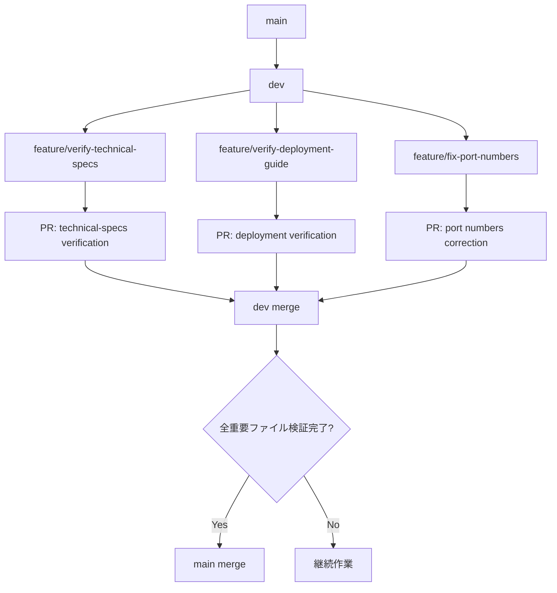
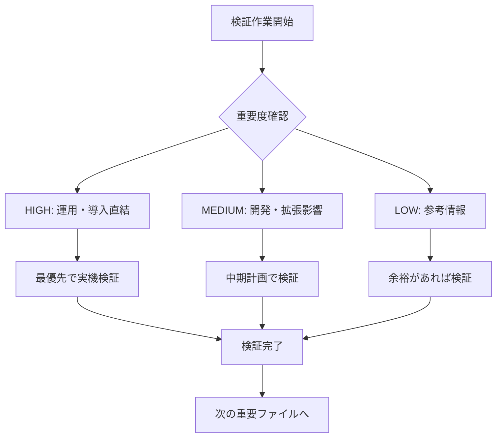
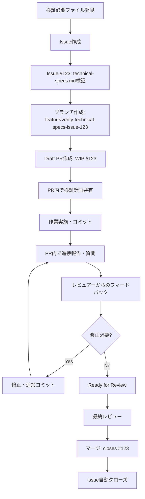

# ドキュメント事実検証ルール

## 概要

このファイルは、プロジェクトドキュメントの「技術的正確性検証」に関する標準的な手順を定めます。**技術的な間違いがないこと**を最重要事項とし、記載内容が実際のシステム・設定と完全に一致しているかを確認します。

## 事実検証の核心目的

### 技術的正確性の3つの重要事項
1. **技術的に重要なファイルの内容に間違いがないか**
2. **間違いがある場合、どの程度の影響があるのか**  
3. **どうやって技術的正確性を確保できるのか**

### 技術的正確性の基本原則
1. **技術的正確性**: 記載された技術情報に一切の間違いがない
2. **実システム一致**: 記載内容が実際のシステム・設定と完全一致
3. **検証可能性**: 実環境で確認・再現して正確性を証明できる
4. **影響度認識**: 間違いがあった場合の技術的・運用的影響を把握

## 事実検証ステータス管理システム

### 技術的正確性ステータス定義
```yaml
TECHNICALLY_VERIFIED: 実環境で技術的正確性を確認済み・間違いなし
NEEDS_TECHNICAL_FIX: 技術的間違いを発見・早急な修正が必要
PARTIAL_VERIFICATION: 部分的に確認済み・残り部分は要検証
UNVERIFIED: 技術的正確性未確認・検証作業未着手
HUMAN_TECHNICAL_REVIEW: 技術専門家による判断が必要
```

### 検証フラグ体系
```yaml
AUTO_VERIFIED: 自動検証で確認可能・完了済み
HUMAN_REVIEW: 人間による専門的判断が必要

自動検証完了後も HUMAN_REVIEW が必要な場合:
  - 設定手順の実用性・わかりやすさ
  - エラー対応手順の実際の有効性
  - 性能値・制限値の業務上の妥当性
  - セキュリティ設定の適切性判断
  - 運用フローの現実的な実行可能性
  - ドキュメント構成・説明の適切性
  - 初心者が理解できるかの判断
  
典型的なパターン:
  "コマンドは動くけど、この手順で本当に大丈夫？"
  "数値は正しいけど、業務要件に合ってる？"
  "技術的には正しいけど、運用現場で使える？"
```

### 技術的重要度設定
```yaml
CRITICAL: 技術的間違いがあると致命的・システム停止や重大障害の原因
HIGH: 技術的間違いがあると運用に直接影響・間違った設定や操作の原因
MEDIUM: 技術的間違いがあると開発に影響・非効率や混乱の原因
LOW: 技術的間違いがあっても影響は軽微・参考情報レベル
```

### 技術的重要度判定の具体例
```yaml
CRITICAL: 間違いがあると致命的
  - データベース接続情報（ホスト、ポート、認証情報）
  - セキュリティ設定・認証設定
  - ネットワーク設定・ファイアウォール設定
  - システム起動・停止手順
  
HIGH: 間違いがあると運用に直接影響
  - ポート番号、IPアドレス、接続情報
  - 実際のコマンド・設定ファイルパス
  - API仕様・エンドポイント
  - 性能値・制限値（実測値）
  
MEDIUM: 間違いがあると開発に影響
  - 開発環境構築手順
  - データベーススキーマ詳細
  - 拡張方法・カスタマイズガイド
  - トラブルシューティング手順
  
LOW: 間違いがあっても影響は軽微
  - プロジェクト概要・背景説明  
  - 一般的な技術解説
  - 将来の計画・構想
```

## Git/Issue中心の管理システム

### 透明な作業管理システム
```yaml
Draft PR中心の管理:
  - 作業開始 = Draft PR作成で即座に可視化
  - 作業中 = PR内でリアルタイム進捗共有
  - 作業完了 = Ready for Review で明確化
  
作業状況は常に透明:
  - gh pr list --draft で作業中一覧確認
  - gh issue list で検証待ちファイル確認
  - 重複作業は自然に回避される
```

### 協働作業のメリット
```yaml
ロック不要の理由:
  - Draft PRで作業者が明確に表示される
  - PR内コメントで進捗・質問がリアルタイム共有
  - 複数人で同じファイルでも分担・協力が可能
  
自然な作業分散:
  - Issue一覧で未着手ファイルが明確
  - Draft PR一覧で作業中ファイルが明確
  - 効率的な作業選択が自然に発生
```

## Git ブランチ戦略

### ブランチ戦略フロー


### ブランチ命名規則
```yaml
検証作業:
  feature/verify-{filename}          # ファイル単位の検証
  feature/verify-{section}-{filename} # セクション単位の検証
  
修正作業:  
  feature/fix-{issue}-{filename}     # 誤情報修正
  feature/update-{content}-{filename} # 情報更新
  
例:
  feature/verify-technical-specs
  feature/verify-hardware-technical-specs  
  feature/fix-port-numbers-technical-specs
  feature/update-node-versions-deployment-guide
```

### 細かなコミット戦略
```bash
# 理想的なコミット頻度

# 1. 作業開始時
git commit -m "docs: start verification of technical-specs.md"

# 2. セクション検証完了時  
git commit -m "docs: verify hardware specs in technical-specs.md - confirmed"

# 3. 問題発見時
git commit -m "docs: mark port numbers as PARTIAL in technical-specs.md - needs verification"

# 4. 30分経過時の活動証明
git commit -m "docs: update activity timestamp in technical-specs.md - still working"

# 5. 検証完了時
git commit -m "docs: complete verification of technical-specs.md - status VERIFIED"
```

## 実際のワークフロー

### 作業開始時の手順
```bash
# 1. 検証対象ファイル選択
gh issue list --label verification  # 検証待ち確認
gh pr list --draft  # 作業中確認

# 2. ブランチ作成・切り替え
git checkout -b feature/verify-technical-specs-issue-123

# 3. 空コミットでブランチプッシュ
git commit --allow-empty -m "docs: start verification of technical-specs.md refs #123"
git push origin feature/verify-technical-specs-issue-123

# 4. Draft PR作成（作業宣言）
gh pr create --draft --title "WIP: technical-specs.md検証 (#123)" \
             --body "$(cat <<'EOF'
## 検証計画
- [ ] ポート番号確認 (実機)
- [ ] 基本コマンド確認  
- [ ] 性能値測定

## 進捗報告場所
このPR内で随時報告・質問します

refs #123
EOF
)"
```

### 作業中の定期更新
```bash
# 検証作業＋コミット
git add . && git commit -m "docs: verify port 1880 confirmed - technical-specs.md refs #123"

# PR内でコメント（進捗報告）
gh pr comment --body "ポート1880確認完了 - Node-RED正常動作確認済み" 
```

### 作業完了時の手順
```bash
# 最終コミット
git add . && git commit -m "docs: complete verification of technical-specs.md refs #123"

# PR内で完了報告
gh pr comment --body "$(cat <<'EOF'
## 検証完了報告

### 確認済み項目
- ポート1880 (Node-RED) - 動作確認済み
- ポート3306 (MariaDB) - 接続確認済み  
- ポート8086 (InfluxDB) - 接続確認済み
- 基本コマンド群 - 実行確認済み

### 検証方法
実際のRaspberry Pi環境で全項目を確認

Ready for Review!
EOF
)"

# Draft PR を Ready for Reviewに変更
gh pr ready
gh pr edit --title "technical-specs.md 検証完了" \
           --body "全ポート・コマンドを実機確認済み - closes #123"
```

## 事実検証作業の実施方法

### 重要度別事実検証優先順位


### 事実検証方法の選択（実システム整合性重視）
```yaml
HIGH優先度の検証方法:
  - 実際のシステムで動作確認
  - 設定ファイルとの完全一致確認
  - 実環境でのコマンド実行
  - 実測による数値データ確認
  
MEDIUM優先度の検証方法:
  - 開発環境での手順実行
  - 代替環境での動作確認
  - 関連ドキュメントとの整合性確認
  
LOW優先度の検証方法:
  - 論理的妥当性の確認
  - 他プロジェクト事例との比較
  - 概念・理論の正確性確認
```

### 信頼できるドキュメントの条件
```yaml
安心して使える状態:
  - 実際のシステムで検証済み
  - 最新の実装状況と一致
  - 間違いがあれば運用に影響するレベルの重要情報が正確
  
検証不要と判断できる状態:
  - 一般的な技術解説のみ
  - 概念的な説明のみ
  - 将来構想・計画のみ
```

### 事実検証完了への道筋
```markdown
各ドキュメントの「事実検証済みにする方法」セクションに具体的アクションを明記:

### 事実検証済みにする方法
- [ ] 実際のRaspberry Piでポート確認
- [ ] docker-compose.ymlとの設定値照合  
- [ ] 負荷テストによる性能測定
- [ ] コマンド実行による動作確認
```

## Issue連携システム

### Issue IDとファイルメタデータの関連付け

#### Git/Issue/PR管理での事実検証情報確認方法
```bash
# 事実検証状況確認コマンド集

# 1. 関連Issue確認  
gh issue view 123

# 2. 作業中PR確認
gh pr view 456 --comments

# 3. 最新コミット確認
git log --oneline -10 --grep="technical-specs"

# 4. 事実検証進捗確認（PR内TODO確認）
gh pr view 456 | grep -E "- \[[ x]\]"
```

### Issue + Draft PR連携ワークフロー


### Git コミットメッセージ連携
```bash
# Issue開始時
git commit -m "docs: start verification of technical-specs.md

- 関連Issue: #123
- 検証項目: ポート番号、基本コマンド、性能値
- 想定作業時間: 2時間

refs #123"

# 進捗更新時
git commit -m "docs: verify port numbers in technical-specs.md - confirmed

- ポート1880, 3306, 8086を実機確認
- docker-compose.ymlとの整合性確認済み

refs #123"

# 完了時
git commit -m "docs: complete verification of technical-specs.md

- 全セクションの実機検証完了
- ステータス: UNVERIFIED → VERIFIED 
- 検証者: user

closes #123"
```

## 進捗管理・監視

### Issue Dashboard
```bash
#!/bin/bash
# issue-dashboard.sh - Issue連携状況確認

echo "ドキュメント検証 Issue Dashboard"
echo "=================================="

# 進行中のIssue確認
echo "進行中の検証作業:"
gh issue list --label verification --state open \
    --json number,title,assignees,labels \
    --template '{{range .}}#{{.number}} {{.title}} ({{range .assignees}}@{{.login}}{{end}}){{"\n"}}{{end}}'

echo ""

# Issue連携されたファイル一覧
echo "🔗 Issue連携済みファイル:"
find docs/ -name "*.md" -exec grep -l "関連Issue.*#[0-9]" {} \; | while read file; do
    issue=$(grep "関連Issue" "$file" | grep -o "#[0-9]*")
    status=$(grep "検証ステータス" "$file" | grep -o "VERIFIED\|PARTIAL\|UNVERIFIED\|NEEDS_FIX\|HUMAN_REVIEW")
    echo "$file: $issue $status"
done

echo ""

# 未Issue化ファイル
echo "❓ Issue未作成の重要ファイル:"
find docs/ -name "*.md" -exec grep -l "重要度.*HIGH" {} \; | while read file; do
    if ! grep -q "関連Issue.*#[0-9]" "$file"; then
        echo "$file (HIGH - Issue作成推奨)"
    fi
done
```

### 作業状況確認スクリプト
```bash
# 検証作業状況確認スクリプト
check_verification_status() {
    echo "ドキュメント検証状況ダッシュボード"
    echo "=================================="
    
    # 検証待ちIssue
    echo ""
    echo "検証待ちファイル:"
    gh issue list --label verification --state open \
        --json number,title --template '{{range .}}#{{.number}} {{.title}}{{"\n"}}{{end}}'
    
    # 作業中Draft PR
    echo ""
    echo "作業中Draft PR:"
    gh pr list --draft --json number,title,author \
        --template '{{range .}}#{{.number}} {{.title}} (@{{.author.login}}){{"\n"}}{{end}}'
}
```

### Issue管理戦略

#### Issue テンプレート設計
```markdown
## ドキュメント事実検証 Issue

### 対象ファイル
`docs/current-system/specifications/technical-specs.md`

### 事実検証が必要な理由
- [ ] NEWLY_CREATED: 新規作成されたドキュメント
- [ ] RELIABILITY_UNKNOWN: 技術情報の信頼性が未確認
- [ ] SYSTEM_MISMATCH: 実環境との整合性が不明
- [ ] NEEDS_HUMAN_REVIEW: 人間による判断・レビューが必要
- [ ] OTHER: その他 ________________

### 重要度
- [ ] HIGH: 運用・導入に直結
- [ ] MEDIUM: 開発・拡張に影響  
- [ ] LOW: 参考情報

### 備考
事実検証作業は別途Draft PRで実施します。

---
/label ~VERIFICATION ~DOCUMENTATION
```

#### Draft PR テンプレート設計
```markdown
## 事実検証作業用 Draft PR

### 事実検証計画
- [ ] ポート番号・接続情報の確認 (AUTO_VERIFIED)
- [ ] 基本コマンドの動作確認 (AUTO_VERIFIED)
- [ ] 性能値・数値データの測定 (AUTO_VERIFIED)
- [ ] 設定ファイルとの整合性確認 (AUTO_VERIFIED)
- [ ] → 自動検証完了後、以下の人間チェック
- [ ] 手順の実用性・わかりやすさ (HUMAN_REVIEW)
- [ ] 業務要件との適合性 (HUMAN_REVIEW)
- [ ] 運用現場での実行可能性 (HUMAN_REVIEW)

### 事実検証方法
- 実際のRaspberry Pi環境での確認
- docker-compose.ymlとの設定値照合
- 関連ドキュメントとの整合性確認
- 人間による専門的判断が必要な項目の識別

### 進捗報告
このPR内で随時進捗・質問・発見事項を報告します

refs #{issue_number}
```

#### Issue ラベル体系
```yaml
種類:
  VERIFICATION: 検証作業
  DOCUMENTATION: ドキュメント作業
  BUG: 誤情報修正
  ENHANCEMENT: 改善提案

重要度:
  HIGH_PRIORITY: HIGH重要度
  MEDIUM_PRIORITY: MEDIUM重要度  
  LOW_PRIORITY: LOW重要度

検証タイプ:
  AUTO_VERIFIABLE: 自動検証可能
  HUMAN_REVIEW: 人間チェック必要
  MIXED_VERIFICATION: 両方必要

状態:
  IN_PROGRESS: 作業中
  NEEDS_REVIEW: レビュー待ち
  BLOCKED: ブロック中

ファイル種別:
  TECHNICAL_SPECS: 技術仕様書
  DEPLOYMENT_GUIDE: 運用ガイド
  OVERVIEW_DOCS: 概要ドキュメント
```

### Draft PR活用戦略
```yaml
Draft PR活用の核心価値:
  透明性:
    - 作業進捗がリアルタイムで可視化
    - コミット履歴で作業内容が時系列で確認可能
    - 他の人が作業状況を即座に把握可能
    
  協働性:
    - PR内で質問・相談・議論が集約
    - レビュアーが早期から助言・フィードバック提供
    - 作業方針の軌道修正を迅速に実施
    
  効率性:
    - ファイル内メタデータ管理が不要
    - Git/GitHub の標準機能だけで完結
    - Issue-PR-コミットの三位一体管理
    
作業パターン:
  WIP: 作業中を明示
  PR Comment: 進捗報告・質問
  Commit: 検証結果を記録
  Ready: 完了時にDraft解除
```

## 成功基準・運用目標

### 検証完了の判定基準
```yaml
ファイル単位:
  FULLY_VERIFIED: 全セクションが実機・実環境で確認済み
  PARTIALLY_VERIFIED: 重要部分は確認済み、細部は要確認
  
プロジェクト単位:
  HIGH優先度ファイル: 100%検証完了
  MEDIUM優先度ファイル: 80%以上検証完了
  LOW優先度ファイル: 機会があれば検証
```

### 運用目標
```yaml
短期目標（2週間）:
  - HIGH 重要度ファイルの検証完了
  - Draft PR中心の透明管理運用開始
  - AUTO_VERIFIED/HUMAN_REVIEW区別習慣の定着

中期目標（1ヶ月）:
  - MEDIUM 重要度ファイルの検証完了  
  - 検証進捗の可視化システム確立
  - 効率的な作業分担体制構築

長期目標（3ヶ月）:
  - 全ドキュメントの信頼性確保
  - 運用ルールの他プロジェクト展開
  - 継続的品質改善サイクル確立
```

## 実用的な運用のポイント

### 作業開始前のチェックリスト
```markdown
□ Issue一覧で検証待ちファイルを確認
□ Draft PR一覧で作業中でないことを確認
□ 実システム整合性重要度を確認（HIGH → MEDIUM → LOW の順）
□ 実環境での検証可能性を確認
□ ブランチ名を決定（feature/verify-xxx-issue-123）
□ Draft PR作成で作業開始を宣言
```

### 作業中の習慣
```markdown
□ 検証作業完了時にコミット＋PR内コメント
□ 質問・相談はPR内で実施
□ 問題発見時はPR内で報告・議論
□ 進捗状況をPR内で随時共有
```

### 作業完了時のチェックリスト
```markdown
□ 最終コミット実行
□ PR内で完了報告コメント
□ Draft PR を Ready for Review に変更
□ Issue closes の確認
□ 次の重要ファイルの確認
```

---

**管理方針**: Git/Issue/PR中心の軽量管理  
**重要度**: High（全作業者必読）