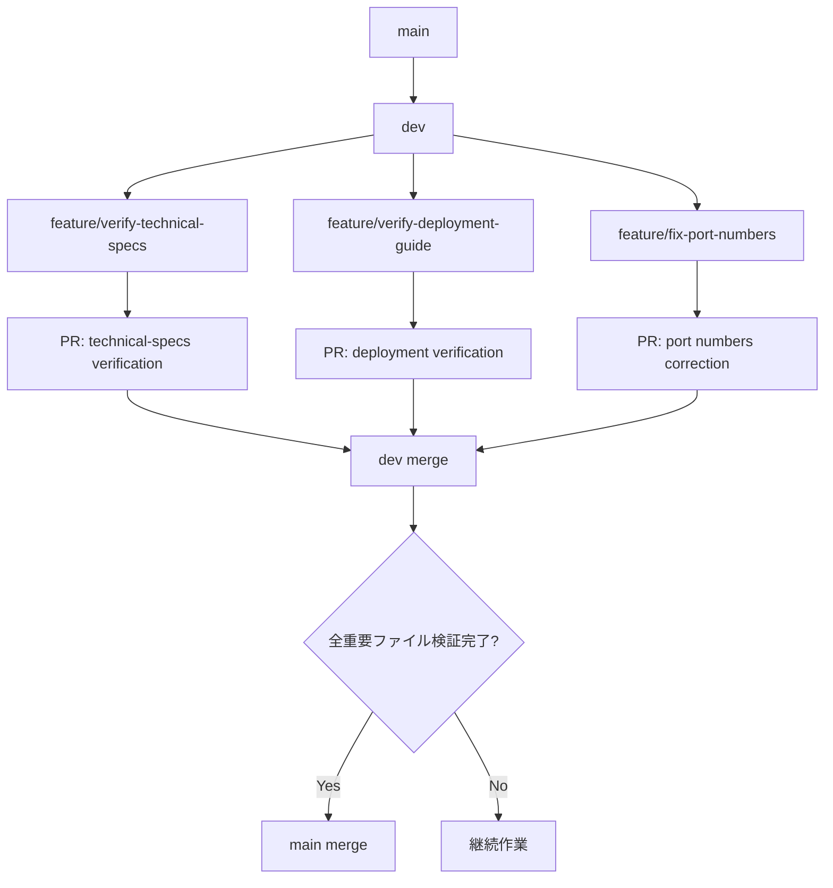
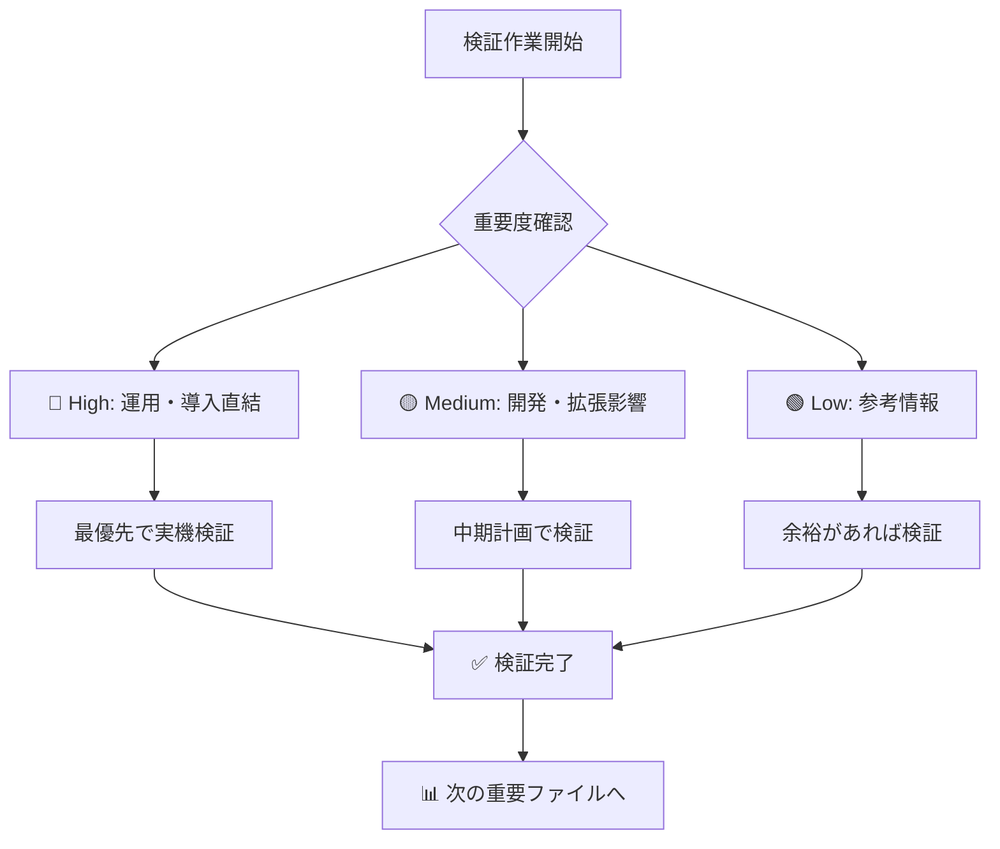
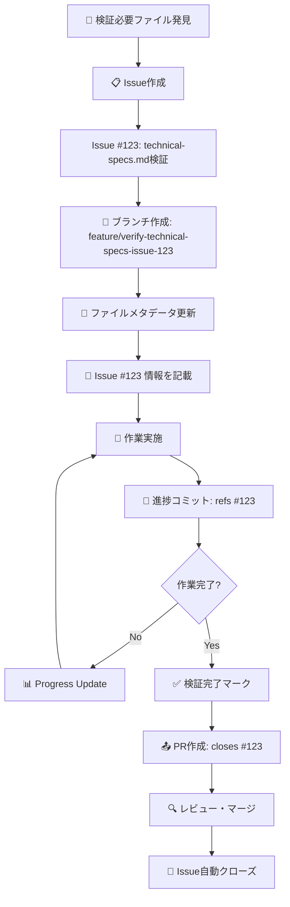

# ドキュメント管理ルール

## 📋 概要

このファイルは、プロジェクトにおけるドキュメント作成・編集・品質管理の標準的な手順を定めます。全作業者がこのルールに従うことで、一貫性のある高品質なドキュメントを維持します。

## 🎯 管理の核心目的

### 3つの重要事項
1. **重要度の高いファイルが検証済みになっているか**
2. **なっていないならばどのステータスになっているのか**  
3. **どうやって検証済みにもっていくことができるのか**

### ドキュメント品質の基本原則
1. **正確性**: 技術的事実と実装の一致
2. **明瞭性**: 読み手に応じた適切な説明レベル
3. **実用性**: 実際の作業で使える情報
4. **保守性**: 更新・修正の容易さ

## 📋 検証ステータス管理システム

### ステータス定義
```yaml
✅ 検証完了: 実環境で確認済み・技術的正確性確認済み
⚠️ 要確認: 部分的に未確認・環境依存で確認困難
🔍 未検証: 検証作業未着手・AI生成初期状態
❌ 修正必要: 明らかな誤情報・早急な修正が必要
```

### 重要度設定
```yaml
🔴 High: 運用・導入に直結 → 最優先で検証
🟡 Medium: 開発・拡張に影響 → 中期で検証  
🟢 Low: 参考情報 → 余裕があれば検証
```

## ⏱️ 時間ベース排他制御システム

### ファイル単位の作業管理
```markdown
各ドキュメントのフッターに以下を明記:

---

## 📋 ドキュメントステータス

**🔍 検証ステータス**: ⚠️ 要確認  
**📅 最終更新**: 2025年6月19日 14:30 JST  
**👤 作業中**: user  
**🕒 最終活動**: 2025年6月19日 14:45 JST  

### 作業ロック状況
- 🟢 **利用可能** (最終活動から30分以上経過)
- 🔴 **作業中** (30分以内に活動あり)  
- 🟡 **要確認** (15-30分経過、引き継ぎ推奨)

### 検証TODO
- [ ] ポート番号確認 (実機) - 想定30分
- [x] 基本コマンド確認 (user, 6/15)
- [ ] 性能値測定 - 想定60分

### 検証済みにする方法
- [ ] 実際のRaspberry Piでポート確認
- [ ] docker-compose.ymlとの設定値照合
- [ ] 負荷テストによる性能測定

**重要度**: 🔴 High（運用に直結）
```

### 作業可能性判定ルール
```bash
最終活動からの経過時間:
- 30分以上: 🟢 他の人が作業開始可能
- 15-30分: 🟡 引き継ぎ確認推奨
- 15分未満: 🔴 作業中（待機）
```

## 🌿 Git ブランチ戦略

### ブランチ戦略フロー


### ブランチ命名規則
```yaml
検証作業:
  feature/verify-{filename}          # ファイル単位の検証
  feature/verify-{section}-{filename} # セクション単位の検証
  
修正作業:  
  feature/fix-{issue}-{filename}     # 誤情報修正
  feature/update-{content}-{filename} # 情報更新
  
例:
  feature/verify-technical-specs
  feature/verify-hardware-technical-specs  
  feature/fix-port-numbers-technical-specs
  feature/update-node-versions-deployment-guide
```

### 細かなコミット戦略
```bash
# 理想的なコミット頻度

# 1. 作業開始時
git commit -m "docs: start verification of technical-specs.md"

# 2. セクション検証完了時  
git commit -m "docs: verify hardware specs in technical-specs.md - ✅ confirmed"

# 3. 問題発見時
git commit -m "docs: mark port numbers as ⚠️ in technical-specs.md - needs verification"

# 4. 30分経過時の活動証明
git commit -m "docs: update activity timestamp in technical-specs.md - still working"

# 5. 検証完了時
git commit -m "docs: complete verification of technical-specs.md - status ✅"
```

## 🔄 実際のワークフロー

### 作業開始時の手順
```bash
# 1. 作業可能性確認
grep "最終活動" docs/path/to/file.md
# 30分以上経過を確認

# 2. ブランチ作成・切り替え
git checkout -b feature/verify-technical-specs

# 3. 作業開始マーク更新
# ファイル内で「最終活動」「作業中」を更新
git add . && git commit -m "docs: start verification of technical-specs.md"
```

### 作業中の定期更新
```bash
# 15-30分ごとの活動証明コミット
git add . && git commit -m "docs: update activity timestamp - verifying port configurations"
```

### 作業完了時の手順
```bash
# 検証完了・ステータス更新
git add . && git commit -m "docs: complete verification of technical-specs.md - status ✅"

# PR作成
git push origin feature/verify-technical-specs
gh pr create --title "📋 technical-specs.md 検証完了" \
              --body "ポート番号、コマンドを実機確認済み"
```

## 🔍 検証作業の実施方法

### 重要度別検証優先順位


### 検証方法の選択
```yaml
技術仕様の検証:
  - 実際のシステムとの照合
  - 設定ファイル(docker-compose.yml等)との確認
  - コマンド実行による動作確認
  
運用手順の検証:
  - 実際の操作手順での確認  
  - インストール手順の実行
  - トラブルシューティングの実証
  
性能・数値の検証:
  - 負荷テストによる実測
  - ベンチマークとの比較
  - 実環境での測定
```

### 検証完了への道筋
```markdown
各ドキュメントの「検証済みにする方法」セクションに具体的アクションを明記:

### 検証済みにする方法
- [ ] 実際のRaspberry Piでポート確認
- [ ] docker-compose.ymlとの設定値照合  
- [ ] 負荷テストによる性能測定
- [ ] コマンド実行による動作確認
```

## 🔗 Issue連携システム

### Issue IDとファイルメタデータの関連付け

#### 拡張版フッターフォーマット（Issue連携対応）
```markdown
---

## 📋 ドキュメントステータス

**🔍 検証ステータス**: ⚠️ 要確認  
**📅 最終更新**: 2025年6月19日 16:00 JST  
**👤 作業中**: user  
**🕒 最終活動**: 2025年6月19日 16:00 JST  

### 🔗 Git・Issue連携情報
- **関連Issue**: [#123 technical-specs.md の検証](../../issues/123)
- **作業ブランチ**: `feature/verify-technical-specs-issue-123`
- **担当者**: @user
- **作業開始**: 2025年6月19日 15:30 JST
- **想定完了**: 2025年6月19日 17:30 JST

### 検証TODO (Issue #123)
- [ ] ポート番号確認 (実機) - 想定30分
- [x] 基本コマンド確認 (user, 6/15) 
- [ ] 性能値測定 - 想定60分

### 検証済みにする方法
- [ ] 実際のRaspberry Piでポート確認 → Issue #123 タスク1
- [ ] docker-compose.ymlとの設定値照合 → Issue #123 タスク2
- [ ] 負荷テストによる性能測定 → Issue #123 タスク3

**重要度**: 🔴 High | **Issue状態**: 🔄 In Progress
```

### Issue連携ワークフロー


### Git コミットメッセージ連携
```bash
# Issue開始時
git commit -m "docs: start verification of technical-specs.md

- 関連Issue: #123
- 検証項目: ポート番号、基本コマンド、性能値
- 想定作業時間: 2時間

refs #123"

# 進捗更新時
git commit -m "docs: verify port numbers in technical-specs.md - ✅ confirmed

- ポート1880, 3306, 8086を実機確認
- docker-compose.ymlとの整合性確認済み

refs #123"

# 完了時
git commit -m "docs: complete verification of technical-specs.md

- 全セクションの実機検証完了
- ステータス: 🔍 → ✅ 
- 検証者: user

closes #123"
```

## 📊 進捗管理・監視

### Issue Dashboard
```bash
#!/bin/bash
# issue-dashboard.sh - Issue連携状況確認

echo "📊 ドキュメント検証 Issue Dashboard"
echo "=================================="

# 進行中のIssue確認
echo "🔄 進行中の検証作業:"
gh issue list --label verification --state open \
    --json number,title,assignees,labels \
    --template '{{range .}}#{{.number}} {{.title}} ({{range .assignees}}@{{.login}}{{end}}){{"\n"}}{{end}}'

echo ""

# Issue連携されたファイル一覧
echo "🔗 Issue連携済みファイル:"
find docs/ -name "*.md" -exec grep -l "関連Issue.*#[0-9]" {} \; | while read file; do
    issue=$(grep "関連Issue" "$file" | grep -o "#[0-9]*")
    status=$(grep "検証ステータス" "$file" | grep -o "[✅⚠️🔍❌]")
    echo "$file: $issue $status"
done

echo ""

# 未Issue化ファイル
echo "❓ Issue未作成の重要ファイル:"
find docs/ -name "*.md" -exec grep -l "重要度.*🔴" {} \; | while read file; do
    if ! grep -q "関連Issue.*#[0-9]" "$file"; then
        echo "$file (🔴 High - Issue作成推奨)"
    fi
done
```

### 作業可能性チェック
```bash
# 作業開始前の確認スクリプト
check_file_availability() {
    local file="$1"
    local last_update=$(grep "最終活動" "$file" | extract_timestamp)
    local now=$(date +%s)
    local diff=$((now - last_update))
    
    if [ $diff -gt 1800 ]; then  # 30分 = 1800秒
        echo "🟢 作業可能: $file"
    elif [ $diff -gt 900 ]; then   # 15分 = 900秒  
        echo "🟡 要確認: $file (引き継ぎ推奨)"
    else
        echo "🔴 作業中: $file (待機)"
    fi
}
```

### Issue管理戦略

#### Issue テンプレート設計
```markdown
## 📋 ドキュメント検証 Issue

### 対象ファイル
- **ファイルパス**: `docs/current-system/specifications/technical-specs.md`
- **重要度**: 🔴 High
- **現在のステータス**: 🔍 未検証

### 検証項目
- [ ] ポート番号・接続情報 (想定30分)
- [ ] 基本コマンド動作確認 (想定30分)  
- [ ] 性能値・数値データ (想定60分)
- [ ] ファイルパス・設定値 (想定30分)

### 検証方法
- [ ] 実際のRaspberry Piでの動作確認
- [ ] docker-compose.ymlとの設定値照合
- [ ] 負荷テストによる性能測定
- [ ] 関連ドキュメントとの整合性確認

### 完了基準
- [ ] 全検証項目が✅マーク
- [ ] ファイルステータスが🔍→✅に変更
- [ ] メタデータの更新完了

### 関連情報
- **依存Issue**: なし
- **ブランチ名**: `feature/verify-technical-specs-issue-{issue_number}`
- **想定作業時間**: 2.5時間
- **担当者**: 未定

---
/label ~verification ~documentation ~high-priority
```

#### Issue ラベル体系
```yaml
種類:
  verification: 検証作業
  documentation: ドキュメント作業
  bug: 誤情報修正
  enhancement: 改善提案

重要度:
  high-priority: 🔴 High重要度
  medium-priority: 🟡 Medium重要度  
  low-priority: 🟢 Low重要度

状態:
  in-progress: 作業中
  needs-review: レビュー待ち
  blocked: ブロック中

ファイル種別:
  technical-specs: 技術仕様書
  deployment-guide: 運用ガイド
  overview-docs: 概要ドキュメント
```

### Pull Request 簡素化（Issue連携）
```yaml
検証PR基準:
  軽微な検証 (即マージ可):
    - 単一セクションの事実確認
    - 明らかな誤記修正 
    - コマンド動作確認
    - PR Title: "📋 Fix: #{issue_number} - 簡潔な修正内容"
    
  重要な検証 (レビュー推奨):
    - 複数セクションの大幅検証
    - システム構成の変更
    - 性能値の大幅修正
    - PR Title: "📋 Verify: #{issue_number} - ファイル名検証完了"
```

## 🎯 成功基準・運用目標

### 検証完了の判定基準
```yaml
ファイル単位:
  ✅ 完全検証済み: 全セクションが実機・実環境で確認済み
  ⚠️ 部分検証済み: 重要部分は確認済み、細部は要確認
  
プロジェクト単位:
  🔴 High優先度ファイル: 100%検証完了
  🟡 Medium優先度ファイル: 80%以上検証完了
  🟢 Low優先度ファイル: 機会があれば検証
```

### 運用目標
```yaml
短期目標（2週間）:
  - 🔴 High 重要度ファイルの検証完了
  - 時間ベース排他制御システム運用開始
  - 細かなGitコミット習慣の定着

中期目標（1ヶ月）:
  - 🟡 Medium 重要度ファイルの検証完了  
  - 検証進捗の可視化システム確立
  - 効率的な作業分担体制構築

長期目標（3ヶ月）:
  - 全ドキュメントの信頼性確保
  - 運用ルールの他プロジェクト展開
  - 継続的品質改善サイクル確立
```

## 🛠️ 実用的な運用のポイント

### 作業開始前のチェックリスト
```markdown
□ ファイルの最終活動時刻を確認（30分以上経過？）
□ 重要度を確認（🔴 High → 🟡 Medium → 🟢 Low の順）
□ 検証TODOの内容と想定時間を確認
□ ブランチ名を決定（feature/verify-xxx）
□ 作業開始のコミット実行
```

### 作業中の習慣
```markdown
□ 15-30分ごとに活動証明コミット
□ セクション完了ごとにステータス更新
□ 問題発見時は即座に⚠️マークと詳細記録
□ 検証完了時は✅マークと確認方法記録
```

### 作業完了時のチェックリスト
```markdown
□ 検証ステータスの最終更新
□ 検証TODOの完了マーク
□ 関連ドキュメントリンクの確認
□ PR作成・マージ
□ 次の重要ファイルの確認
```

---

**📋 ドキュメントステータス**

**🔍 検証ステータス**: ⚠️ 要確認  
**📅 最終更新**: 2025年6月19日 16:00 JST  
**👤 作業中**: Claude + user  
**🕒 最終活動**: 2025年6月19日 16:00 JST  

### 検証TODO
- [ ] 実際のプロジェクトでの運用テスト
- [ ] スクリプト例の動作確認
- [ ] 時間判定ロジックの実装確認

**重要度**: 🔴 High（全作業者必読）