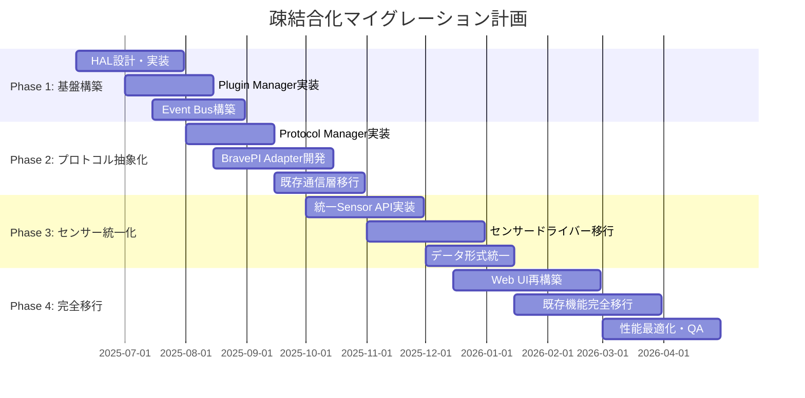
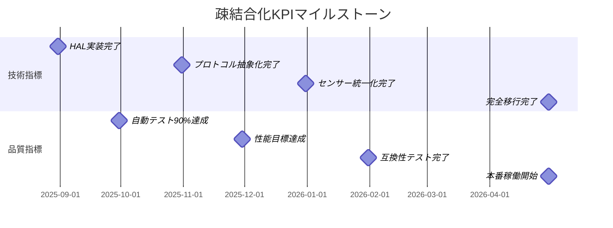
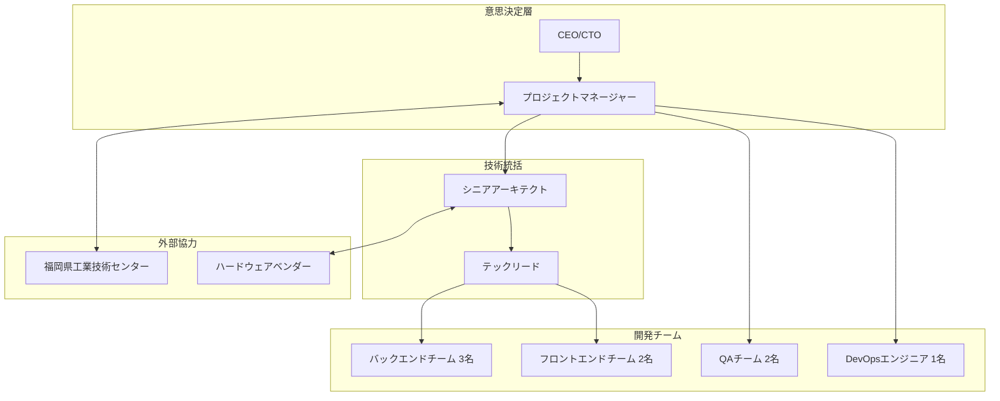

# 疎結合化マイグレーション戦略

*BravePI/BraveJIG依存排除・ベンダーニュートラル化実行計画*

## 計画概要

本計画は、IoT導入支援キット Ver.4.1 から次期疎結合システムへの段階的移行戦略を定義します。現行システムの安定稼働を維持しながら、BravePI/BraveJIG依存を段階的に排除し、ベンダーニュートラルなIoTプラットフォームへの移行を11ヶ月で完遂します。

## 目次
1. [移行戦略概要](#移行戦略概要)
2. [フェーズ別実行計画](#フェーズ別実行計画)
3. [リスク管理・品質保証](#リスク管理・品質保証)
4. [リソース計画](#リソース計画)
5. [成功指標・KPI](#成功指標・kpi)
6. [ロールバック戦略](#ロールバック戦略)

## 移行戦略概要

### 基本方針：段階的抽象化アプローチ



### 移行戦略の特徴

| 戦略要素 | 内容 | メリット |
|----------|------|----------|
| **段階的移行** | 3ヶ月ごとの4フェーズ | リスク分散・検証可能 |
| **並行運用** | 新旧システム同時稼働 | サービス継続・安全性 |
| **逐次検証** | フェーズごとの品質確認 | 品質保証・早期発見 |
| **ロールバック対応** | 各フェーズで復旧可能 | 事業継続性確保 |

## フェーズ別実行計画

### Phase 1: 基盤構築（Month 1-3）

#### 目標：疎結合アーキテクチャの基盤実装

**実装範囲**
```yaml
Core Components:
  1. Hardware Abstraction Layer (HAL) 実装
  2. Plugin Manager システム構築  
  3. Event Bus 基盤実装
  4. Configuration Manager 実装
  5. 開発・テスト環境構築

技術スタック:
  - Backend: Node.js 18+ / TypeScript 5+
  - Framework: NestJS (DI Container)
  - Database: PostgreSQL + InfluxDB 2.0
  - Message: MQTT (Aedes) + Redis Pub/Sub
  - Test: Jest + Supertest + Playwright
```

#### 週次実行計画

**Week 1-2: プロジェクト基盤構築**
```bash
# プロジェクト初期化
mkdir new-iot-platform
cd new-iot-platform
npm init -y

# モノレポ構造構築
npx lerna init
npx lerna create @iot-platform/core
npx lerna create @iot-platform/plugins

# 開発環境セットアップ
docker-compose -f docker/docker-compose.dev.yml up -d
npm run setup:dev
```

**Week 3-4: HAL インターフェース設計**
```typescript
// src/domain/hardware/interfaces/HardwareDevice.ts
export interface HardwareDevice {
  getDeviceInfo(): Promise<DeviceInfo>;
  initialize(config: DeviceConfig): Promise<void>;
  createSensor(type: SensorType, config: SensorConfig): Promise<Sensor>;
  // ... 詳細インターフェース実装
}

// 実装例：Mock Device（テスト用）
export class MockHardwareDevice implements HardwareDevice {
  async getDeviceInfo(): Promise<DeviceInfo> {
    return {
      id: "mock-device-001",
      manufacturer: "Test Corp",
      model: "Mock IoT Device v1.0"
    };
  }
}
```

**Week 5-6: Plugin Manager実装**
```typescript
// src/infrastructure/plugin/PluginManager.ts
export class PluginManager {
  private plugins = new Map<string, LoadedPlugin>();
  
  async loadPlugin(manifest: PluginManifest): Promise<void> {
    // プラグイン動的ロード実装
  }
  
  getPlugin<T>(name: string): T | undefined {
    // プラグイン取得実装
  }
}
```

**Week 7-8: Event Bus実装**
```typescript
// src/infrastructure/events/EventBus.ts
export class EventBus {
  private handlers = new Map<string, EventHandler[]>();
  
  subscribe<T>(eventType: string, handler: EventHandler<T>): void {
    // イベントハンドラー登録
  }
  
  publish<T>(event: DomainEvent<T>): Promise<void> {
    // イベント発行・配信
  }
}
```

**Week 9-12: 統合・テスト**
```yaml
Integration Tests:
  - HAL + Plugin Manager統合テスト
  - Event Bus動作テスト
  - Mock Hardware Device テスト
  - 基本API エンドポイントテスト

Quality Gates:
  - Unit Test Coverage: >90%
  - Integration Test: 全パス
  - TypeScript Strict Mode: エラーなし
  - ESLint/Prettier: クリーン
```

#### Phase 1 成果物・検証項目

| 成果物 | 検証項目 | 合格基準 |
|--------|----------|----------|
| **HAL実装** | インターフェース準拠性 | 全メソッド実装・テスト通過 |
| **Plugin Manager** | 動的ロード・アンロード | プラグイン10個の同時管理 |
| **Event Bus** | 非同期イベント処理 | 1000 events/sec 処理 |
| **Configuration** | 設定管理・検証 | JSON Schema検証100% |
| **開発環境** | CI/CD・自動テスト | 全テスト自動実行 |

### Phase 2: プロトコル抽象化（Month 4-6）

#### 目標：BravePI/JIG通信の抽象化・互換性確保

**実装範囲**
```yaml
Protocol Abstraction:
  1. Protocol Manager 実装
  2. BravePI Protocol Adapter実装
  3. BraveJIG Protocol Adapter実装
  4. 既存シリアル通信の段階的置換
  5. 通信エラー・復旧機構移行

Performance Requirements:
  - 通信レイテンシ: <100ms維持
  - データスループット: 現行同等
  - エラー率: <0.1%
```

#### 週次実行計画

**Week 13-16: Protocol Manager実装**
```typescript
// src/infrastructure/protocol/ProtocolManager.ts
export class ProtocolManager {
  private adapters = new Map<string, ProtocolAdapter>();
  
  async createConnection(
    protocolType: string, 
    endpoint: string
  ): Promise<Connection> {
    const adapter = this.adapters.get(protocolType);
    return await adapter.connect(endpoint);
  }
}

// BravePI専用プロトコルアダプター
export class BravePIProtocolAdapter implements ProtocolAdapter {
  async encodeMessage(message: Message): Promise<Buffer> {
    // 既存バイナリプロトコル実装
    const buffer = Buffer.alloc(16 + message.payload.length);
    // ... BravePI固有エンコーディング
    return buffer;
  }
}
```

**Week 17-20: 既存通信層の段階的置換**
```yaml
Migration Strategy:
  Week 17: Serial Communication抽象化
    - /dev/ttyAMA0 (BravePI) 接続抽象化
    - /dev/ttyACM0-9 (BraveJIG) 接続抽象化
    
  Week 18: プロトコル解析の移行
    - 53個のFunctionノード分析
    - バイナリ解析ロジック抽象化
    
  Week 19: 通信エラー処理移行
    - 自動復旧機構の抽象化
    - タイムアウト・再試行ロジック統一
    
  Week 20: 性能テスト・最適化
    - レイテンシ測定・改善
    - スループット確認・調整
```

**Week 21-24: 互換性テスト・検証**
```yaml
Compatibility Testing:
  1. 既存BravePI/JIGデバイスでの動作確認
  2. 全16センサータイプの通信テスト
  3. 長時間稼働テスト（72時間）
  4. 障害注入テスト・復旧確認
  5. 性能ベンチマーク比較

Parallel Operation:
  - 新通信システムと既存システムの並行稼働
  - データ一致性確認
  - 切り替え機構の実装・テスト
```

### Phase 3: センサー統一化（Month 7-9）

#### 目標：センサータイプの完全抽象化・統一API実現

**実装範囲**
```yaml
Sensor Unification:
  1. 統一Sensor API実装
  2. 16センサータイプの個別アダプター実装
  3. データ形式統一・変換層実装
  4. 既存380ハードウェア制御ノード移行
  5. センサー設定管理統一化

センサータイプ移行計画:
  Priority 1: 基本センサー (257-264) - 8種類
  Priority 2: JIG拡張センサー (289-293) - 5種類  
  Priority 3: その他センサー - 3種類
```

#### センサータイプ別移行スケジュール

| Week | 対象センサー | 実装内容 | 検証項目 |
|------|-------------|----------|----------|
| **25-26** | Type 257-258 (接点) | GPIO抽象化 | デジタル信号・デバウンス |
| **27-28** | Type 259 (ADC) | アナログ変換統一 | 電圧値・較正処理 |
| **29-30** | Type 260-261 (測距・温度) | I2C通信抽象化 | 距離・温度精度確認 |
| **31-32** | Type 262-264 (加速度・差圧・照度) | 複数チャンネル対応 | 3軸データ・FFT処理 |
| **33-34** | Type 289-293 (JIG拡張) | USB通信抽象化 | 高精度データ・同期処理 |
| **35-36** | 統合テスト・性能最適化 | 全センサー統合 | 同時100センサー動作 |

#### 統一センサーAPI実装例

```typescript
// 統一センサーインターフェース
export interface UnifiedSensor {
  getId(): string;
  getType(): SensorType;
  
  // データ読み取り（非同期・Promise based）
  readValue(): Promise<SensorValue>;
  readRawValue(): Promise<number>;
  
  // 設定管理（JSON Schema based）
  configure(config: SensorConfig): Promise<void>;
  getConfiguration(): Promise<SensorConfig>;
  
  // イベント（Observer Pattern）
  on(event: SensorEvent, callback: EventCallback): void;
  off(event: SensorEvent, callback: EventCallback): void;
}

// センサー値統一構造
export interface SensorValue {
  value: number;
  unit: string;
  timestamp: Date;
  quality: DataQuality;
  metadata?: Record<string, any>;
}

// 接点センサー実装例
export class ContactSensor implements UnifiedSensor {
  constructor(
    private deviceDriver: HardwareDevice,
    private config: ContactSensorConfig
  ) {}
  
  async readValue(): Promise<SensorValue> {
    const rawValue = await this.deviceDriver.readGPIO(this.config.pin);
    const debounced = this.applyDebounce(rawValue);
    
    return {
      value: debounced ? 1 : 0,
      unit: "boolean",
      timestamp: new Date(),
      quality: DataQuality.GOOD
    };
  }
}
```

### Phase 4: 完全移行・新機能実装（Month 10-11）

#### 目標：既存システムの完全置換・新機能追加

**実装範囲**
```yaml
Complete Migration:
  1. Web UI完全再構築（React + TypeScript）
  2. 既存Node-REDフロー（1017ノード）の完全移行
  3. データベーススキーマ統一化・マイグレーション
  4. 設定管理システム統一化
  5. 新機能追加（他社ハードウェア対応）

New Features:
  - ESP32/Arduino対応プラグイン
  - 標準IoTプロトコル対応（MQTT-SN/CoAP）
  - 高度な分析機能（FFT・機械学習）
  - セキュリティ強化（認証・暗号化）
```

#### 最終移行実行計画

**Week 37-40: Web UI再構築**
```typescript
// 新ダッシュボード実装
export const SensorDashboard: React.FC = () => {
  const { sensors } = useSensors();
  const { realTimeData } = useRealTimeData();
  
  return (
    <Grid container spacing={3}>
      {sensors.map(sensor => (
        <Grid item xs={12} md={6} lg={4} key={sensor.id}>
          <SensorCard 
            sensor={sensor} 
            data={realTimeData[sensor.id]} 
          />
        </Grid>
      ))}
    </Grid>
  );
};

// リアルタイムデータフック
export const useRealTimeData = () => {
  const [data, setData] = useState<SensorDataMap>({});
  
  useEffect(() => {
    const eventSource = new EventSource('/api/v2/sensors/stream');
    eventSource.onmessage = (event) => {
      const sensorData = JSON.parse(event.data);
      setData(prev => ({
        ...prev,
        [sensorData.sensorId]: sensorData
      }));
    };
    
    return () => eventSource.close();
  }, []);
  
  return { data };
};
```

**Week 41-44: データベース統一化・マイグレーション**
```sql
-- 既存BravePI/JIG専用テーブルの統一化
CREATE TABLE unified_devices (
  id UUID PRIMARY KEY DEFAULT gen_random_uuid(),
  name VARCHAR(255) NOT NULL,
  device_type VARCHAR(50) NOT NULL, -- 'bravepi', 'bravejig', 'esp32'
  capabilities JSONB NOT NULL,       -- 標準化された機能定義
  configuration JSONB NOT NULL,      -- 統一設定形式
  created_at TIMESTAMP DEFAULT NOW(),
  updated_at TIMESTAMP DEFAULT NOW()
);

-- 既存データマイグレーション
INSERT INTO unified_devices (name, device_type, capabilities, configuration)
SELECT 
  device_name,
  'bravepi' as device_type,
  jsonb_build_object(
    'maxSensors', 50,
    'protocols', array['UART', 'BLE'],
    'supportedSensors', array[257,258,259,260,261,262,263,264]
  ) as capabilities,
  jsonb_build_object(
    'serialPort', '/dev/ttyAMA0',
    'baudRate', 38400,
    'bleConfig', jsonb_build_object(
      'advInterval', adv_interval,
      'uplinkInterval', uplink_interval
    )
  ) as configuration
FROM devices d
JOIN ble_device_configs bdc ON d.device_id = bdc.device_id
WHERE d.ble = true;
```

## リスク管理・品質保証

### 技術リスク・対策

| リスク | 影響度 | 発生確率 | 対策 |
|--------|--------|----------|------|
| **性能劣化** | 高 | 中 | 継続的ベンチマーク・最適化 |
| **既存機能影響** | 高 | 中 | 並行運用・段階的切替 |
| **データ損失** | 最高 | 低 | 自動バックアップ・検証 |
| **互換性問題** | 中 | 中 | 包括的互換性テスト |
| **開発遅延** | 中 | 高 | バッファ期間・スコープ調整 |

### 品質保証戦略

#### 自動テスト戦略
```yaml
Unit Tests:
  - Coverage: >90%
  - Framework: Jest + Testing Library
  - 自動実行: Git Push時

Integration Tests:
  - API Tests: Supertest
  - Database Tests: テスト専用DB
  - Hardware Mock: カスタムシミュレーター

E2E Tests:
  - Browser: Playwright
  - シナリオ: 主要ワークフロー20件
  - 実行: Deploy前必須

Performance Tests:
  - Load Testing: k6
  - 指標: レスポンス時間・スループット
  - 回帰テスト: CI/CD組み込み
```

#### 品質ゲート

| Phase | 品質ゲート | 合格基準 |
|-------|-----------|----------|
| **Phase 1** | コード品質 | 技術負債レーティング A |
| **Phase 2** | 互換性 | 既存機能100%動作 |
| **Phase 3** | 性能 | レイテンシ<100ms維持 |
| **Phase 4** | 総合品質 | 全テスト通過・UAT完了 |

### 監視・アラート設定

```yaml
監視項目:
  Performance:
    - API Response Time: <100ms
    - Sensor Data Rate: >1Hz
    - Database Query: <50ms
    
  Reliability:
    - System Uptime: >99.9%
    - Error Rate: <0.1%
    - Data Accuracy: >99.95%
    
  Resource Usage:
    - CPU Usage: <80%
    - Memory Usage: <85%
    - Disk Usage: <90%

アラート設定:
  Critical: 即座に対応（5分以内）
  Warning: 1時間以内対応
  Info: 日次レビュー
```

## リソース計画

### 開発チーム構成

| 役割 | 人数 | 主な責務 | 期間 |
|------|------|----------|------|
| **プロジェクトマネージャー** | 1名 | 全体進行・リスク管理 | 11ヶ月 |
| **シニアアーキテクト** | 1名 | アーキテクチャ設計・技術指導 | 11ヶ月 |
| **バックエンドエンジニア** | 3名 | API・プラグイン・HAL実装 | 11ヶ月 |
| **フロントエンドエンジニア** | 2名 | React UI・可視化実装 | 8ヶ月 |
| **QAエンジニア** | 2名 | テスト設計・自動化・品質保証 | 9ヶ月 |
| **DevOpsエンジニア** | 1名 | CI/CD・インフラ・監視 | 7ヶ月 |

### 技術スキル要件

| スキル | レベル | 必要性 | 取得方法 |
|--------|--------|--------|----------|
| **TypeScript/Node.js** | 上級 | 必須 | 既存スキル・研修 |
| **NestJS/DI** | 中級 | 必須 | 技術研修・実践 |
| **IoTプロトコル** | 中級 | 重要 | 技術調査・実装 |
| **React/Redux** | 中級 | 重要 | フロントエンド研修 |
| **PostgreSQL/InfluxDB** | 中級 | 重要 | DB設計研修 |
| **Docker/CI/CD** | 中級 | 重要 | DevOps研修 |

### 予算・コスト見積

```yaml
人件費（11ヶ月）:
  開発チーム: 10名 × 平均80万円/月 × 9.5ヶ月平均 = 7,600万円
  
技術インフラ:
  開発環境: AWS/Azure 月20万円 × 11ヶ月 = 220万円
  CI/CD: GitHub Actions Pro = 50万円
  監視・ログ: Datadog/New Relic = 100万円
  
ツール・ライセンス:
  IDE・開発ツール = 50万円
  テストツール = 30万円
  
研修・教育:
  技術研修 = 200万円
  外部コンサルタント = 300万円

総予算: 約8,550万円
```

## 成功指標・KPI

### 技術KPI

| 指標 | 現状 | 目標 | 測定方法 |
|------|------|------|----------|
| **新ハードウェア対応期間** | 3-6ヶ月 | 1-2週間 | 実装時間計測 |
| **テスト自動化率** | 10% | 90% | テストカバレッジ |
| **システム応答時間** | <100ms | <50ms | APM監視 |
| **コード保守性** | D評価 | A評価 | SonarQube分析 |
| **障害復旧時間** | 2-4時間 | 15分以内 | 監視アラート |

### 事業KPI

| 指標 | 現状 | 目標 | 測定方法 |
|------|------|------|----------|
| **開発速度** | 基準値 | 3倍向上 | ベロシティ計測 |
| **品質向上** | 基準値 | 障害50%削減 | 障害件数統計 |
| **保守コスト** | 基準値 | 40%削減 | 工数・時間計測 |
| **新機能リリース** | 年2回 | 月1回 | リリース頻度 |
| **顧客満足度** | 基準値 | 20%向上 | NPS・満足度調査 |

### マイルストーン



## ロールバック戦略

### 緊急ロールバック手順

#### Level 1: 機能レベルロールバック
```yaml
# 新機能の無効化（設定変更のみ）
Scope: 個別機能・プラグイン
Time: 5分以内
Method:
  - 機能フラグによる無効化
  - プラグインの動的アンロード
  - 設定ファイルの切り戻し

Example:
  # 新プロトコルアダプターの無効化
  docker exec iot-platform config set protocol.bravepi.enabled=false
  docker exec iot-platform service restart protocol-manager
```

#### Level 2: サービスレベルロールバック
```yaml
# サービス単位での旧バージョン復帰
Scope: 個別マイクロサービス
Time: 15分以内
Method:
  - Docker Image の切り戻し
  - データベースのポイント復旧
  - 負荷分散設定の変更

Example:
  # センサーサービスのロールバック
  docker-compose -f rollback/docker-compose.v1.yml up -d sensor-service
  kubectl rollout undo deployment/sensor-service
```

#### Level 3: システムレベルロールバック
```yaml
# 全システムの完全復旧
Scope: 全システム
Time: 60分以内
Method:
  - 完全システムイメージの復旧
  - データベース全体の復旧
  - ネットワーク設定の復元

Example:
  # 完全システム復旧
  ./scripts/emergency-rollback.sh --to-version=v4.1.0
  docker-compose -f production/v4.1.0/docker-compose.yml up -d
```

### ロールバック判断基準

| 障害レベル | 判断基準 | ロールバック方式 | 復旧目標時間 |
|-----------|----------|-----------------|-------------|
| **軽微** | 個別機能の異常 | 機能無効化 | 5分以内 |
| **中程度** | サービス影響 | サービス切り戻し | 15分以内 |
| **重大** | システム全体影響 | 完全ロールバック | 60分以内 |
| **致命的** | データ整合性問題 | 緊急停止・手動復旧 | 4時間以内 |

### データ保護戦略

```yaml
Backup Strategy:
  Real-time: InfluxDBの連続レプリケーション
  Hourly: PostgreSQL の増分バックアップ
  Daily: システム全体のスナップショット
  Weekly: オフサイトバックアップ

Data Validation:
  - マイグレーション前後のデータ整合性チェック
  - リアルタイムデータ検証・異常検知
  - 定期的なデータ品質監査

Recovery Procedures:
  1. データ損失検知・影響範囲特定
  2. 適切なバックアップポイント選択
  3. データ復旧・整合性検証
  4. サービス再開・動作確認
```

## 実行体制・コミュニケーション

### プロジェクト管理体制



### 定期会議・レポート

| 会議 | 頻度 | 参加者 | 目的 |
|------|------|--------|------|
| **ステアリング委員会** | 月次 | CEO, PM, ARCH | 意思決定・方向性確認 |
| **技術レビュー会議** | 週次 | ARCH, LEAD, BE, FE | 技術課題・設計判断 |
| **スプリント計画** | 2週次 | 全開発チーム | 短期計画・タスク割当 |
| **品質レビュー** | 週次 | PM, QA, LEAD | 品質状況・リスク確認 |
| **ステークホルダー報告** | 月次 | PM, FITC | 進捗・課題共有 |

---

## 文書メタデータ

**文書タイトル**: 疎結合化マイグレーション戦略  
**作成日付**: 2025年6月6日  
**計画期間**: 2025年6月 〜 2026年4月（11ヶ月）  
**対象システム**: IoT導入支援キット Ver.4.1 → 次期システム  
**計画範囲**: 全システム疎結合化・移行実行計画  
**策定者**: システム移行チーム  
**文書レベル**: 実行計画・戦略 (★★★)