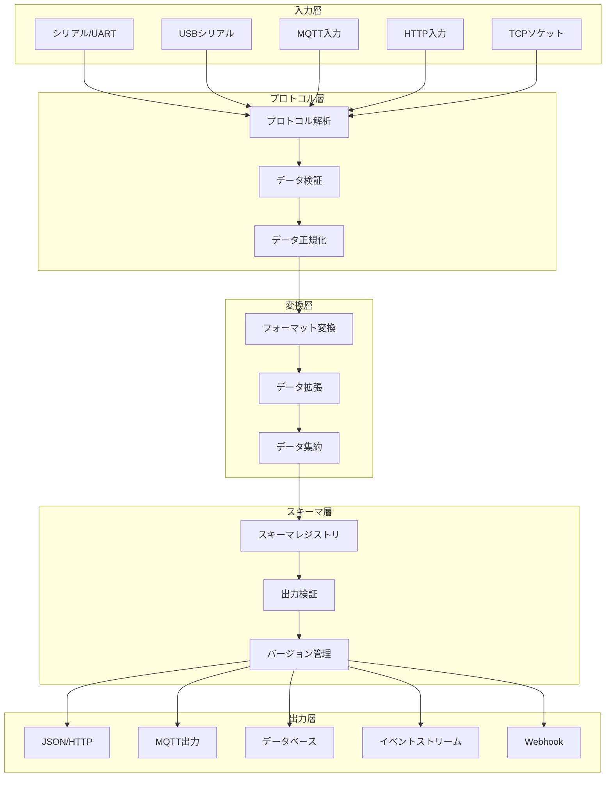

# データ変換アーキテクチャ設計書

*BravePI/JIG専用データの汎用化変換システム設計*

## 概要

本設計書は、BravePI/JIG専用バイナリプロトコルを汎用的なJSON形式に変換するデータ変換アーキテクチャの概念設計を定義します。現行システムの密結合構造から、ベンダーニュートラルで拡張可能な疎結合アーキテクチャへの転換を実現します。

## 目次
1. [アーキテクチャ原則](#アーキテクチャ原則)
2. [データフロー設計](#データフロー設計)
3. [変換レイヤー詳細](#変換レイヤー詳細)
4. [プロトコル抽象化](#プロトコル抽象化)
5. [パフォーマンス設計](#パフォーマンス設計)
6. [拡張性設計](#拡張性設計)

## アーキテクチャ原則

### 1. 設計方針

#### コア原則
- **プロトコル非依存**: 特定の通信プロトコルに依存しない設計
- **ベンダー中立**: 特定メーカーの仕様に依存しない実装
- **スキーマ進化対応**: データ構造の変更に柔軟に対応
- **リアルタイム処理**: 低遅延でのデータ変換
- **水平スケーリング**: 負荷に応じた拡張性

#### 品質要求
- 変換レイテンシ: 10ミリ秒以下
- スループット: 毎秒1万メッセージ以上
- 可用性: 99.9%
- データロス: 0%
- スキーマ互換性: 後方互換100%

### 2. レイヤード・アーキテクチャ

## データフロー設計

### 1. 変換パイプライン

#### パイプラインアーキテクチャ

データ変換は以下の5段階のパイプラインで処理されます：

1. **入力段階**: 各種データソースからの生データ受信
2. **プロトコル段階**: プロトコル固有の解析と検証
3. **変換段階**: 標準フォーマットへの変換
4. **スキーマ段階**: スキーマ準拠性の検証
5. **出力段階**: 各種出力先への配信

各段階は独立して動作し、非同期処理により高いスループットを実現します。

### 2. 入力データ分類

#### 入力ソースの種類

**ハードウェア固有**
- BravePI: UART通信によるバイナリデータ
- BraveJIG: USBシリアル通信
- I2C直接接続: 標準I2Cプロトコル
- GPIO: デジタル信号入力

**標準プロトコル**
- MQTT: メッセージングプロトコル
- HTTP: RESTful API
- TCP/UDP: ソケット通信
- シリアル通信: RS-232/RS-485

**将来の拡張**
- Modbus（RTU/TCP）
- LoRaWAN
- Zigbee
- WiFi/Ethernetデバイス

#### データ形式の分類

**バイナリ形式**
- 固定長ヘッダー
- 可変長ペイロード
- エラー検出用チェックサム

**テキスト形式**
- JSON: 構造化データ
- CSV: 表形式データ
- カスタムテキスト形式

**ハイブリッド形式**
- Protocol Buffers
- MessagePack
- CBOR

### 3. 出力データ統一化

#### 統一データモデル

**必須フィールド**
- 一意識別子
- デバイス識別子
- センサータイプ（標準化）
- 測定値
- 単位（SI単位系）
- タイムスタンプ（ISO 8601形式）

**品質管理フィールド**
- データ品質（良好/不確実/不良）
- 信頼度（0.0〜1.0）
- 精度情報

**メタデータフィールド**
- ソース情報（デバイスタイプ、バージョン）
- 地理的位置情報（オプション）

**処理情報フィールド**
- 変換時刻
- 処理遅延
- パイプラインバージョン

**拡張フィールド**
- カスタムデータ用の柔軟な領域

#### 標準センサータイプ

**物理量センサー**
- 温度、湿度、気圧、照度

**運動センサー**
- 加速度、ジャイロスコープ、磁力計、距離

**電気センサー**
- 電圧、電流、電力

**デジタル信号**
- デジタル入力、デジタル出力、接点

**複合センサー**
- 位置、方向、環境

## 変換レイヤー詳細

### 1. プロトコルパーサー

#### プロトコル解析の概念

プロトコルパーサーは、各種デバイスから受信した生データを統一的なフレーム構造に変換する役割を担います。

**解析済みフレームの構成要素**
- プロトコルバージョン
- メッセージタイプ
- デバイスID
- センサータイプ
- タイムスタンプ
- ペイロード（実データ）
- メタデータ

**プロトコルパーサーの責務**
1. データフォーマットの識別
2. フレーム構造の解析
3. データ整合性の検証

#### BravePI専用プロトコルの特徴

- 固定長ヘッダー（18バイト）
- プロトコル識別子による判定
- センサータイプの標準形式へのマッピング
- タイムスタンプの妥当性検証

#### 汎用プロトコルのサポート

- JSON形式の自動認識
- 柔軟なデータ構造への対応
- 標準フィールドの抽出

### 2. データ変換器

#### データ変換の役割

データ変換器は、解析されたフレームデータを統一的なセンサーデータ形式に変換します。

**変換処理の流れ**
1. センサー値の抽出
2. 単位の標準化
3. データ品質の評価
4. 信頼度の計算
5. メタデータの付与

#### センサータイプ別の変換ロジック

**デジタル信号**
- 接点入力/出力: ブール値への変換

**アナログ信号**
- ADC: ミリボルト単位への変換
- 測距: ミリメートル単位への変換
- 温度: 摂氏温度への変換

**複合データ**
- 加速度: 3軸データと合成値の計算
- 温湿度: 複数パラメータの同時変換

#### データ品質評価基準

1. **データの有効性**: 値が正常に取得できているか
2. **タイムスタンプの新鮮度**: データの鮮度による品質判定
3. **センサー固有の基準**: 各センサーの特性に応じた評価

#### マルチプロトコル対応

- プロトコルタイプに応じた変換器の動的選択
- 新規プロトコルの追加が容易な設計
- 共通インターフェースによる統一的な処理

### 3. データエンリッチャー

#### データエンリッチメントの概念

データエンリッチャーは、基本的なセンサーデータに付加価値を提供する処理を行います。

**主要な機能**

1. **位置情報の付加**
   - デバイスIDから物理的位置を解決
   - GPS座標、建物、フロア、部屋情報の追加

2. **較正処理**
   - センサー固有の較正パラメータ適用
   - 線形較正（スケールとオフセット）
   - 複数値データの同時較正

3. **統計情報の追加**
   - 移動平均の計算
   - 標準偏差の算出
   - 最小値・最大値の記録
   - 異常スコアの計算
   - トレンド分析

#### 位置情報解決の仕組み

- デバイスIDと物理位置のマッピング管理
- 階層的な位置情報（建物→フロア→部屋）
- 動的な位置更新への対応

#### センサー較正の重要性

- 製造誤差の補正
- 経年劣化への対応
- 環境要因の補償
- 較正履歴の管理

#### リアルタイム分析

- ストリーミングデータの統計処理
- 異常値検出アルゴリズム
- トレンド分析による予測

## プロトコル抽象化

### 1. プロトコル検出器

#### 自動プロトコル検出の仕組み

プロトコル検出器は、受信したデータのフォーマットを自動的に識別し、適切なパーサーを選択します。

**検出プロセス**
1. 登録されたパーサーを順次評価
2. データフォーマットの特徴を識別
3. 対応するパーサーを返却

**サポートプロトコル**
- BravePI専用プロトコル
- BraveJIG専用プロトコル
- 汎用JSON形式
- Modbus RTU
- 拡張可能な設計

#### プロトコルルーティング

**ルーティングの流れ**
1. プロトコルの自動検出
2. データフレームの解析
3. フレームデータの検証
4. 統一形式への変換
5. データエンリッチメント

**エラーハンドリング**
- 未知のプロトコルの検出
- 不正なフレームデータの処理
- 変換エラーの適切な処理

### 2. スキーマレジストリ

#### スキーマ管理の重要性

スキーマレジストリは、データ構造の一貫性を保証し、バージョン管理を行うシステムです。

**主要機能**

1. **スキーマ定義の管理**
   - 必須フィールドの定義
   - データ型の制約
   - 値の範囲制限
   - フォーマット仕様

2. **バージョン管理**
   - 複数バージョンの並行サポート
   - バージョン間の移行支援
   - 現行バージョンの追跡

3. **検証機能**
   - データのスキーマ準拠性チェック
   - エラーの詳細な報告
   - バリデーション結果の返却

4. **スキーマ進化**
   - 新バージョンの追加
   - 後方互換性の確保
   - 段階的な移行サポート

#### スキーマ定義の構造

**必須フィールド**
- ID、デバイスID、センサータイプ
- 測定値、単位、タイムスタンプ

**オプションフィールド**
- 品質情報、信頼度
- ソース情報、処理情報
- 拡張フィールド

## パフォーマンス設計

### 1. 非同期処理アーキテクチャ

#### 並行処理の設計思想

非同期処理により、高いスループットと低レイテンシを実現します。

**アーキテクチャの特徴**

1. **ワーカープール方式**
   - 複数のワーカーによる並行処理
   - 負荷分散の自動化
   - スケーラブルな処理能力

2. **キューベースの処理**
   - 入力キューと出力キューの分離
   - バックプレッシャー制御
   - 処理の非同期化

3. **エラー処理**
   - ワーカー単位のエラー隔離
   - 自動リトライ機構
   - エラーログの詳細記録

4. **パフォーマンス計測**
   - 処理時間の自動記録
   - ワーカー別の統計情報
   - ボトルネックの特定

#### 処理フローの最適化

- 非ブロッキングI/O
- コルーチンベースの処理
- リソースの効率的な利用

### 2. バッチ処理最適化

#### バッチ処理の設計原則

バッチ処理により、I/O効率を最大化し、システム全体のスループットを向上させます。

**バッチ処理の特徴**

1. **動的バッチサイズ**
   - データ量に基づく自動調整
   - 時間ベースのフラッシュ
   - 最適なバッチサイズの維持

2. **並行出力**
   - 複数の出力先への同時書き込み
   - 非同期I/Oの活用
   - エラーの独立処理

3. **バッファ管理**
   - メモリ効率的なバッファリング
   - オーバーフロー防止
   - 適切なバックプレッシャー

#### キャッシュ戦略

**キャッシュの役割**
- 頻繁にアクセスされるデータの高速化
- ネットワーク遅延の削減
- システム負荷の軽減

**キャッシュ管理機能**
- TTL（Time To Live）ベースの自動削除
- パターンマッチによる選択的無効化
- メモリ使用量の制御

### 3. 監視・メトリクス

#### パフォーマンス監視の重要性

システムの健全性を維持し、問題を早期に発見するための包括的な監視システムです。

**収集するメトリクス**

1. **処理統計**
   - 総メッセージ数
   - 成功/失敗の変換数
   - エラー種別の分類

2. **レイテンシ分析**
   - 平均処理時間
   - 最大/最小レイテンシ
   - レイテンシ分布

3. **スループット測定**
   - 毎秒処理メッセージ数
   - ピーク処理能力
   - 処理効率

#### メトリクス収集の仕組み

**スライディングウィンドウ方式**
- 最新のN件のデータを保持
- リアルタイムの統計計算
- メモリ効率的な実装

**エラー分析**
- エラータイプ別の集計
- エラー頻度の追跡
- トラブルシューティング支援

**非同期収集**
- パフォーマンスへの影響最小化
- スレッドセーフな実装
- 高精度なタイミング測定

## 拡張性設計

### 1. プラグインアーキテクチャ

#### プラグインシステムの設計思想

新しいデバイスやプロトコルを容易に追加できる拡張可能なアーキテクチャです。

**プラグインの構成要素**

1. **プラグインインターフェース**
   - 名前とバージョンの定義
   - パーサーの提供
   - 変換器の提供

2. **プラグイン管理**
   - 動的なプラグイン登録
   - ファイルからの自動ロード
   - 依存関係の解決

3. **プラグイン実装例**
   - ESP32デバイスサポート
   - カスタムプロトコル対応
   - 独自センサーの統合

#### 拡張のメリット

**開発効率**
- 既存コードの変更不要
- 独立した開発とテスト
- 段階的な機能追加

**保守性**
- モジュール単位の更新
- バージョン管理の簡素化
- 問題の局所化

**柔軟性**
- 顧客固有の要件対応
- 実験的機能の追加
- 迅速なプロトタイピング

### 2. 設定管理システム

#### 階層的な設定構造

設定管理システムは、システム全体の動作を制御する中心的な役割を果たします。

**設定カテゴリ**

1. **プロトコル設定**
   - 有効/無効の切り替え
   - タイムアウト値
   - リトライ回数

2. **変換設定**
   - 品質しきい値
   - 信頼度しきい値
   - 最大レイテンシ

3. **出力設定**
   - 出力先の有効化
   - バッチサイズ
   - 接続パラメータ

4. **キャッシュ設定**
   - TTL（有効期限）
   - 最大サイズ
   - 削除ポリシー

5. **監視設定**
   - メトリクス収集
   - ログレベル
   - パフォーマンス追跡

#### 動的設定管理

**主要機能**
- ドット記法による階層アクセス
- デフォルト値のサポート
- 設定変更の監視
- ホットリロード対応

**利点**
- 再起動不要な設定変更
- 環境別の設定管理
- 設定の一元化

---

## 文書メタデータ

**文書タイトル**: データ変換アーキテクチャ設計書  
**作成日付**: 2025年6月6日  
**対象システム**: BravePI/JIG データ変換システム  
**アーキテクチャレベル**: データ変換・プロトコル抽象化  
**文書レベル**: アーキテクチャ概念設計