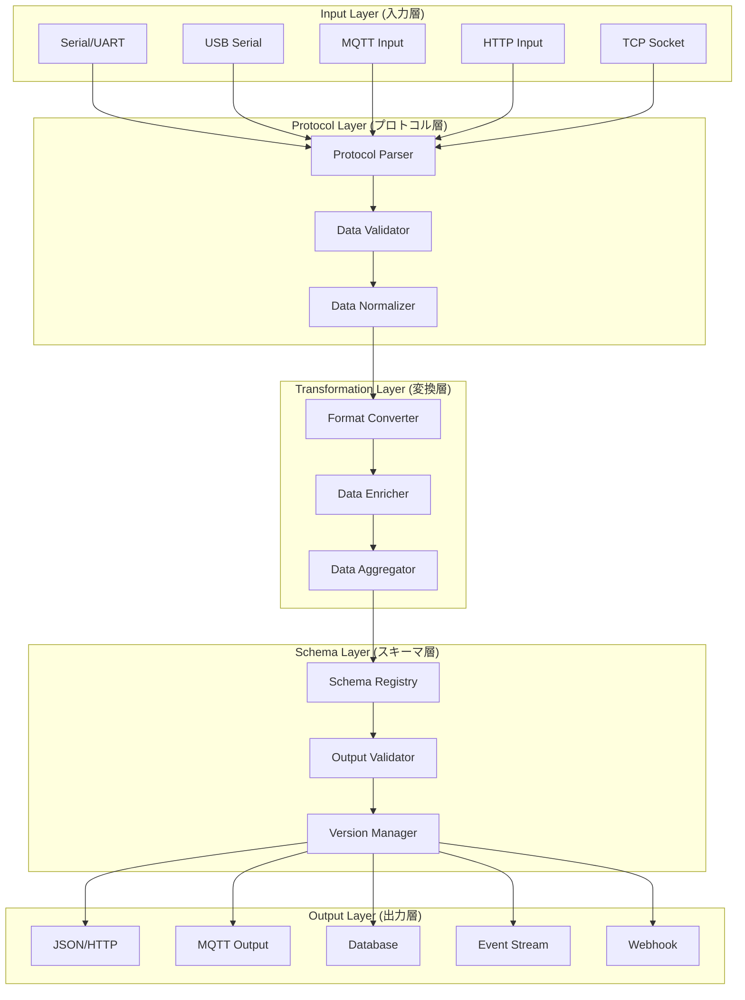

# データ変換アーキテクチャ設計書

*BravePI/JIG専用データの汎用化変換システム設計*

## 概要

本設計書は、BravePI/JIG専用バイナリプロトコルを汎用的なJSON形式に変換するデータ変換アーキテクチャの詳細仕様を定義します。現行システムの1017ノードによる密結合構造から、ベンダーニュートラルで拡張可能な疎結合アーキテクチャへの転換を実現します。

## 目次
1. [アーキテクチャ原則](#アーキテクチャ原則)
2. [データフロー設計](#データフロー設計)
3. [変換レイヤー詳細](#変換レイヤー詳細)
4. [プロトコル抽象化](#プロトコル抽象化)
5. [パフォーマンス設計](#パフォーマンス設計)
6. [拡張性設計](#拡張性設計)

## アーキテクチャ原則

### 1. 設計方針

```yaml
コア原則:
  1. Protocol Agnostic: プロトコル非依存
  2. Vendor Neutral: ベンダー中立
  3. Schema Evolution: スキーマ進化対応
  4. Real-time Processing: リアルタイム処理
  5. Horizontal Scaling: 水平スケーリング

品質要求:
  - 変換レイテンシ: <10ms
  - スループット: >10,000 messages/sec
  - 可用性: 99.9%
  - データロス: 0%
  - スキーマ互換性: 後方互換100%
```

### 2. レイヤード・アーキテクチャ



## データフロー設計

### 1. 変換パイプライン

```python
# データ変換パイプライン概念設計
class DataTransformationPipeline:
    """
    データ変換パイプライン
    Input → Protocol → Transform → Schema → Output
    """
    
    def __init__(self):
        self.input_handlers = {}      # 入力ハンドラー
        self.protocol_parsers = {}    # プロトコル解析器
        self.transformers = {}        # データ変換器
        self.schema_registry = {}     # スキーマレジストリ
        self.output_adapters = {}     # 出力アダプター
        
        self.pipeline_stages = [
            self.input_stage,
            self.protocol_stage,
            self.transformation_stage,
            self.schema_stage,
            self.output_stage
        ]
    
    async def process(self, input_data: bytes, source_type: str) -> Dict[str, Any]:
        """データ変換パイプライン実行"""
        context = TransformationContext(
            raw_data=input_data,
            source_type=source_type,
            timestamp=datetime.utcnow()
        )
        
        # パイプライン段階的実行
        for stage in self.pipeline_stages:
            context = await stage(context)
            
        return context.output_data
```

### 2. 入力データ分類

```yaml
# 入力データタイプ分類
Input Sources:
  Hardware Specific:
    - BravePI: UART 38400baud バイナリ
    - BraveJIG: USB Serial バイナリ
    - I2C Direct: 標準I2Cプロトコル
    - GPIO: デジタル信号
    
  Standard Protocols:
    - MQTT: JSON/バイナリメッセージ
    - HTTP: REST/JSON
    - TCP/UDP: カスタムプロトコル
    - Serial: RS-232/RS-485
    
  Future Extensions:
    - Modbus RTU/TCP
    - LoRaWAN
    - Zigbee
    - WiFi/Ethernet デバイス

# データ形式分類
Data Formats:
  Binary:
    - Fixed Header: 16-18 bytes
    - Variable Payload: 0-1024 bytes
    - CRC/Checksum: 2-4 bytes
    
  Text:
    - JSON: 標準構造化データ
    - CSV: シンプルセンサーデータ
    - Custom: 独自テキスト形式
    
  Hybrid:
    - Protocol Buffers
    - MessagePack
    - CBOR
```

### 3. 出力データ統一化

```typescript
// 統一出力データスキーマ
interface UniversalSensorData {
  // Core Fields (必須)
  id: string;                    // 一意識別子
  deviceId: string;              // デバイス識別子
  sensorType: string;            // センサータイプ（標準化）
  value: number | boolean | object; // 測定値
  unit: string;                  // 単位（SI単位系）
  timestamp: string;             // ISO 8601形式
  
  // Quality Fields (品質管理)
  quality: 'good' | 'uncertain' | 'bad';
  confidence: number;            // 0.0-1.0
  accuracy?: number;             // 精度情報
  
  // Metadata Fields (メタデータ)
  source: {
    type: string;                // 'bravepi', 'esp32', etc.
    version: string;             // プロトコルバージョン
    location?: GeoLocation;      // 地理的位置
  };
  
  // Processing Fields (処理情報)
  processing: {
    transformedAt: string;       // 変換時刻
    latency: number;             // 処理遅延(ms)
    pipelineVersion: string;     // パイプラインバージョン
  };
  
  // Extensions (拡張フィールド)
  extensions?: Record<string, any>;
}

// センサータイプ標準化
enum StandardSensorType {
  // 物理量センサー
  TEMPERATURE = 'temperature',
  HUMIDITY = 'humidity',
  PRESSURE = 'pressure',
  ILLUMINANCE = 'illuminance',
  
  // 運動センサー
  ACCELERATION = 'acceleration',
  GYROSCOPE = 'gyroscope',
  MAGNETOMETER = 'magnetometer',
  DISTANCE = 'distance',
  
  // 電気センサー
  VOLTAGE = 'voltage',
  CURRENT = 'current',
  POWER = 'power',
  
  // デジタル信号
  DIGITAL_INPUT = 'digital_input',
  DIGITAL_OUTPUT = 'digital_output',
  CONTACT = 'contact',
  
  // 複合センサー
  POSITION = 'position',
  ORIENTATION = 'orientation',
  ENVIRONMENT = 'environment'
}
```

## 変換レイヤー詳細

### 1. プロトコルパーサー

```python
from abc import ABC, abstractmethod
from typing import Dict, Any, Optional, List
import struct
from dataclasses import dataclass
from datetime import datetime

@dataclass
class ParsedFrame:
    """解析済みフレームデータ"""
    protocol_version: int
    message_type: int
    device_id: str
    sensor_type: str
    timestamp: datetime
    payload: bytes
    metadata: Dict[str, Any]

class ProtocolParser(ABC):
    """プロトコル解析器基底クラス"""
    
    @abstractmethod
    def supports(self, data: bytes) -> bool:
        """このパーサーがデータをサポートするか判定"""
        pass
    
    @abstractmethod
    def parse(self, data: bytes) -> ParsedFrame:
        """データを解析してフレーム構造を抽出"""
        pass
    
    @abstractmethod
    def validate(self, frame: ParsedFrame) -> bool:
        """フレームデータの整合性を検証"""
        pass

class BravePIProtocolParser(ProtocolParser):
    """BravePI専用プロトコル解析器"""
    
    PROTOCOL_SIGNATURE = b'\x01'  # BravePIプロトコル識別子
    HEADER_SIZE = 18
    
    def supports(self, data: bytes) -> bool:
        """BravePIデータかどうか判定"""
        return (len(data) >= self.HEADER_SIZE and 
                data[0:1] == self.PROTOCOL_SIGNATURE)
    
    def parse(self, data: bytes) -> ParsedFrame:
        """BravePIバイナリフレーム解析"""
        if not self.supports(data):
            raise ValueError("Unsupported protocol format")
        
        # ヘッダー解析
        protocol = data[0]
        msg_type = data[1]
        payload_length = struct.unpack('<H', data[2:4])[0]
        timestamp_raw = struct.unpack('<I', data[4:8])[0]
        device_number = struct.unpack('<Q', data[8:16])[0]
        sensor_type_raw = struct.unpack('<H', data[16:18])[0]
        
        # ペイロード抽出
        payload = data[18:18+payload_length] if len(data) > 18 else b''
        
        return ParsedFrame(
            protocol_version=protocol,
            message_type=msg_type,
            device_id=f"bravepi-{device_number:08x}",
            sensor_type=self._map_sensor_type(sensor_type_raw),
            timestamp=datetime.fromtimestamp(timestamp_raw),
            payload=payload,
            metadata={
                'raw_sensor_type': sensor_type_raw,
                'payload_length': payload_length,
                'parser': 'bravepi-v1'
            }
        )
    
    def validate(self, frame: ParsedFrame) -> bool:
        """フレーム整合性検証"""
        # タイムスタンプ妥当性
        now = datetime.utcnow()
        time_diff = abs((now - frame.timestamp).total_seconds())
        if time_diff > 3600:  # 1時間以上の差は異常
            return False
        
        # センサータイプ妥当性
        if not frame.sensor_type or frame.sensor_type == 'unknown':
            return False
            
        return True
    
    def _map_sensor_type(self, raw_type: int) -> str:
        """BravePI固有センサータイプを標準形式にマッピング"""
        mapping = {
            257: StandardSensorType.DIGITAL_INPUT,
            258: StandardSensorType.DIGITAL_OUTPUT,
            259: StandardSensorType.VOLTAGE,
            260: StandardSensorType.DISTANCE,
            261: StandardSensorType.TEMPERATURE,
            262: StandardSensorType.ACCELERATION,
            263: StandardSensorType.PRESSURE,
            264: StandardSensorType.ILLUMINANCE,
            # JIG拡張
            289: StandardSensorType.ILLUMINANCE,
            290: StandardSensorType.ACCELERATION,
            291: StandardSensorType.ENVIRONMENT,  # 温湿度複合
            292: StandardSensorType.PRESSURE,
            293: StandardSensorType.DISTANCE,
        }
        return mapping.get(raw_type, 'unknown')

class GenericJSONParser(ProtocolParser):
    """汎用JSON形式パーサー"""
    
    def supports(self, data: bytes) -> bool:
        """JSON形式かどうか判定"""
        try:
            json.loads(data.decode('utf-8'))
            return True
        except (json.JSONDecodeError, UnicodeDecodeError):
            return False
    
    def parse(self, data: bytes) -> ParsedFrame:
        """JSON形式データ解析"""
        try:
            json_data = json.loads(data.decode('utf-8'))
            
            return ParsedFrame(
                protocol_version=1,
                message_type=0,
                device_id=json_data.get('deviceId', 'unknown'),
                sensor_type=json_data.get('sensorType', 'unknown'),
                timestamp=datetime.fromisoformat(
                    json_data.get('timestamp', datetime.utcnow().isoformat())
                ),
                payload=json.dumps(json_data.get('data', {})).encode(),
                metadata={
                    'format': 'json',
                    'parser': 'generic-json-v1'
                }
            )
        except Exception as e:
            raise ValueError(f"JSON parsing failed: {e}")
    
    def validate(self, frame: ParsedFrame) -> bool:
        """JSON フレーム検証"""
        return frame.device_id != 'unknown' and frame.sensor_type != 'unknown'
```

### 2. データ変換器

```python
class DataTransformer(ABC):
    """データ変換器基底クラス"""
    
    @abstractmethod
    def transform(self, frame: ParsedFrame) -> UniversalSensorData:
        """フレームデータを統一形式に変換"""
        pass

class BravePITransformer(DataTransformer):
    """BravePI専用データ変換器"""
    
    def transform(self, frame: ParsedFrame) -> UniversalSensorData:
        """BravePIフレームを統一形式に変換"""
        # センサー値抽出
        value, unit = self._extract_sensor_value(
            frame.metadata['raw_sensor_type'], 
            frame.payload
        )
        
        # 品質評価
        quality = self._assess_quality(frame, value)
        
        return UniversalSensorData(
            id=f"{frame.device_id}-{frame.sensor_type}-{int(frame.timestamp.timestamp())}",
            deviceId=frame.device_id,
            sensorType=frame.sensor_type,
            value=value,
            unit=unit,
            timestamp=frame.timestamp.isoformat(),
            quality=quality,
            confidence=self._calculate_confidence(frame, value),
            source={
                'type': 'bravepi',
                'version': f"v{frame.protocol_version}",
                'parser': frame.metadata['parser']
            },
            processing={
                'transformedAt': datetime.utcnow().isoformat(),
                'latency': 0,  # 後で計算
                'pipelineVersion': '1.0.0'
            }
        )
    
    def _extract_sensor_value(self, sensor_type: int, payload: bytes) -> tuple:
        """センサータイプ別値抽出"""
        if sensor_type in [257, 258]:  # 接点入力/出力
            return bool(payload[0]) if payload else False, ""
        
        elif sensor_type in [259]:  # ADC
            if len(payload) >= 4:
                value = struct.unpack('<f', payload[:4])[0]
                return round(value, 3), "mV"
        
        elif sensor_type in [260, 293]:  # 測距
            if len(payload) >= 4:
                value = struct.unpack('<f', payload[:4])[0]
                return round(value, 2), "mm"
        
        elif sensor_type in [261]:  # 温度
            if len(payload) >= 4:
                value = struct.unpack('<f', payload[:4])[0]
                return round(value, 2), "℃"
        
        elif sensor_type in [262, 290]:  # 加速度
            if len(payload) >= 12:
                x = struct.unpack('<f', payload[0:4])[0]
                y = struct.unpack('<f', payload[4:8])[0]
                z = struct.unpack('<f', payload[8:12])[0]
                composite = (x**2 + y**2 + z**2) ** 0.5
                
                return {
                    'x': round(x, 3),
                    'y': round(y, 3),
                    'z': round(z, 3),
                    'magnitude': round(composite, 3)
                }, "G"
        
        elif sensor_type in [291]:  # 温湿度
            if len(payload) >= 8:
                temp = struct.unpack('<f', payload[0:4])[0]
                humidity = struct.unpack('<f', payload[4:8])[0]
                return {
                    'temperature': round(temp, 2),
                    'humidity': round(humidity, 1)
                }, "℃/%"
        
        return None, ""
    
    def _assess_quality(self, frame: ParsedFrame, value: Any) -> str:
        """データ品質評価"""
        if value is None:
            return 'bad'
        
        # タイムスタンプ新鮮度
        age = (datetime.utcnow() - frame.timestamp).total_seconds()
        if age > 300:  # 5分以上古い
            return 'uncertain'
        
        # TODO: センサー固有の品質判定ロジック
        
        return 'good'
    
    def _calculate_confidence(self, frame: ParsedFrame, value: Any) -> float:
        """信頼度計算"""
        confidence = 1.0
        
        # タイムスタンプ新鮮度による減点
        age = (datetime.utcnow() - frame.timestamp).total_seconds()
        if age > 60:
            confidence *= max(0.5, 1.0 - age / 3600)
        
        # データ妥当性による減点
        if value is None:
            confidence = 0.0
        
        return round(confidence, 3)

class MultiProtocolTransformer(DataTransformer):
    """マルチプロトコル対応変換器"""
    
    def __init__(self):
        self.transformers = {
            'bravepi': BravePITransformer(),
            'json': GenericJSONTransformer(),
            # 他のプロトコル変換器も登録
        }
    
    def transform(self, frame: ParsedFrame) -> UniversalSensorData:
        """プロトコルタイプに応じた変換器を選択"""
        parser_type = frame.metadata.get('parser', '').split('-')[0]
        
        transformer = self.transformers.get(parser_type)
        if not transformer:
            raise ValueError(f"No transformer for parser: {parser_type}")
        
        return transformer.transform(frame)
```

### 3. データエンリッチャー

```python
class DataEnricher:
    """データ付加価値向上処理"""
    
    def __init__(self):
        self.location_resolver = LocationResolver()
        self.calibration_manager = CalibrationManager()
        self.analytics_engine = AnalyticsEngine()
    
    async def enrich(self, data: UniversalSensorData) -> UniversalSensorData:
        """データエンリッチメント処理"""
        # 位置情報付加
        if location := await self.location_resolver.resolve(data.deviceId):
            data.source['location'] = location
        
        # 較正処理
        if calibrated_value := self.calibration_manager.calibrate(
            data.deviceId, data.sensorType, data.value
        ):
            data.extensions = data.extensions or {}
            data.extensions['calibrated_value'] = calibrated_value
        
        # 統計情報付加
        stats = await self.analytics_engine.calculate_stats(
            data.deviceId, data.sensorType, data.value
        )
        if stats:
            data.extensions = data.extensions or {}
            data.extensions['statistics'] = stats
        
        return data

class LocationResolver:
    """デバイス位置情報解決"""
    
    async def resolve(self, device_id: str) -> Optional[Dict[str, float]]:
        """デバイスIDから位置情報を取得"""
        # データベースまたは設定から位置情報取得
        # 実装例: GPS座標、建物・フロア情報等
        return {
            'latitude': 33.606389,  # 福岡県工業技術センター
            'longitude': 130.418056,
            'altitude': 10.0,
            'building': 'FITC',
            'floor': 1,
            'room': 'Lab-A'
        }

class CalibrationManager:
    """センサー較正管理"""
    
    def calibrate(self, device_id: str, sensor_type: str, raw_value: Any) -> Any:
        """センサー較正処理"""
        calibration = self._get_calibration_params(device_id, sensor_type)
        if not calibration:
            return None
        
        if isinstance(raw_value, (int, float)):
            # 線形較正: y = ax + b
            return raw_value * calibration['scale'] + calibration['offset']
        
        elif isinstance(raw_value, dict):
            # 複数値の較正
            calibrated = {}
            for key, value in raw_value.items():
                if isinstance(value, (int, float)):
                    cal_params = calibration.get(key, {'scale': 1.0, 'offset': 0.0})
                    calibrated[key] = value * cal_params['scale'] + cal_params['offset']
            return calibrated
        
        return None
    
    def _get_calibration_params(self, device_id: str, sensor_type: str) -> Dict:
        """較正パラメータ取得"""
        # データベースから較正パラメータを取得
        # 実装例: デバイス・センサー固有の較正係数
        return {
            'scale': 1.0,
            'offset': 0.0,
            'last_calibrated': '2025-01-01T00:00:00Z'
        }

class AnalyticsEngine:
    """リアルタイム分析エンジン"""
    
    async def calculate_stats(
        self, 
        device_id: str, 
        sensor_type: str, 
        value: Any
    ) -> Optional[Dict[str, Any]]:
        """統計情報計算"""
        # 過去データから統計情報を計算
        # 実装例: 移動平均、標準偏差、異常検知等
        return {
            'moving_average_1h': 25.2,
            'std_deviation_1h': 1.5,
            'min_24h': 18.5,
            'max_24h': 32.1,
            'anomaly_score': 0.1,
            'trend': 'stable'
        }
```

## プロトコル抽象化

### 1. プロトコル検出器

```python
class ProtocolDetector:
    """プロトコル自動検出システム"""
    
    def __init__(self):
        self.parsers: List[ProtocolParser] = [
            BravePIProtocolParser(),
            BraveJIGProtocolParser(),
            GenericJSONParser(),
            ModbusRTUParser(),
            # 他のプロトコルパーサー
        ]
    
    def detect(self, data: bytes) -> Optional[ProtocolParser]:
        """データからプロトコルタイプを検出"""
        for parser in self.parsers:
            if parser.supports(data):
                return parser
        return None
    
    def register_parser(self, parser: ProtocolParser) -> None:
        """新しいプロトコルパーサーを登録"""
        self.parsers.append(parser)

class ProtocolRouter:
    """プロトコル別ルーティング"""
    
    def __init__(self):
        self.detector = ProtocolDetector()
        self.transformer = MultiProtocolTransformer()
        self.enricher = DataEnricher()
    
    async def route(self, raw_data: bytes, source_info: Dict) -> UniversalSensorData:
        """データを適切なパーサー・変換器にルーティング"""
        # プロトコル検出
        parser = self.detector.detect(raw_data)
        if not parser:
            raise ValueError("Unknown protocol")
        
        # フレーム解析
        frame = parser.parse(raw_data)
        
        # 検証
        if not parser.validate(frame):
            raise ValueError("Invalid frame data")
        
        # 変換
        universal_data = self.transformer.transform(frame)
        
        # エンリッチメント
        enriched_data = await self.enricher.enrich(universal_data)
        
        return enriched_data
```

### 2. スキーマレジストリ

```python
import jsonschema
from typing import Dict, Any

class SchemaRegistry:
    """スキーマバージョン管理・検証システム"""
    
    def __init__(self):
        self.schemas: Dict[str, Dict[str, Any]] = {}
        self.current_version = "1.0.0"
        self._load_schemas()
    
    def _load_schemas(self):
        """スキーマ定義読み込み"""
        self.schemas = {
            "1.0.0": {
                "type": "object",
                "required": ["id", "deviceId", "sensorType", "value", "unit", "timestamp"],
                "properties": {
                    "id": {"type": "string"},
                    "deviceId": {"type": "string"},
                    "sensorType": {"type": "string"},
                    "value": {"oneOf": [
                        {"type": "number"},
                        {"type": "boolean"},
                        {"type": "object"}
                    ]},
                    "unit": {"type": "string"},
                    "timestamp": {"type": "string", "format": "date-time"},
                    "quality": {"type": "string", "enum": ["good", "uncertain", "bad"]},
                    "confidence": {"type": "number", "minimum": 0, "maximum": 1},
                    "source": {"type": "object"},
                    "processing": {"type": "object"},
                    "extensions": {"type": "object"}
                }
            }
        }
    
    def validate(self, data: Dict[str, Any], version: str = None) -> bool:
        """データがスキーマに準拠しているか検証"""
        version = version or self.current_version
        schema = self.schemas.get(version)
        
        if not schema:
            raise ValueError(f"Unknown schema version: {version}")
        
        try:
            jsonschema.validate(data, schema)
            return True
        except jsonschema.ValidationError:
            return False
    
    def evolve_schema(self, new_version: str, schema: Dict[str, Any]):
        """スキーマ進化・新バージョン追加"""
        self.schemas[new_version] = schema
        # 後方互換性チェック
        self._check_compatibility(new_version)
    
    def _check_compatibility(self, new_version: str):
        """後方互換性チェック"""
        # TODO: スキーマ互換性検証ロジック実装
        pass
```

## パフォーマンス設計

### 1. 非同期処理アーキテクチャ

```python
import asyncio
from asyncio import Queue
from typing import AsyncIterator
import aiofiles

class AsyncDataProcessor:
    """非同期データ処理システム"""
    
    def __init__(self, max_workers: int = 10):
        self.input_queue: Queue = Queue()
        self.output_queue: Queue = Queue()
        self.workers: List[asyncio.Task] = []
        self.max_workers = max_workers
        self.router = ProtocolRouter()
    
    async def start(self):
        """処理ワーカー開始"""
        for i in range(self.max_workers):
            worker = asyncio.create_task(self._worker(f"worker-{i}"))
            self.workers.append(worker)
    
    async def stop(self):
        """処理ワーカー停止"""
        for worker in self.workers:
            worker.cancel()
        await asyncio.gather(*self.workers, return_exceptions=True)
    
    async def _worker(self, worker_id: str):
        """データ処理ワーカー"""
        while True:
            try:
                # 入力キューからデータ取得
                raw_data, source_info = await self.input_queue.get()
                
                # データ処理
                start_time = asyncio.get_event_loop().time()
                universal_data = await self.router.route(raw_data, source_info)
                processing_time = asyncio.get_event_loop().time() - start_time
                
                # 処理時間記録
                universal_data.processing['latency'] = round(processing_time * 1000, 2)
                universal_data.processing['worker_id'] = worker_id
                
                # 出力キューに結果送信
                await self.output_queue.put(universal_data)
                
                # タスク完了通知
                self.input_queue.task_done()
                
            except asyncio.CancelledError:
                break
            except Exception as e:
                logger.error(f"Worker {worker_id} error: {e}")
                self.input_queue.task_done()
    
    async def process_data(self, raw_data: bytes, source_info: Dict) -> None:
        """データ処理要求"""
        await self.input_queue.put((raw_data, source_info))
    
    async def get_processed_data(self) -> UniversalSensorData:
        """処理済みデータ取得"""
        return await self.output_queue.get()
```

### 2. バッチ処理最適化

```python
class BatchProcessor:
    """バッチ処理最適化システム"""
    
    def __init__(self, batch_size: int = 100, flush_interval: float = 1.0):
        self.batch_size = batch_size
        self.flush_interval = flush_interval
        self.batch: List[UniversalSensorData] = []
        self.last_flush = asyncio.get_event_loop().time()
        self.outputs: List[OutputAdapter] = []
    
    async def add_data(self, data: UniversalSensorData):
        """データをバッチに追加"""
        self.batch.append(data)
        
        # バッチサイズまたは時間でフラッシュ
        current_time = asyncio.get_event_loop().time()
        if (len(self.batch) >= self.batch_size or 
            current_time - self.last_flush >= self.flush_interval):
            await self.flush()
    
    async def flush(self):
        """バッチデータを出力"""
        if not self.batch:
            return
        
        batch_data = self.batch.copy()
        self.batch.clear()
        self.last_flush = asyncio.get_event_loop().time()
        
        # 並行出力
        tasks = []
        for output in self.outputs:
            task = asyncio.create_task(output.write_batch(batch_data))
            tasks.append(task)
        
        await asyncio.gather(*tasks, return_exceptions=True)

class CacheManager:
    """データキャッシュ管理"""
    
    def __init__(self, ttl: int = 300):  # 5分TTL
        self.cache: Dict[str, Any] = {}
        self.ttl = ttl
    
    async def get(self, key: str) -> Optional[Any]:
        """キャッシュからデータ取得"""
        if key in self.cache:
            data, timestamp = self.cache[key]
            if asyncio.get_event_loop().time() - timestamp < self.ttl:
                return data
            else:
                del self.cache[key]
        return None
    
    async def set(self, key: str, value: Any):
        """キャッシュにデータ設定"""
        self.cache[key] = (value, asyncio.get_event_loop().time())
    
    async def invalidate(self, pattern: str):
        """パターンマッチでキャッシュ無効化"""
        keys_to_delete = [key for key in self.cache.keys() if pattern in key]
        for key in keys_to_delete:
            del self.cache[key]
```

### 3. 監視・メトリクス

```python
from dataclasses import dataclass
from collections import defaultdict, deque
import time

@dataclass
class PerformanceMetrics:
    """パフォーマンスメトリクス"""
    total_messages: int = 0
    successful_conversions: int = 0
    failed_conversions: int = 0
    average_latency: float = 0.0
    max_latency: float = 0.0
    min_latency: float = float('inf')
    messages_per_second: float = 0.0
    
class MetricsCollector:
    """メトリクス収集システム"""
    
    def __init__(self, window_size: int = 1000):
        self.window_size = window_size
        self.latencies = deque(maxlen=window_size)
        self.timestamps = deque(maxlen=window_size)
        self.errors_by_type = defaultdict(int)
        self.lock = asyncio.Lock()
    
    async def record_success(self, latency: float):
        """成功メトリクス記録"""
        async with self.lock:
            self.latencies.append(latency)
            self.timestamps.append(time.time())
    
    async def record_error(self, error_type: str):
        """エラーメトリクス記録"""
        async with self.lock:
            self.errors_by_type[error_type] += 1
    
    async def get_metrics(self) -> PerformanceMetrics:
        """現在のメトリクス取得"""
        async with self.lock:
            if not self.latencies:
                return PerformanceMetrics()
            
            # レイテンシ統計
            avg_latency = sum(self.latencies) / len(self.latencies)
            max_latency = max(self.latencies)
            min_latency = min(self.latencies)
            
            # スループット計算
            if len(self.timestamps) >= 2:
                time_span = self.timestamps[-1] - self.timestamps[0]
                mps = len(self.timestamps) / time_span if time_span > 0 else 0
            else:
                mps = 0
            
            return PerformanceMetrics(
                total_messages=len(self.latencies),
                successful_conversions=len(self.latencies),
                failed_conversions=sum(self.errors_by_type.values()),
                average_latency=avg_latency,
                max_latency=max_latency,
                min_latency=min_latency,
                messages_per_second=mps
            )
```

## 拡張性設計

### 1. プラグインアーキテクチャ

```python
from abc import ABC, abstractmethod
import importlib
from typing import Type

class TransformationPlugin(ABC):
    """変換プラグイン基底クラス"""
    
    @property
    @abstractmethod
    def name(self) -> str:
        """プラグイン名"""
        pass
    
    @property
    @abstractmethod
    def version(self) -> str:
        """プラグインバージョン"""
        pass
    
    @abstractmethod
    def get_parser(self) -> ProtocolParser:
        """プロトコルパーサー取得"""
        pass
    
    @abstractmethod
    def get_transformer(self) -> DataTransformer:
        """データ変換器取得"""
        pass

class PluginManager:
    """プラグイン管理システム"""
    
    def __init__(self):
        self.plugins: Dict[str, TransformationPlugin] = {}
        self.protocol_detector = ProtocolDetector()
        self.transformer = MultiProtocolTransformer()
    
    def register_plugin(self, plugin: TransformationPlugin):
        """プラグイン登録"""
        self.plugins[plugin.name] = plugin
        
        # プロトコルパーサー登録
        parser = plugin.get_parser()
        self.protocol_detector.register_parser(parser)
        
        # 変換器登録
        transformer = plugin.get_transformer()
        self.transformer.register_transformer(plugin.name, transformer)
    
    def load_plugin_from_file(self, plugin_path: str):
        """ファイルからプラグイン動的ロード"""
        spec = importlib.util.spec_from_file_location("plugin", plugin_path)
        module = importlib.util.module_from_spec(spec)
        spec.loader.exec_module(module)
        
        # プラグインクラス検索
        for item_name in dir(module):
            item = getattr(module, item_name)
            if (isinstance(item, type) and 
                issubclass(item, TransformationPlugin) and 
                item != TransformationPlugin):
                plugin = item()
                self.register_plugin(plugin)
                break

# プラグイン実装例
class ESP32Plugin(TransformationPlugin):
    """ESP32デバイス対応プラグイン"""
    
    @property
    def name(self) -> str:
        return "esp32"
    
    @property
    def version(self) -> str:
        return "1.0.0"
    
    def get_parser(self) -> ProtocolParser:
        return ESP32ProtocolParser()
    
    def get_transformer(self) -> DataTransformer:
        return ESP32Transformer()

class ESP32ProtocolParser(ProtocolParser):
    """ESP32専用プロトコルパーサー"""
    
    def supports(self, data: bytes) -> bool:
        # ESP32固有のプロトコル識別
        return data.startswith(b'ESP32:')
    
    def parse(self, data: bytes) -> ParsedFrame:
        # ESP32プロトコル解析実装
        pass
    
    def validate(self, frame: ParsedFrame) -> bool:
        # ESP32フレーム検証実装
        pass
```

### 2. 設定管理システム

```yaml
# config/transformation.yaml
transformation:
  version: "1.0.0"
  
  # プロトコル設定
  protocols:
    bravepi:
      enabled: true
      timeout: 5000
      retry_count: 3
      
    bravejig:
      enabled: true
      usb_timeout: 10000
      
    esp32:
      enabled: false
      wifi_timeout: 15000
  
  # 変換設定
  conversion:
    quality_threshold: 0.8
    confidence_threshold: 0.9
    max_latency_ms: 100
    
  # 出力設定
  outputs:
    json_api:
      enabled: true
      batch_size: 100
      flush_interval: 1.0
      
    mqtt:
      enabled: true
      broker: "localhost:1883"
      qos: 1
      
    database:
      enabled: true
      connection: "postgresql://..."
      batch_size: 1000
  
  # キャッシュ設定
  cache:
    enabled: true
    ttl: 300
    max_size: 10000
  
  # 監視設定
  monitoring:
    metrics_enabled: true
    log_level: "INFO"
    performance_tracking: true
```

```python
class ConfigurationManager:
    """設定管理システム"""
    
    def __init__(self, config_path: str = "config/transformation.yaml"):
        self.config_path = config_path
        self.config = self._load_config()
        self.watchers: List[Callable] = []
    
    def _load_config(self) -> Dict[str, Any]:
        """設定ファイル読み込み"""
        with open(self.config_path, 'r') as f:
            return yaml.safe_load(f)
    
    def get(self, key_path: str, default: Any = None) -> Any:
        """設定値取得（ドット記法サポート）"""
        keys = key_path.split('.')
        value = self.config
        
        for key in keys:
            if isinstance(value, dict) and key in value:
                value = value[key]
            else:
                return default
                
        return value
    
    def watch(self, callback: Callable[[Dict[str, Any]], None]):
        """設定変更監視"""
        self.watchers.append(callback)
    
    async def reload(self):
        """設定リロード"""
        new_config = self._load_config()
        old_config = self.config
        self.config = new_config
        
        # 変更通知
        for watcher in self.watchers:
            await watcher(new_config, old_config)
```

---

## 文書メタデータ

**文書タイトル**: データ変換アーキテクチャ設計書  
**作成日付**: 2025年6月6日  
**対象システム**: BravePI/JIG データ変換システム  
**アーキテクチャレベル**: データ変換・プロトコル抽象化  
**実装言語**: Python 3.11+ / TypeScript  
**文書レベル**: アーキテクチャ設計・実装仕様 (★★★)