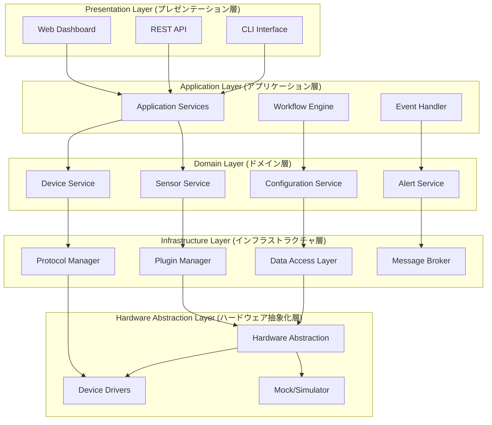

# 疎結合アーキテクチャ設計書

*ベンダーニュートラルIoTプラットフォーム設計仕様*

## 設計概要

本設計書は、IoT導入支援キット次期システムにおける疎結合アーキテクチャの技術仕様を定義します。BravePI/BraveJIG依存を排除し、ハードウェアベンダーに依存しない拡張可能なIoTプラットフォームを実現するためのアーキテクチャ設計・実装方針・技術仕様を詳述します。

## 目次
1. [設計原則](#設計原則)
2. [アーキテクチャ概要](#アーキテクチャ概要)
3. [レイヤー設計詳細](#レイヤー設計詳細)
4. [インターフェース仕様](#インターフェース仕様)
5. [プラグインシステム](#プラグインシステム)
6. [実装仕様](#実装仕様)

## 設計原則

### 1. SOLID原則の適用

#### Single Responsibility Principle (単一責任原則)
```typescript
// ❌ 現状：多責任クラス
class BravePISensor {
  readValue() { /* センサー読み取り */ }
  parseProtocol() { /* プロトコル解析 */ }
  validateData() { /* データ検証 */ }
  saveToDatabase() { /* DB保存 */ }
}

// ✅ 改善：単一責任クラス
class Sensor {
  readValue(): Promise<SensorValue> { /* センサー読み取りのみ */ }
}

class ProtocolParser {
  parse(buffer: Buffer): ParsedData { /* プロトコル解析のみ */ }
}

class DataValidator {
  validate(data: any): ValidationResult { /* データ検証のみ */ }
}
```

#### Open/Closed Principle (開放閉鎖原則)
```typescript
// 拡張に開放、修正に閉鎖
abstract class SensorDriver {
  abstract readValue(): Promise<SensorValue>;
  abstract configure(config: SensorConfig): void;
  
  // 共通処理（修正に閉鎖）
  protected logAccess(): void { /* ログ記録 */ }
  protected validateConfig(config: SensorConfig): boolean { /* 設定検証 */ }
}

// 新しいハードウェアは継承で拡張（既存コード修正不要）
class ESP32SensorDriver extends SensorDriver {
  readValue(): Promise<SensorValue> { /* ESP32固有実装 */ }
  configure(config: SensorConfig): void { /* ESP32固有設定 */ }
}
```

#### Dependency Inversion Principle (依存性逆転原則)
```typescript
// ❌ 現状：具象クラスに依存
class SensorManager {
  private bravePI = new BravePIDevice(); // 具象クラスに依存
  
  readSensor() {
    return this.bravePI.readData(); // BravePI固有メソッド
  }
}

// ✅ 改善：抽象に依存
interface HardwareDevice {
  readData(): Promise<any>;
}

class SensorManager {
  constructor(private device: HardwareDevice) {} // 抽象に依存
  
  readSensor() {
    return this.device.readData(); // 標準インターフェース
  }
}
```

### 2. 疎結合設計パターン

| パターン | 適用箇所 | 疎結合効果 |
|----------|----------|------------|
| **Dependency Injection** | 全レイヤー | 実装の交換可能性 |
| **Observer Pattern** | イベント処理 | 処理の動的追加・削除 |
| **Strategy Pattern** | プロトコル処理 | アルゴリズム交換可能性 |
| **Adapter Pattern** | 既存システム統合 | レガシー互換性 |
| **Plugin Architecture** | 機能拡張 | 動的機能追加 |

## アーキテクチャ概要

### 5層疎結合アーキテクチャ



### レイヤー間通信仕様

| 通信方向 | 方式 | 制約 |
|----------|------|------|
| **上位→下位** | インターフェース呼び出し | 抽象インターフェースのみ |
| **下位→上位** | イベント通知 | Observer/Event Bus |
| **同層間** | メッセージング | MQTT/Event System |
| **外部システム** | API Gateway | REST/GraphQL |

## レイヤー設計詳細

### 1. Hardware Abstraction Layer (HAL)

#### 目的：ハードウェア差異の完全隠蔽

```typescript
// 統一ハードウェアインターフェース
interface HardwareDevice {
  // メタデータ
  getDeviceInfo(): DeviceInfo;
  getCapabilities(): DeviceCapabilities;
  
  // ライフサイクル
  initialize(config: DeviceConfig): Promise<void>;
  shutdown(): Promise<void>;
  reset(): Promise<void>;
  
  // センサー操作
  createSensor(type: SensorType, config: SensorConfig): Promise<Sensor>;
  destroySensor(sensor: Sensor): Promise<void>;
  listSensors(): Promise<Sensor[]>;
  
  // 設定管理
  getConfiguration(): Promise<DeviceConfig>;
  updateConfiguration(config: Partial<DeviceConfig>): Promise<void>;
  
  // 診断・監視
  getHealthStatus(): Promise<HealthStatus>;
  runDiagnostics(): Promise<DiagnosticsResult>;
}

// デバイス情報構造
interface DeviceInfo {
  id: string;
  name: string;
  manufacturer: string;
  model: string;
  firmwareVersion: string;
  hardwareVersion: string;
  supportedProtocols: Protocol[];
}

// デバイス能力定義
interface DeviceCapabilities {
  maxSensors: number;
  supportedSensorTypes: SensorType[];
  communicationMethods: CommunicationMethod[];
  powerManagement: PowerCapabilities;
  dataRates: DataRateCapabilities;
}
```

#### HAL実装例：BravePI Adapter

```typescript
class BravePIAdapter implements HardwareDevice {
  private serialPort: SerialPort;
  private protocolParser: BravePIProtocolParser;
  private sensors: Map<string, BravePISensor> = new Map();
  
  getDeviceInfo(): DeviceInfo {
    return {
      id: this.deviceId,
      name: "BravePI IoT Hub",
      manufacturer: "Fukuoka Industrial Technology Center",
      model: "BravePI v1.0",
      firmwareVersion: "1.2.3",
      hardwareVersion: "1.0",
      supportedProtocols: [Protocol.UART, Protocol.BLE]
    };
  }
  
  async initialize(config: DeviceConfig): Promise<void> {
    // BravePI固有の初期化処理
    this.serialPort = new SerialPort(config.serialPort, {
      baudRate: config.baudRate || 38400
    });
    
    this.protocolParser = new BravePIProtocolParser();
    await this.establishConnection();
  }
  
  async createSensor(type: SensorType, config: SensorConfig): Promise<Sensor> {
    // BravePI固有のセンサー作成
    const sensor = new BravePISensor(type, config, this.protocolParser);
    await sensor.initialize();
    
    this.sensors.set(sensor.getId(), sensor);
    return sensor;
  }
}
```

### 2. Infrastructure Layer

#### Protocol Manager：通信プロトコル抽象化

```typescript
// 統一プロトコルインターフェース
interface ProtocolAdapter {
  getProtocolInfo(): ProtocolInfo;
  
  // 接続管理
  connect(endpoint: string, options?: ConnectionOptions): Promise<Connection>;
  disconnect(connection: Connection): Promise<void>;
  
  // データ送受信
  send(connection: Connection, data: any): Promise<void>;
  receive(connection: Connection): Promise<any>;
  
  // プロトコル固有処理
  encodeMessage(message: Message): Buffer;
  decodeMessage(buffer: Buffer): Message;
  validateMessage(message: Message): ValidationResult;
}

// BravePI専用プロトコルアダプター
class BravePIProtocolAdapter implements ProtocolAdapter {
  getProtocolInfo(): ProtocolInfo {
    return {
      name: "BravePI Binary Protocol",
      version: "1.0",
      transport: "Serial",
      features: ["CRC16", "Binary", "Async"]
    };
  }
  
  encodeMessage(message: Message): Buffer {
    // BravePI固有のバイナリエンコーディング
    const buffer = Buffer.alloc(16 + message.payload.length);
    buffer.writeUInt8(message.protocol, 0);
    buffer.writeUInt8(message.type, 1);
    buffer.writeUInt16LE(message.payload.length, 2);
    buffer.writeUInt32LE(message.timestamp, 4);
    buffer.writeBigUInt64LE(BigInt(message.deviceId), 8);
    message.payload.copy(buffer, 16);
    
    // CRC16チェックサム追加
    const crc = this.calculateCRC16(buffer.slice(0, -2));
    buffer.writeUInt16LE(crc, buffer.length - 2);
    
    return buffer;
  }
  
  decodeMessage(buffer: Buffer): Message {
    // BravePI固有のバイナリデコーディング
    const protocol = buffer.readUInt8(0);
    const type = buffer.readUInt8(1);
    const length = buffer.readUInt16LE(2);
    const timestamp = buffer.readUInt32LE(4);
    const deviceId = buffer.readBigUInt64LE(8).toString();
    const payload = buffer.slice(16, 16 + length);
    
    return {
      protocol,
      type,
      timestamp,
      deviceId,
      payload
    };
  }
}
```

#### Plugin Manager：動的機能拡張

```typescript
// プラグインメタデータ
interface PluginManifest {
  name: string;
  version: string;
  description: string;
  author: string;
  
  // 依存関係
  dependencies: PluginDependency[];
  platforms: Platform[];
  nodeVersion: string;
  
  // 機能定義
  capabilities: PluginCapability[];
  entryPoint: string;
  configSchema: JSONSchema;
}

// プラグイン管理システム
class PluginManager {
  private plugins: Map<string, LoadedPlugin> = new Map();
  private dependencyResolver: DependencyResolver;
  
  async loadPlugin(pluginPath: string): Promise<void> {
    // プラグインマニフェスト読み込み
    const manifest = await this.readManifest(pluginPath);
    
    // 依存関係解決
    await this.dependencyResolver.resolve(manifest.dependencies);
    
    // プラグイン動的ロード
    const pluginModule = await import(path.join(pluginPath, manifest.entryPoint));
    const plugin = new pluginModule.default();
    
    // プラグイン初期化
    await plugin.initialize(this.createContext());
    
    this.plugins.set(manifest.name, {
      manifest,
      instance: plugin,
      loadedAt: new Date()
    });
  }
  
  async unloadPlugin(pluginName: string): Promise<void> {
    const plugin = this.plugins.get(pluginName);
    if (plugin) {
      await plugin.instance.shutdown();
      this.plugins.delete(pluginName);
    }
  }
  
  getPlugin<T>(pluginName: string): T | undefined {
    const plugin = this.plugins.get(pluginName);
    return plugin?.instance as T;
  }
}
```

### 3. Domain Layer

#### Sensor Service：センサー管理の抽象化

```typescript
// ドメインモデル：センサー
class SensorEntity {
  constructor(
    private id: SensorId,
    private type: SensorType,
    private deviceId: DeviceId,
    private config: SensorConfig,
    private metadata: SensorMetadata
  ) {}
  
  // ドメインロジック
  isWithinThreshold(value: number): boolean {
    return value >= this.config.thresholds.min && 
           value <= this.config.thresholds.max;
  }
  
  applyCalibration(rawValue: number): number {
    return rawValue * this.config.calibration.scale + 
           this.config.calibration.offset;
  }
  
  shouldTriggerAlert(value: number): boolean {
    if (this.config.alertRules.enabled) {
      return !this.isWithinThreshold(value);
    }
    return false;
  }
}

// センサーサービス
class SensorService {
  constructor(
    private sensorRepository: SensorRepository,
    private hardwareManager: HardwareManager,
    private eventBus: EventBus
  ) {}
  
  async createSensor(request: CreateSensorRequest): Promise<SensorEntity> {
    // ドメインロジック：センサー作成
    const sensor = SensorEntity.create(request);
    
    // ハードウェア層への委譲
    const hardwareSensor = await this.hardwareManager.createSensor(
      sensor.getType(),
      sensor.getConfig()
    );
    
    // 永続化
    await this.sensorRepository.save(sensor);
    
    // イベント発行
    this.eventBus.publish(new SensorCreatedEvent(sensor));
    
    return sensor;
  }
  
  async readSensorValue(sensorId: SensorId): Promise<SensorValue> {
    const sensor = await this.sensorRepository.findById(sensorId);
    if (!sensor) {
      throw new SensorNotFoundError(sensorId);
    }
    
    // ハードウェア層から生値取得
    const rawValue = await this.hardwareManager.readSensor(sensorId);
    
    // ドメインロジック適用
    const calibratedValue = sensor.applyCalibration(rawValue);
    
    // 閾値チェック
    if (sensor.shouldTriggerAlert(calibratedValue)) {
      this.eventBus.publish(new SensorAlertEvent(sensor, calibratedValue));
    }
    
    return new SensorValue(calibratedValue, new Date(), rawValue);
  }
}
```

## インターフェース仕様

### 1. 統一センサーインターフェース

```typescript
// センサー基底インターフェース
interface Sensor {
  // 識別情報
  getId(): string;
  getType(): SensorType;
  getDeviceId(): string;
  
  // データ読み取り
  readValue(): Promise<SensorValue>;
  readRawValue(): Promise<number>;
  
  // 設定管理
  configure(config: SensorConfig): Promise<void>;
  getConfiguration(): Promise<SensorConfig>;
  
  // ライフサイクル
  initialize(): Promise<void>;
  shutdown(): Promise<void>;
  
  // 状態監視
  getStatus(): Promise<SensorStatus>;
  isHealthy(): Promise<boolean>;
  
  // イベント
  on(event: SensorEvent, callback: EventCallback): void;
  off(event: SensorEvent, callback: EventCallback): void;
}

// センサー値構造
interface SensorValue {
  value: number;
  unit: string;
  timestamp: Date;
  quality: DataQuality;
  metadata?: Record<string, any>;
}

// データ品質指標
enum DataQuality {
  GOOD = "good",
  UNCERTAIN = "uncertain", 
  BAD = "bad",
  MAINTENANCE = "maintenance"
}

// センサー設定構造
interface SensorConfig {
  // 測定設定
  measurementInterval: number;
  samplingRate: number;
  
  // 較正設定
  calibration: {
    enabled: boolean;
    scale: number;
    offset: number;
    polynomialCoefficients?: number[];
  };
  
  // 閾値設定
  thresholds: {
    min: number;
    max: number;
    hysteresisHigh?: number;
    hysteresisLow?: number;
  };
  
  // フィルタ設定
  filtering: {
    enabled: boolean;
    type: FilterType;
    parameters: Record<string, any>;
  };
  
  // アラート設定
  alertRules: {
    enabled: boolean;
    conditions: AlertCondition[];
    actions: AlertAction[];
  };
}
```

### 2. デバイス管理インターフェース

```typescript
// デバイス管理インターフェース
interface DeviceManager {
  // デバイス発見・登録
  discoverDevices(): Promise<DiscoveredDevice[]>;
  registerDevice(device: DeviceRegistrationRequest): Promise<Device>;
  unregisterDevice(deviceId: string): Promise<void>;
  
  // デバイス制御
  getDevice(deviceId: string): Promise<Device>;
  listDevices(filter?: DeviceFilter): Promise<Device[]>;
  updateDevice(deviceId: string, updates: DeviceUpdate): Promise<Device>;
  
  // 設定管理
  getDeviceConfiguration(deviceId: string): Promise<DeviceConfig>;
  updateDeviceConfiguration(deviceId: string, config: DeviceConfig): Promise<void>;
  
  // 監視・診断
  getDeviceHealth(deviceId: string): Promise<DeviceHealth>;
  runDeviceDiagnostics(deviceId: string): Promise<DiagnosticsResult>;
}

// デバイス構造
interface Device {
  id: string;
  name: string;
  type: DeviceType;
  manufacturer: string;
  model: string;
  
  // 接続情報
  connectionInfo: ConnectionInfo;
  status: DeviceStatus;
  lastSeen: Date;
  
  // 機能情報
  capabilities: DeviceCapabilities;
  supportedSensors: SensorType[];
  
  // 設定
  configuration: DeviceConfig;
  
  // 統計
  statistics: DeviceStatistics;
}
```

## プラグインシステム

### 1. プラグインアーキテクチャ

```typescript
// プラグイン基底インターフェース
interface Plugin {
  // メタデータ
  getName(): string;
  getVersion(): string;
  getDescription(): string;
  
  // ライフサイクル
  initialize(context: PluginContext): Promise<void>;
  shutdown(): Promise<void>;
  
  // 機能提供
  getCapabilities(): PluginCapability[];
  handleRequest(request: PluginRequest): Promise<PluginResponse>;
}

// プラグインコンテキスト
interface PluginContext {
  // システムサービス
  getLogger(): Logger;
  getEventBus(): EventBus;
  getConfigManager(): ConfigManager;
  getDataAccess(): DataAccess;
  
  // プラグイン間通信
  callPlugin(pluginName: string, method: string, params: any): Promise<any>;
  subscribeEvent(eventType: string, handler: EventHandler): void;
  publishEvent(event: PluginEvent): void;
}

// ハードウェアプラグイン例
class ESP32Plugin implements Plugin {
  private devices: Map<string, ESP32Device> = new Map();
  
  getName(): string { return "ESP32 Hardware Plugin"; }
  getVersion(): string { return "1.0.0"; }
  
  getCapabilities(): PluginCapability[] {
    return [
      {
        type: "hardware",
        name: "ESP32 Device Support",
        supportedSensors: [
          SensorType.TEMPERATURE,
          SensorType.HUMIDITY,
          SensorType.ANALOG_INPUT
        ]
      }
    ];
  }
  
  async initialize(context: PluginContext): Promise<void> {
    this.context = context;
    
    // ESP32デバイス自動発見
    const discoveredDevices = await this.discoverESP32Devices();
    
    for (const deviceInfo of discoveredDevices) {
      const device = new ESP32Device(deviceInfo);
      await device.initialize();
      this.devices.set(device.getId(), device);
    }
    
    this.context.getLogger().info(`ESP32 Plugin initialized with ${this.devices.size} devices`);
  }
  
  async handleRequest(request: PluginRequest): Promise<PluginResponse> {
    switch (request.method) {
      case "createSensor":
        return await this.createSensor(request.params);
      case "readSensor":
        return await this.readSensor(request.params);
      case "configureSensor":
        return await this.configureSensor(request.params);
      default:
        throw new UnsupportedMethodError(request.method);
    }
  }
}
```

### 2. プラグイン動的ロード機構

```typescript
// プラグインローダー
class PluginLoader {
  private pluginPaths: string[] = [];
  private loadedPlugins: Map<string, LoadedPlugin> = new Map();
  
  async scanPlugins(directory: string): Promise<PluginManifest[]> {
    const pluginDirs = await fs.readdir(directory);
    const manifests: PluginManifest[] = [];
    
    for (const dir of pluginDirs) {
      const manifestPath = path.join(directory, dir, "manifest.json");
      if (await fs.pathExists(manifestPath)) {
        const manifest = await fs.readJson(manifestPath);
        manifests.push(manifest);
      }
    }
    
    return manifests;
  }
  
  async loadPlugin(manifest: PluginManifest, pluginDir: string): Promise<LoadedPlugin> {
    // 依存関係チェック
    await this.validateDependencies(manifest);
    
    // プラグインモジュール動的ロード
    const entryPath = path.join(pluginDir, manifest.entryPoint);
    const pluginModule = await import(entryPath);
    
    // プラグインインスタンス作成
    const plugin = new pluginModule.default();
    
    // 初期化
    const context = this.createPluginContext(manifest);
    await plugin.initialize(context);
    
    const loadedPlugin: LoadedPlugin = {
      manifest,
      instance: plugin,
      context,
      loadedAt: new Date()
    };
    
    this.loadedPlugins.set(manifest.name, loadedPlugin);
    return loadedPlugin;
  }
}
```

## 実装仕様

### 1. 技術スタック

```yaml
Backend Framework:
  - Runtime: Node.js 18+ (TypeScript)
  - Framework: NestJS (Dependency Injection)
  - Database: PostgreSQL + InfluxDB
  - Message Broker: MQTT (Aedes) + Redis Pub/Sub
  
Frontend:
  - Framework: React 18+ (TypeScript)
  - State Management: Redux Toolkit
  - UI Library: Material-UI v5
  - Charts: Chart.js + D3.js
  
Testing:
  - Unit: Jest + Testing Library
  - Integration: Supertest
  - E2E: Playwright
  - Hardware Mock: Custom Simulator
  
DevOps:
  - Containerization: Docker + Docker Compose
  - CI/CD: GitHub Actions
  - Monitoring: Prometheus + Grafana
  - Documentation: TypeDoc + Storybook
```

### 2. プロジェクト構造

```
new-iot-platform/
├── packages/
│   ├── core/                    # コアライブラリ
│   │   ├── src/
│   │   │   ├── domain/         # ドメインモデル
│   │   │   ├── infrastructure/ # インフラストラクチャ
│   │   │   └── application/    # アプリケーションサービス
│   │   └── tests/
│   │
│   ├── plugins/                 # ハードウェアプラグイン
│   │   ├── bravepi/            # BravePIプラグイン
│   │   ├── esp32/              # ESP32プラグイン
│   │   └── mock/               # テスト用モック
│   │
│   ├── api/                    # REST API
│   │   ├── src/
│   │   │   ├── controllers/    # APIコントローラー
│   │   │   ├── services/       # ビジネスロジック
│   │   │   └── middleware/     # ミドルウェア
│   │   └── tests/
│   │
│   ├── web-ui/                 # Webダッシュボード
│   │   ├── src/
│   │   │   ├── components/     # UIコンポーネント
│   │   │   ├── pages/          # ページコンポーネント
│   │   │   └── services/       # フロントエンドサービス
│   │   └── tests/
│   │
│   └── cli/                    # CLI ツール
│       ├── src/
│       │   ├── commands/       # CLIコマンド
│       │   └── utils/          # ユーティリティ
│       └── tests/
│
├── tools/                      # 開発ツール
│   ├── scripts/                # ビルド・デプロイスクリプト
│   ├── docker/                 # Docker設定
│   └── docs/                   # 技術文書
│
├── examples/                   # サンプル・チュートリアル
│   ├── basic-setup/            # 基本セットアップ
│   ├── custom-plugin/          # カスタムプラグイン
│   └── integration/            # 統合例
│
└── tests/                      # 統合テスト
    ├── e2e/                    # E2Eテスト
    ├── integration/            # 統合テスト
    └── performance/            # 性能テスト
```

### 3. 開発・デプロイメント仕様

#### 開発環境セットアップ
```bash
# 1. プロジェクトクローン
git clone <repository>
cd new-iot-platform

# 2. 依存関係インストール
npm install

# 3. 開発用データベース起動
docker-compose -f docker/docker-compose.dev.yml up -d

# 4. 環境設定
cp .env.example .env.development

# 5. 開発サーバー起動
npm run dev

# 6. テスト実行
npm run test
npm run test:e2e
```

#### プロダクション環境
```yaml
# docker-compose.prod.yml
version: '3.8'

services:
  iot-platform:
    image: iot-platform:latest
    environment:
      - NODE_ENV=production
      - DATABASE_URL=${DATABASE_URL}
      - MQTT_BROKER_URL=${MQTT_BROKER_URL}
    volumes:
      - ./plugins:/app/plugins:ro
      - ./config:/app/config:ro
    ports:
      - "3000:3000"
    restart: unless-stopped
    
  postgres:
    image: postgres:15
    environment:
      - POSTGRES_DB=iot_platform
      - POSTGRES_USER=${DB_USER}
      - POSTGRES_PASSWORD=${DB_PASSWORD}
    volumes:
      - postgres_data:/var/lib/postgresql/data
    restart: unless-stopped
    
  influxdb:
    image: influxdb:2.7
    environment:
      - INFLUXDB_DB=sensor_data
      - INFLUXDB_ADMIN_TOKEN=${INFLUX_TOKEN}
    volumes:
      - influx_data:/var/lib/influxdb2
    restart: unless-stopped
    
  mqtt-broker:
    image: eclipse-mosquitto:2.0
    volumes:
      - ./mqtt/mosquitto.conf:/mosquitto/config/mosquitto.conf:ro
    ports:
      - "1883:1883"
      - "9001:9001"
    restart: unless-stopped
```

## 移行戦略

### Phase 1: 基盤構築（Month 1-3）
1. **コアアーキテクチャ実装**
   - HAL インターフェース定義
   - Plugin Manager 実装
   - Event Bus 実装

2. **BravePIアダプター開発**
   - 既存BravePI機能の移植
   - プロトコル抽象化
   - 互換性テスト

### Phase 2: 機能移行（Month 4-6）
1. **センサー管理移行**
   - 統一センサーAPI実装
   - 既存センサーの段階的移行
   - データ形式統一

2. **Web UI 再構築**
   - React 新ダッシュボード
   - リアルタイム可視化
   - 設定管理UI

### Phase 3: 完全移行（Month 7-9）
1. **全機能移行完了**
   - 既存Node-REDフローの移行
   - 性能最適化
   - 品質保証

2. **新機能追加**
   - 他社ハードウェア対応
   - 高度な分析機能
   - セキュリティ強化

---

## 文書メタデータ

**文書タイトル**: 疎結合アーキテクチャ設計書  
**作成日付**: 2025年6月6日  
**対象システム**: IoT導入支援キット 次期システム  
**設計範囲**: 全システムアーキテクチャ・実装仕様  
**設計者**: システム設計チーム  
**文書レベル**: アーキテクチャ設計・実装仕様 (★★★)