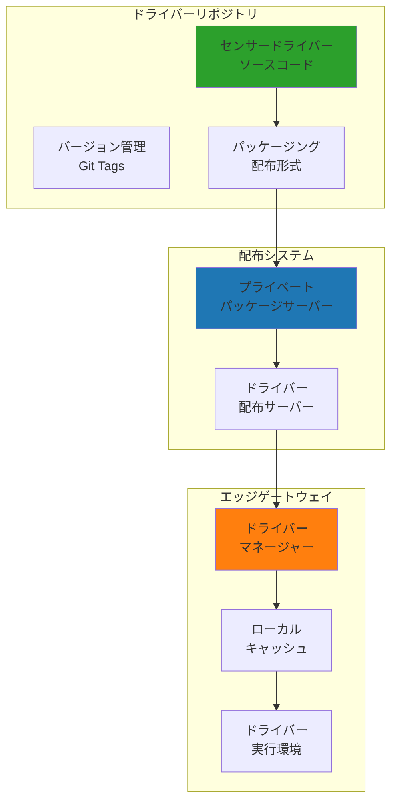

# センサードライバーアーキテクチャ設計

## 概要

本ドキュメントは、新しいIoTゲートウェイシステムにおけるセンサードライバーの管理、配布、更新に関するアーキテクチャの概念設計を定義します。

## 現状分析

### Node-REDシステムでのドライバー管理

現在のシステムでは以下のセンサードライバーが実装されています：

| ドライバー | センサー種別 | 通信方式 | 用途 |
|-----------|------------|---------|------|
| vl53l1x | 測距センサー | I2C | 距離測定 |
| opt3001 | 照度センサー | I2C | 明るさ測定 |
| mcp3427 | ADCセンサー | I2C | アナログ値読取 |
| mcp9600 | 熱電対センサー | I2C | 温度測定 |
| lis2duxs12 | 加速度センサー | I2C | 振動測定 |
| lombscargle | FFT解析 | - | 周波数解析 |
| sdp810 | 差圧センサー | I2C | 圧力測定 |

### 現状の課題

1. **更新の困難さ**: 各ゲートウェイへの手動ファイルコピー
2. **バージョン管理の欠如**: 動作バージョンの不透明性
3. **依存関係管理の不在**: ライブラリ管理の複雑化
4. **テスト体制の不備**: 動作検証の不完全性

## 新アーキテクチャ設計

### ドライバー管理の階層構造



### ドライバーインターフェース設計

#### 統一ドライバーインターフェース

**センサー情報モデル**
- ドライバー名
- ドライバーバージョン
- センサータイプ
- 測定単位
- 通信方式（I2C、SPI、シリアル、GPIO）
- サポートデバイスリスト

**基本インターフェース定義**

1. **情報取得機能**
   - ドライバー情報の取得
   - センサー仕様の提供

2. **初期化機能**
   - 設定検証
   - ハードウェア初期化
   - 接続確認

3. **データ取得機能**
   - センサー値の読み取り
   - データ品質情報の付与
   - タイムスタンプの追加

4. **ユーティリティ機能**
   - 接続テスト
   - 較正処理（オプション）
   - 診断情報取得（オプション）

### ドライバー実装概念

#### VL53L1X測距センサードライバーの例

**ドライバー特性**
- ドライバー名: vl53l1x
- センサータイプ: 測距センサー
- 測定単位: ミリメートル
- 通信方式: I2C
- デフォルトアドレス: 0x29

**実装の要点**

1. **設定検証**
   - I2Cアドレスの範囲チェック
   - バス番号の設定
   - 必須パラメータの確認

2. **センサー初期化**
   - I2Cインターフェースの確立
   - センサー固有の初期化シーケンス
   - 測定モードの設定

3. **データ読み取り**
   - 距離値の取得
   - 信号品質の評価
   - タイムスタンプの付与

4. **接続テスト**
   - デバイスIDの確認
   - 通信正常性の検証

### ドライバーパッケージ構造

```
sensor-drivers/
├── パッケージ設定ファイル
├── 依存関係定義
├── sensor_drivers/
│   ├── 初期化ファイル
│   ├── 基底クラス定義
│   ├── i2c/
│   │   ├── vl53l1x      # 測距センサー
│   │   ├── opt3001      # 照度センサー
│   │   ├── mcp3427      # ADC
│   │   ├── mcp9600      # 熱電対
│   │   ├── lis2duxs12   # 加速度
│   │   └── sdp810       # 差圧
│   ├── serial/
│   │   └── brave_pi     # BravePI通信
│   └── analysis/
│       └── lombscargle  # FFT解析
├── tests/                # テストコード
└── docs/                 # ドキュメント
```

### ドライバーマネージャー

#### 動的ドライバー管理の概念

**ドライバーマネージャーの役割**

1. **ドライバーレジストリ管理**
   - インストール済みドライバーの追跡
   - バージョン情報の記録
   - インストール日時の管理

2. **ドライバーインストール**
   - プライベートパッケージサーバーからの取得
   - 依存関係の自動解決
   - バージョン指定インストール

3. **動的ロード機能**
   - 必要時のドライバーロード
   - メモリ効率的な管理
   - キャッシュ機構

4. **ドライバー更新**
   - 最新バージョンの確認
   - 差分更新の実施
   - ロールバック機能

**キャッシュディレクトリ構造**
- ドライバーファイルのローカル保存
- レジストリ情報の保持
- 設定ファイルの管理

### ドライバー配布システム

#### プライベートパッケージサーバー構成

**サーバーコンポーネント**

1. **パッケージサーバー**
   - プライベートパッケージリポジトリ
   - 認証機能
   - バージョン管理

2. **ドライバービルダー**
   - 自動ビルドシステム
   - パッケージング処理
   - バージョンタグ付け

**配布フロー**
1. ソースコードのコミット
2. 自動ビルドのトリガー
3. パッケージ作成
4. サーバーへのアップロード
5. メタデータの更新

### 自動更新メカニズム

#### ドライバー自動更新の概念

**更新プロセス**

1. **更新チェック**
   - 定期的なバージョン確認
   - 利用可能な更新の検出
   - 互換性の確認

2. **更新適用**
   - 実行中センサーの安全な停止
   - ドライバーの更新
   - センサーの再起動

3. **ロールバック機能**
   - 更新失敗時の復元
   - 以前のバージョンへの戻し
   - エラーログの記録

**更新ポリシー**
- 更新間隔の設定
- 自動/手動更新の選択
- 重要度による優先度制御

## 利点

1. **バージョン管理**: 明確なバージョン管理体制
2. **依存関係解決**: 自動的な依存関係管理
3. **動的ロード**: メモリ効率的な実行
4. **自動更新**: セキュリティパッチの迅速適用
5. **テスト可能**: 品質保証体制の確立
6. **互換性管理**: デバイス別の対応状況明確化

## 移行戦略

### Phase 1: 基盤構築
1. ドライバー基底クラスの設計
2. 既存ドライバーの移植計画
3. テスト体制の構築

### Phase 2: 配布システム
1. パッケージサーバーの構築
2. CI/CDパイプラインの設計
3. 自動ビルド・配布の実現

### Phase 3: 動的管理
1. ドライバーマネージャーの開発
2. 自動更新機能の組み込み
3. 運用体制の確立

## セキュリティ考慮事項

1. **署名検証**: パッケージのデジタル署名
2. **アクセス制御**: サーバーへの認証体制
3. **実行環境分離**: ドライバー実行環境の隔離
4. **監査ログ**: 更新履歴の完全記録

## まとめ

このアーキテクチャ設計により、センサードライバーの管理が大幅に改善され、保守性と拡張性が向上します。特に少人数での運用においても、自動化により負担が軽減されます。