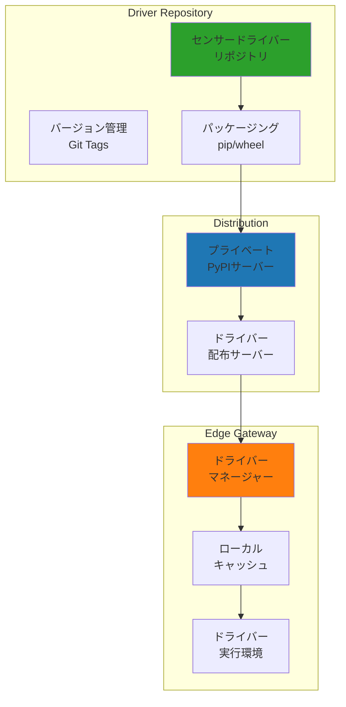

# センサードライバーアーキテクチャ設計

## 概要

本ドキュメントは、新しいIoTゲートウェイシステムにおけるセンサードライバーの管理、配布、更新に関するアーキテクチャを定義します。

## 現状分析

### Node-REDシステムでのドライバー管理

現在のシステムでは以下のセンサードライバーがPythonスクリプトとして実装されています：

| ドライバー | センサー種別 | 通信方式 | 用途 |
|-----------|------------|---------|------|
| vl53l1x.py | 測距センサー | I2C | 距離測定 |
| opt3001.py | 照度センサー | I2C | 明るさ測定 |
| mcp3427.py | ADCセンサー | I2C | アナログ値読取 |
| mcp9600.py | 熱電対センサー | I2C | 温度測定 |
| lis2duxs12.py | 加速度センサー | I2C | 振動測定 |
| lombscargle.py | FFT解析 | - | 周波数解析 |
| sdp810.py | 差圧センサー | I2C | 圧力測定 |

### 現状の課題

1. **更新の困難さ**: 各ゲートウェイに手動でファイルをコピー
2. **バージョン管理なし**: どのバージョンが動作しているか不明
3. **依存関係管理なし**: 必要なライブラリの管理が困難
4. **テストの欠如**: ドライバーの動作確認が不十分

## 新アーキテクチャ設計

### ドライバー管理の階層構造



### ドライバーインターフェース設計

```python
# edge-gateway/drivers/base.py
from abc import ABC, abstractmethod
from typing import Dict, Any, Optional, List
from dataclasses import dataclass

@dataclass
class SensorInfo:
    """センサー情報"""
    driver_name: str
    driver_version: str
    sensor_type: str
    unit: str
    communication: str  # i2c, spi, serial, gpio
    supported_devices: List[str]  # ['RPi4', 'RPi5', 'JetsonNano']

class SensorDriverBase(ABC):
    """全センサードライバーの基底クラス"""
    
    def __init__(self, config: Dict[str, Any]):
        self.config = config
        self._validate_config()
        self._initialize()
    
    @abstractmethod
    def get_info(self) -> SensorInfo:
        """ドライバー情報を取得"""
        pass
    
    @abstractmethod
    def _validate_config(self) -> None:
        """設定の検証"""
        pass
    
    @abstractmethod
    def _initialize(self) -> None:
        """初期化処理"""
        pass
    
    @abstractmethod
    def read(self) -> Dict[str, Any]:
        """センサー値読み取り"""
        pass
    
    @abstractmethod
    def test_connection(self) -> bool:
        """接続テスト"""
        pass
    
    def calibrate(self, offset: float = 0.0, scale: float = 1.0) -> None:
        """較正処理（オプション）"""
        pass
    
    def get_diagnostics(self) -> Dict[str, Any]:
        """診断情報取得（オプション）"""
        return {}
```

### ドライバー実装例

```python
# edge-gateway/drivers/i2c/vl53l1x.py
from drivers.base import SensorDriverBase, SensorInfo
from hardware.interfaces import I2CInterface
import VL53L1X  # 外部ライブラリ

class VL53L1XDriver(SensorDriverBase):
    """VL53L1X測距センサードライバー"""
    
    DRIVER_VERSION = "1.0.0"
    DEFAULT_ADDRESS = 0x29
    
    def get_info(self) -> SensorInfo:
        return SensorInfo(
            driver_name="vl53l1x",
            driver_version=self.DRIVER_VERSION,
            sensor_type="distance",
            unit="mm",
            communication="i2c",
            supported_devices=["RPi4", "RPi5", "JetsonNano"]
        )
    
    def _validate_config(self) -> None:
        """設定検証"""
        self.address = self.config.get('address', self.DEFAULT_ADDRESS)
        self.bus = self.config.get('bus', 1)
        
        if not 0x08 <= self.address <= 0x77:
            raise ValueError(f"Invalid I2C address: {self.address}")
    
    def _initialize(self) -> None:
        """センサー初期化"""
        self.i2c = I2CInterface(bus=self.bus)
        self.sensor = VL53L1X.VL53L1X(i2c_bus=self.bus, i2c_address=self.address)
        self.sensor.open()
        self.sensor.start_ranging(1)  # Short range mode
    
    def read(self) -> Dict[str, Any]:
        """距離測定"""
        distance = self.sensor.get_distance()
        return {
            "value": distance,
            "unit": "mm",
            "quality": self._get_signal_quality(),
            "timestamp": datetime.utcnow().isoformat()
        }
    
    def test_connection(self) -> bool:
        """接続確認"""
        try:
            # WHO_AM_Iレジスタ読み取り
            model_id = self.sensor.get_model_id()
            return model_id == 0xEACC
        except Exception:
            return False
    
    def _get_signal_quality(self) -> float:
        """信号品質取得"""
        try:
            return self.sensor.get_signal_rate() / 1000.0
        except:
            return 0.0
```

### ドライバーパッケージ構造

```
sensor-drivers/
├── setup.py                 # パッケージ設定
├── requirements.txt         # 依存関係
├── sensor_drivers/
│   ├── __init__.py
│   ├── base.py             # 基底クラス
│   ├── i2c/
│   │   ├── __init__.py
│   │   ├── vl53l1x.py      # 測距センサー
│   │   ├── opt3001.py      # 照度センサー
│   │   ├── mcp3427.py      # ADC
│   │   ├── mcp9600.py      # 熱電対
│   │   ├── lis2duxs12.py   # 加速度
│   │   └── sdp810.py       # 差圧
│   ├── serial/
│   │   └── brave_pi.py     # BravePI通信
│   └── analysis/
│       └── lombscargle.py  # FFT解析
├── tests/                  # テストコード
│   ├── test_vl53l1x.py
│   └── ...
└── docs/                   # ドキュメント
```

### ドライバーマネージャー

```python
# edge-gateway/driver_manager.py
import importlib
import json
from pathlib import Path
from typing import Dict, Optional, Type
import pip

class DriverManager:
    """センサードライバーの動的管理"""
    
    def __init__(self, cache_dir: str = "/opt/gateway/drivers"):
        self.cache_dir = Path(cache_dir)
        self.loaded_drivers: Dict[str, Type[SensorDriverBase]] = {}
        self.driver_registry = self._load_registry()
    
    def _load_registry(self) -> Dict:
        """ドライバーレジストリ読み込み"""
        registry_file = self.cache_dir / "registry.json"
        if registry_file.exists():
            return json.loads(registry_file.read_text())
        return {}
    
    def install_driver(self, driver_name: str, version: Optional[str] = None) -> bool:
        """ドライバーのインストール"""
        try:
            # プライベートPyPIサーバーから取得
            package_name = f"iot-sensor-{driver_name}"
            if version:
                package_name += f"=={version}"
            
            pip.main(['install', '--index-url', 'http://pypi.local', 
                     '--trusted-host', 'pypi.local', package_name])
            
            # レジストリ更新
            self.driver_registry[driver_name] = {
                "version": version or "latest",
                "installed": datetime.utcnow().isoformat()
            }
            self._save_registry()
            return True
            
        except Exception as e:
            print(f"Driver installation failed: {e}")
            return False
    
    def load_driver(self, driver_name: str) -> Optional[Type[SensorDriverBase]]:
        """ドライバーの動的ロード"""
        if driver_name in self.loaded_drivers:
            return self.loaded_drivers[driver_name]
        
        try:
            # 動的インポート
            module = importlib.import_module(f"sensor_drivers.{driver_name}")
            
            # ドライバークラスを探す
            for attr_name in dir(module):
                attr = getattr(module, attr_name)
                if (isinstance(attr, type) and 
                    issubclass(attr, SensorDriverBase) and 
                    attr != SensorDriverBase):
                    self.loaded_drivers[driver_name] = attr
                    return attr
                    
        except ImportError as e:
            print(f"Failed to load driver {driver_name}: {e}")
            return None
    
    def update_driver(self, driver_name: str) -> bool:
        """ドライバーの更新"""
        # 最新バージョン確認
        latest_version = self._check_latest_version(driver_name)
        current_version = self.driver_registry.get(driver_name, {}).get("version")
        
        if latest_version != current_version:
            return self.install_driver(driver_name, latest_version)
        return True
    
    def list_available_drivers(self) -> List[Dict]:
        """利用可能なドライバー一覧"""
        # プライベートPyPIサーバーから取得
        # 実装は省略
        pass
```

### ドライバー配布システム

```yaml
# infrastructure/driver-distribution/docker-compose.yml
version: '3.8'

services:
  pypi-server:
    image: pypiserver/pypiserver:latest
    ports:
      - "8080:8080"
    volumes:
      - ./packages:/data/packages
    command: -P . -a . /data/packages
    environment:
      - PYPISERVER_PASSWORD=secure_password
  
  driver-builder:
    build: ./builder
    volumes:
      - ./sensor-drivers:/workspace
      - ./packages:/output
    environment:
      - BUILD_VERSION=${VERSION}
```

### 自動更新メカニズム

```python
# edge-gateway/auto_updater.py
class DriverAutoUpdater:
    """ドライバー自動更新"""
    
    def __init__(self, driver_manager: DriverManager):
        self.driver_manager = driver_manager
        self.update_interval = 3600  # 1時間ごと
    
    async def check_updates(self):
        """更新チェック"""
        available_updates = []
        
        for driver_name in self.driver_manager.driver_registry:
            if self.driver_manager.needs_update(driver_name):
                available_updates.append(driver_name)
        
        return available_updates
    
    async def apply_updates(self, drivers: List[str]):
        """更新適用"""
        results = {}
        
        for driver_name in drivers:
            # 実行中のセンサーを一時停止
            await self.pause_sensor(driver_name)
            
            # ドライバー更新
            success = self.driver_manager.update_driver(driver_name)
            results[driver_name] = success
            
            # センサー再開
            if success:
                await self.resume_sensor(driver_name)
        
        return results
```

## 利点

1. **バージョン管理**: Git タグによる明確なバージョン管理
2. **依存関係解決**: pip による自動的な依存関係管理
3. **動的ロード**: 必要なドライバーのみロード
4. **自動更新**: セキュリティパッチの迅速な適用
5. **テスト可能**: 単体テストによる品質保証
6. **互換性管理**: デバイス別の対応状況を明確化

## 移行戦略

### Phase 1: 基盤構築
1. ドライバー基底クラスの実装
2. 既存ドライバーの移植（インターフェース準拠）
3. テストコードの作成

### Phase 2: 配布システム
1. プライベートPyPIサーバーの構築
2. CI/CDパイプラインの設定
3. 自動ビルド・配布の実装

### Phase 3: 動的管理
1. ドライバーマネージャーの実装
2. 自動更新機能の追加
3. 運用開始

## セキュリティ考慮事項

1. **署名検証**: ドライバーパッケージのデジタル署名
2. **アクセス制御**: PyPIサーバーへの認証
3. **サンドボックス**: ドライバー実行環境の分離
4. **監査ログ**: 更新履歴の記録

## まとめ

この設計により、センサードライバーの管理が大幅に改善され、保守性と拡張性が向上します。特に1人での運用においても、自動化により負担が軽減されます。