# システム概要図解説明書

*BravePI/JIG疎結合化の全体像とGateway設計の視覚的理解*

## 文書概要

本文書は、IoT導入支援キット Ver.4.1 の BravePI/JIG ハードウェア依存を解消するための全体システム構成を図解で説明します。プログラムの詳細に入る前に、システム全体の概念・データの流れ・疎結合化のアプローチを視覚的に理解することを目的とします。

## 目次
1. [現状システムの問題点（図解）](#現状システムの問題点図解)
2. [疎結合化の全体戦略（図解）](#疎結合化の全体戦略図解)
3. [Gatewayによる解決アプローチ](#gatewayによる解決アプローチ)
4. [データフロー変化の比較](#データフロー変化の比較)
5. [段階的移行戦略](#段階的移行戦略)

## 現状システムの問題点（図解）

### 1. 密結合の現状アーキテクチャ

```mermaid
graph TB
    subgraph "現状：密結合システム"
        subgraph "ハードウェア層"
            BPI[BravePI Device]
            BJG[BraveJIG Device]
        end
        
        subgraph "通信層（密結合）"
            UART[UART 38400baud]
            USB[USB Serial]
        end
        
        subgraph "Node-RED処理層（1017ノード）"
            F1[Function Node 1<br/>BravePI解析]
            F2[Function Node 2<br/>温度センサー専用]
            F3[Function Node 3<br/>接点入力専用]
            F53[... Function Node 53<br/>プロトコル解析]
            
            H1[Hardware Node 1<br/>GPIO制御]
            H2[Hardware Node 2<br/>I2C制御]
            H380[... Hardware Node 380<br/>デバイス制御]
        end
        
        subgraph "データベース層"
            MARIADB[MariaDB<br/>BravePI専用テーブル]
            INFLUX[InfluxDB<br/>固定スキーマ]
        end
        
        subgraph "UI層"
            WEB[Web Dashboard<br/>ハードウェア固有UI]
        end
    end
    
    BPI -->|バイナリプロトコル| UART
    BJG -->|バイナリプロトコル| USB
    UART --> F1
    USB --> F1
    F1 --> F2
    F1 --> F3
    F2 --> F53
    F3 --> F53
    F53 --> H1
    H1 --> H2
    H2 --> H380
    H380 --> MARIADB
    MARIADB --> INFLUX
    INFLUX --> WEB
    
    style F1 fill:#ff6b6b,stroke:#fff,stroke-width:2px,color:#fff
    style F2 fill:#ff6b6b,stroke:#fff,stroke-width:2px,color:#fff
    style F3 fill:#ff6b6b,stroke:#fff,stroke-width:2px,color:#fff
    style F53 fill:#ff6b6b,stroke:#fff,stroke-width:2px,color:#fff
    style H1 fill:#ff8787,stroke:#fff,stroke-width:2px,color:#fff
    style H2 fill:#ff8787,stroke:#fff,stroke-width:2px,color:#fff
    style H380 fill:#ff8787,stroke:#fff,stroke-width:2px,color:#fff
```

### 2. 密結合による具体的問題

```mermaid
graph TB
    subgraph "問題1：ベンダーロックイン"
        A[新しいハードウェア追加要求]
        A --> B[全システム修正必要]
        B --> C[3-6ヶ月の開発期間]
        C --> D[高いコスト・リスク]
    end
    
    subgraph "問題2：保守性の悪化"
        E[センサータイプ追加]
        E --> F[53個のFunctionノード修正]
        F --> G[380個のHardwareノード修正]
        G --> H[データベーススキーマ変更]
        H --> I[UI表示ロジック修正]
    end
    
    subgraph "問題3：テスト困難性"
        J[機能テスト実行]
        J --> K[実機必須]
        K --> L[環境構築困難]
        L --> M[デバッグ複雑化]
    end
    
    style B fill:#ff6b6b,stroke:#fff,stroke-width:2px,color:#fff
    style C fill:#ff6b6b,stroke:#fff,stroke-width:2px,color:#fff
    style F fill:#ff6b6b,stroke:#fff,stroke-width:2px,color:#fff
    style G fill:#ff6b6b,stroke:#fff,stroke-width:2px,color:#fff
    style H fill:#ff6b6b,stroke:#fff,stroke-width:2px,color:#fff
    style I fill:#ff6b6b,stroke:#fff,stroke-width:2px,color:#fff
    style K fill:#ff6b6b,stroke:#fff,stroke-width:2px,color:#fff
    style L fill:#ff6b6b,stroke:#fff,stroke-width:2px,color:#fff
```

## 疎結合化の全体戦略（図解）

### 1. 目標アーキテクチャ：疎結合システム

```mermaid
graph TB
    subgraph "目標：疎結合システム"
        subgraph "ハードウェア環境層（ベアメタル）"
            subgraph "Raspberry Pi 4 環境（初期実装）"
                RPI4[Raspberry Pi 4<br/>⚠️ プラットフォーム依存<br/>GPIO・UART・I2C制御]
                BPI[BravePI<br/>UART /dev/ttyAMA0<br/>38400ボー・バイナリフレーム]
                BJG[BraveJIG<br/>USB Serial /dev/ttyACM0-9<br/>38400ボー・バイナリフレーム]
                I2C[I2C Sensors<br/>/dev/i2c-1・レジスタ制御]
                
                subgraph "汎用通信Driver Library"
                    UART_DRV[UART Driver<br/>uart_driver.py<br/>物理制御のみ]
                    USB_DRV[USB Serial Driver<br/>usb_serial_driver.py<br/>物理制御のみ]
                    I2C_DRV[I2C Driver<br/>i2c_driver.py<br/>物理制御のみ]
                end
            end
            
            subgraph "その他ハードウェア環境（将来対応）"
                ESP[ESP32<br/>内蔵WiFi・MQTT Client<br/>✅ ハードウェア非依存]
                ARD[Arduino<br/>WiFi Shield・MQTT<br/>✅ ハードウェア非依存]
                PC[PC/サーバー環境<br/>USB Serial のみ対応<br/>⏳ 将来移植予定]
            end
        end
        
        subgraph "ネットワーク通信層"
            MQTT[MQTT Broker<br/>Eclipse Mosquitto<br/>Topic: sensors/device/type]
        end
        
        subgraph "Universal Gateway（ハードウェア非依存）"
            GW[Gateway Core<br/>🌟 新規実装<br/>MQTT Subscribe]
            subgraph "Protocol Adapters（プロトコル固有処理）"
                PA1[BravePI Protocol Adapter<br/>バイナリフレーム解析<br/>メッセージタイプ処理]
                PA2[BraveJIG Protocol Adapter<br/>JIG専用センサー対応<br/>高精度データ処理]
                PA3[Standard JSON Adapter<br/>JSON正規化]
                PA4[Legacy Protocol Adapter<br/>既存フォーマット対応]
            end
        end
        
        subgraph "統一API層"
            API[REST API<br/>HTTP/HTTPS<br/>統一インターフェース]
            MQTT_OUT[MQTT Output<br/>processed/sensors/+<br/>統一JSON配信]
        end
        
        subgraph "アプリケーション層"
            APP[統一アプリケーション<br/>ハードウェア非依存<br/>内部API通信]
        end
        
        subgraph "データ層"
            DB[統一データベース<br/>PostgreSQL + InfluxDB<br/>ベンダー中立スキーマ]
        end
        
        subgraph "ユーザーインターフェース"
            UI[統一Dashboard<br/>React + WebSocket<br/>ハードウェア非依存UI]
        end
    end
    
    RPI4 --> BPI
    RPI4 --> BJG  
    RPI4 --> I2C
    BPI --> UART_DRV
    BJG --> USB_DRV
    I2C --> I2C_DRV
    
    UART_DRV -.->|Raw MQTT Publish<br/>raw/uart/data| MQTT
    USB_DRV -.->|Raw MQTT Publish<br/>raw/usb_serial/data| MQTT
    I2C_DRV -.->|Raw MQTT Publish<br/>raw/i2c/data| MQTT
    ESP -.->|MQTT Publish| MQTT
    ARD -.->|MQTT Publish| MQTT
    PC -.->|⏳ 将来対応| MQTT
    
    MQTT -.->|MQTT Subscribe| GW
    
    GW --> PA1
    GW --> PA2
    GW --> PA3
    GW --> PA4
    
    PA1 --> API
    PA2 --> API
    PA3 --> API
    PA4 --> API
    PA1 --> MQTT_OUT
    PA2 --> MQTT_OUT
    PA3 --> MQTT_OUT
    PA4 --> MQTT_OUT
    
    API --> APP
    MQTT_OUT --> APP
    
    APP -.->|SQL/InfluxQL| DB
    DB -.->|HTTP API| UI
    
    style GW fill:#51cf66,stroke:#fff,stroke-width:2px,color:#000
    style MQTT fill:#74c0fc,stroke:#000,stroke-width:2px,color:#000
    style API fill:#51cf66,stroke:#fff,stroke-width:2px,color:#000
    style MQTT_OUT fill:#51cf66,stroke:#fff,stroke-width:2px,color:#000
    style APP fill:#51cf66,stroke:#fff,stroke-width:2px,color:#000
    style UART_DRV fill:#ffd43b,stroke:#000,stroke-width:2px,color:#000
    style USB_DRV fill:#ffd43b,stroke:#000,stroke-width:2px,color:#000
    style I2C_DRV fill:#ffd43b,stroke:#000,stroke-width:2px,color:#000
    style PA1 fill:#fab005,stroke:#000,stroke-width:2px,color:#000
    style PA2 fill:#fab005,stroke:#000,stroke-width:2px,color:#000
    style PA3 fill:#fab005,stroke:#000,stroke-width:2px,color:#000
    style PA4 fill:#fab005,stroke:#000,stroke-width:2px,color:#000
```

### 2. 疎結合化による効果

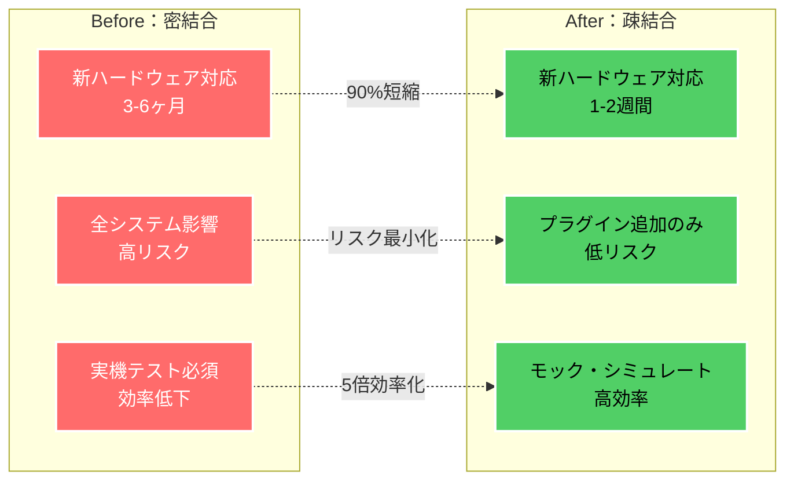

## Gatewayによる解決アプローチ

### 1. 開発対象の2層構成

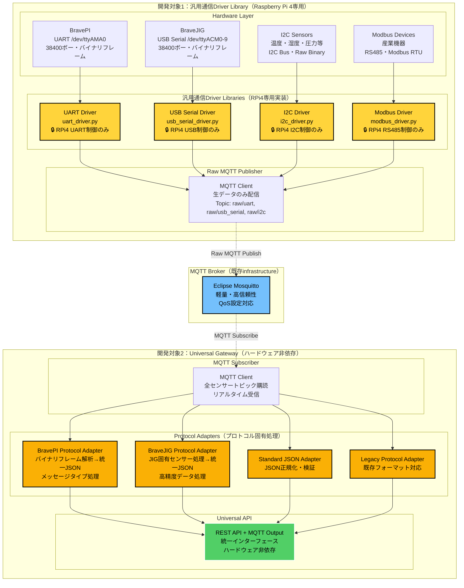

#### 開発対象1：汎用通信Driver Library仕様（初期実装：Raspberry Pi 4依存）

| 通信方式 | Driver Library | 物理制御 | Raw MQTT出力 | 依存ライブラリ | プラットフォーム依存 |
|----------|----------------|----------|-------------|---------------|------------------|
| **UART** | `uart_driver.py` | UART制御のみ<br/>38400ボー設定 | 生バイナリデータ<br/>→Raw MQTT Publish<br/>Topic: `raw/uart/data` | `pyserial`<br/>`paho-mqtt` | **RPi4**: `/dev/ttyAMA0`<br/>GPIO制御依存 |
| **USB Serial** | `usb_serial_driver.py` | USB Serial制御のみ<br/>38400ボー設定 | 生バイナリデータ<br/>→Raw MQTT Publish<br/>Topic: `raw/usb_serial/data` | `pyserial`<br/>`paho-mqtt` | **RPi4**: `/dev/ttyACM0-9`<br/>USB制御依存 |
| **I2C** | `i2c_driver.py` | I2C Bus制御のみ<br/>レジスタ読み書き | 生バイナリデータ<br/>→Raw MQTT Publish<br/>Topic: `raw/i2c/data` | `smbus2`<br/>`paho-mqtt` | **RPi4**: `/dev/i2c-1`<br/>I2C制御依存 |
| **RS485/Modbus** | `modbus_driver.py` | RS485制御のみ<br/>RTU通信 | 生バイナリデータ<br/>→Raw MQTT Publish<br/>Topic: `raw/modbus/data` | `pymodbus`<br/>`paho-mqtt` | **RPi4**: USB-RS485<br/>制御依存 |

⚠️ **汎用通信層の特徴**: Driver Libraryは通信制御のみを担当し、**プロトコル解析は一切行いません**。
BravePI/JIG固有の処理は全てGateway側のProtocol Adapterで実装します。

#### 開発対象2：Universal Gateway Protocol Adapter仕様

| Protocol Adapter | ファイル | 機能 | Raw MQTT入力 | 統一JSON出力 |
|------------------|----------|------|-------------|-------------|
| **BravePI Protocol Adapter** | `bravepi_protocol_adapter.py` | バイナリフレーム解析<br/>メッセージタイプ処理<br/>16センサータイプ対応 | Raw MQTT Topic<br/>`raw/uart/data` | 統一JSON<br/>BravePI固有処理済み |
| **BraveJIG Protocol Adapter** | `bravejig_protocol_adapter.py` | JIG専用センサー処理<br/>高精度データ処理<br/>JIG拡張センサー対応 | Raw MQTT Topic<br/>`raw/usb_serial/data` | 統一JSON<br/>BraveJIG固有処理済み |
| **Standard JSON Adapter** | `json_adapter.py` | JSON正規化・検証<br/>フィールド統一 | Raw MQTT Topic<br/>`raw/json/data` | 統一JSON<br/>正規化済み |
| **Legacy Protocol Adapter** | `legacy_adapter.py` | 既存フォーマット対応<br/>後方互換性 | Raw MQTT Topic<br/>`raw/legacy/data` | 統一JSON<br/>互換性確保 |

⚠️ **Protocol Adapterの特徴**: ハードウェア固有のプロトコル解析・データ変換を全て担当します。
Driver Libraryからの生データを受け取り、統一JSON形式に変換して出力します。

#### 新規ハードウェア対応手順

```mermaid
graph LR
    subgraph "新ハードウェア追加"
        NEW_HW[新しいハードウェア<br/>例：Siemens PLC]
    end
    
    subgraph "汎用通信Driver開発"
        STEP1[通信Driver作成<br/>ethernet_driver.py]
        STEP2[物理制御実装<br/>Ethernet通信のみ]
        STEP3[Raw データ配信<br/>プロトコル解析なし]
        STEP4[Raw MQTT Publisher<br/>Topic: raw/ethernet/data]
    end
    
    subgraph "Protocol Adapter開発"
        STEP5[Protocol Adapter追加<br/>siemens_protocol_adapter.py]
        STEP6[S7プロトコル解析実装<br/>PLC→統一JSON変換]
        STEP7[Raw MQTT Subscribe設定<br/>raw/ethernet/data購読]
    end
    
    subgraph "統合・テスト"
        STEP8[E2Eテスト<br/>実機→Raw MQTT→Gateway]
        STEP9[本番配備<br/>工場ライン投入]
    end
    
    NEW_HW --> STEP1 --> STEP2 --> STEP3 --> STEP4
    STEP4 --> STEP5 --> STEP6 --> STEP7
    STEP7 --> STEP8 --> STEP9
    
    style NEW_HW fill:#e9ecef,stroke:#000,stroke-width:2px,color:#000
    style STEP1 fill:#ffd43b,stroke:#000,stroke-width:2px,color:#000
    style STEP2 fill:#ffd43b,stroke:#000,stroke-width:2px,color:#000
    style STEP3 fill:#ffd43b,stroke:#000,stroke-width:2px,color:#000
    style STEP4 fill:#ffd43b,stroke:#000,stroke-width:2px,color:#000
    style STEP5 fill:#fab005,stroke:#000,stroke-width:2px,color:#000
    style STEP6 fill:#fab005,stroke:#000,stroke-width:2px,color:#000
    style STEP7 fill:#fab005,stroke:#000,stroke-width:2px,color:#000
    style STEP9 fill:#51cf66,stroke:#fff,stroke-width:2px,color:#000
```

**新規ハードウェア対応手順**:
1. **汎用通信Driver作成** (ethernet_driver.py) - ベアメタル環境用
2. **物理制御実装** (Ethernet通信のみ) - 通信制御のみ
3. **Rawデータ配信** (プロトコル解析なし) - 生データ転送のみ
4. **Raw MQTT Publisher** (raw/ethernet/data) - 生データ配信
5. **Protocol Adapter追加** (siemens_protocol_adapter.py) - Gateway側
6. **S7プロトコル解析実装** (PLC→統一JSON変換) - ハードウェア固有処理
7. **Raw MQTT Subscribe設定** (raw/ethernet/data購読) - Gateway設定
8. **E2Eテスト** (実機→Raw MQTT→Gateway) - 統合動作確認
9. **本番配備** (工場ライン投入) - 運用開始

**開発期間**: 
- **汎用通信Driver**: **3-4日** (通信制御のみ、プロトコル解析なし)
- **Protocol Adapter**: **1週間** (ハードウェア固有のプロトコル処理)
- **総計 1-2週間** で完成（従来の3-6ヶ月から大幅短縮）

**🎯 設計の利点**: 
- **汎用Driver**: 他のEthernet機器でも流用可能
- **Protocol Adapter**: ハードウェア固有知識を集約
- **完全分離**: 通信層とプロトコル層の責務が明確

### 2. Universal Gateway 出力仕様（工場・現場向け）

**ハードウェア非依存設計方針**: 
- **MQTT中心**: リアルタイム・軽量・高信頼性
- **工場標準**: 製造業で実績のある通信方式
- **統一API**: どのハードウェアからのデータも同一形式

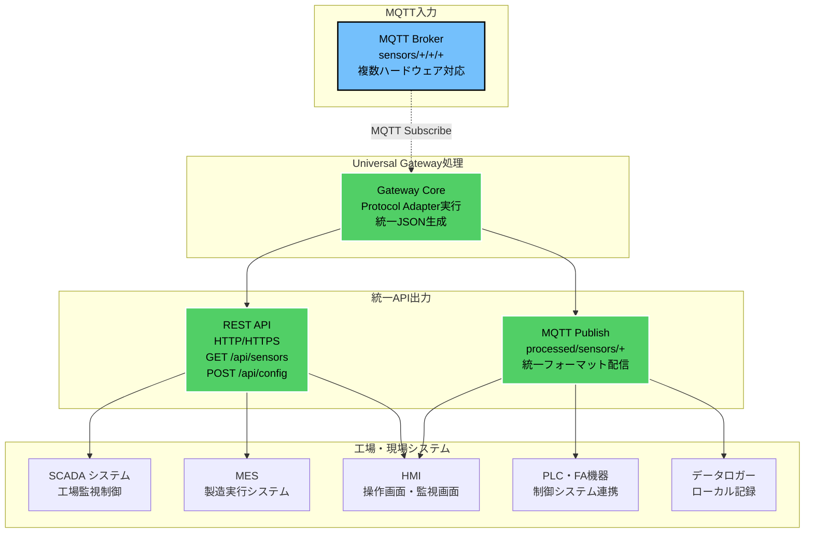

#### 工場・現場での通信規格

| 通信方式 | 用途 | 工場での利用例 | 信頼性 |
|----------|------|-------------|--------|
| **REST API** | 基本的なデータ取得・設定 | • SCADA からのデータ取得<br/>• MES との連携<br/>• 設定変更・状態確認 | ★★★ |
| **MQTT** | 軽量リアルタイム通信 | • PLC への状態通知<br/>• 工場内ネットワーク配信<br/>• ローカルログ記録 | ★★★ |

#### 実装例（工場向け）

```yaml
# REST API（シンプル・確実）
GET  /api/sensor/{device_id}/value     # センサー値取得
POST /api/sensor/{device_id}/config    # 設定変更
GET  /api/status                       # システム状態確認

# MQTT（工場標準）  
Topic: factory/line1/{device_id}/data        # ライン1データ
Topic: factory/line1/{device_id}/status      # デバイス状態
Topic: factory/alerts/{alert_level}          # アラート通知
```

### 3. BravePI/JIGプロトコル変換の詳細

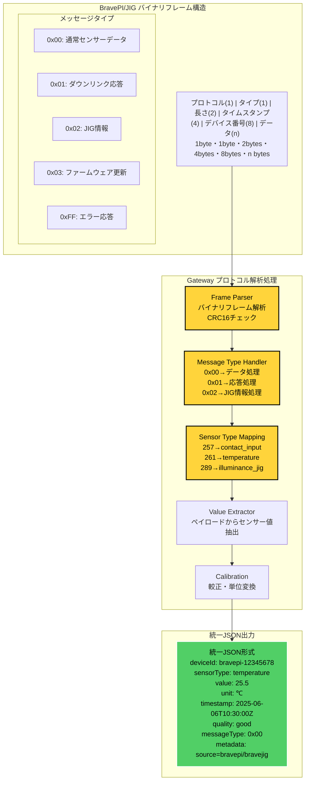

## データフロー変化の比較

### 1. 現状：BravePI依存データフロー

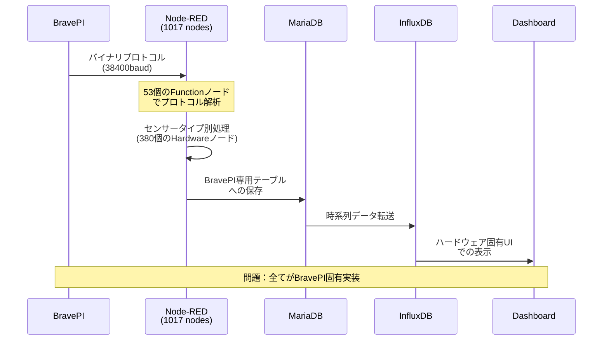

### 2. 目標：Gateway経由データフロー

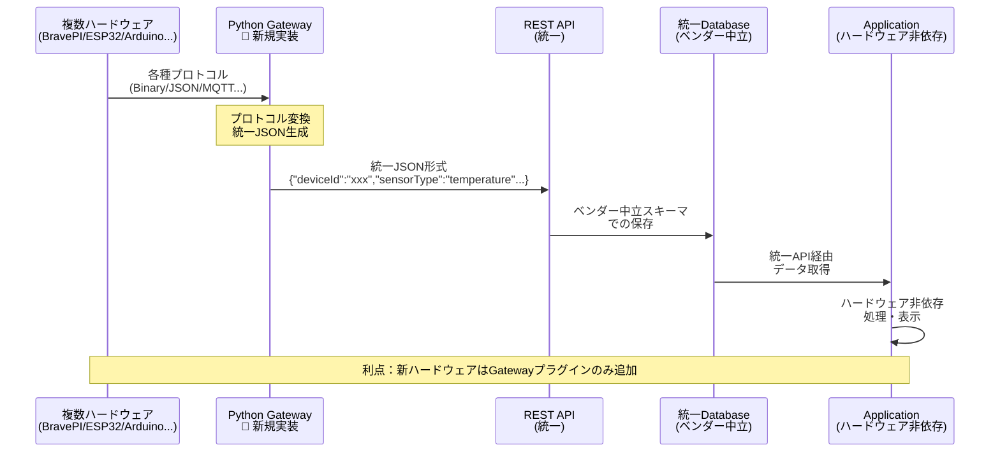

### 3. 新ハードウェア追加時の比較

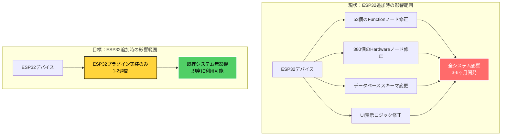


---

## 文書メタデータ

**文書タイトル**: システム概要図解説明書  
**作成日付**: 2025年6月6日  
**対象読者**: システム設計者・開発者・プロジェクト関係者  
**目的**: 疎結合化戦略の視覚的理解・合意形成  
**前提知識**: IoTシステム基礎・現状システム概要  
**文書レベル**: 概要説明・戦略図解 (★★☆)