# システム概要図解説明書

*BravePI/JIG疎結合化の全体像とGateway設計の視覚的理解*

## 文書概要

本文書は、IoT導入支援キット Ver.4.1 の BravePI/JIG ハードウェア依存を解消するための全体システム構成を図解で説明します。プログラムの詳細に入る前に、システム全体の概念・データの流れ・疎結合化のアプローチを視覚的に理解することを目的とします。

## 目次
1. [現状システムの問題点（図解）](#現状システムの問題点図解)
2. [疎結合化の全体戦略（図解）](#疎結合化の全体戦略図解)
3. [Gatewayによる解決アプローチ](#gatewayによる解決アプローチ)
4. [データフロー変化の比較](#データフロー変化の比較)
5. [段階的移行戦略](#段階的移行戦略)

## 現状システムの問題点（図解）

### 1. 密結合の現状アーキテクチャ

```mermaid
graph TB
    subgraph "現状：密結合システム"
        subgraph "ハードウェア層"
            BPI[BravePI Device]
            BJG[BraveJIG Device]
        end
        
        subgraph "通信層（密結合）"
            UART[UART 38400baud]
            USB[USB Serial]
        end
        
        subgraph "Node-RED処理層（1017ノード）"
            F1[Function Node 1<br/>BravePI解析]
            F2[Function Node 2<br/>温度センサー専用]
            F3[Function Node 3<br/>接点入力専用]
            F53[... Function Node 53<br/>プロトコル解析]
            
            H1[Hardware Node 1<br/>GPIO制御]
            H2[Hardware Node 2<br/>I2C制御]
            H380[... Hardware Node 380<br/>デバイス制御]
        end
        
        subgraph "データベース層"
            MARIADB[MariaDB<br/>BravePI専用テーブル]
            INFLUX[InfluxDB<br/>固定スキーマ]
        end
        
        subgraph "UI層"
            WEB[Web Dashboard<br/>ハードウェア固有UI]
        end
    end
    
    BPI -->|バイナリプロトコル| UART
    BJG -->|バイナリプロトコル| USB
    UART --> F1
    USB --> F1
    F1 --> F2
    F1 --> F3
    F2 --> F53
    F3 --> F53
    F53 --> H1
    H1 --> H2
    H2 --> H380
    H380 --> MARIADB
    MARIADB --> INFLUX
    INFLUX --> WEB
    
    style F1 fill:#ff6b6b,stroke:#fff,stroke-width:2px,color:#fff
    style F2 fill:#ff6b6b,stroke:#fff,stroke-width:2px,color:#fff
    style F3 fill:#ff6b6b,stroke:#fff,stroke-width:2px,color:#fff
    style F53 fill:#ff6b6b,stroke:#fff,stroke-width:2px,color:#fff
    style H1 fill:#ff8787,stroke:#fff,stroke-width:2px,color:#fff
    style H2 fill:#ff8787,stroke:#fff,stroke-width:2px,color:#fff
    style H380 fill:#ff8787,stroke:#fff,stroke-width:2px,color:#fff
```

### 2. 密結合による具体的問題

```mermaid
graph TB
    subgraph "問題1：ベンダーロックイン"
        A[新しいハードウェア追加要求]
        A --> B[全システム修正必要]
        B --> C[3-6ヶ月の開発期間]
        C --> D[高いコスト・リスク]
    end
    
    subgraph "問題2：保守性の悪化"
        E[センサータイプ追加]
        E --> F[53個のFunctionノード修正]
        F --> G[380個のHardwareノード修正]
        G --> H[データベーススキーマ変更]
        H --> I[UI表示ロジック修正]
    end
    
    subgraph "問題3：テスト困難性"
        J[機能テスト実行]
        J --> K[実機必須]
        K --> L[環境構築困難]
        L --> M[デバッグ複雑化]
    end
    
    style B fill:#ff6b6b,stroke:#fff,stroke-width:2px,color:#fff
    style C fill:#ff6b6b,stroke:#fff,stroke-width:2px,color:#fff
    style F fill:#ff6b6b,stroke:#fff,stroke-width:2px,color:#fff
    style G fill:#ff6b6b,stroke:#fff,stroke-width:2px,color:#fff
    style H fill:#ff6b6b,stroke:#fff,stroke-width:2px,color:#fff
    style I fill:#ff6b6b,stroke:#fff,stroke-width:2px,color:#fff
    style K fill:#ff6b6b,stroke:#fff,stroke-width:2px,color:#fff
    style L fill:#ff6b6b,stroke:#fff,stroke-width:2px,color:#fff
```

## 疎結合化の全体戦略（図解）

### 1. 目標アーキテクチャ：疎結合システム

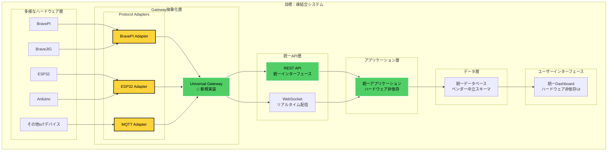

### 2. 疎結合化による効果

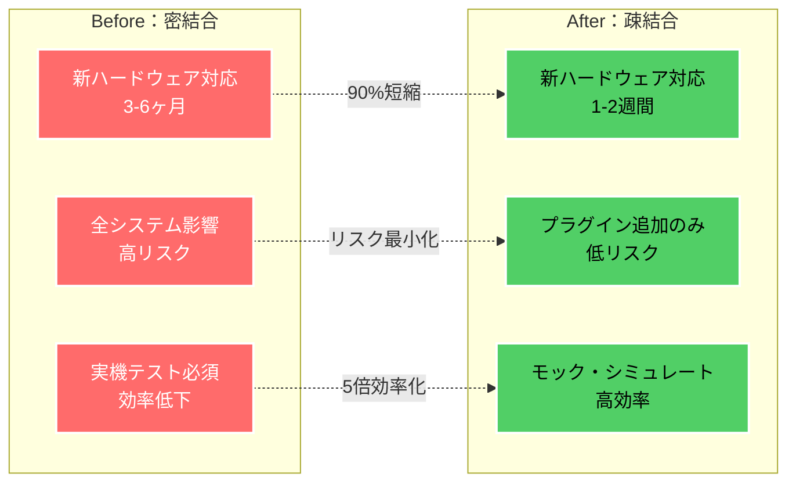

## Gatewayによる解決アプローチ

### 1. Gateway のコアコンセプト

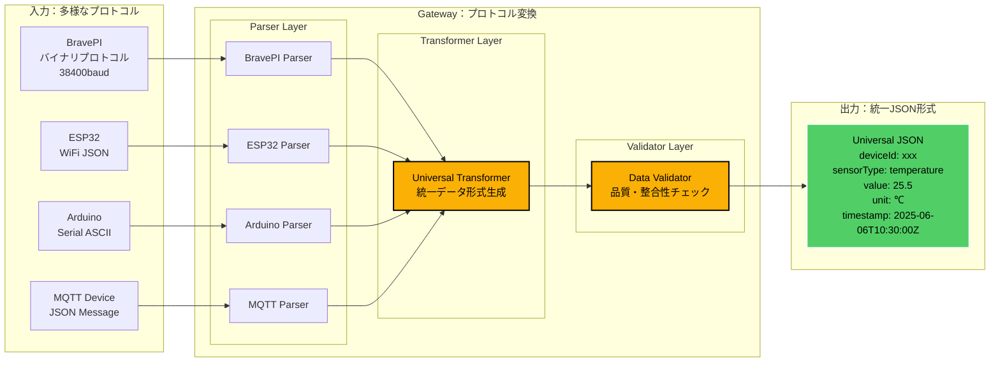

### 2. Gateway出力後の通信規格

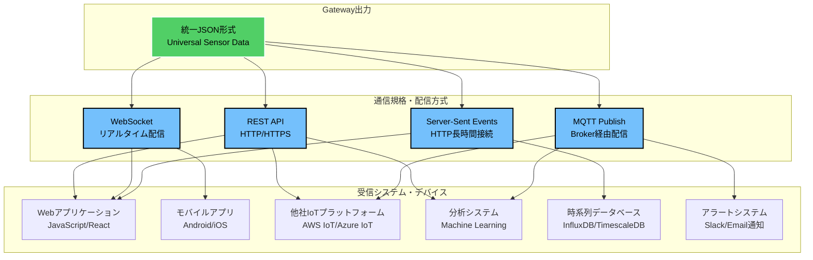

#### 通信規格の詳細

| 通信方式 | プロトコル | 用途 | 特徴 |
|----------|-----------|------|------|
| **REST API** | HTTP/HTTPS | 一般的なWebアプリ連携 | • 同期通信<br/>• ポーリング可能<br/>• 標準的 |
| **WebSocket** | WS/WSS | リアルタイム配信 | • 双方向通信<br/>• 低レイテンシ<br/>• 常時接続 |
| **MQTT** | MQTT v3.1.1/v5.0 | IoTデバイス間通信 | • 軽量プロトコル<br/>• QoS対応<br/>• Pub/Sub |
| **Server-Sent Events** | HTTP | 一方向リアルタイム | • HTTP互換<br/>• 自動再接続<br/>• 簡単実装 |

#### 実装例

```yaml
# REST API エンドポイント
GET  /api/v1/sensors/latest        # 最新データ取得
POST /api/v1/sensors/{id}/config   # センサー設定
GET  /api/v1/devices               # デバイス一覧

# WebSocket エンドポイント  
WS   /ws/sensor-stream             # リアルタイムデータ配信
WS   /ws/device/{id}/control       # デバイス制御

# MQTT トピック
Topic: sensors/{deviceId}/{sensorType}/data    # データ配信
Topic: sensors/{deviceId}/config               # 設定配信
Topic: alerts/{deviceId}/{alertType}           # アラート配信

# Server-Sent Events
GET  /events/sensor-stream         # イベントストリーム
GET  /events/alerts                # アラートストリーム
```

### 3. BravePI専用プロトコル変換の詳細

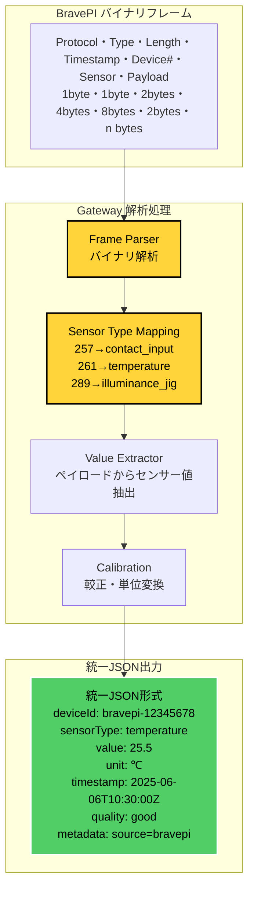

## データフロー変化の比較

### 1. 現状：BravePI依存データフロー

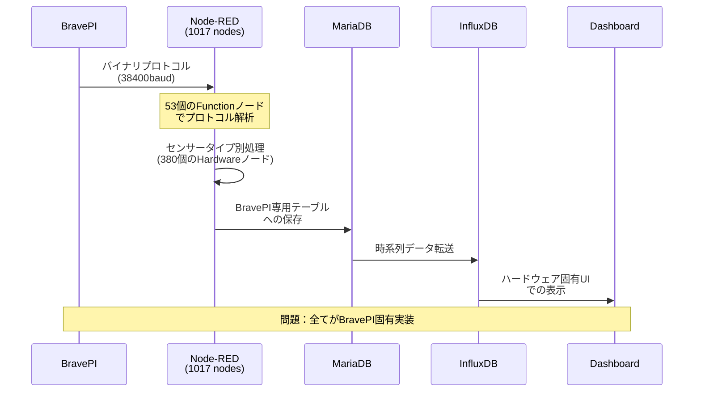

### 2. 目標：Gateway経由データフロー

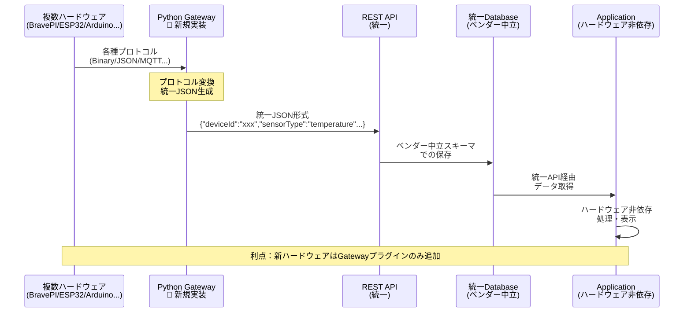

### 3. 新ハードウェア追加時の比較

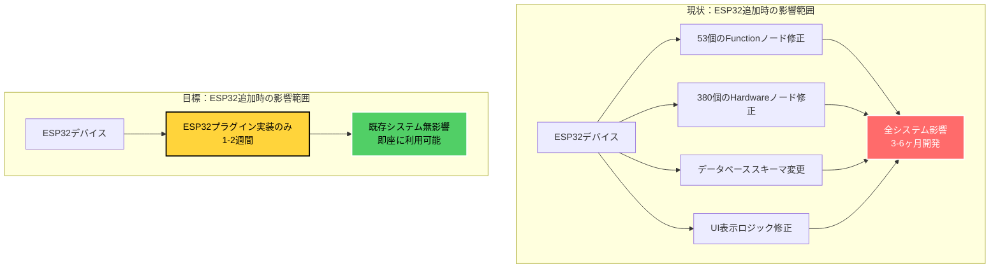

## 段階的移行戦略

### 1. 移行フェーズ概要

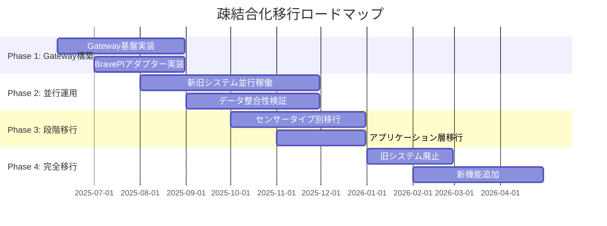

### 2. Phase 1: Gateway構築の詳細

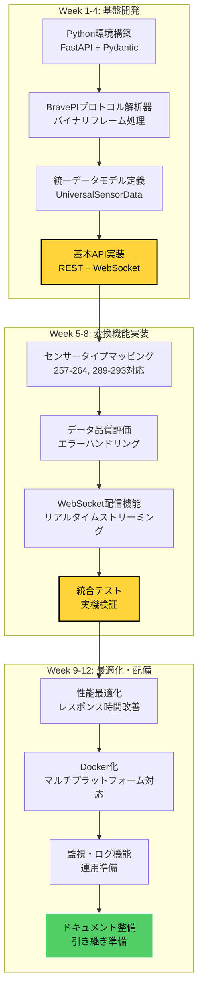

### 3. Phase 2: 並行運用アーキテクチャ

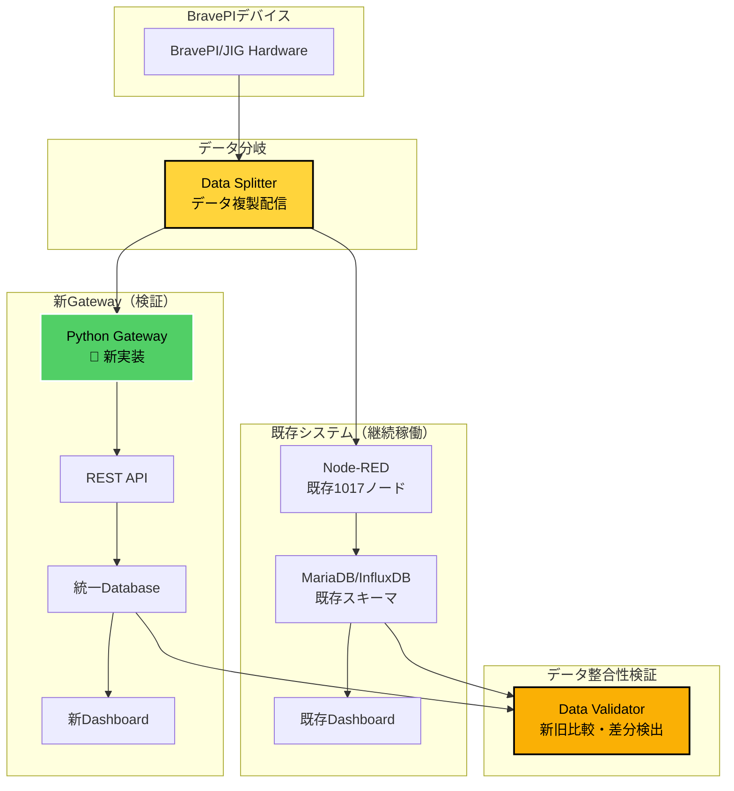

## 実装優先度とROI

### 1. 機能別優先度マトリックス

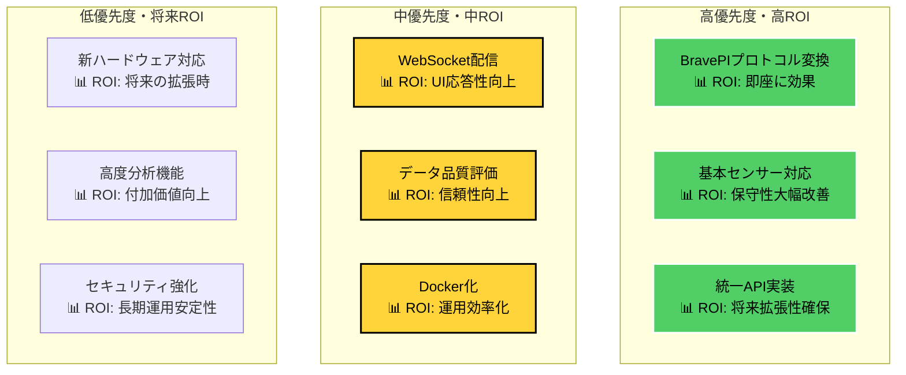

### 2. 段階的ROI実現

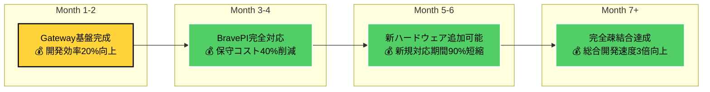

---

## 文書メタデータ

**文書タイトル**: システム概要図解説明書  
**作成日付**: 2025年6月6日  
**対象読者**: システム設計者・開発者・プロジェクト関係者  
**目的**: 疎結合化戦略の視覚的理解・合意形成  
**前提知識**: IoTシステム基礎・現状システム概要  
**文書レベル**: 概要説明・戦略図解 (★★☆)