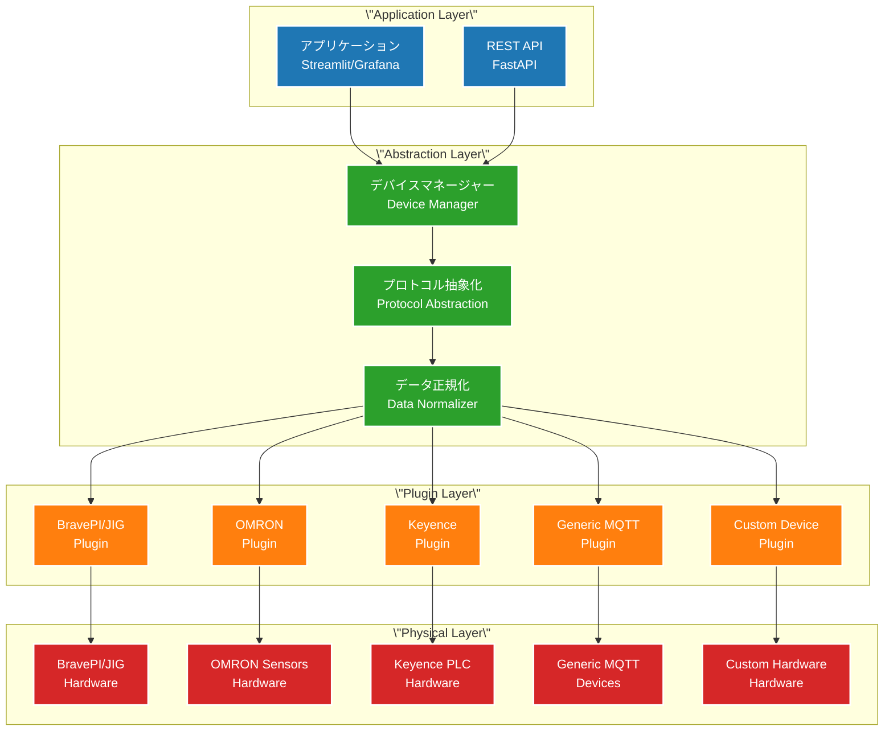

# ベンダー中立的疎結合アーキテクチャ

## 概要

本ドキュメントでは、BravePI/JIGに密結合していた現行システムから、**任意のベンダーのセンサーハブ・デバイスに対応できる疎結合アーキテクチャ**への移行設計を記述します。

## 設計方針

### 1. **ベンダー中立性**
- 特定ベンダーのプロトコルに依存しない抽象化
- プラグイン形式でのドライバー追加
- 標準的な通信プロトコルの採用

### 2. **相互運用性**
- 他社製センサーハブとの容易な統合
- 標準化されたインターフェース定義
- オープンなエコシステム構築

### 3. **拡張性**
- 新しいデバイスタイプの動的追加
- 設定ベースでのデバイス管理
- API経由での外部統合

## アーキテクチャ概要

### 疎結合レイヤー構成



## 標準化インターフェース設計

### 1. **統一デバイスインターフェース**

```python
# common/interfaces/device_interface.py
from abc import ABC, abstractmethod
from typing import Dict, List, Any, Optional
from dataclasses import dataclass

@dataclass
class DeviceCapability:
    \"\"\"デバイス能力の定義\"\"\"
    device_type: str           # \"sensor_hub\", \"plc\", \"gateway\"
    communication: str         # \"serial\", \"ethernet\", \"mqtt\", \"modbus\"
    sensor_types: List[str]    # [\"temperature\", \"pressure\", \"acceleration\"]
    max_sensors: int          # 最大センサー数
    supports_commands: bool   # コマンド送信対応
    supports_configuration: bool  # 設定変更対応

@dataclass 
class SensorReading:
    \"\"\"標準化されたセンサー読み取り値\"\"\"
    sensor_id: str
    sensor_type: str          # \"temperature\", \"pressure\", etc.
    value: Any               # 測定値（単一値またはリスト）
    unit: str                # 単位
    timestamp: str           # ISO8601形式
    quality: float           # 品質指標 (0.0-1.0)
    metadata: Dict[str, Any] # 追加情報（RSSI、Battery等）

class DeviceDriverInterface(ABC):
    \"\"\"全デバイスドライバーの共通インターフェース\"\"\"
    
    @abstractmethod
    def get_capabilities(self) -> DeviceCapability:
        \"\"\"デバイス能力を取得\"\"\"
        pass
    
    @abstractmethod
    async def initialize(self, config: Dict[str, Any]) -> bool:
        \"\"\"デバイス初期化\"\"\"
        pass
    
    @abstractmethod
    async def discover_sensors(self) -> List[Dict[str, str]]:
        \"\"\"接続されたセンサーを自動発見\"\"\"
        pass
    
    @abstractmethod
    async def read_sensors(self) -> List[SensorReading]:
        \"\"\"全センサーからデータ読み取り\"\"\"
        pass
    
    @abstractmethod
    async def send_command(self, command: Dict[str, Any]) -> bool:
        \"\"\"デバイスにコマンド送信\"\"\"
        pass
    
    @abstractmethod
    async def health_check(self) -> Dict[str, Any]:
        \"\"\"デバイス健全性チェック\"\"\"
        pass
```

### 2. **設定ベースのデバイス管理**

```yaml
# config/devices.yml - デバイス設定例
devices:
  - name: \"factory_line_1_hub\"
    driver: \"bravepi\"
    config:
      serial_port: \"/dev/ttyAMA0\"
      baud_rate: 38400
      protocol_version: \"1.0\"
    sensors:
      - id: \"temp_001\"
        type: \"temperature\"
        name: \"工場内温度\"
        thresholds:
          high: 30.0
          low: 10.0
  
  - name: \"precision_measurement\"
    driver: \"bravejig\" 
    config:
      usb_ports: [\"/dev/ttyACM0\", \"/dev/ttyACM1\"]
      protocol_version: \"2.0\"
    sensors:
      - id: \"accel_001\"
        type: \"acceleration\"
        name: \"振動センサー\"
        fft_enabled: true
  
  - name: \"omron_plc_station\"
    driver: \"omron_fins\"
    config:
      ip_address: \"192.168.1.100\"
      port: 9600
      unit_address: 0
    sensors:
      - id: \"pressure_001\"
        type: \"pressure\"
        name: \"油圧センサー\"
        address: \"D100\"
  
  - name: \"keyence_vision\"
    driver: \"keyence_ethernet\"
    config:
      ip_address: \"192.168.1.101\"
      port: 8500
    sensors:
      - id: \"vision_001\"
        type: \"quality_check\"
        name: \"品質検査\"
  
  - name: \"mqtt_generic_device\"
    driver: \"mqtt_generic\"
    config:
      broker: \"192.168.1.200\"
      topics:
        - \"factory/sensors/+/data\"
    sensors:
      - id: \"ext_temp_001\"
        type: \"temperature\"
        name: \"外部温度センサー\"
```

### 3. **プラグインアーキテクチャ**

```python
# plugins/base_plugin.py
class DevicePluginBase(DeviceDriverInterface):
    \"\"\"プラグインの基底クラス\"\"\"
    
    def __init__(self, config: Dict[str, Any]):
        self.config = config
        self.logger = logging.getLogger(f\"plugin.{self.__class__.__name__}\")
    
    def get_plugin_info(self) -> Dict[str, str]:
        \"\"\"プラグイン情報\"\"\"
        return {
            \"name\": self.__class__.__name__,
            \"version\": getattr(self, \"VERSION\", \"unknown\"),
            \"vendor\": getattr(self, \"VENDOR\", \"unknown\"),
            \"description\": getattr(self, \"DESCRIPTION\", \"\")
        }

# plugins/bravepi_plugin.py
class BravePIPlugin(DevicePluginBase):
    \"\"\"BravePI専用プラグイン\"\"\"
    
    VERSION = \"1.0.0\"
    VENDOR = \"Fukuoka Industrial Technology Center\"
    DESCRIPTION = \"BravePI IoT Hub Driver\"
    
    def get_capabilities(self) -> DeviceCapability:
        return DeviceCapability(
            device_type=\"sensor_hub\",
            communication=\"serial\",
            sensor_types=[\"temperature\", \"humidity\", \"digital_input\", \"digital_output\"],
            max_sensors=16,
            supports_commands=True,
            supports_configuration=True
        )
    
    async def initialize(self, config: Dict[str, Any]) -> bool:
        try:
            self.serial_port = config[\"serial_port\"]
            self.baud_rate = config.get(\"baud_rate\", 38400)
            self.protocol_handler = BravePIProtocolHandler(
                self.serial_port, self.baud_rate
            )
            await self.protocol_handler.connect()
            return True
        except Exception as e:
            self.logger.error(f\"BravePI initialization failed: {e}\")
            return False
    
    async def discover_sensors(self) -> List[Dict[str, str]]:
        # BravePI固有のセンサー発見ロジック
        return await self.protocol_handler.enumerate_sensors()
    
    async def read_sensors(self) -> List[SensorReading]:
        # BravePI固有のデータ読み取りロジック
        raw_data = await self.protocol_handler.read_all()
        return [self._convert_to_standard_reading(data) for data in raw_data]

# plugins/omron_plugin.py  
class OMRONFinsPlugin(DevicePluginBase):
    \"\"\"OMRON PLC FINS通信プラグイン\"\"\"
    
    VERSION = \"1.0.0\"
    VENDOR = \"OMRON\"
    DESCRIPTION = \"OMRON PLC FINS Protocol Driver\"
    
    def get_capabilities(self) -> DeviceCapability:
        return DeviceCapability(
            device_type=\"plc\",
            communication=\"ethernet\", 
            sensor_types=[\"pressure\", \"temperature\", \"flow\", \"digital_input\"],
            max_sensors=1000,
            supports_commands=True,
            supports_configuration=False
        )
    
    async def initialize(self, config: Dict[str, Any]) -> bool:
        try:
            from omron_fins import FinsClient  # 外部ライブラリ
            self.client = FinsClient(
                config[\"ip_address\"], 
                config[\"port\"],
                config.get(\"unit_address\", 0)
            )
            await self.client.connect()
            return True
        except Exception as e:
            self.logger.error(f\"OMRON FINS initialization failed: {e}\")
            return False

# plugins/mqtt_generic_plugin.py
class MQTTGenericPlugin(DevicePluginBase):
    \"\"\"汎用MQTTデバイスプラグイン\"\"\"
    
    VERSION = \"1.0.0\"
    VENDOR = \"Generic\"
    DESCRIPTION = \"Generic MQTT Device Driver\"
    
    def get_capabilities(self) -> DeviceCapability:
        return DeviceCapability(
            device_type=\"mqtt_gateway\",
            communication=\"mqtt\",
            sensor_types=[\"any\"],  # 任意のセンサータイプ
            max_sensors=1000,
            supports_commands=True,
            supports_configuration=True
        )
```

### 4. **デバイスマネージャー**

```python
# core/device_manager.py
class DeviceManager:
    \"\"\"デバイスの統合管理\"\"\"
    
    def __init__(self, config_path: str):
        self.devices: Dict[str, DeviceDriverInterface] = {}
        self.plugin_registry = PluginRegistry()
        self.config = self._load_config(config_path)
    
    async def initialize_all_devices(self):
        \"\"\"全デバイスの初期化\"\"\"
        for device_config in self.config[\"devices\"]:
            await self._initialize_device(device_config)
    
    async def _initialize_device(self, device_config: Dict):
        \"\"\"個別デバイスの初期化\"\"\"
        driver_name = device_config[\"driver\"]
        plugin_class = self.plugin_registry.get_plugin(driver_name)
        
        if not plugin_class:
            raise ValueError(f\"Unknown driver: {driver_name}\")
        
        device = plugin_class(device_config[\"config\"])
        success = await device.initialize(device_config[\"config\"])
        
        if success:
            self.devices[device_config[\"name\"]] = device
            logger.info(f\"Device {device_config['name']} initialized successfully\")
        else:
            logger.error(f\"Device {device_config['name']} initialization failed\")
    
    async def read_all_sensors(self) -> List[SensorReading]:
        \"\"\"全デバイスからセンサーデータを収集\"\"\"
        all_readings = []
        
        for device_name, device in self.devices.items():
            try:
                readings = await device.read_sensors()
                all_readings.extend(readings)
            except Exception as e:
                logger.error(f\"Failed to read from {device_name}: {e}\")
        
        return all_readings
    
    def get_device_capabilities(self) -> Dict[str, DeviceCapability]:
        \"\"\"全デバイスの能力一覧\"\"\"
        return {
            name: device.get_capabilities() 
            for name, device in self.devices.items()
        }
```

### 5. **プラグインレジストリ**

```python
# core/plugin_registry.py
class PluginRegistry:
    \"\"\"プラグインの動的管理\"\"\"
    
    def __init__(self):
        self._plugins: Dict[str, Type[DeviceDriverInterface]] = {}
        self._load_builtin_plugins()
        self._discover_external_plugins()
    
    def _load_builtin_plugins(self):
        \"\"\"組み込みプラグインの読み込み\"\"\"
        from plugins.bravepi_plugin import BravePIPlugin
        from plugins.bravejig_plugin import BraveJIGPlugin
        from plugins.mqtt_generic_plugin import MQTTGenericPlugin
        
        self.register_plugin(\"bravepi\", BravePIPlugin)
        self.register_plugin(\"bravejig\", BraveJIGPlugin) 
        self.register_plugin(\"mqtt_generic\", MQTTGenericPlugin)
    
    def _discover_external_plugins(self):
        \"\"\"外部プラグインの自動発見\"\"\"
        plugin_dir = Path(\"plugins/external/\")
        if not plugin_dir.exists():
            return
        
        for plugin_file in plugin_dir.glob(\"*_plugin.py\"):
            self._load_external_plugin(plugin_file)
    
    def register_plugin(self, name: str, plugin_class: Type[DeviceDriverInterface]):
        \"\"\"プラグインの登録\"\"\"
        self._plugins[name] = plugin_class
        logger.info(f\"Plugin '{name}' registered: {plugin_class.__name__}\")
    
    def get_plugin(self, name: str) -> Optional[Type[DeviceDriverInterface]]:
        \"\"\"プラグインの取得\"\"\"
        return self._plugins.get(name)
    
    def list_available_plugins(self) -> Dict[str, Dict[str, str]]:
        \"\"\"利用可能なプラグイン一覧\"\"\"
        result = {}
        for name, plugin_class in self._plugins.items():
            # 一時インスタンスを作成して情報取得
            temp_instance = plugin_class({})
            result[name] = temp_instance.get_plugin_info()
        return result
```

## 標準MQTTメッセージフォーマット

### ベンダー中立的なメッセージ構造

```json
{
  \"schema_version\": \"1.0\",
  \"gateway_id\": \"gateway-001\", 
  \"timestamp\": \"2024-01-15T10:30:00.000Z\",
  \"devices\": [
    {
      \"device_name\": \"factory_line_1_hub\",
      \"device_type\": \"sensor_hub\",
      \"vendor\": \"FITC\",
      \"model\": \"BravePI\",
      \"status\": \"online\",
      \"sensors\": [
        {
          \"sensor_id\": \"temp_001\",
          \"sensor_type\": \"temperature\",
          \"name\": \"工場内温度\",
          \"value\": 25.3,
          \"unit\": \"celsius\",
          \"quality\": 0.95,
          \"timestamp\": \"2024-01-15T10:30:00.000Z\",
          \"metadata\": {
            \"rssi\": -45,
            \"battery_level\": 85
          }
        }
      ]
    },
    {
      \"device_name\": \"omron_plc_station\",
      \"device_type\": \"plc\",
      \"vendor\": \"OMRON\",
      \"model\": \"CJ2M\",
      \"status\": \"online\",
      \"sensors\": [
        {
          \"sensor_id\": \"pressure_001\",
          \"sensor_type\": \"pressure\",
          \"name\": \"油圧センサー\",
          \"value\": 150.5,
          \"unit\": \"kPa\",
          \"quality\": 1.0,
          \"timestamp\": \"2024-01-15T10:30:00.000Z\",
          \"metadata\": {
            \"plc_address\": \"D100\"
          }
        }
      ]
    }
  ]
}
```

## 利点と効果

### 1. **ベンダー中立性**
- ✅ BravePI/JIG以外のデバイス対応が容易
- ✅ 特定ベンダーへの依存を排除
- ✅ オープンなエコシステム構築

### 2. **拡張性**
- ✅ 新しいプラグインの動的追加
- ✅ 設定ベースでのデバイス管理
- ✅ サードパーティ製品の容易な統合

### 3. **相互運用性**
- ✅ 標準化されたインターフェース
- ✅ 統一されたMQTTメッセージ
- ✅ 他社製品との組み合わせが自由

### 4. **保守性**
- ✅ デバイス固有ロジックの分離
- ✅ テスト可能な設計
- ✅ 段階的な移行が可能

## 移行戦略

### Phase 1: プラグインフレームワーク構築
1. 基盤インターフェースの実装
2. BravePI/JIGプラグインの作成
3. デバイスマネージャーの実装

### Phase 2: 標準化
1. MQTTメッセージフォーマットの統一
2. 設定管理の標準化
3. UI/APIの抽象化対応

### Phase 3: エコシステム拡大
1. サードパーティプラグイン開発
2. プラグイン開発ガイドの作成
3. コミュニティ形成

## まとめ

この疎結合アーキテクチャにより、BravePI/JIGに特化していたシステムが、**任意のベンダーのIoTデバイスに対応できるオープンプラットフォーム**に進化します。他社製センサーハブやPLCとの統合が容易になり、真の相互運用性を実現できます。