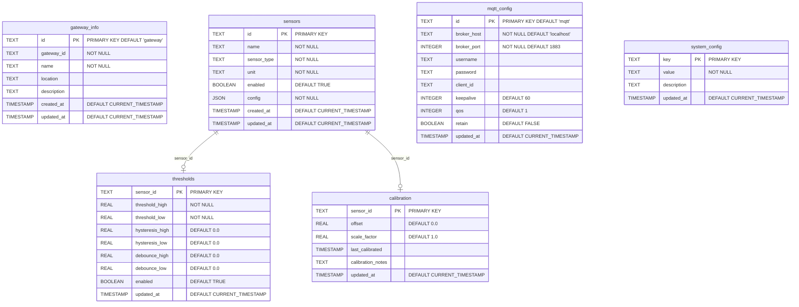

# エッジゲートウェイ SQLite実装詳細

## 概要

エッジゲートウェイでは軽量で信頼性の高いSQLiteを使用してローカル設定を管理します。MariaDBと比較して、大幅なリソース削減と運用の簡素化を実現します。

## SQLite採用の理由

### リソース効率性
- **メモリ使用量**: MariaDBの1/10以下（約10-50MB）
- **ディスク使用量**: 単一ファイル（1-10MB程度）
- **CPU使用量**: プロセス不要のため最小限

### 運用の簡素化
- **設定不要**: インストール後すぐに使用可能
- **プロセス管理不要**: ライブラリとして動作
- **バックアップ簡単**: 単一ファイルのコピーのみ
- **障害リスク削減**: プロセス死活監視が不要

### 機能的十分性
- **JSON対応**: 設定データの柔軟な格納
- **トランザクション**: データ整合性の保証
- **同期書き込み**: 電源断時のデータ保護
- **インデックス**: 必要な検索性能

## データベース設計

### テーブル構造

```sql
-- エッジゲートウェイ設定管理スキーマ
-- infrastructure/gateway-setup/sqlite/schema.sql

-- ゲートウェイ基本情報
CREATE TABLE gateway_info (
    id TEXT PRIMARY KEY DEFAULT 'gateway',
    gateway_id TEXT NOT NULL,
    name TEXT NOT NULL,
    location TEXT,
    description TEXT,
    created_at TIMESTAMP DEFAULT CURRENT_TIMESTAMP,
    updated_at TIMESTAMP DEFAULT CURRENT_TIMESTAMP
);

-- センサー設定
CREATE TABLE sensors (
    id TEXT PRIMARY KEY,
    name TEXT NOT NULL,
    sensor_type TEXT NOT NULL,
    unit TEXT NOT NULL,
    enabled BOOLEAN DEFAULT TRUE,
    config JSON NOT NULL,
    created_at TIMESTAMP DEFAULT CURRENT_TIMESTAMP,
    updated_at TIMESTAMP DEFAULT CURRENT_TIMESTAMP
);

-- しきい値設定
CREATE TABLE thresholds (
    sensor_id TEXT PRIMARY KEY,
    threshold_high REAL NOT NULL,
    threshold_low REAL NOT NULL,
    hysteresis_high REAL DEFAULT 0.0,
    hysteresis_low REAL DEFAULT 0.0,
    debounce_high REAL DEFAULT 0.0,
    debounce_low REAL DEFAULT 0.0,
    enabled BOOLEAN DEFAULT TRUE,
    updated_at TIMESTAMP DEFAULT CURRENT_TIMESTAMP,
    FOREIGN KEY (sensor_id) REFERENCES sensors(id) ON DELETE CASCADE
);

-- 較正設定
CREATE TABLE calibration (
    sensor_id TEXT PRIMARY KEY,
    offset REAL DEFAULT 0.0,
    scale_factor REAL DEFAULT 1.0,
    last_calibrated TIMESTAMP,
    calibration_notes TEXT,
    updated_at TIMESTAMP DEFAULT CURRENT_TIMESTAMP,
    FOREIGN KEY (sensor_id) REFERENCES sensors(id) ON DELETE CASCADE
);

-- MQTT設定
CREATE TABLE mqtt_config (
    id TEXT PRIMARY KEY DEFAULT 'mqtt',
    broker_host TEXT NOT NULL DEFAULT 'localhost',
    broker_port INTEGER NOT NULL DEFAULT 1883,
    username TEXT,
    password TEXT,
    client_id TEXT,
    keepalive INTEGER DEFAULT 60,
    qos INTEGER DEFAULT 1,
    retain BOOLEAN DEFAULT FALSE,
    updated_at TIMESTAMP DEFAULT CURRENT_TIMESTAMP
);

-- システム設定
CREATE TABLE system_config (
    key TEXT PRIMARY KEY,
    value TEXT NOT NULL,
    description TEXT,
    updated_at TIMESTAMP DEFAULT CURRENT_TIMESTAMP
);

-- インデックス
CREATE INDEX idx_sensors_type ON sensors(sensor_type);
CREATE INDEX idx_sensors_enabled ON sensors(enabled);
CREATE INDEX idx_thresholds_enabled ON thresholds(enabled);

-- トリガー（更新日時の自動更新）
CREATE TRIGGER update_sensors_timestamp 
    AFTER UPDATE ON sensors
BEGIN
    UPDATE sensors SET updated_at = CURRENT_TIMESTAMP WHERE id = NEW.id;
END;

CREATE TRIGGER update_thresholds_timestamp 
    AFTER UPDATE ON thresholds
BEGIN
    UPDATE thresholds SET updated_at = CURRENT_TIMESTAMP WHERE sensor_id = NEW.sensor_id;
END;

CREATE TRIGGER update_calibration_timestamp 
    AFTER UPDATE ON calibration
BEGIN
    UPDATE calibration SET updated_at = CURRENT_TIMESTAMP WHERE sensor_id = NEW.sensor_id;
END;
```

### 初期データ

```sql
-- 初期設定データ
INSERT INTO gateway_info (gateway_id, name, location) 
VALUES ('rpi4-gateway-001', 'Factory Line 1 Gateway', 'Manufacturing Floor A');

INSERT INTO mqtt_config (broker_host, broker_port, client_id) 
VALUES ('192.168.1.200', 1883, 'rpi4-gateway-001');

-- システム設定のデフォルト値
INSERT INTO system_config (key, value, description) VALUES
    ('data_collection_interval', '1.0', 'Data collection interval in seconds'),
    ('heartbeat_interval', '30.0', 'Heartbeat transmission interval in seconds'),
    ('log_level', 'INFO', 'Logging level (DEBUG, INFO, WARNING, ERROR)'),
    ('max_retry_attempts', '3', 'Maximum retry attempts for MQTT publishing'),
    ('connection_timeout', '10.0', 'Network connection timeout in seconds');
```

## データ操作の概念

### 基本的な操作パターン

SQLiteデータベースへのアクセスは以下の原則に従います：

1. **トランザクション管理**
   - すべての書き込み操作はトランザクション内で実行
   - エラー時の自動ロールバック
   - データ整合性の保証

2. **接続管理**
   - 接続プーリングによる効率的なリソース利用
   - 同時アクセス制御
   - タイムアウト処理

3. **エラーハンドリング**
   - 適切な例外処理
   - リトライメカニズム
   - ログ記録

### データアクセスパターン

**設定の読み込み**
- キャッシュによる高速化
- 変更検知による自動リロード
- デフォルト値の適用

**設定の更新**
- 楽観的ロック
- 監査ログの記録
- 変更通知の送信

**バルク操作**
- バッチ処理による効率化
- トランザクション単位の制御
- プログレス監視

### データベース操作の実装方針

**基本設計**
- スレッドセーフな接続管理
- コンテキストマネージャーによるリソース管理
- 例外安全なトランザクション処理

**データアクセスレイヤー**
1. **センサー設定管理**
   - 基本設定、しきい値、較正情報の統合管理
   - JSON形式での柔軟な設定保存
   - 関連テーブルのJOINによる効率的なデータ取得

2. **MQTT設定管理**
   - シングルトンパターンでの設定管理
   - デフォルト値の適切なハンドリング
   - セキュリティ情報の安全な保存

3. **システム設定管理**
   - キー・バリュー形式での柔軟な設定
   - 説明文付きでの設定管理
   - 変更履歴の追跡

**ユーティリティ機能**
- データベースのバックアップ機能
- データベース情報の取得
- ヘルスチェック機能

## 運用とメンテナンス

### バックアップ戦略

**バックアップの設計方針**
- 単一ファイルのコピーによるシンプルなバックアップ
- タイムスタンプ付きファイル名での管理
- 古いバックアップの自動削除（保存期間管理）
- バックアップディレクトリの自動作成

**バックアッププロセス**
1. バックアップディレクトリの確認・作成
2. タイムスタンプ付きファイル名の生成
3. データベースファイルのコピー
4. 古いバックアップの自動削除

### ヘルスチェック

**ヘルスチェック項目**
1. **ファイルの存在確認**
   - データベースファイルの存在
   - ファイルサイズの確認
   - アクセス権限の確認

2. **スキーマの整合性**
   - 必要なテーブルの存在確認
   - インデックスの確認
   - トリガーの確認

3. **データ整合性**
   - SQLiteのPRAGMA integrity_check
   - 外部キー制約の確認
   - データの論理的整合性

4. **基本操作の確認**
   - 読み取り操作のテスト
   - レコード数の確認
   - パフォーマンス指標

## データベースER図

### エンティティ関係図



### テーブル詳細説明

#### gateway_info
ゲートウェイの基本情報を格納。通常は1レコードのみ。
- **gateway_id**: ユニークなゲートウェイ識別子
- **name**: 表示用の名前
- **location**: 設置場所
- **description**: 説明文

#### sensors  
接続されているセンサーの定義情報。
- **id**: センサーID（プライマリキー）
- **sensor_type**: temperature, pressure, distance等
- **unit**: 単位（℃、Pa、mm等）
- **config**: センサー固有設定（JSON形式）

#### thresholds
各センサーのしきい値設定。
- **threshold_high/low**: 上限・下限値
- **hysteresis_high/low**: ヒステリシス設定
- **debounce_high/low**: デバウンス時間

#### calibration
センサーの較正情報。
- **offset**: オフセット値
- **scale_factor**: スケールファクター
- **last_calibrated**: 最終較正日時

#### mqtt_config
MQTT通信設定。通常は1レコードのみ。
- **broker_host/port**: MQTTブローカー接続先
- **client_id**: クライアント識別子
- **qos**: Quality of Service設定

#### system_config
システム全体の設定項目。キー・バリュー形式。
- **key**: 設定項目名
- **value**: 設定値（文字列）
- **description**: 設定の説明

## パフォーマンス比較

| 項目 | MariaDB | SQLite | 改善率 |
|------|---------|--------|--------|
| メモリ使用量 | ~200MB | ~20MB | 90%削減 |
| ディスク使用量 | ~500MB | ~5MB | 99%削減 |
| 起動時間 | ~10秒 | ~0.1秒 | 99%削減 |
| 設定ファイル数 | 複数 | 0個 | 100%削減 |
| プロセス数 | +1 | 0 | - |
| バックアップ時間 | ~10秒 | ~0.1秒 | 99%削減 |

## まとめ

SQLiteの採用により、エッジゲートウェイの運用が大幅に簡素化され、リソース使用量も劇的に削減されます。特にRaspberry Piのような制約のある環境では、この軽量化のメリットは大きく、システム全体の安定性と保守性が向上します。